## 1. crate 与依赖

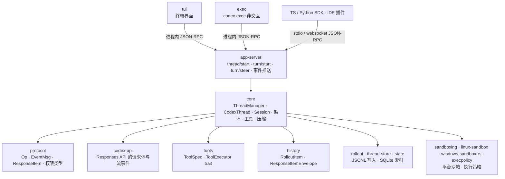
```mermaid
graph TD
  TUI["tui<br/>终端界面"] -->|进程内 JSON-RPC| APS
  EXEC["exec<br/>codex exec 非交互"] -->|进程内 JSON-RPC| APS
  SDK["TS / Python SDK · IDE 插件"] -->|stdio / websocket JSON-RPC| APS
  APS["app-server<br/>thread/start · turn/start · turn/steer · 事件推送"] --> CORE
  CORE["core<br/>ThreadManager · CodexThread · Session · 循环 · 工具 · 压缩"] --> PROTO
  CORE --> API
  CORE --> TOOLS
  CORE --> HIST
  CORE --> ROLL
  CORE --> SBX
  PROTO["protocol<br/>Op · EventMsg · ResponseItem · 权限类型"]
  API["codex-api<br/>Responses API 的请求体与流事件"]
  TOOLS["tools<br/>ToolSpec · ToolExecutor trait"]
  HIST["history<br/>RolloutItem · ResponseItemEnvelope"]
  ROLL["rollout · thread-store · state<br/>JSONL 写入 · SQLite 索引"]
  SBX["sandboxing · linux-sandbox · windows-sandbox-rs · execpolicy<br/>平台沙箱 · 执行策略"]
```

codex采用了前后端分离的架构，tui/各种插件/codexapp等 都通过jsonrpc与appserver交互。

---

## 2. 数据模型：所有类都在传什么

看类型之前，先看一次请求从客户端到 `Session` 的调用链路：

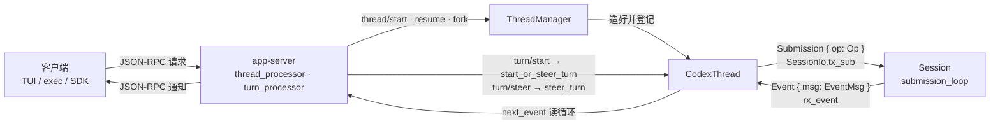
```mermaid
flowchart LR
  C["客户端<br/>TUI / exec / SDK"] -->|"JSON-RPC 请求"| H["app-server<br/>thread_processor · turn_processor"]
  H -->|"thread/start · resume · fork"| TM["ThreadManager"]
  TM -->|"造好并登记"| CT["CodexThread"]
  H -->|"turn/start → start_or_steer_turn<br/>turn/steer → steer_turn"| CT
  CT -->|"Submission { op: Op }<br/>SessionIo.tx_sub"| S["Session<br/>submission_loop"]
  S -->|"Event { msg: EventMsg }<br/>rx_event"| CT
  CT -->|"next_event 读循环"| H
  H -->|"JSON-RPC 通知"| C
```

1. **客户端 → app-server**：客户端通过 JSON-RPC 调用 app-server。`thread/start`（以及 `thread/resume`、`thread/fork`）由 `thread_processor` 处理，`turn/start`、`turn/steer` 由 `turn_processor` 处理。
2. **app-server → `ThreadManager` → `CodexThread`**：`thread/*` 请求调 `ThreadManager` 造出一个 `CodexThread` 并登记进线程表（§7）；`turn/*` 请求先按 thread id `get_thread` 拿到它，再调 `start_or_steer_turn` / `steer_turn`。
3. **`CodexThread` → `Session`**：这一段通过通道通信。请求被包成 `Submission { op: Op }` 塞进 `SessionIo.tx_sub`，`Session` 的 `submission_loop` 逐个取出分派。
4. **`Session` → 客户端**：`Session` 把事件包成 `Event { msg: EventMsg }` 发进事件通道；app-server 每个线程起一个 `next_event` 读循环，把事件转成 JSON-RPC 通知推给客户端。

JSON-RPC 的请求和通知是 app-server 自己的协议类型，这里不展开。本节讲的都在 app-server 以下：2.1 是 `turn/start` 带进来的用户输入怎么转成轮次输入；2.2 是 `CodexThread` 和 `Session` 之间通道里传的 `Op` / `Event`；2.3、2.4 是进了 `Session` 之后写进历史和 rollout 的条目。

### 2.1 输入：从 `UserInput` 到 `TurnInput`

客户端调用 `turn/start` 或 `turn/steer` 时，参数里的 `input` 是 app-server 协议里的 `UserInput`。`turn_processor` 用 `into_core` 把它转成 protocol crate 的 `UserInput`，装进 `TurnInput::UserInput`，再和线程设置、`TurnStartOptions`（新轮次的参数）一起包成 `TurnInputRequest`，调 `CodexThread::start_or_steer_turn`。`TurnInputMode` 由调用的方法决定（`turn/start` 是 `StartOrSteer`，`turn/steer` 是 `Steer`）。Session 处理完回一个 `TurnInputSubmission`，app-server 根据它给客户端返回响应或错误。

进了 core 之后，`UserInput` 有两个用处：

- 转成 `ResponseItem::Message` 写进历史，之后发给模型的就是这条（`record_user_prompt_and_emit_turn_item`）；
- 直接用 `UserInput` 生成 `TurnItem::UserMessage` 发给 UI，因为 `text_elements` 这类 UI 字段在 `ResponseItem` 里没有。

`Skill` / `Mention` 两种会在新轮次开始时展开成注入的上下文（§8.3）。

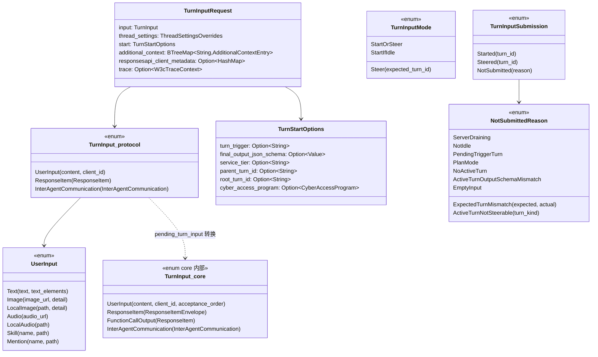
```mermaid
classDiagram
  class UserInput {
    <<enum>>
    Text(text, text_elements)
    Image(image_url, detail)
    LocalImage(path, detail)
    Audio(audio_url)
    LocalAudio(path)
    Skill(name, path)
    Mention(name, path)
  }
  class TurnInputRequest {
    input: TurnInput
    thread_settings: ThreadSettingsOverrides
    start: TurnStartOptions
    additional_context: BTreeMap~String,AdditionalContextEntry~
    responsesapi_client_metadata: Option~HashMap~
    trace: Option~W3cTraceContext~
  }
  class TurnInput_protocol {
    <<enum>>
    UserInput(content, client_id)
    ResponseItem(ResponseItem)
    InterAgentCommunication(InterAgentCommunication)
  }
  class TurnInputMode {
    <<enum>>
    StartOrSteer
    StartIfIdle
    Steer(expected_turn_id)
  }
  class TurnStartOptions {
    turn_trigger: Option~String~
    final_output_json_schema: Option~Value~
    service_tier: Option~String~
    parent_turn_id: Option~String~
    root_turn_id: Option~String~
    cyber_access_program: Option~CyberAccessProgram~
  }
  class TurnInputSubmission {
    <<enum>>
    Started(turn_id)
    Steered(turn_id)
    NotSubmitted(reason)
  }
  class NotSubmittedReason {
    <<enum>>
    ServerDraining
    NotIdle
    PendingTriggerTurn
    PlanMode
    NoActiveTurn
    ExpectedTurnMismatch(expected, actual)
    ActiveTurnNotSteerable(turn_kind)
    ActiveTurnOutputSchemaMismatch
    EmptyInput
  }
  class TurnInput_core {
    <<enum core 内部>>
    UserInput(content, client_id, acceptance_order)
    ResponseItem(ResponseItemEnvelope)
    FunctionCallOutput(ResponseItem)
    InterAgentCommunication(InterAgentCommunication)
  }
  TurnInputRequest --> TurnInput_protocol
  TurnInputRequest --> TurnStartOptions
  TurnInput_protocol --> UserInput
  TurnInputSubmission --> NotSubmittedReason
  TurnInput_protocol ..> TurnInput_core : pending_turn_input 转换
```

| 类型 | 要点 |
|---|---|
| `UserInput` | 七种。`Text` 里的 `text_elements` 是 UI 用的高亮区间，不发给模型。`Skill` / `Mention` 是 `@技能` `@应用` 的引用，§8.3 会展开成注入的上下文。 |
| `TurnInputRequest` | 一次提交的全部参数。`thread_settings` 是"顺便改一下线程设置"（模型、审批策略等），**开新轮和插话都会应用**，只是插话时对当前轮不生效。 |
| `TurnInput`（协议版） | 三种。`ResponseItem` 变体让客户端直接提交一条历史条目（比如 IDE 给的上下文）。 |
| `TurnInputMode` | 三种路由。`Steer { expected_turn_id }` 是乐观并发控制：你决定插话到 Session 收到之间那一轮可能已经结束，带上你以为的 turn_id，不匹配就拒绝。 |
| `TurnStartOptions` | 只在这次提交启动了新轮次时才用。`parent_turn_id` / `root_turn_id` 在多 agent 场景下记录父轮次和根轮次的 id。 |
| `TurnInputSubmission` | 三种结果。`Started` / `Steered` 只表示"core 收下了"，不等 hook、不等落盘、不等采样。 |
| `NotSubmittedReason` | 九种拒绝理由，每种对应的判断逻辑见 §8.1。 |
| `TurnInput`（core 版） | core 内部多了 `acceptance_order`（用户输入的受理顺序，用来在回放时排序）和 `FunctionCallOutput`（客户端直接提交的工具输出）。 |

### 2.2 `CodexThread` 和 Session 之间：Op 进，Event 出

`CodexThread::start_or_steer_turn` 拿到上一节的 `TurnInputRequest` 后，连同 `TurnInputMode` 和一个用来接收 `TurnInputSubmission` 的 `reply` 通道，包成 `Op::TurnInput`，外面再套一层 `Submission` 发进 `SessionIo.tx_sub`。除了用户输入，中断、审批结果、压缩、关闭等请求也都包成 `Op`，走同一条通道。反方向，Session 产生的所有输出都是 `Event`。

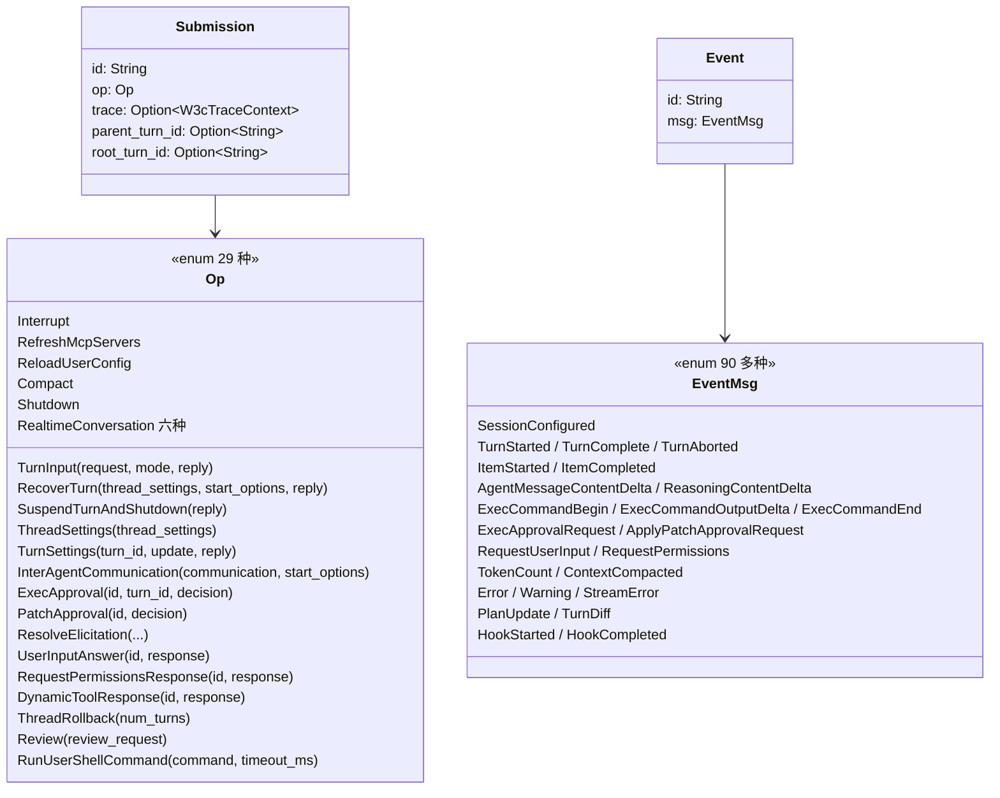
```mermaid
classDiagram
  class Submission {
    id: String
    op: Op
    trace: Option~W3cTraceContext~
    parent_turn_id: Option~String~
    root_turn_id: Option~String~
  }
  class Op {
    <<enum 29 种>>
    Interrupt
    TurnInput(request, mode, reply)
    RecoverTurn(thread_settings, start_options, reply)
    SuspendTurnAndShutdown(reply)
    ThreadSettings(thread_settings)
    TurnSettings(turn_id, update, reply)
    InterAgentCommunication(communication, start_options)
    ExecApproval(id, turn_id, decision)
    PatchApproval(id, decision)
    ResolveElicitation(...)
    UserInputAnswer(id, response)
    RequestPermissionsResponse(id, response)
    DynamicToolResponse(id, response)
    RefreshMcpServers
    ReloadUserConfig
    Compact
    ThreadRollback(num_turns)
    Review(review_request)
    Shutdown
    RunUserShellCommand(command, timeout_ms)
    RealtimeConversation 六种
  }
  class Event {
    id: String
    msg: EventMsg
  }
  class EventMsg {
    <<enum 90 多种>>
    SessionConfigured
    TurnStarted / TurnComplete / TurnAborted
    ItemStarted / ItemCompleted
    AgentMessageContentDelta / ReasoningContentDelta
    ExecCommandBegin / ExecCommandOutputDelta / ExecCommandEnd
    ExecApprovalRequest / ApplyPatchApprovalRequest
    RequestUserInput / RequestPermissions
    TokenCount / ContextCompacted
    Error / Warning / StreamError
    PlanUpdate / TurnDiff
    HookStarted / HookCompleted
  }
  Submission --> Op
  Event --> EventMsg
```

| 类型 | 要点 |
|---|---|
| `Submission` | `id` 是提交 id。**如果这次提交开了新轮次，轮次 id 就是它**（`Started { turn_id: submission_id }`）。 |
| `Op` | 29 个变体。`TurnInput`、`RecoverTurn`、`SuspendTurnAndShutdown`、`TurnSettings` 四个带 `reply: oneshot::Sender`，提交方要等 Session 回一个路由结果。其余的发出后不等回复。 |
| `Event` | `id` 对应 `Submission.id`。启动阶段的事件 id 是常量 `INITIAL_SUBMIT_ID`。 |
| `EventMsg` | 90 多个变体。分五类：生命周期（Turn*/Item*）、流式增量（*Delta）、工具（Exec*/Patch*/McpToolCall*）、等用户（*ApprovalRequest/RequestUserInput/ElicitationRequest）、状态（TokenCount/Error/Warning）。 |

### 2.3 历史条目：`ResponseItem` 和它的信封

`ResponseItem` 是 OpenAI Responses API 的条目格式，codex 直接用它作为对话历史的格式。历史里的条目有这几个来源：

- **用户输入**：上面说的 `UserInput` 转成 `Message { role: "user" }`；
- **模型输出**：模型流里每个 `OutputItemDone` 带的就是一个 `ResponseItem`（助手消息、推理、工具调用），收到就写进历史（§8.6）；
- **工具结果**：工具执行完产出 `ResponseInputItem`，`into()` 成 `FunctionCallOutput` 等写进历史（§9.4）；
- **core 自己加的**：初始上下文和设置变化的 developer 消息（§13）、压缩后的摘要（§11.3）。

写进去之后有四个地方用它：

- 外面包一层 `ResponseItemEnvelope`，存在 `SessionState.history`（`ContextManager`）里；
- 每次请求模型前 `for_prompt` 去掉信封，整个列表就是请求体的 `input`（§8.5）；
- 解析成 `TurnItem`，放进 `ItemStarted` / `ItemCompleted` 事件发给 UI；
- 以 `RolloutItem::ResponseItem` 写进 rollout 文件（§2.4）。

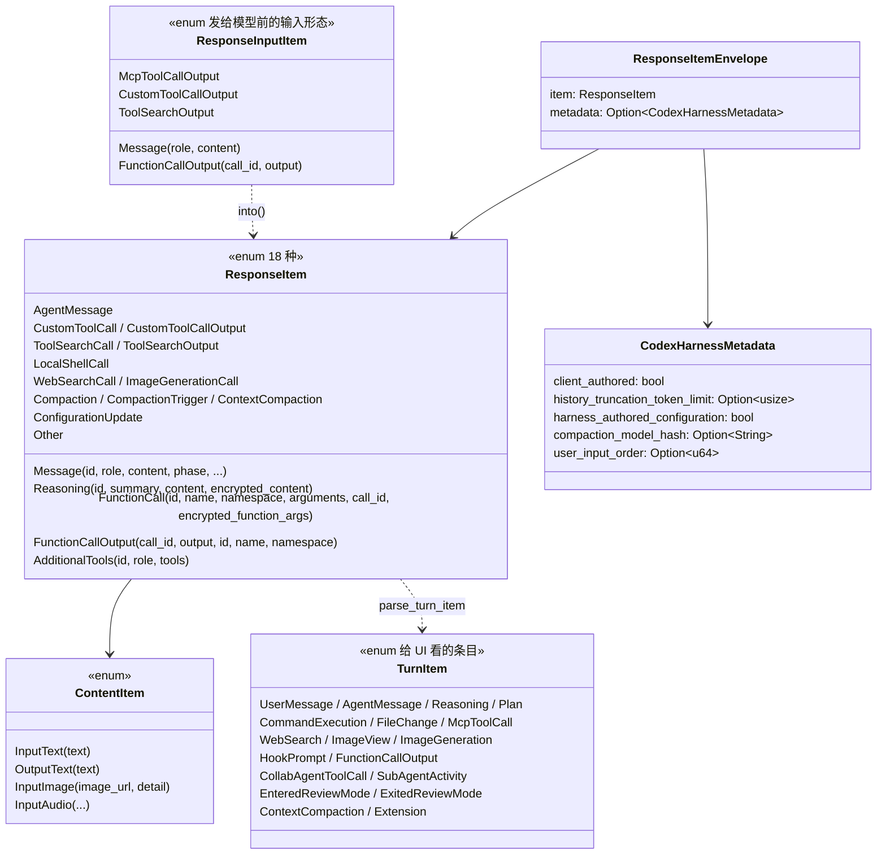
```mermaid
classDiagram
  class ResponseItem {
    <<enum 18 种>>
    Message(id, role, content, phase, ...)
    AgentMessage
    Reasoning(id, summary, content, encrypted_content)
    FunctionCall(id, name, namespace, arguments, call_id, encrypted_function_args)
    FunctionCallOutput(call_id, output, id, name, namespace)
    CustomToolCall / CustomToolCallOutput
    ToolSearchCall / ToolSearchOutput
    LocalShellCall
    WebSearchCall / ImageGenerationCall
    Compaction / CompactionTrigger / ContextCompaction
    ConfigurationUpdate
    AdditionalTools(id, role, tools)
    Other
  }
  class ContentItem {
    <<enum>>
    InputText(text)
    OutputText(text)
    InputImage(image_url, detail)
    InputAudio(...)
  }
  class ResponseInputItem {
    <<enum 发给模型前的输入形态>>
    Message(role, content)
    FunctionCallOutput(call_id, output)
    McpToolCallOutput
    CustomToolCallOutput
    ToolSearchOutput
  }
  class ResponseItemEnvelope {
    item: ResponseItem
    metadata: Option~CodexHarnessMetadata~
  }
  class CodexHarnessMetadata {
    client_authored: bool
    history_truncation_token_limit: Option~usize~
    harness_authored_configuration: bool
    compaction_model_hash: Option~String~
    user_input_order: Option~u64~
  }
  class TurnItem {
    <<enum 给 UI 看的条目>>
    UserMessage / AgentMessage / Reasoning / Plan
    CommandExecution / FileChange / McpToolCall
    WebSearch / ImageView / ImageGeneration
    HookPrompt / FunctionCallOutput
    CollabAgentToolCall / SubAgentActivity
    EnteredReviewMode / ExitedReviewMode
    ContextCompaction / Extension
  }
  ResponseItem --> ContentItem
  ResponseItemEnvelope --> ResponseItem
  ResponseItemEnvelope --> CodexHarnessMetadata
  ResponseInputItem ..> ResponseItem : into()
  ResponseItem ..> TurnItem : parse_turn_item
```

| 类型 | 要点 |
|---|---|
| `ResponseItem` | **历史里存的就是它，发给模型的也是它**，没有第二套内部消息模型（对照 pi 的 `AgentMessage` → `Message` 两层）。18 个变体里 `Compaction` / `ContextCompaction` / `ConfigurationUpdate` / `AdditionalTools` 是 codex 自己加的，发给非 OpenAI 提供方前会被处理。 |
| `ContentItem` | 消息正文的三种内容。`InputImage.detail` 发请求前会按模型能力归一化。 |
| `ResponseInputItem` | 工具输出的"输入形态"，`into()` 就变成 `ResponseItem`。用户消息也先造成它。 |
| `ResponseItemEnvelope` | 历史里每条 `ResponseItem` 外面包一层元数据。**`ContextManager` 存的是信封，不是裸条目。** |
| `CodexHarnessMetadata` | 五个字段全是"给回放和截断用的"，模型看不到。`history_truncation_token_limit` 记的是这条工具输出当时按什么预算截断的。 |
| `TurnItem` | 给 UI 的条目，`ItemStarted` / `ItemCompleted` 事件里带的就是它。由 `ResponseItem` 解析出来。 |

### 2.4 rollout 条目与错误分类

rollout 是每个线程在磁盘上的一个 JSONL 文件（`~/.codex/sessions/` 下），每行一个 `RolloutItem`。Session 运行时往里写：历史条目、每轮的 `TurnContext` 设置快照、token 用量、压缩结果，以及发给客户端的事件（§12.1）。

读 rollout 的有两处：

- **core 恢复线程**：`thread/resume` 时 `ThreadManager::resume_thread_from_rollout` 读文件，用其中的 `ResponseItem` / `Compacted` / `TurnContext` 重建 `ContextManager`，模型接着之前的上下文继续（§12.3）；
- **app-server 返回历史给客户端**：用 `ThreadHistoryBuilder` 把 rollout 里的条目（主要是 `EventMsg`）重放成 `Turn` 列表，放进响应里。

所以 rollout 里同时存了两类数据：`ResponseItem` 是给模型恢复上下文用的，`EventMsg` 是给 UI 恢复界面用的。

`CodexErrorDetails` 和 rollout 无关，是 core 内部的错误类型。放在这里是因为它也是贯穿各层的数据类型，主要用处是请求模型失败时用 `is_retryable()` 判断要不要重试（§11.1）。

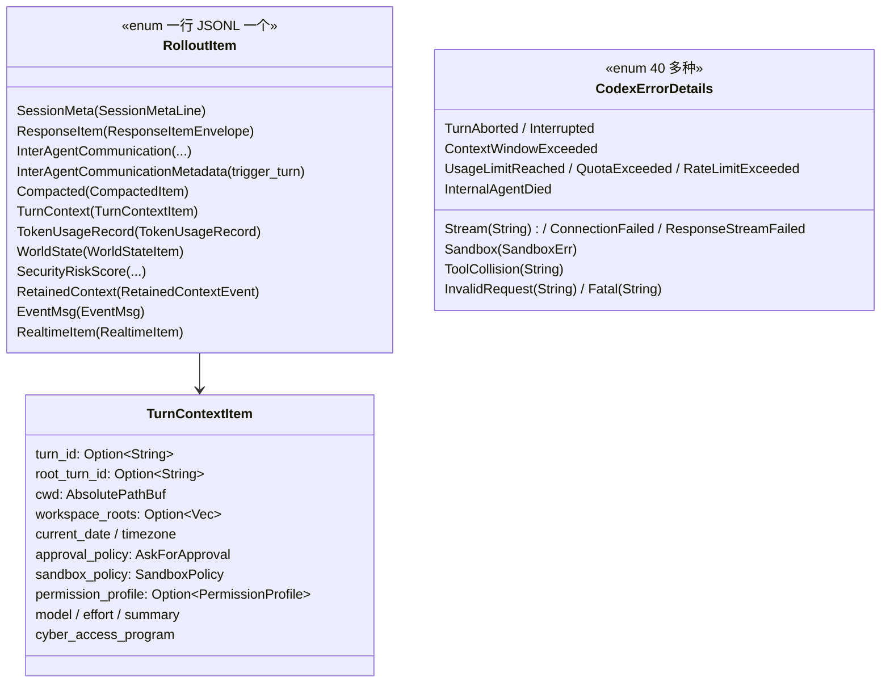
```mermaid
classDiagram
  class RolloutItem {
    <<enum 一行 JSONL 一个>>
    SessionMeta(SessionMetaLine)
    ResponseItem(ResponseItemEnvelope)
    InterAgentCommunication(...)
    InterAgentCommunicationMetadata(trigger_turn)
    Compacted(CompactedItem)
    TurnContext(TurnContextItem)
    TokenUsageRecord(TokenUsageRecord)
    WorldState(WorldStateItem)
    SecurityRiskScore(...)
    RetainedContext(RetainedContextEvent)
    EventMsg(EventMsg)
    RealtimeItem(RealtimeItem)
  }
  class TurnContextItem {
    turn_id: Option~String~
    root_turn_id: Option~String~
    cwd: AbsolutePathBuf
    workspace_roots: Option~Vec~
    current_date / timezone
    approval_policy: AskForApproval
    sandbox_policy: SandboxPolicy
    permission_profile: Option~PermissionProfile~
    model / effort / summary
    cyber_access_program
  }
  class CodexErrorDetails {
    <<enum 40 多种>>
    TurnAborted / Interrupted
    Stream(String) / ConnectionFailed / ResponseStreamFailed
    ContextWindowExceeded
    UsageLimitReached / QuotaExceeded / RateLimitExceeded
    Sandbox(SandboxErr)
    ToolCollision(String)
    InvalidRequest(String) / Fatal(String)
    InternalAgentDied
  }
  RolloutItem --> TurnContextItem
```

| 类型 | 要点 |
|---|---|
| `RolloutItem` | 12 种。**`EventMsg` 也是一种**：发给客户端的每个事件默认都写进 rollout（由 `persist` 参数控制）。`TurnContext` 每个真实用户轮写一条，是恢复时的"设置基线"。 |
| `TurnContextItem` | 一轮的有效设置快照。§13 讲它怎么被拿来 diff。 |
| `CodexErrorDetails` | 40 多种。`is_retryable()` 白名单式列出哪些**不能**重试（`TurnAborted`、`ContextWindowExceeded`、`UsageLimitReached`、`Sandbox`、`Fatal` 等 26 种），其余都可重试。 |

---

## 3. 会话层类图：从 `ThreadManager` 到 `Session`

这一层回答"一次对话的运行时对象是什么、状态放在哪"。

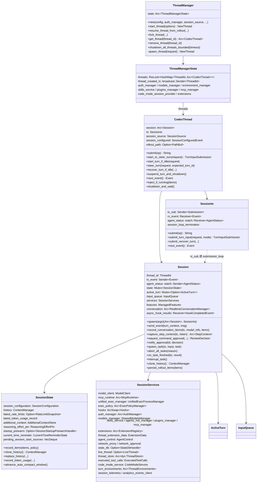
```mermaid
classDiagram
  class ThreadManager {
    state: Arc~ThreadManagerState~
    +new(config, auth_manager, session_source, ...)
    +start_thread(options) NewThread
    +resume_thread_from_rollout(...)
    +fork_thread(...)
    +get_thread(thread_id) Arc~CodexThread~
    +remove_thread(thread_id)
    +shutdown_all_threads_bounded(timeout)
    -spawn_thread(request) NewThread
  }
  class ThreadManagerState {
    threads: RwLock~HashMap~ThreadId, Arc~CodexThread~~~
    thread_created_tx: broadcast::Sender~ThreadId~
    auth_manager / models_manager / environment_manager
    skills_service / plugins_manager / mcp_manager
    code_mode_session_provider / extensions
  }
  class CodexThread {
    session: Arc~Session~
    io: SessionIo
    session_source: SessionSource
    session_configured: SessionConfiguredEvent
    rollout_path: Option~PathBuf~
    +submit(op) String
    +start_or_steer_turn(request) TurnInputSubmission
    +start_turn_if_idle(request)
    +steer_turn(request, expected_turn_id)
    +recover_turn_if_idle(...)
    +suspend_turn_and_shutdown()
    +next_event() Event
    +inject_if_running(items)
    +shutdown_and_wait()
  }
  class SessionIo {
    tx_sub: Sender~Submission~
    rx_event: Receiver~Event~
    agent_status: watch::Receiver~AgentStatus~
    session_loop_termination
    +submit(op) String
    +submit_turn_input(request, mode) TurnInputSubmission
    +submit_recover_turn(...)
    +next_event() Event
  }
  class Session {
    thread_id: ThreadId
    tx_event: Sender~Event~
    agent_status: watch::Sender~AgentStatus~
    state: Mutex~SessionState~
    active_turn: Mutex~Option~ActiveTurn~~
    input_queue: InputQueue
    services: SessionServices
    features: ManagedFeatures
    conversation: Arc~RealtimeConversationManager~
    async_hook_results: Receiver~HookCompletedEvent~
    +spawn(args) (Arc~Session~, SessionIo)
    +send_event(turn_context, msg)
    +record_conversation_items(tc, model_info, items)
    +capture_step_context(tc, token) Arc~StepContext~
    +request_command_approval(...) ReviewDecision
    +notify_approval(id, decision)
    +spawn_task(tc, input, task)
    +abort_all_tasks(reason)
    +on_task_finished(tc, result)
    +interrupt_task()
    +clone_history() ContextManager
    +persist_rollout_items(items)
  }
  class SessionState {
    session_configuration: SessionConfiguration
    history: ContextManager
    latest_rate_limits: Option~RateLimitSnapshot~
    latest_token_usage_record
    additional_context: AdditionalContextStore
    reasoning_effort_pin: ReasoningEffortPin
    startup_prewarm: Option~SessionStartupPrewarmHandle~
    current_time_reminder: CurrentTimeReminderState
    pending_session_start_sources: VecDeque
    +record_items(items, policy)
    +clone_history() ContextManager
    +replace_history(...)
    +record_token_usage(...)
    +advance_auto_compact_window()
  }
  class SessionServices {
    model_client: ModelClient
    mcp_runtime: Arc~McpRuntime~
    unified_exec_manager: UnifiedExecProcessManager
    exec_policy: Arc~ExecPolicyManager~
    hooks: ArcSwap~Hooks~
    auth_manager: Arc~AuthManager~
    models_manager: SharedModelsManager
    skills_service / agents_md_manager / plugins_manager / mcp_manager
    extensions: Arc~ExtensionRegistry~
    thread_extension_data: ExtensionData
    agent_control: AgentControl
    network_proxy / network_approval
    state_db: Option~StateDbHandle~
    live_thread: Option~LiveThread~
    thread_store: Arc~dyn ThreadStore~
    executed_tool_calls: ExecutedToolCalls
    code_mode_service: CodeModeService
    turn_environments: Arc~ThreadEnvironments~
    session_telemetry / analytics_events_client
  }
  ThreadManager --> ThreadManagerState
  ThreadManagerState --> CodexThread : threads
  CodexThread --> Session
  CodexThread --> SessionIo
  SessionIo ..> Session : tx_sub 进 submission_loop
  Session --> SessionState
  Session --> SessionServices
  Session --> ActiveTurn
  Session --> InputQueue
```

### 3.1 `ThreadManager`

**职责一句话**：进程级单例，造线程、存线程、给线程共享的重服务（模型目录、MCP 管理器、技能服务、插件管理器、环境管理器）。

| 方法 | 干什么 | 谁调它 |
|---|---|---|
| `new(config, auth_manager, session_source, ...)` | 建 `ThreadManagerState`，里面装所有共享服务 | app-server 启动时 |
| `start_thread(options)` | 新线程。走 `start_thread_inner` → `spawn_thread` | app-server `thread/start` |
| `resume_thread_from_rollout(...)` | 从 rollout 文件读回历史再 `spawn_thread` | `thread/resume` |
| `fork_thread(...)` | 复制到某条为止的历史，开新线程 | `thread/fork` |
| `spawn_subagent(...)` | 多 agent 子线程 | `spawn_agent` 工具 |
| `spawn_thread(request)` | **真正的装配点**：`Session::spawn(SessionSpawnArgs {...})` 拿到 `(session, io)`，等第一个事件必须是 `SessionConfigured`，然后 `CodexThread::new` 塞进 `threads` 表 | 上面三个 |
| `get_thread(thread_id)` | 查表 | app-server 每个请求 |
| `shutdown_all_threads_bounded(timeout)` | 给每个线程发 `Op::Shutdown` 并限时等 | 进程退出 |

### 3.2 `CodexThread`

**职责一句话**：一条线程对外的把手。持有 `Session` 和它的 IO 通道，把"提交 Op / 读事件"包成方法。

**存什么数据**：

| 字段 | 含义 |
|---|---|
| `session: Arc<Session>` | 运行时本体。`pub(crate)`，只有 core 内部能直接用 |
| `io: SessionIo` | 提交通道 + 事件通道 + agent 状态 watch |
| `session_source` | 谁开的这条线程（CLI / VSCode / 子 agent / 内部任务） |
| `session_configured` / `rollout_path` | 启动时的第一个事件和 rollout 文件路径，方便客户端随时再拿 |

**能做什么**：

| 方法 | 干什么 | 谁调它 |
|---|---|---|
| `submit(op)` | `io.submit(op)`，生成提交 id 并塞进通道 | 所有不需要回复的 Op |
| `start_or_steer_turn(request)` | `TurnInputMode::StartOrSteer` | app-server `turn/start` |
| `start_turn_if_idle(request)` | `StartIfIdle`，忙就拒 | 自动化触发（hook 续跑、定时） |
| `steer_turn(request, expected_turn_id)` | `Steer { expected_turn_id }` | app-server `turn/steer` |
| `submit_turn_input_with_mode` | 三个上面方法的公共实现：非 Steer 先向 `agent_control` 要执行容量，再 `io.submit_turn_input` | 上面三个 |
| `recover_turn_if_idle` | `Op::RecoverTurn`，恢复被中断的轮次 | worker 交接 |
| `suspend_turn_and_shutdown` | `Op::SuspendTurnAndShutdown`，停轮但不记终止事件，让别的 worker 接手 | 云端 worker 交接 |
| `next_event()` | `io.next_event()`，阻塞读一个事件 | app-server 每线程一个读循环 |
| `inject_if_running(items)` | 把条目塞进正在跑的轮次的待处理输入，没在跑就原样返回 | hook 异步结果、IDE 上下文 |

### 3.3 `SessionIo`

| 字段 / 方法 | 含义 |
|---|---|
| `tx_sub: Sender<Submission>` | 有界通道，容量 512（`SUBMISSION_CHANNEL_CAPACITY`）。另一头是 `submission_loop` |
| `rx_event: Receiver<Event>` | 无界通道。`Session.tx_event` 往里写 |
| `submit(op)` | 造 `Submission { id: new_submission_id(), op }` 发出去，返回 id |
| `submit_turn_input(request, mode)` | 造 `Op::TurnInput { reply }`，**等 `reply` 那个 oneshot 回来**再返回。所以调用方拿到的是 Session 已经做完路由决定后的结果 |
| `next_event()` | 收一个事件，通道关了返回 `InternalAgentDied` |

### 3.4 `Session`

**职责一句话**：一次对话的运行时中心。所有状态（历史、活跃轮次、待处理输入）和所有服务都挂在它上面，所有 Op 由它的 `submission_loop` 处理，所有事件由它的 `send_event` 发出。它自己不跑循环，循环在任务层和 `run_turn` 里。

**存什么数据**：

| 字段 | 含义 |
|---|---|
| `thread_id` | 线程 id，和 rollout 文件名里的一致 |
| `tx_event: Sender<Event>` | 事件出口。`send_event` 最终写这里 |
| `agent_status: watch::Sender<AgentStatus>` | 最新的 agent 状态（PendingInit / Running / Idle / Interrupted …），由事件推导（`deliver_event_raw`） |
| `state: Mutex<SessionState>` | **对话历史在这里面**（`SessionState.history`）。改历史要先拿这把锁 |
| `active_turn: Mutex<Option<ActiveTurn>>` | 当前活跃轮次。`None` 就是空闲。**启动新轮次、插话、审批回复全靠它判断** |
| `input_queue: InputQueue` | 邮箱和待处理输入的操作入口（真正的存储在 `ActiveTurn.turn_state.pending_input`） |
| `services: SessionServices` | 所有服务，见 §3.6 |
| `features: ManagedFeatures` | 146 个 feature flag 的开关表。正文里每处 `Feature::X` 都查它 |
| `conversation` / `realtime_history` | 实时语音对话的状态，本篇不讲 |
| `async_hook_results` | 异步 hook 跑完的结果通道，在两个安全点被排空（§8.4） |

**能做什么**（只列主线用到的）：

| 方法 | 干什么 | 谁调它 |
|---|---|---|
| `spawn(args)` → `spawn_internal` | 建两条通道、算执行策略、`Session::new`、`tokio::spawn(submission_loop)`、返回 `(session, SessionIo)` | `ThreadManager::spawn_thread` |
| `new(...)` | 1000 多行的构造：建 `ContextManager`、装 `SessionServices`、`ModelClient::new`、`Arc::new(Session {...})`、发 `SessionConfigured` 事件、装 MCP 运行时、`schedule_startup_prewarm`、`record_initial_history` | `spawn_internal` |
| `send_event(turn_context, msg)` | 带轮次 id 的事件出口。里面处理子 agent 回传父 agent、实时镜像，最后 `send_event_raw` | 全项目 |
| `send_event_raw_with_persistence(event, persist)` | **先写 rollout（`RolloutItem::EventMsg`），再 `deliver_event_raw` 推给客户端** | `send_event` / `send_event_raw` |
| `record_conversation_items(tc, model_info, items)` | 给条目补 id 和时间戳、包信封、`state.history.record_annotated_items`、写 rollout、发 `RawResponseItem` 事件 | 每条进历史的东西 |
| `record_user_prompt_and_emit_turn_item(...)` | 用户消息专用：入历史 + 发 `ItemStarted` / `ItemCompleted(UserMessage)` + 确保 rollout 文件已创建 | `record_pending_input` |
| `capture_step_context(tc, token)` / `capture_step_context_inner` | 拍一次采样的快照，见 §3.9 | `run_turn` 每步 |
| `record_context_updates_and_set_reference_context_item(step)` | 算这一步要不要给模型塞上下文（首轮全量、以后只塞 diff），见 §13 | `run_turn` |
| `request_command_approval(...)` | 造 `oneshot`、登记到 `TurnState.pending_approvals`、发 `ExecApprovalRequest` 事件、**`rx_approve.await`** | exec / apply_patch 的审批 |
| `notify_approval(id, decision)` | 从 `pending_approvals` 取出 sender 把决定发过去 | `handlers::exec_approval` |
| `spawn_task(tc, input, task)` | 先 `abort_all_tasks(Replaced)` 再 `start_task` | 开新轮 |
| `start_task(tc, input, task)` | 建 `ActiveTurn`、`tokio::spawn` 跑 `task.run`、跑完 `on_task_finished` | `spawn_task` / `start_if_idle` / `maybe_start_turn_for_pending_work` |
| `abort_all_tasks(reason)` | 取出 `active_turn`、取消令牌、发 `TurnAborted` | `interrupt_task` / `spawn_task` |
| `on_task_finished(tc, result)` | 把剩余待处理输入落历史、发 `TurnComplete` 或 `TurnAborted`、清 `active_turn`、flush rollout、看邮箱要不要再开一轮 | `start_task` 里 spawn 的闭包 |
| `interrupt_task()` | `abort_all_tasks(Interrupted)` | `Op::Interrupt` |
| `clone_history()` | 拿锁复制一份 `ContextManager`（内部是 `Arc<Vec>`，复制便宜） | 每次发请求前 |
| `persist_rollout_items(items)` | `live_thread.append_items(items)` | 所有落盘 |

### 3.5 `SessionState`

| 字段 | 含义 |
|---|---|
| `session_configuration` | 线程级设置：模型、审批策略、沙箱策略、cwd、provider、`base_instructions`。`Op::ThreadSettings` 改的就是它 |
| `history: ContextManager` | **对话历史本体**，见 §3.10 |
| `latest_rate_limits` / `latest_token_usage_record` | 最近一次响应里的限流和用量 |
| `additional_context: AdditionalContextStore` | 客户端通过 `TurnInputRequest.additional_context` 给的键值上下文，按 key 合并 |
| `reasoning_effort_pin` | 某个模型被钉住的推理强度 |
| `startup_prewarm` | 启动时预热的 HTTP/WebSocket 连接句柄，第一轮消费掉 |
| `pending_session_start_sources` | 还没跑的 SessionStart hook 来源（startup / resume / fork / clear） |

### 3.6 `SessionServices`

一个 50 个字段的大结构体，全是 `Arc<...>` 或句柄。读代码时只需认这些：

| 字段 | 谁用它 |
|---|---|
| `model_client: ModelClient` | 每轮 `new_session()` 造一个轮次级会话（§6） |
| `mcp_runtime` / `mcp_manager` / `mcp_handler_cache` | 每步拍 MCP 快照、注册 MCP 工具 |
| `unified_exec_manager: UnifiedExecProcessManager` | `exec_command` / `write_stdin` 的进程表 |
| `exec_policy: Arc<ExecPolicyManager>` | 命令要不要审批的规则引擎（starlark 规则文件） |
| `hooks: ArcSwap<Hooks>` | hook 配置，可热替换 |
| `extensions` / `thread_extension_data` / `session_extension_data` | 扩展注册表和类型化的"杂物箱"（`ExtensionData` 是按类型索引的 map，很多跨模块状态放这里） |
| `agent_control: AgentControl` | 多 agent 的执行配额和父子关系 |
| `live_thread` / `thread_store` / `state_db` | 持久化三件套：写 rollout 的句柄、线程元数据存储、SQLite 索引 |
| `executed_tool_calls` | 已执行工具调用的记录，发请求前会 `attach_to_prompt` |
| `code_mode_service` | Code Mode 的 V8 worker |
| `turn_environments: Arc<ThreadEnvironments>` | 执行环境（本机 / 远程 executor）的连接状态 |

### 3.7 `ActiveTurn` / `RunningTask` / `TurnState`

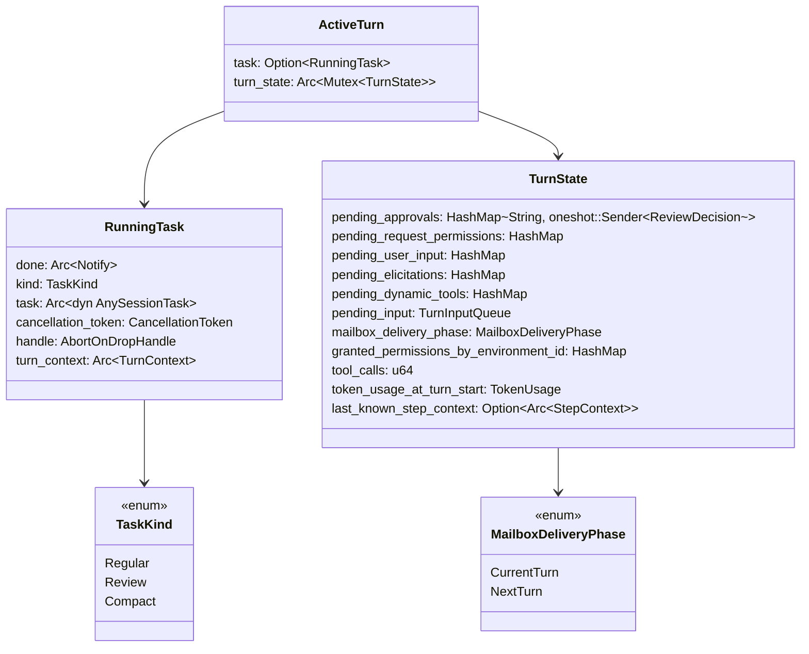
```mermaid
classDiagram
  class ActiveTurn {
    task: Option~RunningTask~
    turn_state: Arc~Mutex~TurnState~~
  }
  class RunningTask {
    done: Arc~Notify~
    kind: TaskKind
    task: Arc~dyn AnySessionTask~
    cancellation_token: CancellationToken
    handle: AbortOnDropHandle
    turn_context: Arc~TurnContext~
  }
  class TurnState {
    pending_approvals: HashMap~String, oneshot::Sender~ReviewDecision~~
    pending_request_permissions: HashMap
    pending_user_input: HashMap
    pending_elicitations: HashMap
    pending_dynamic_tools: HashMap
    pending_input: TurnInputQueue
    mailbox_delivery_phase: MailboxDeliveryPhase
    granted_permissions_by_environment_id: HashMap
    tool_calls: u64
    token_usage_at_turn_start: TokenUsage
    last_known_step_context: Option~Arc~StepContext~~
  }
  class MailboxDeliveryPhase {
    <<enum>>
    CurrentTurn
    NextTurn
  }
  class TaskKind {
    <<enum>>
    Regular
    Review
    Compact
  }
  ActiveTurn --> RunningTask
  ActiveTurn --> TurnState
  TurnState --> MailboxDeliveryPhase
  RunningTask --> TaskKind
```

| 类型 | 要点 |
|---|---|
| `ActiveTurn` | `task` 为 `None` 但 `ActiveTurn` 存在，表示"轮次已预留还没起任务"（`start_if_idle` 先占位再造 `TurnContext`，防止两个启动新轮次的请求同时通过空闲检查）。 |
| `RunningTask` | `handle` 是 `AbortOnDropHandle`，`ActiveTurn` 被丢掉时任务自动 abort。`cancellation_token` 是这轮取消树的根。 |
| `TurnState` | **所有"等用户回答"的 oneshot 都在这**：命令审批、权限请求、`request_user_input`、MCP elicitation、动态工具。`clear_pending_waiters` 在中断时一次清空，等待方收到 `Abort`。`pending_input` 是插话队列的真身。 |
| `MailboxDeliveryPhase` | 这一轮还收不收子 agent 发来的邮件。开局是收（`CurrentTurn`）；模型给出最终答案后改成不收（`NextTurn`），晚到的邮件留到下一轮；接着又有工具调用或用户插话，就重新打开。详见 §10.2。 |

### 3.8 `InputQueue`

**职责一句话**：插话和邮箱的读写入口。插话存在 `TurnState.pending_input`（轮次级），邮箱存在自己的 `mailbox_pending_mails`（会话级）。

| 方法 | 干什么 | 谁调它 |
|---|---|---|
| `extend_pending_input_for_turn_state(turn_state, items)` | 追加到轮次的待处理输入 | `steer_input`、`start_task` |
| `extend_pending_input_and_accept_mailbox_delivery_for_turn_state` | 追加，并重新打开收件（`CurrentTurn`） | `steer_input` |
| `get_pending_input(active_turn)` | **取走**轮次待处理输入 + 排空邮箱（收件开着时才取，见 §10.2）。返回 `(items, start_options)` | `run_turn` 每步开头 |
| `has_pending_input(active_turn)` | 有没有东西可取 | `RegularTask::run` 外层循环、`run_turn` |
| `drain_mailbox_input_items()` | 排空邮箱。多封 `trigger_turn` 邮件时取最后一封的 start_options，`parent_turn_id` 要全部一致才保留 | `get_pending_input`、`start_task` |
| `clear_pending(active_turn)` | 清 waiters 和待处理输入 | `abort_all_tasks` |
| `enqueue_mailbox_communication(...)` | 别的 agent 投递 | `Op::InterAgentCommunication` |

### 3.9 `TurnContext` 与 `StepContext`

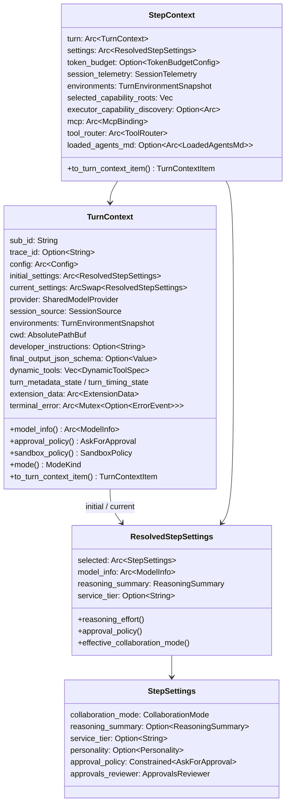
```mermaid
classDiagram
  class TurnContext {
    sub_id: String
    trace_id: Option~String~
    config: Arc~Config~
    initial_settings: Arc~ResolvedStepSettings~
    current_settings: ArcSwap~ResolvedStepSettings~
    provider: SharedModelProvider
    session_source: SessionSource
    environments: TurnEnvironmentSnapshot
    cwd: AbsolutePathBuf
    developer_instructions: Option~String~
    final_output_json_schema: Option~Value~
    dynamic_tools: Vec~DynamicToolSpec~
    turn_metadata_state / turn_timing_state
    extension_data: Arc~ExtensionData~
    terminal_error: Arc~Mutex~Option~ErrorEvent~~~
    +model_info() Arc~ModelInfo~
    +approval_policy() AskForApproval
    +sandbox_policy() SandboxPolicy
    +mode() ModeKind
    +to_turn_context_item() TurnContextItem
  }
  class ResolvedStepSettings {
    selected: Arc~StepSettings~
    model_info: Arc~ModelInfo~
    reasoning_summary: ReasoningSummary
    service_tier: Option~String~
    +reasoning_effort()
    +approval_policy()
    +effective_collaboration_mode()
  }
  class StepSettings {
    collaboration_mode: CollaborationMode
    reasoning_summary: Option~ReasoningSummary~
    service_tier: Option~String~
    personality: Option~Personality~
    approval_policy: Constrained~AskForApproval~
    approvals_reviewer: ApprovalsReviewer
  }
  class StepContext {
    turn: Arc~TurnContext~
    settings: Arc~ResolvedStepSettings~
    token_budget: Option~TokenBudgetConfig~
    session_telemetry: SessionTelemetry
    environments: TurnEnvironmentSnapshot
    selected_capability_roots: Vec
    executor_capability_discovery: Option~Arc~
    mcp: Arc~McpBinding~
    tool_router: Arc~ToolRouter~
    loaded_agents_md: Option~Arc~LoadedAgentsMd~~
    +to_turn_context_item() TurnContextItem
  }
  TurnContext --> ResolvedStepSettings : initial / current
  ResolvedStepSettings --> StepSettings
  StepContext --> TurnContext
  StepContext --> ResolvedStepSettings
```

| 类型 | 要点 |
|---|---|
| `TurnContext` | 一轮的不变量。`current_settings` 是 `ArcSwap`，`Op::TurnSettings` 能在轮次中途换模型或推理强度，但已经拍下的 `StepContext` 不受影响。`terminal_error` 非空表示这轮已经报过致命错，外层循环看到它就不再续跑。由 `new_turn_context_from_configuration` → `make_turn_context` 造出来，输入是 `SessionConfiguration` + 环境快照 + 技能快照。 |
| `StepContext` | 一步的快照。`capture_step_context_inner` 的顺序：读 `current_settings` → 算 token 预算 → 刷新环境就绪状态 → 刷新 AGENTS.md → 解析能力根 → **并行**拍 MCP 快照和准备工具推荐 → `built_tools` 造 `ToolRouter`。**上下文、公布的工具、执行的工具都从这一个对象取**，MCP 服务器中途掉线不会让模型调到一个不存在的工具。 |

### 3.10 `ContextManager`

**职责一句话**：对话历史。存的是 `ResponseItemEnvelope` 数组，外加 token 统计和上下文基线。

| 字段 | 含义 |
|---|---|
| `items: Arc<Vec<ResponseItemEnvelope>>` | 历史本体。`Arc` 让 `clone_history` 几乎免费，改的时候 `Arc::make_mut` 写时复制 |
| `history_version` / `user_message_revision` | 压缩或回滚时 +1；用户输入或重置时 +1 |
| `token_info: Option<TokenUsageInfo>` | 最近一次响应报的用量，`get_total_token_usage` 从它算 |
| `reference_context_item: Option<TurnContextItem>` | 上下文 diff 的基线（§13）。`None` 表示下一轮要全量注入 |
| `world_state_baseline` | 最近一次塞给模型的"世界状态"（cwd、git 分支等），用来 diff |

| 方法 | 干什么 | 谁调它 |
|---|---|---|
| `record_items(items, policy)` / `record_annotated_items` | 追加。工具输出按 `policy` 截断 | `record_prepared_conversation_items` |
| `for_prompt(input_modalities)` | **发请求前的最后一道**：`normalize_history` 后返回裸 `ResponseItem` 列表 | `run_turn`、`run_sampling_request` |
| `normalize_history` | 四个不变量：每个工具调用都有输出（缺的补合成输出）、每个输出都有调用（孤儿删掉）、模型不支持图就删图、不支持音频就删音频 | `for_prompt` |
| `estimate_token_count` | 本地估算（按字节和条目类型加权），没有服务端用量时用 | 压缩判定 |
| `replace_compacted(items)` | 压缩后整体替换，`history_version += 1` | `replace_compacted_history` |
| `drop_last_n_user_turns(n)` | `Op::ThreadRollback`，从最后一个用户消息边界往前切 | `handlers::thread_rollback` |

---

## 4. 任务与循环层：`SessionTask` 和轮次函数族

codex 的循环不是一个类，是一组自由函数。有状态的部分（`Session`、`TurnContext`、`StepContext`）作为参数传进去。

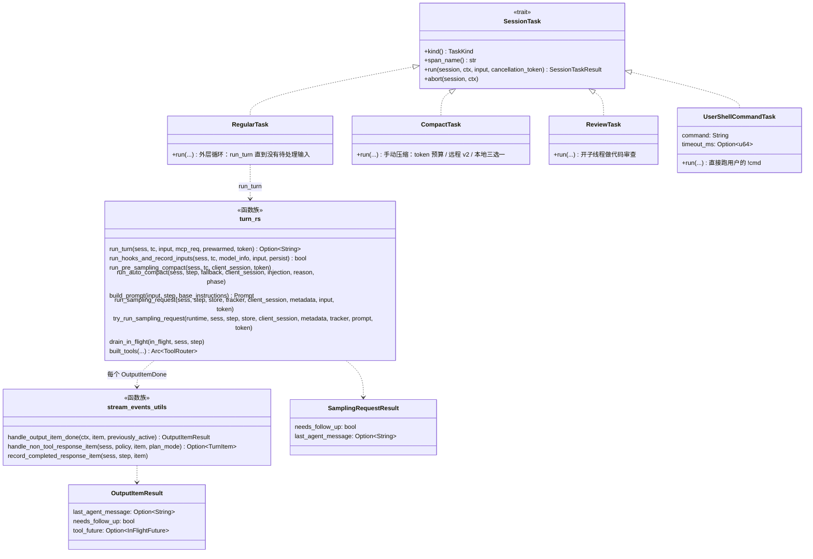
```mermaid
classDiagram
  class SessionTask {
    <<trait>>
    +kind() TaskKind
    +span_name() str
    +run(session, ctx, input, cancellation_token) SessionTaskResult
    +abort(session, ctx)
  }
  class RegularTask {
    +run(...) 外层循环：run_turn 直到没有待处理输入
  }
  class CompactTask {
    +run(...) 手动压缩：token 预算 / 远程 v2 / 本地三选一
  }
  class ReviewTask {
    +run(...) 开子线程做代码审查
  }
  class UserShellCommandTask {
    command: String
    timeout_ms: Option~u64~
    +run(...) 直接跑用户的 !cmd
  }
  class turn_rs {
    <<函数族>>
    run_turn(sess, tc, input, mcp_req, prewarmed, token) Option~String~
    run_hooks_and_record_inputs(sess, tc, model_info, input, persist) bool
    run_pre_sampling_compact(sess, tc, client_session, token)
    run_auto_compact(sess, step, fallback, client_session, injection, reason, phase)
    build_prompt(input, step, base_instructions) Prompt
    run_sampling_request(sess, step, store, tracker, client_session, metadata, input, token)
    try_run_sampling_request(runtime, sess, step, store, client_session, metadata, tracker, prompt, token)
    drain_in_flight(in_flight, sess, step)
    built_tools(...) Arc~ToolRouter~
  }
  class stream_events_utils {
    <<函数族>>
    handle_output_item_done(ctx, item, previously_active) OutputItemResult
    handle_non_tool_response_item(sess, policy, item, plan_mode) Option~TurnItem~
    record_completed_response_item(sess, step, item)
  }
  class SamplingRequestResult {
    needs_follow_up: bool
    last_agent_message: Option~String~
  }
  class OutputItemResult {
    last_agent_message: Option~String~
    needs_follow_up: bool
    tool_future: Option~InFlightFuture~
  }
  SessionTask <|.. RegularTask
  SessionTask <|.. CompactTask
  SessionTask <|.. ReviewTask
  SessionTask <|.. UserShellCommandTask
  RegularTask ..> turn_rs : run_turn
  turn_rs ..> stream_events_utils : 每个 OutputItemDone
  turn_rs ..> SamplingRequestResult
  stream_events_utils ..> OutputItemResult
```

### 4.1 `SessionTask` trait

| 方法 | 含义 |
|---|---|
| `kind()` | `Regular` / `Review` / `Compact`。`steer_input` 用它拒绝往压缩轮和审查轮插话 |
| `run(self, session, ctx, input, cancellation_token)` | 跑到结束或被取消。返回 `Ok(Some(最后一条 agent 消息))`；返回 `Err(TurnAborted)` 走中断生命周期 |
| `abort(session, ctx)` | 默认空。`ReviewTask` 覆盖它退出审查模式 |

`AnySessionTask` 是它的对象安全版本，把 `impl Future` 装箱成 `BoxFuture`，`RunningTask.task` 存的是 `Arc<dyn AnySessionTask>`。

**"一次对话"和"一次压缩"是同类对象**：共享 `ActiveTurn`、取消令牌、`on_task_finished` 收尾。这是 codex 值得单独记的一个抽象。

### 4.2 `RegularTask::run`：外层循环

```rust
// RegularTask::run 摘要
sess.emit_turn_started(&ctx)                         // 立刻发 TurnStarted，不等预热
let prewarmed = sess.consume_startup_prewarm_for_regular_turn(&token)   // 第一轮复用启动预热的连接
let mut next_input = input;
loop {
    let last = run_turn(sess, ctx, next_input, &mut mcp_req, prewarmed.take(), token.child_token()).await?;
    if ctx.terminal_error.lock().await.is_some() { return Ok(last); }   // 已报致命错，不续
    if !sess.input_queue.has_pending_input(&sess.active_turn).await { return Ok(last); }  // 邮箱空 → 结束
    next_input = Vec::new();                          // 下一轮的输入从邮箱里取
}
```

和 pi-mono 的 `while (true) { ... followUp = getFollowUpMessages(); if (!followUp.length) break; }` 同构。区别：pi 查内存数组，codex 查 `TurnState.pending_input` 和会话级邮箱。

### 4.3 轮次函数族

| 函数 | 干什么 | 谁调它 |
|---|---|---|
| `run_turn` | 一轮的主体：采样前压缩 → 拍第一步快照 → 记上下文更新 → 技能/插件注入 → 落用户输入 → **内层 `loop`** | `RegularTask::run` |
| `run_hooks_and_record_inputs` | 对每条输入跑 `UserPromptSubmit` hook（`inspect_pending_input`），没被拦就 `record_pending_input` 落历史。返回 `true` 表示全被拦、本轮该停 | `run_turn` 三处、`on_task_finished` |
| `run_pre_sampling_compact` | 先看模型换没换（换了且压缩哈希不同就用旧模型压一次），再看 `token_limit_reached`，到了就 `run_auto_compact(PreTurn)` | `run_turn` |
| `run_auto_compact` | 三选一：`Feature::TokenBudget` 开 → token 预算压缩；provider 支持远程 v2 → `run_inline_remote_auto_compact_task_v2`；否则本地 `run_inline_auto_compact_task` | `run_pre_sampling_compact`、内层循环两处 |
| `build_prompt` | 造 `Prompt`（§8.5） | `run_sampling_request` |
| `run_sampling_request` | **重试外壳**：`loop` 里造 prompt、调 `try_run_sampling_request`，按错误分类决定返回还是退避重试 | 内层循环 |
| `try_run_sampling_request` | **一次真实请求**：`client_session.stream(...)` → 逐个消费 `ResponseEvent`→ `Completed` 时 break → `drain_in_flight` 等所有工具结果按序落历史 | `run_sampling_request` |
| `drain_in_flight` | `while let Some(res) = in_flight.next()`，每个结果 `record_annotated_conversation_items` | `try_run_sampling_request` |
| `built_tools` | 调 `spec_plan::build_tool_router` 造这一步的 `ToolRouter` | `capture_step_context_inner` |
| `handle_output_item_done` | 一个完成的输出项：是工具调用 → 落历史 + 造 future；是消息/推理 → 转 `TurnItem` 发事件 + 落历史；解析失败 → 造一条错误的 `FunctionCallOutput` 落历史 | `try_run_sampling_request` |

---

## 5. 工具层类图

工具层的类按调用顺序排成一条线，读图时从上往下看：

- **路由**：每一步的 `StepContext` 持有一个 `ToolRouter`，它包着 `ToolRegistry`（名字 → handler）和这一步给模型看的工具清单。
- **调度**：`ToolCallRuntime` 把模型输出的 `ToolCall` 交给 router，router 补上 session / 取消令牌等上下文造出 `ToolInvocation`，registry 找到 handler 执行，结果包成 `AnyToolResult`。
- **执行**：handler 都实现 `CoreToolRuntime`。要跑命令或改文件的（`exec_command` / `apply_patch`）在内部再 new 一个 `ToolOrchestrator`，由它做审批 + 沙箱 + 重试。

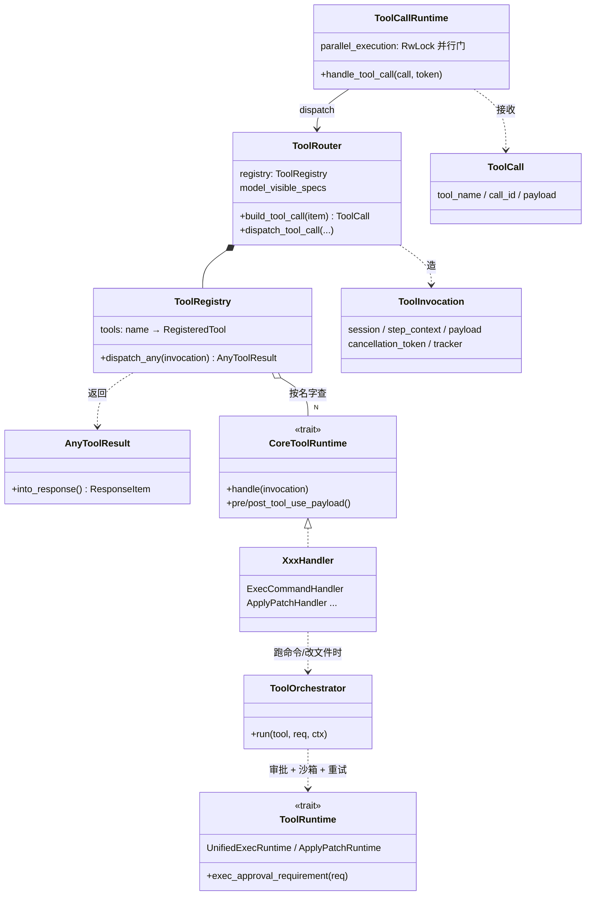
```mermaid
classDiagram
  direction TB
  class ToolCallRuntime {
    parallel_execution: RwLock 并行门
    +handle_tool_call(call, token)
  }
  class ToolRouter {
    registry: ToolRegistry
    model_visible_specs
    +build_tool_call(item) ToolCall
    +dispatch_tool_call(...)
  }
  class ToolRegistry {
    tools: name → RegisteredTool
    +dispatch_any(invocation) AnyToolResult
  }
  class ToolCall {
    tool_name / call_id / payload
  }
  class ToolInvocation {
    session / step_context / payload
    cancellation_token / tracker
  }
  class AnyToolResult {
    +into_response() ResponseItem
  }
  class CoreToolRuntime {
    <<trait>>
    +handle(invocation)
    +pre/post_tool_use_payload()
  }
  class XxxHandler {
    ExecCommandHandler
    ApplyPatchHandler ...
  }
  class ToolOrchestrator {
    +run(tool, req, ctx)
  }
  class ToolRuntime {
    <<trait>>
    UnifiedExecRuntime / ApplyPatchRuntime
    +exec_approval_requirement(req)
  }

  ToolCallRuntime ..> ToolCall : 接收
  ToolCallRuntime --> ToolRouter : dispatch
  ToolRouter *-- ToolRegistry
  ToolRouter ..> ToolInvocation : 造
  ToolRegistry o-- "N" CoreToolRuntime : 按名字查
  ToolRegistry ..> AnyToolResult : 返回
  CoreToolRuntime <|.. XxxHandler
  XxxHandler ..> ToolOrchestrator : 跑命令/改文件时
  ToolOrchestrator ..> ToolRuntime : 审批 + 沙箱 + 重试
```

完整字段和方法见下面 5.1–5.5 的表格；一次调用具体经过哪些函数，见 §9。

### 5.1 trait 与暴露方式

| 类型 | 要点 |
|---|---|
| `ToolExecutor<Invocation>` | 最小契约：名字、给模型看的 `ToolSpec`、`handle`。`supports_parallel_tool_calls` 默认 `false`；`exec_command` 覆盖为 `true` |
| `CoreToolRuntime` | core 内部扩展：hook 载荷、就绪等待（MCP 工具要等服务器连上）、参数流式 diff。所有 handler 都实现它 |
| `ToolExposure` | 六种。`Direct` 进初始工具清单；`Deferred` 只能靠 `tool_search` 找到；`Hidden` 注册了但模型看不见（比如 hook 专用） |
| `ToolInvocation` | handler 收到的全部参数。`step_context` 是那一步的快照，`tracker` 是这一轮的文件 diff 累加器 |

### 5.2 `ToolRegistry` 与 `ToolRouter`

| 方法 | 干什么 |
|---|---|
| `ToolRegistry::add` / `add_with_exposure` | 注册内置工具，默认 `Direct` |
| `register_external` | 注册 MCP / 动态工具，重名返回 `false` 并记 `first_collision` |
| `dispatch_any_with_terminal_outcome(invocation, reached)` | **执行一个工具的完整流程**：计数 `tool_calls` → 找 runtime（找不到回 `unsupported tool` 文案给模型）→ `matches_kind` → `PreToolUse` hook（可拦截、可改参数）→ `notify_tool_start` → `tool.handle` → `PostToolUse` hook→ 包成 `AnyToolResult` |
| `ToolRouter::build_tool_call(item)` | `ResponseItem` → `Option<ToolCall>`：`FunctionCall` / `CustomToolCall` / `ToolSearchCall(execution == "client")` 三种能变成调用，其它返回 `None` |
| `ToolRouter::model_visible_specs()` | 这一步发给模型的工具清单，`build_prompt` 直接用 |
| `ToolRouter::tool_supports_parallel(call)` | 查注册表，找不到当 `false` |

`ToolRouter` 由 `spec_plan::build_tool_router` 造：先 `add_core_tool_sources`（内置工具），再 `append_mcp_tools`（MCP）、`append_extension_tool_executors`（扩展）、`append_dynamic_tool_runtimes`（客户端动态工具），最后 `finalize_tool_router` 算 Code Mode 命名空间和 `model_visible_specs`。

### 5.3 内置工具清单

| 工具名 | 注册条件 |
|---|---|
| `exec_command` + `write_stdin` | `Feature::ShellTool` 且 `Feature::UnifiedExec`；关掉 UnifiedExec 就只有一次性的 `exec_command` |
| `apply_patch` | 模型的 `apply_patch_tool_type` 非空 |
| `update_plan` | `config.update_plan_enabled` |
| `request_user_input` / `request_user_input_async` / `send_message_to_user_async` | 实验开关 + 非子 agent |
| `request_permissions` | `Feature::RequestPermissionsTool` |
| `new_context_window` / `get_context_remaining` | `Feature::TokenBudget` |
| `current_time` / `sleep` | `Feature::CurrentTimeReminder` / `Feature::SleepTool` |
| `view_image` | `Feature::ViewImage` |
| `list_mcp_resources` / `read_mcp_resource` 等 | 有 MCP 资源 |
| `spawn_agent` / `send_message` / `wait_agent` / `list_agents` / `interrupt_agent` / `followup_task` | `collab_tools_enabled` |
| `tool_search` | 有 `Deferred` 工具时在 `finalize_tool_router` 里自动加 |
| `code_mode` / `code_mode_wait`（名字见 `codex_code_mode::PUBLIC_TOOL_NAME`） | `ToolMode::CodeMode` |

### 5.4 `ToolCallRuntime`

| 字段 / 方法 | 含义 |
|---|---|
| `parallel_execution: Arc<RwLock<()>>` | **并行门**。支持并行的工具拿读锁，不支持的拿写锁。所以 `exec_command` 之间可以并发，`apply_patch` 会等所有 exec 结束再独占 |
| `handle_tool_call_with_source(call, source, token)` | 记录到 `executed_tool_calls` → `tokio::spawn` 一个任务：等 runtime 就绪 → 拿门 → `router.dispatch_tool_call_with_terminal_outcome` → 释放门。外面 `select!` 等结果或取消；取消时若 handler 还没到终态就 abort 并回一条 "aborted" 结果 |

### 5.5 `ToolOrchestrator` 与 `ExecApprovalRequirement`

`ToolOrchestrator::run` 是"审批 + 沙箱 + 失败重试"的通用流程。它不在 `ToolRouter` / `ToolRegistry` 这条调度链上，而是在 handler **内部**按需 new 出来的：

- `apply_patch`：`ApplyPatchHandler` 内部 `ToolOrchestrator::new()`，把 `ApplyPatchRuntime` 交给 `run`。
- `exec_command`：`ExecCommandHandler` → `UnifiedExecProcessManager::open_session_with_sandbox` → 在里面 new 一个 `ToolOrchestrator`，把 `UnifiedExecRuntime` 交给它。

两者都实现 `ToolRuntime<Req, Out>`（= `Approvable` + `Sandboxable`）。orchestrator 先调 `tool.exec_approval_requirement(req)`，返回 `None` 就用 `default_exec_approval_requirement`（按审批策略和文件系统沙箱策略算），再对 `ExecApprovalRequirement` 做 `match`：`Skip` 直接跑、`NeedsApproval` 先问用户、`Forbidden` 直接拒。§9.2 展开。

---

## 6. 模型层类图


```mermaid
classDiagram
  class ModelClient {
    state: Arc~ModelClientState~
    agent_identity_policy
    prompt_cache_key_override: Option~String~
    event_sender: Option~Sender~Event~~
    +new(auth_manager, policy, thread_id, provider, session_source, originator, ...)
    +new_session() ModelClientSession
    +build_responses_request(prompt, model_info, effort, summary, service_tier, metadata) ResponsesApiRequest
    +responses_websocket_enabled() bool
  }
  class ModelClientSession {
    client: ModelClient
    websocket_session: WebsocketSession
    turn_state: Arc~OnceLock~String~~
    +stream(prompt, model_info, telemetry, effort, summary, service_tier, metadata, trace) ResponseStream
    +try_switch_fallback_transport(telemetry, model_info) bool
    +preconnect_websocket()
    -stream_responses_api(...)
    -stream_responses_websocket(...)
    -get_incremental_items(request, last_response, allow_empty) Option~Vec~
  }
  class WebsocketSession {
    connection: Option~ApiWebSocketConnection~
    endpoint: Option~ResponsesEndpoint~
    auth_owner_generation: Option~u64~
    last_request: Option~ResponsesApiRequest~
    last_response_rx: Option~oneshot::Receiver~LastResponse~~
  }
  class Prompt {
    input: Vec~ResponseItem~
    tools: Arc~ToolSpecs~
    parallel_tool_calls: bool
    base_instructions: BaseInstructions
    output_schema: Option~Value~
    output_schema_strict: bool
    cyber_access_program: Option
    +get_formatted_input_for_request(model_info) Vec~ResponseItem~
  }
  class ResponsesApiRequest {
    model: String
    instructions: String
    input: Vec~ResponseItem~
    tools: Option~ResponsesApiTools~
    tool_choice: String
    parallel_tool_calls: bool
    reasoning: Option~Reasoning~
    store: bool
    stream: bool
    include: Vec~String~
    service_tier: Option~String~
    prompt_cache_key: Option~String~
    text: Option~TextControls~
    client_metadata: Option~HashMap~
  }
  class ResponseEvent {
    <<enum>>
    Created(response_id)
    OutputItemAdded(ResponseItem)
    OutputItemDone(ResponseItem)
    OutputTextDelta(String)
    ToolCallInputDelta(item_id, call_id, delta)
    ReasoningSummaryDelta / ReasoningContentDelta / ReasoningSummaryDone / ReasoningSummaryPartAdded
    Completed(response_id, token_usage, usage_metadata, end_turn)
    RateLimits(snapshot)
    ServerModel / ModelVerifications / ServerReasoningIncluded / ModelsEtag
    SafetyBuffering / TurnModerationMetadata
  }
  class ResponsesStreamRetryState {
    retries: u64
    connection_retries: u64
    connection_retry_delay: Duration
  }
  ModelClient ..> ModelClientSession : new_session
  ModelClientSession --> WebsocketSession
  ModelClientSession ..> Prompt : 读
  ModelClient ..> ResponsesApiRequest : build_responses_request
  ModelClientSession ..> ResponseEvent : stream 产出
```

| 类型 | 要点 |
|---|---|
| `ModelClient` | 会话级，`Session::new` 里造一次。`event_sender` 让它能直接发 `AuthRecovery*` 之类的事件 |
| `ModelClientSession` | **轮次级**。`new_session` 每轮造一个；缓存 WebSocket 连接和 `x-codex-turn-state` 粘性路由 token。注释明说跨轮复用会把上一轮的路由 token 带到下一轮，违反契约 |
| `WebsocketSession` | `last_request` + `last_response_rx` 让下一次请求可以只发增量（`get_incremental_items`：非 input 字段全等、新 input 是旧 input + 上次输出的严格前缀扩展，才发 delta） |
| `Prompt` | 一次请求的逻辑载荷。`tools` 是 `Arc<[ToolSpec]>` 直接指向 `ToolRouter.model_visible_specs` |
| `ResponsesApiRequest` | 真正序列化的请求体，字段见 §8.5 |
| `ResponseEvent` | provider 流被归一化成的 18 种事件。`Completed.end_turn` 是 `Option<bool>`：`Some(false)` 表示模型明确说"我还没完"，会置 `needs_follow_up` |
| `ResponsesStreamRetryState` | 普通重试计数和连接重试计数分开 |

`stream` 的路由：`WireApi::Responses` 下，WebSocket 开着就先试 `stream_responses_websocket`，返回 `FallbackToHttp` 就永久切到 `stream_responses_api`。

---

## 7. 流程一：启动装配

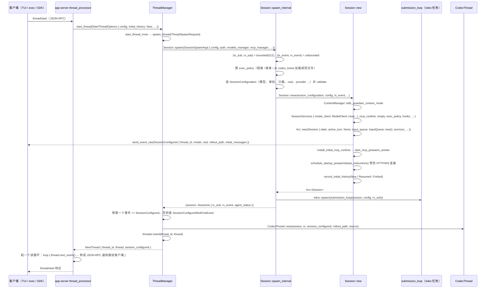
```mermaid
sequenceDiagram
  participant C as 客户端（TUI / exec / SDK）
  participant APS as app-server thread_processor
  participant TM as ThreadManager
  participant S as Session::spawn_internal
  participant SN as Session::new
  participant L as submission_loop（tokio 任务）
  participant CT as CodexThread

  C->>APS: thread/start（JSON-RPC）
  APS->>TM: start_thread(StartThreadOptions { config, initial_history: New, ... })
  TM->>TM: start_thread_inner → spawn_thread(ThreadSpawnRequest)
  TM->>S: Session::spawn(SessionSpawnArgs { config, auth, models_manager, mcp_manager, ... })
  S->>S: (tx_sub, rx_sub) = bounded(512)，(tx_event, rx_event) = unbounded
  S->>S: 算 exec_policy（隔离 / 继承 / 从 codex_home 加载规则文件）
  S->>S: 组 SessionConfiguration（模型、审批、沙箱、cwd、provider …）并 validate
  S->>SN: Session::new(session_configuration, config, tx_event, ...)
  SN->>SN: ContextManager::with_guardian_context_mode
  SN->>SN: SessionServices { model_client: ModelClient::new(...), mcp_runtime: empty, exec_policy, hooks, ... }
  SN->>SN: Arc::new(Session { state, active_turn: None, input_queue: InputQueue::new(), services, ... })
  SN-->>C: send_event_raw(SessionConfigured { thread_id, model, cwd, rollout_path, initial_messages })
  SN->>SN: install_initial_mcp_runtime → start_mcp_prewarm_worker
  SN->>SN: schedule_startup_prewarm(base_instructions) 预热 HTTP/WS 连接
  SN->>SN: record_initial_history(New / Resumed / Forked)
  SN-->>S: Arc<Session>
  S->>L: tokio::spawn(submission_loop(session, config, rx_sub))
  S-->>TM: (session, SessionIo { tx_sub, rx_event, agent_status })
  TM->>TM: 等第一个事件 == SessionConfigured，否则报 SessionConfiguredNotFirstEvent
  TM->>CT: CodexThread::new(session, io, session_configured, rollout_path, source)
  TM->>TM: threads.insert(thread_id, thread)
  TM-->>APS: NewThread { thread_id, thread, session_configured }
  APS->>APS: 起一个读循环：loop { thread.next_event() → 转成 JSON-RPC 通知推给客户端 }
  APS-->>C: thread/start 响应
```

| 步 | 要点 |
|---|---|
| ① | `thread/start` 请求处理器调 `ThreadManager::start_thread` |
| ② | `spawn_thread` 是唯一装配点，新建 / 恢复 / fork 三条路都汇到这 |
| ③ | 两条通道。提交通道有界 512，事件通道无界 |
| ④ | 执行策略三选一：`SessionIsolation::Isolated` 只用托管策略；有继承的用继承的（子 agent）；否则从 `codex_home` 读 `.codexpolicy` 规则文件 |
| ⑤ | `Session::new` 参数 36 个，全是上面算好的东西 |
| ⑥ | `SessionServices` 字面量。`mcp_runtime` 先放一个空的，真正的连接在 `SessionConfigured` 事件之后才装（注释：让 MCP 事件跟在它后面） |
| ⑦ | **第一个事件必须是 `SessionConfigured`**，`spawn_thread` 会检查（不是就返回 `Err(SessionConfiguredNotFirstEvent)`） |
| ⑧ | 启动预热：用 base instructions 发一个空请求把连接和缓存暖起来，句柄存进 `SessionState.startup_prewarm`，第一轮 `consume_startup_prewarm_for_regular_turn` 消费 |
| ⑨ | `record_initial_history`：`New` 什么都不做（初始上下文推迟到第一轮）；`Resumed` 走 `apply_rollout_reconstruction`（§12.3） |
| ⑩ | `submission_loop` 是一个独立 tokio 任务，`Op::Shutdown` 才退出 |
| ⑪ | `CodexThread` 只是把 `(session, io)` 包起来 |

**三个客户端怎么接**：

| 客户端 | 造线程 | 提交输入 | 读事件 |
|---|---|---|---|
| app-server（网络 / stdio） | `thread_processor` 处理 `thread/start` | `turn_processor` 调 `thread.start_or_steer_turn(...)` | 每线程一个 `next_event` 循环，转成 `ServerNotification` |
| TUI | `start_thread` → 发 `thread/start` 给进程内 app-server | `submit_op` → `AppCommand` → app-server 请求 | `app_server.next_event()` |
| `codex exec` | `InProcessAppServerClient::start` | `ClientRequest::TurnStart` | `client.next_event()` 循环，`TurnCompleted` 时退出 |

所以 core 的入口在三种模式下**完全一样**，差别只在 app-server 之上。

---

## 8. 流程二：一次 prompt 从输入到停下（主线）

这是整篇最重要的一张图。假设线程空闲，用户发了一句话，模型调了一次工具然后回答。

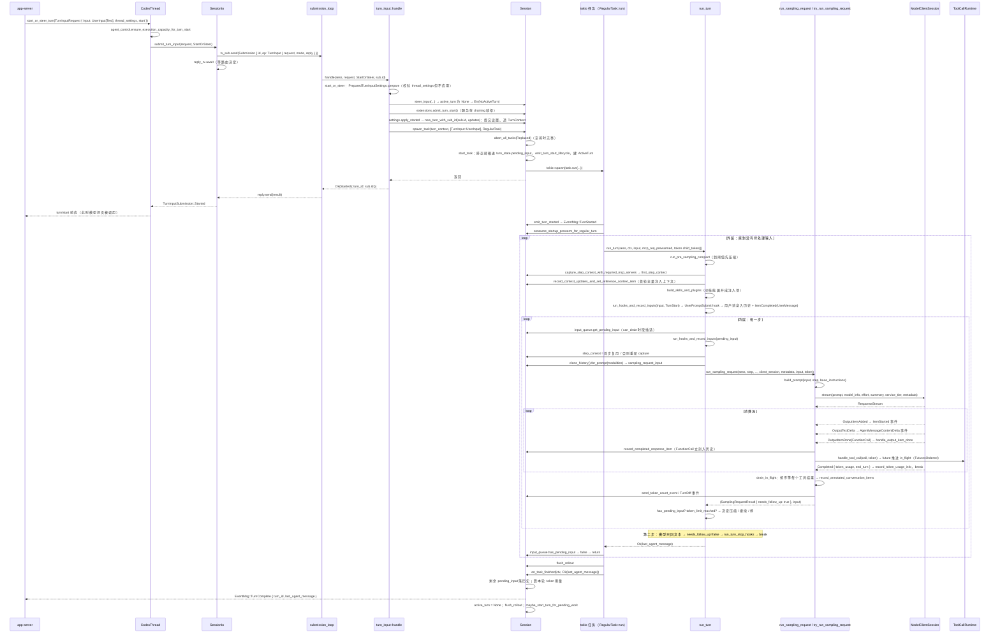
```mermaid
sequenceDiagram
  participant APS as app-server
  participant CT as CodexThread
  participant IO as SessionIo
  participant L as submission_loop
  participant TI as turn_input::handle
  participant S as Session
  participant T as tokio 任务（RegularTask::run）
  participant RT as run_turn
  participant SR as run_sampling_request / try_run_sampling_request
  participant MC as ModelClientSession
  participant TR as ToolCallRuntime

  APS->>CT: start_or_steer_turn(TurnInputRequest { input: UserInput[Text], thread_settings, start })
  CT->>CT: agent_control.ensure_execution_capacity_for_turn_start
  CT->>IO: submit_turn_input(request, StartOrSteer)
  IO->>L: tx_sub.send(Submission { id, op: TurnInput { request, mode, reply } })
  IO->>IO: reply_rx.await（等路由决定）
  L->>TI: handle(sess, request, StartOrSteer, sub.id)
  TI->>TI: start_or_steer：PreparedTurnInputSettings::prepare（校验 thread_settings 但不应用）
  TI->>S: steer_input(...) → active_turn 为 None → Err(NoActiveTurn)
  TI->>S: extensions.admit_turn_start()（服务在 draining 就拒）
  TI->>S: settings.apply_started → new_turn_with_sub_id(sub.id, updates)：提交设置、造 TurnContext
  TI->>S: spawn_task(turn_context, [TurnInput::UserInput], RegularTask)
  S->>S: abort_all_tasks(Replaced)（空闲时无事）
  S->>S: start_task：排空邮箱进 turn_state.pending_input，emit_turn_start_lifecycle，建 ActiveTurn
  S->>T: tokio::spawn(task.run(...))
  S-->>TI: 返回
  TI-->>L: Ok(Started { turn_id: sub.id })
  L-->>IO: reply.send(result)
  IO-->>CT: TurnInputSubmission::Started
  CT-->>APS: turn/start 响应（此时模型还没被调用）

  T->>S: emit_turn_started → EventMsg::TurnStarted
  T->>S: consume_startup_prewarm_for_regular_turn
  loop 外层：直到没有待处理输入
    T->>RT: run_turn(sess, ctx, input, mcp_req, prewarmed, token.child_token())
    RT->>RT: run_pre_sampling_compact（到阈值先压缩）
    RT->>S: capture_step_context_with_required_mcp_servers → first_step_context
    RT->>S: record_context_updates_and_set_reference_context_item（首轮全量注入上下文）
    RT->>RT: build_skills_and_plugins（@技能 展开成注入项）
    RT->>RT: run_hooks_and_record_inputs(input, TurnStart) → UserPromptSubmit hook → 用户消息入历史 + ItemCompleted(UserMessage)
    loop 内层：每一步
      RT->>S: input_queue.get_pending_input（can_drain 时取插话）
      RT->>RT: run_hooks_and_record_inputs(pending_input)
      RT->>S: step_context = 首步复用 / 否则重新 capture
      RT->>S: clone_history().for_prompt(modalities) → sampling_request_input
      RT->>SR: run_sampling_request(sess, step, ..., client_session, metadata, input, token)
      SR->>SR: build_prompt(input, step, base_instructions)
      SR->>MC: stream(prompt, model_info, effort, summary, service_tier, metadata)
      MC-->>SR: ResponseStream
      loop 消费流
        MC-->>SR: OutputItemAdded → ItemStarted 事件
        MC-->>SR: OutputTextDelta → AgentMessageContentDelta 事件
        MC-->>SR: OutputItemDone(FunctionCall) → handle_output_item_done
        SR->>S: record_completed_response_item（FunctionCall 立刻入历史）
        SR->>TR: handle_tool_call(call, token) → future 推进 in_flight（FuturesOrdered）
        MC-->>SR: Completed { token_usage, end_turn } → record_token_usage_info，break
      end
      SR->>SR: drain_in_flight：按序等每个工具结果 → record_annotated_conversation_items
      SR->>S: send_token_count_event / TurnDiff 事件
      SR-->>RT: (SamplingRequestResult { needs_follow_up: true }, input)
      RT->>RT: has_pending_input? token_limit_reached? → 决定压缩 / 继续 / 停
    end
    Note over RT: 第二步：模型只回文本 → needs_follow_up=false → run_turn_stop_hooks → break
    RT-->>T: Ok(last_agent_message)
    T->>S: input_queue.has_pending_input → false → return
  end
  T->>S: flush_rollout
  T->>S: on_task_finished(ctx, Ok(last_agent_message))
  S->>S: 剩余 pending_input 落历史；算本轮 token 用量
  S-->>APS: EventMsg::TurnComplete { turn_id, last_agent_message }
  S->>S: active_turn = None；flush_rollout；maybe_start_turn_for_pending_work
```

### 8.1 `turn_input::handle`：三条路

| 模式 | 函数 | 逻辑 |
|---|---|---|
| `StartOrSteer` | `start_or_steer` | 只接受非空 `UserInput` 或独立的 `FunctionCallOutput`（否则 `InvalidRequest`）。先 `steer_input`：成功就是 `Steered`；失败原因是 `NoActiveTurn` 才走开新轮；其它失败原因（轮次不可插话、schema 不匹配、空输入）直接 `NotSubmitted` |
| `StartIfIdle` | `start_if_idle` | 依次检查：邮箱里有要触发轮次的邮件 → `PendingTriggerTurn`；自动输入遇到 Plan 模式 → `PlanMode`；`admit_turn_start` 失败 → `ServerDraining`；`active_turn` 非空 → `NotIdle`。通过后**先 `get_or_insert_with(ActiveTurn::default)` 占位**，再造 `TurnContext`，失败就 `clear_reserved_idle_turn` |
| `Steer { expected_turn_id }` | `steer` | 只接受 `UserInput`；`steer_input` 带 `expected_turn_id` |
| 恢复 | `handle_recovery` | `Op::RecoverTurn`：造一个空 `UserInput` 请求、`turn_trigger = "retry"`，走 `start_if_idle(kind = Recovery)`；Recovery 不塞新用户消息，直接续采样 |

`steer_input` 的拒绝顺序：无活跃轮 → `expected_turn_id` 不等 → 活跃的是 Review / Compact 任务 → 空输入 → 输出 schema 不等。全过之后把输入（补上 `acceptance_order`）追加到 `turn_state.pending_input` 并重新打开收件（`CurrentTurn`，见 §10.2）。

`apply_started` 做两件事：拿持久化锁应用 `thread_settings`（所以"发消息时顺便换模型"是原子的），然后 `new_turn_with_sub_id` 造 `TurnContext`，**轮次 id 就是提交 id**。

### 8.2 `start_task` 做了什么

| 步 | 做什么 |
|---|---|
| ① | `activate_plugin_selection`；`turn_metadata_state.set_root_turn_id(sub_id)` |
| ② | `mark_turn_started`、记 `token_usage_at_turn_start` |
| ③ | `CancellationToken::new()`——**这轮取消树的根** |
| ④ | `drain_mailbox_input_items` → 塞进 `turn_state.pending_input`（轮次开始时邮箱里已有的邮件并进这一轮） |
| ⑤ | `emit_turn_start_lifecycle`（extension 的 on_turn_start） |
| ⑥ | `tokio::spawn`：跑 `task.run(session, ctx, input, token.child_token())`；跑完 `flush_rollout`；**没被取消才** `on_task_finished`；`done.notify_waiters()` |
| ⑦ | `RunningTask { done, handle: AbortOnDropHandle, kind, task, cancellation_token, turn_context, ... }` 写进 `active_turn.task` |

### 8.3 `run_turn` 进入循环之前

| 步 | 做什么 | 提前返回 |
|---|---|---|
| ① | `drain_async_hook_results(before_user_prompt = true)`：上一轮跑完的异步 hook 结果先落历史 | — |
| ② | `client_session = prewarmed 或 model_client.new_session()` | — |
| ③ | `run_pre_sampling_compact`（§11.2）。失败时先把输入落历史再报错，注释：压缩在输入记录之前跑，所以任何失败都要保住输入 | `TurnAborted` / `ToolCollision` 返回 Err；其它错发 `Error` 事件后 `Ok(None)` |
| ④ | `required_mcp_servers_for_input`：输入里 `@提到` 的 MCP 服务器和插件，这一步必须等它们连上 | — |
| ⑤ | `capture_step_context_with_required_mcp_servers` → `first_step_context` | 取消返回 Err |
| ⑥ | **并行**：`record_context_updates_and_set_reference_context_item`（§13）和算 diff 显示根 | — |
| ⑦ | `build_skills_and_plugins`：`@技能` 展开成要注入的 `ResponseItem`，`explicitly_enabled_connectors` | 返回 `None` 就 `Ok(None)` |
| ⑧ | `run_pending_session_start_hooks`；guardian 输入终结（内部安全审查用，可忽略） | hook 要停就 `Ok(None)` |
| ⑨ | `can_drain_pending_input = input.is_empty()`；`run_hooks_and_record_inputs(input, TurnStart)`：**用户消息在这里入历史** | 全被 hook 拦下就 `Ok(None)` |
| ⑩ | 预热 shell 快照；记 `previous_turn_settings`；注入项逐条 `record_conversation_items` | — |

`can_drain_pending_input` 初始为"这轮没有新输入"：有新输入时第一步不取插话，让新输入先被采样；采样过一次之后置 `true`。

### 8.4 内层循环每一圈做什么

| 步 | 做什么 |
|---|---|
| ① | `pending_input = can_drain ? input_queue.get_pending_input() : []` |
| ② | `run_hooks_and_record_inputs(pending_input, Standard)`，被拦就 `break` |
| ③ | `rollout_budget::maybe_record_reminder`：rollout 预算快用完时塞一条提醒 |
| ④ | `step_context`：有 `next_step_context` 且没有新插话就复用；否则重新 `capture`（插话里可能又 `@` 了新的 MCP 服务器） |
| ⑤ | `time_reminder::maybe_record_current_time_reminder`；`record_step_world_state_if_changed`（cwd/分支变了塞一条）；`record_reasoning_effort_override` |
| ⑥ | `sampling_request_input = clone_history().for_prompt(modalities)` |
| ⑦ | `run_sampling_request(...)` → `(SamplingRequestResult, input)` |
| ⑧ | 成功：`model_needs_follow_up` 为真时重新打开收件（`CurrentTurn`）；`can_drain = true`；`drain_async_hook_results(false)` |
| ⑨ | `has_pending_input` 和 `context_window_token_status` 并行算；`needs_follow_up = model_needs_follow_up || has_pending_input` |
| ⑩ | `should_roll_over = needs_follow_up && (显式要新窗口 || token_limit_reached)` → `run_auto_compact(MidTurn)` 后 `continue`（§11.3） |
| ⑪ | `!needs_follow_up`：`run_turn_stop_hooks`。Stop hook 可以 `should_block` 并给一段文本 → 当成新的用户消息入历史、`continue`；`should_stop` → `break`；再跑 legacy `AfterAgent` hook；然后 `break` |
| ⑫ | `needs_follow_up` 为真：`continue` |
| ⑬ | 错误分支：`ContextWindowExceeded` 且 guardian 预算场景 → 压一次 `continue`；`TurnAborted` → `return Err`；`InvalidImageRequest` → 发固定文案 `break`；其它 → `emit_turn_error_lifecycle` + `Error` 事件 + `break`（注释：让用户能继续对话） |

**谁决定继续**：`needs_follow_up`，它由三个来源合成——模型这一步有工具调用（`handle_output_item_done` 置 `needs_follow_up = true`）、`Completed.end_turn == Some(false)`、队列里有待处理输入。**谁决定停**：`!needs_follow_up` 加上 Stop hook 没拦。

### 8.5 请求体的字段从哪来（`build_prompt` + `build_responses_request`）

| 字段 | 来源 | 每步会变吗 |
|---|---|---|
| `model` | `model_info.slug`（`StepContext.settings.model_info`） | 轮次中途 `Op::TurnSettings` 换模型时下一步变 |
| `instructions` | `sess.get_prompt_base_instructions()`：`SessionConfiguration.base_instructions`，`update_plan` 关掉时删掉相关段落。`use_responses_lite` 模型下清空，改成 `input` 开头的 `AdditionalTools` + 一条 developer 消息 | 不变 |
| `input` | `clone_history().for_prompt()` 的结果，再 `executed_tool_calls.attach_to_prompt`，再 `get_formatted_input_for_request` 归一化图片 detail。非 OpenAI provider 清掉 `encrypted_function_args` 和内部元数据 | 每步增长；压缩后整体替换 |
| `tools` | `step_context.tool_router.model_visible_specs()` → `create_tools_raw_json_for_responses_api` | 同一轮内只在重新 `capture` 时变（插话提到新 MCP） |
| `tool_choice` | 常量 `"auto"` | 不变 |
| `parallel_tool_calls` | `Prompt.parallel_tool_calls`（`build_prompt` 写死 `true`）且非 lite | 不变 |
| `reasoning` | `build_reasoning(model_info, effort, summary)`：effort 来自 `reasoning_effort_for_request`（用户设置 → 钉住值 → 模型默认） | 换设置时变 |
| `store` / `stream` | `false` / `true` | 不变 |
| `include` | `["reasoning.encrypted_content"]` | 不变 |
| `service_tier` | `model_info.service_tier_for_request(turn 级 service_tier)` | `TurnStartOptions.service_tier` 只管这一轮 |
| `prompt_cache_key` | `prompt_cache_key(responses_metadata)`：默认线程 id，审查子会话用父线程 id | 不变 |
| `text` | `create_text_param_for_request(verbosity, output_schema, strict)`：结构化输出 schema 来自 `TurnContext.final_output_json_schema` | 不变 |
| `client_metadata` | `responses_metadata.client_metadata()`：session/thread/turn id、`turn_trigger`、客户端名 | 每轮变 |
| 请求头 | `build_responses_options`：`x-codex-turn-state`（粘性路由，`ModelClientSession.turn_state`）、originator、beta features、attestation、`responses-lite` | 同轮内固定 |

**重试时请求体改什么**：`run_sampling_request` 的 `loop` 每次重新 `clone_history().for_prompt()` 造 `prompt_input`，所以第一次失败后**已经落历史的部分输出会出现在重试请求里**（`initial_input` 只在第一次用）；`extension_data.remove::<ResponseId>()` 清掉上一次的响应 id，防止工具调用归因到失败的响应。

### 8.6 流事件怎么处理（`try_run_sampling_request` 的 `match`）

| `ResponseEvent` | 处理 |
|---|---|
| `Created { response_id }` | 存进 `extension_data` |
| `OutputItemAdded(item)` | 补 id；`CustomToolCall` 起一个参数 diff 消费者（`apply_patch` 流式显示 diff）；消息 / 推理 → `parse_turn_item` → `emit_turn_item_started`；记为 `active_item` |
| `OutputTextDelta(delta)` | 有 `active_item` 才处理：`AgentMessage` 走 `assistant_message_stream_parsers`（剥 `<proposed_plan>` 等隐藏标记）再发 `AgentMessageContentDelta`；没有 `active_item` 是 bug（debug 构建 panic） |
| `ToolCallInputDelta` | 喂给参数 diff 消费者 |
| `ReasoningSummaryDelta` / `ReasoningContentDelta` / `ReasoningSummaryPartAdded` / `ReasoningSummaryDone` | 转成 `ReasoningContentDelta` / `AgentReasoningSectionBreak` 事件。`ConcurrentReasoningSummaries` 开着时用 `SummaryDone` 而不是 `Delta` |
| `OutputItemDone(item)` | 结束上一个 `active_item` 的 diff 消费者和文本段；plan 模式特殊处理；**`handle_output_item_done`**：工具调用 → `in_flight.push_back(future)`、`needs_follow_up = true`；消息 → `emit_turn_item_completed`、更新 `last_agent_message`。然后：如果这个项是 commentary 消息或推理，且邮箱有新邮件，**提前 break** 让邮件进下一步 |
| `Completed { response_id, token_usage, end_turn }` | flush 文本段；`record_observed_response_completed`；`record_token_usage_info`（超预算返回 Err）；`end_turn == Some(false)` 置 `needs_follow_up`；`break Ok(SamplingRequestResult)` |
| `RateLimits` | 记下，延到 `TokenCount` 事件一起发 |
| `ServerModel` / `ModelVerifications` / `SafetyBuffering` / `TurnModerationMetadata` / `ModelsEtag` / `ServerReasoningIncluded` | 各发一个事件或更新状态 |

流结束后：`drain_in_flight` 等所有工具；发 `TokenCount`（注释：`request_user_input` 之类会让轮次停下等用户，token 计数要等工具都结束再发）；被取消就 `Err(TurnAborted)`；有文件改动就发 `TurnDiff`。

### 8.7 `on_task_finished`

| 步 | 做什么 |
|---|---|
| ① | 按结果分类：`Ok(msg)` 正常；`Err(TurnAborted)` → `abort_reason = Interrupted`；其它 Err → 发 `Error` 事件 |
| ② | `active_turn.task.take()`，`handle.detach()`（任务已经跑完，别 abort） |
| ③ | `take_pending_input_for_turn_state`：**还没被取走的插话在这里落历史**（`run_hooks_and_record_inputs`），下一轮开始时它们已经在历史里 |
| ④ | 算本轮 token 用量（总量减去 `token_usage_at_turn_start`）、遥测 |
| ⑤ | 中断的话跑 `TurnInterrupt` hook；发 `TurnAborted { reason }` 或 `TurnComplete { last_agent_message, error }` |
| ⑥ | `active_turn = None`（只在 `task` 为空且 `turn_state` 指针相同时） |
| ⑦ | `flush_rollout`；`maybe_start_turn_for_pending_work`：邮箱里有 `trigger_turn` 的邮件就自动开下一轮 |

---

## 9. 流程三：一轮里的工具调用

以 `exec_command` 为例，包含审批和沙箱。

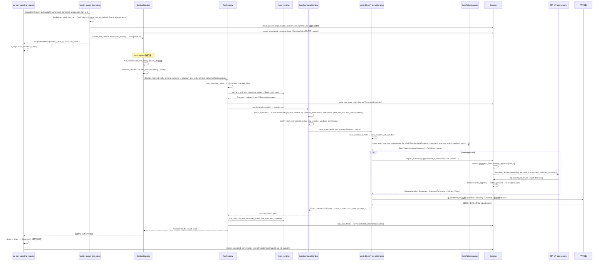
```mermaid
sequenceDiagram
  participant SR as try_run_sampling_request
  participant HO as handle_output_item_done
  participant TR as ToolCallRuntime
  participant RG as ToolRegistry
  participant HK as hook_runtime
  participant H as ExecCommandHandler
  participant PM as UnifiedExecProcessManager
  participant EP as ExecPolicyManager
  participant S as Session
  participant U as 用户（经 app-server）
  participant SB as 平台沙箱

  SR->>HO: OutputItemDone(FunctionCall { name: exec_command, arguments, call_id })
  HO->>HO: ToolRouter::build_tool_call → ToolCall { tool_name, call_id, payload: Function(arguments) }
  HO->>S: input_queue.accept_mailbox_delivery_for_current_turn（重新打开收件）
  HO->>S: record_completed_response_item（FunctionCall 立刻入历史 + rollout）
  HO->>TR: handle_tool_call(call, token.child_token()) → InFlightFuture
  HO-->>SR: OutputItemResult { needs_follow_up: true, tool_future }
  SR->>SR: in_flight.push_back(tool_future)
  Note over TR: tokio::spawn 的任务里：
  TR->>TR: tool_runtime.wait_until_ready（MCP 工具等连接）
  TR->>TR: supports_parallel ? parallel_execution.read() : .write()
  TR->>RG: dispatch_tool_call_with_terminal_outcome → dispatch_any_with_terminal_outcome(ToolInvocation)
  RG->>RG: turn_state.tool_calls += 1；找 runtime；matches_kind
  RG->>HK: run_pre_tool_use_hooks(tool_name = "Bash", tool_input)
  HK-->>RG: Continue { updated_input } / Blocked(message)
  RG->>S: notify_tool_start → ItemStarted(CommandExecution)
  RG->>H: tool.handle(invocation) → handle_call
  H->>H: parse_arguments → ExecCommandArgs { cmd, workdir, tty, sandbox_permissions, justification, yield_time_ms, max_output_tokens }
  H->>H: resolve_tool_environment；native cwd；resolve_sandbox_permissions
  H->>PM: exec_command(ExecCommandRequest, context)
  PM->>PM: exec_command_inner → open_session_with_sandbox
  PM->>EP: create_exec_approval_requirement_for_shell(ExecApprovalRequest { command, approval_policy, sandbox_policy, ... })
  EP-->>PM: Skip / NeedsApproval { reason } / Forbidden { reason }
  alt NeedsApproval
    PM->>S: request_command_approval(call_id, command, cwd, reason, ...)
    S->>S: oneshot 登记进 turn_state.pending_approvals[call_id]
    S-->>U: EventMsg::ExecApprovalRequest { call_id, command, available_decisions }
    U->>S: Op::ExecApproval { id: call_id, decision }
    S->>S: handlers::exec_approval → notify_approval → tx.send(decision)
    S-->>PM: ReviewDecision（Approved / ApprovedForSession / Denied / Abort）
  end
  PM->>SB: 按 SandboxType 起进程（Seatbelt / seccomp+Landlock / 受限令牌 / None）
  SB-->>PM: 输出流 + 退出码（或 SandboxDenied）
  PM-->>H: ExecCommandToolOutput { chunk_id, output, exit_code, process_id, ... }
  H-->>RG: Box<dyn ToolOutput>
  RG->>HK: run_post_tool_use_hooks(tool_name, tool_input, tool_response)
  RG->>S: notify_tool_finish → ItemCompleted(CommandExecution)
  RG-->>TR: AnyToolResult { call_id, result }
  TR-->>SR: 释放并行门；future 兑现
  SR->>SR: drain_in_flight：in_flight.next() 按提交顺序取
  SR->>S: record_annotated_conversation_items([FunctionCallOutput { call_id, output }])
```

### 9.1 三条硬规则

| 规则 | 相关函数 | 说明 |
|---|---|---|
| **工具调用项在执行前就入历史** | `record_completed_response_item` | 注释："records items immediately so history and rollout stay in sync even if the turn is later cancelled"。被中断时历史里有 `FunctionCall` 没有输出，`normalize_history` 下次发请求前会补一条合成输出 |
| **结果按提交顺序回填** | `FuturesOrdered` | 并发执行，但 `next()` 按 `push_back` 顺序产出。模型看到的历史顺序和它发出调用的顺序一致 |
| **并行门是读写锁** | `supports_parallel_tool_calls` | `supports_parallel_tool_calls` 为真的拿读锁，其它拿写锁。`exec_command` 是 `true`，`apply_patch` 默认 `false`，所以"两个 exec 并发、patch 独占" |

### 9.2 审批：谁决定要不要问

判定在 `default_exec_approval_requirement`，输入是审批策略和文件系统沙箱策略：

| `AskForApproval` | 命令要求提权（`with_escalated_permissions`）| 结果 |
|---|---|---|
| `Never` | 任意 | `Skip`（不问；`Forbidden` 只在命令明确要求绕过沙箱时） |
| `OnRequest` / `Granular` | 是 | `NeedsApproval` |
| `OnRequest` / `Granular` | 否 | `Skip`，先在沙箱里跑 |
| `UnlessTrusted` | 任意 | `NeedsApproval`（除非 execpolicy 规则说 `Allow`） |

在这之前 `ExecPolicyManager` 先用 starlark 规则文件匹配命令：规则命中 `Allow` → `Skip` 且可能 `bypass_sandbox`；命中 `Deny` → `Forbidden`；命中 `Prompt` → `NeedsApproval`；没命中走上表。

等用户的机制（`request_command_approval`）：造 `oneshot`，以 `call_id`（或 `approval_id`）为键存进 `TurnState.pending_approvals`，发 `ExecApprovalRequest` 事件，`rx.await`。用户回 `Op::ExecApproval`：`Abort` → `interrupt_task`；否则 `notify_approval` 把决定送进 oneshot。`ReviewDecision` 有九种，`ApprovedForSession` 会记进 `services.tool_approvals`，同样的命令这个会话不再问。

`apply_patch` 走的是 `ToolOrchestrator::run`：同样先算 `ExecApprovalRequirement`，`NeedsApproval` 时 `request_patch_approval`，批准后第一次在沙箱里跑；返回 `Sandbox(Denied)` 时如果策略允许，再问一次用户要不要不带沙箱重跑（`Err(ToolError::Codex(err))` 分支）。

### 9.3 沙箱：走哪个

`SandboxManager::select_initial(permission_profile, preference, windows_level, has_network)` 返回 `SandboxType`：`None` / `MacosSeatbelt` / `LinuxSeccomp` / `WindowsRestrictedToken`。选定后 `open_session_with_sandbox` 把 `SandboxType` 和权限一起交给 `codex_exec_server`，由它起进程。`DangerFullAccess` 或 execpolicy `Allow + bypass_sandbox` 时是 `None`。

远程执行环境（`environment.is_remote()`）不在本机起沙箱，权限以 URI 形式发给远端 executor 自己执行。

### 9.4 工具结果怎么回到模型

`AnyToolResult::into_response()` → `result.to_response_item(call_id, payload)` → `ResponseInputItem::FunctionCallOutput { call_id, output }` → 包信封（`history_truncation_token_limit` 记当前截断预算）→ `record_annotated_conversation_items`。输出超长时按 `model_info.truncation_policy` 截断，原文可通过 `chunk_id` 用 `write_stdin` 或 `read_mcp_resource` 再取。

### 9.5 三种"工具没跑成"的文案

| 情况 | 来源 | 模型看到什么 |
|---|---|---|
| 模型调了不存在的工具 | `unsupported_tool_call_message` | `FunctionCallError::RespondToModel(...)` → 一条 `FunctionCallOutput` 说明工具不存在 |
| hook 拦截 | `PreToolUseHookResult::Blocked(message)` | hook 给的文本作为输出 |
| 被中断 | `aborted_response(call, secs)` | "aborted by user after N seconds" |

---

## 10. 流程四：插话、邮箱与中断

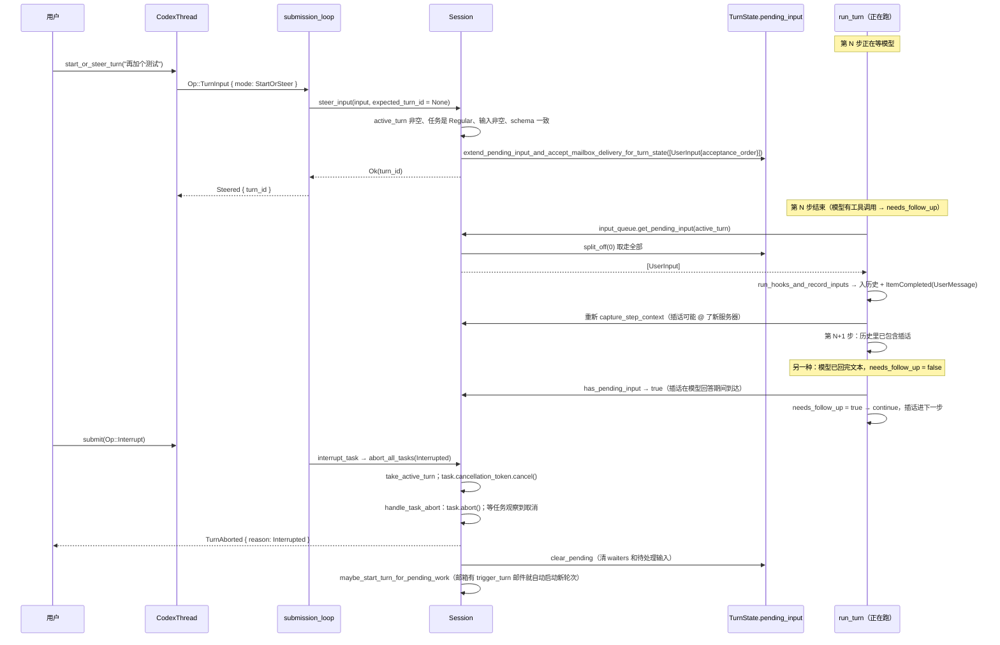
```mermaid
sequenceDiagram
  participant U as 用户
  participant CT as CodexThread
  participant L as submission_loop
  participant S as Session
  participant TS as TurnState.pending_input
  participant RT as run_turn（正在跑）

  Note over RT: 第 N 步正在等模型
  U->>CT: start_or_steer_turn("再加个测试")
  CT->>L: Op::TurnInput { mode: StartOrSteer }
  L->>S: steer_input(input, expected_turn_id = None)
  S->>S: active_turn 非空、任务是 Regular、输入非空、schema 一致
  S->>TS: extend_pending_input_and_accept_mailbox_delivery_for_turn_state([UserInput{acceptance_order}])
  S-->>L: Ok(turn_id)
  L-->>CT: Steered { turn_id }
  Note over RT: 第 N 步结束（模型有工具调用 → needs_follow_up）
  RT->>S: input_queue.get_pending_input(active_turn)
  S->>TS: split_off(0) 取走全部
  S-->>RT: [UserInput]
  RT->>RT: run_hooks_and_record_inputs → 入历史 + ItemCompleted(UserMessage)
  RT->>S: 重新 capture_step_context（插话可能 @ 了新服务器）
  RT->>RT: 第 N+1 步：历史里已包含插话

  Note over RT: 另一种：模型已回完文本，needs_follow_up = false
  RT->>S: has_pending_input → true（插话在模型回答期间到达）
  RT->>RT: needs_follow_up = true → continue，插话进下一步

  U->>CT: submit(Op::Interrupt)
  L->>S: interrupt_task → abort_all_tasks(Interrupted)
  S->>S: take_active_turn；task.cancellation_token.cancel()
  S->>S: handle_task_abort：task.abort()；等任务观察到取消
  S-->>U: TurnAborted { reason: Interrupted }
  S->>TS: clear_pending（清 waiters 和待处理输入）
  S->>S: maybe_start_turn_for_pending_work（邮箱有 trigger_turn 邮件就自动启动新轮次）
```

### 10.1 插话和 pi-mono 的差别

| | pi-mono | codex |
|---|---|---|
| 队列在哪 | `Agent.steeringQueue` / `followUpQueue`（内存数组） | `TurnState.pending_input`（轮次级）+ `InputQueue.mailbox_pending_mails`（会话级） |
| 两种语义 | steer（本轮）/ followUp（下一轮） | 只有一种：**都进当前轮**。`has_pending_input` 让外层循环在模型停下后再跑一轮，效果等于 followUp |
| 取的时机 | 轮次开头 `prepareNextTurn` 后 | 每步开头，但 `can_drain_pending_input` 在"这轮刚开始有新输入"和"刚压缩完"时为 `false`，让新输入先被采样 |
| 一次取几条 | `one-at-a-time` 默认一条 | 全部（`split_off(0)`） |
| 竞态处理 | 无 | `Steer { expected_turn_id }` 不匹配拒绝；`StartIfIdle` 先占位再造上下文 |
| 排队消息的 UI 呈现 | 文本匹配 | `acceptance_order` 单调序号 + `ItemCompleted(UserMessage)` 事件 |

### 10.2 子 agent 的消息什么时候能插进来（`MailboxDeliveryPhase`）

**场景**：主 agent 用 `spawn_agent` 派出几个子 agent 并行干活。子 agent 干完或者有进展时，会给主 agent 发一条消息（`Op::InterAgentCommunication` → `input_queue.enqueue_mailbox_communication`），放进会话级的"邮箱"。主 agent 每一步开头调 `get_pending_input` 时，会把用户插话和邮箱里的消息一起取走，拼进下一次请求。

**问题**：子 agent 的消息什么时候到是说不准的。设想主 agent 已经把最终答案输出给用户了，这时一条子 agent 消息才到。如果照常取走，`has_pending_input` 会返回 `true`，外层循环以为还有活，就会让模型再跑一步，于是用户看到答案后面又冒出一段内容。

**解法**：在 `TurnState` 上加一个开关，记录"这一轮还收不收邮件"。它就是 `MailboxDeliveryPhase`（`state/turn.rs:51`）。名字直译是"邮件投递阶段"，其实只有两个值：

- `CurrentTurn`：收。邮件可以并进这一轮。
- `NextTurn`：不收。邮件先留在邮箱里，等下一轮再处理。

**开关什么时候拨**：

| 时机 | 拨到 | 代码 |
|---|---|---|
| 新一轮开始 | 收（默认值） | `#[default] CurrentTurn` |
| 模型输出了一段给用户看的最终答案（`assistant` 消息、不是 `Commentary` 过程说明、文本非空） | 不收 | `handle_output_item_done` → `defer_mailbox_delivery_to_next_turn`（`input_queue.rs:213`） |
| 模型接着又发了工具调用，或者用户插话 | 收 | `handle_output_item_done`、`steer_input` → `accept_mailbox_delivery_for_current_turn` |

有一个例外：拨到"不收"之前会先看 `pending_input` 里有没有用户插话、工具输出，或者要求开新一轮（`trigger_turn`）的邮件。只要有，就不拨，因为这些是这一轮必须接着处理的。

**"不收"具体是什么效果**：`get_pending_input` 什么都不取，返回空；`has_pending_input` 直接返回 `false`（`input_queue.rs:291`、`:329`）。外层循环看到没有待处理输入，这一轮就正常结束了。

**被留下的邮件去哪了**：一直留在 `mailbox_pending_mails` 里，有两条出路：

- 用户下次发消息开新一轮时，`start_task` 先把邮箱里的邮件取出来并进这一轮（§8.2 第 ④ 步）。
- 如果邮件带 `trigger_turn = true`，会话一空闲，`maybe_start_turn_for_pending_work`（`tasks/mod.rs:427`）就自动开一轮去处理它，不用等用户。

### 10.3 中断的传播路径

`Op::Interrupt` → `handlers::interrupt` → `Session::interrupt_task` → `abort_all_tasks(Interrupted)` → `take_active_turn`（标记 `interrupted`）→ `handle_task_abort`：`task.cancellation_token.cancel()`，Code Mode 开着时还打断 V8 cell，等 `done` 通知 → `emit_turn_abort_lifecycle` → `TurnAborted` 事件 → `input_queue.clear_pending`。

取消令牌是树：`start_task` 造根 → `task.run` 拿 `child_token()` → `run_turn` 拿 `child_token()` → `run_sampling_request` 拿 `child_token()` → 每个工具调用拿 `child_token()`。任何一层 `.or_cancel(&token)` 都会在根取消时返回 `Cancelled`。**中断不会等工具跑完**：`handle_tool_call_with_source` 的 `select!` 在取消时 `dispatch_handle.abort()`，除非 handler 已经到终态。

`Op::RecoverTurn`（`handle_recovery`）能把一个被中断的轮次续起来：不塞新消息、`turn_trigger = "retry"`，历史里的 `FunctionCall` 没有输出会被 `normalize_history` 补上合成输出后直接再采样。

---

## 11. 流程五：循环外的循环——重试与压缩

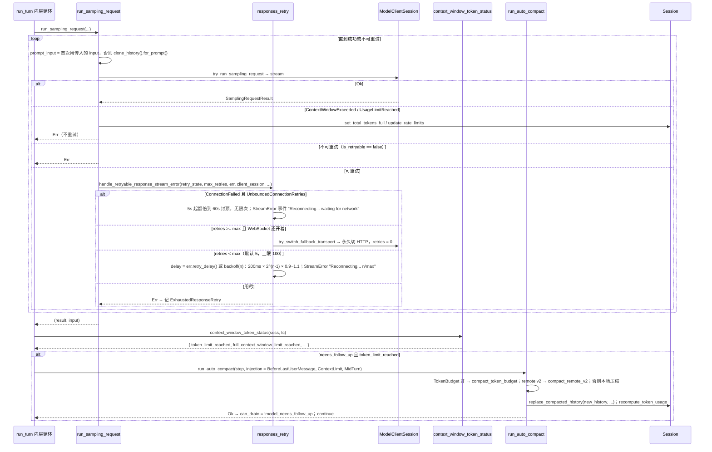
```mermaid
sequenceDiagram
  participant RT as run_turn 内层循环
  participant SR as run_sampling_request
  participant RS as responses_retry
  participant MC as ModelClientSession
  participant CW as context_window_token_status
  participant AC as run_auto_compact
  participant S as Session

  RT->>SR: run_sampling_request(...)
  loop 直到成功或不可重试
    SR->>SR: prompt_input = 首次用传入的 input，否则 clone_history().for_prompt()
    SR->>MC: try_run_sampling_request → stream
    alt Ok
      MC-->>SR: SamplingRequestResult
    else ContextWindowExceeded / UsageLimitReached
      SR->>S: set_total_tokens_full / update_rate_limits
      SR-->>RT: Err（不重试）
    else 不可重试（is_retryable == false）
      SR-->>RT: Err
    else 可重试
      SR->>RS: handle_retryable_response_stream_error(retry_state, max_retries, err, client_session, ...)
      alt ConnectionFailed 且 UnboundedConnectionRetries
        RS->>RS: 5s 起翻倍到 60s 封顶，无限次；StreamError 事件 "Reconnecting... waiting for network"
      else retries >= max 且 WebSocket 还开着
        RS->>MC: try_switch_fallback_transport → 永久切 HTTP，retries = 0
      else retries < max（默认 5，上限 100）
        RS->>RS: delay = err.retry_delay() 或 backoff(n)：200ms × 2^(n-1) × 0.9~1.1；StreamError "Reconnecting... n/max"
      else 用尽
        RS-->>SR: Err → 记 ExhaustedResponseRetry
      end
    end
  end
  SR-->>RT: (result, input)
  RT->>CW: context_window_token_status(sess, tc)
  CW-->>RT: { token_limit_reached, full_context_window_limit_reached, ... }
  alt needs_follow_up 且 token_limit_reached
    RT->>AC: run_auto_compact(step, injection = BeforeLastUserMessage, ContextLimit, MidTurn)
    AC->>AC: TokenBudget 开 → compact_token_budget；remote v2 → compact_remote_v2；否则本地压缩
    AC->>S: replace_compacted_history(new_history, ...)；recompute_token_usage
    AC-->>RT: Ok → can_drain = !model_needs_follow_up；continue
  end
```

### 11.1 重试

| 项 | 值 |
|---|---|
| 最大重试 | provider 配置 `stream_max_retries`，默认 5，硬上限 100 |
| 退避 | `200ms × 2^(n-1)`，乘 0.9~1.1 抖动；服务端给了 `retry_delay` 就用它 |
| 连接失败 | `Feature::UnboundedConnectionRetries` 开着且是 `ConnectionFailed`：5s 起翻倍，60s 封顶，**不计入 max_retries** |
| WebSocket 降级 | 普通重试用完后如果 WS 还没降级：`try_switch_fallback_transport` 切 HTTP 并把计数清零再来一轮 |
| 不重试的错误 | `is_retryable() == false` 的 26 种，另外 `ContextWindowExceeded` 和 `UsageLimitReached` 在 `run_sampling_request` 里单独处理（记状态后直接返回） |
| 重试请求体 | 重新 `for_prompt()`；`extension_data.remove::<ResponseId>()` |
| 用尽后 | `ExhaustedResponseRetry { turn_id, retry_at }` 存进 `thread_extension_data`，供后续判断 |

第一次 WebSocket 重试在 release 构建里不发 `StreamError`（注释：减少瞬时重连噪音）。

### 11.2 压缩判定

```
active_context_tokens     = state.history.get_total_token_usage()      // 最近响应报的 total（含推理）
scope_tokens              = 按 model_auto_compact_token_limit_scope：Total 用全量；BodyAfterPrefix 减去窗口 prefill
scope_limit               = config.model_auto_compact_token_limit 或 model_info.auto_compact_token_limit()
full_limit                = model_info.resolved_context_window() × effective_context_window_percent / 100
buffered_limit            = scope_limit + token_budget.fallback_buffer_tokens（没有 token_budget 就 +0）
full_context_window_limit_reached = active >= full_limit
token_limit_reached       = scope_tokens >= buffered_limit || full_context_window_limit_reached
```

两个触发点：

| 时机 | 函数 | 条件 | 注入 |
|---|---|---|---|
| 采样前（PreTurn） | `run_pre_sampling_compact` | 模型换了且压缩哈希变了（`maybe_run_previous_model_inline_compact`）；或 `token_limit_reached` | `DoNotInject`（新输入还没记录，上下文会在之后全量注入） |
| 采样后（MidTurn） | `run_turn` 内层循环 | `needs_follow_up && (显式要新窗口 \|\| token_limit_reached)` | `BeforeLastUserMessage`：压缩后把初始上下文插到最后一条真实用户消息前 |

源码里的一条 TODO 承认：采样前压缩没算上"即将加入的新输入"，可能压完还是超。

### 11.3 压缩本体三选一（`run_auto_compact`）

| 路径 | 条件 | 做什么 |
|---|---|---|
| token 预算 | `Feature::TokenBudget` | 开新上下文窗口而不是总结 |
| 远程 v2 | `provider.capabilities().remote_compaction == V2` | 发一个压缩请求让服务端返回 `Compaction` 项；保留最近的 agent 消息（最多 10000 token，`MAX_RETAINED_AGENT_MESSAGE_TOKENS`）；失败可用回退模型再试一次 |
| 本地 | 其它 provider | 见下 |

本地压缩 `run_compact_task_inner_impl`：

1. 发 `ItemStarted(ContextCompaction)`。
2. `history = clone_history()` 加一条总结提示词（`SUMMARIZATION_PROMPT`，用户可用 `config.compact_prompt` 覆盖）。
3. `loop`：`Prompt { input: history.for_prompt(), base_instructions, ..Default }`（**没有 tools**）→ `drain_to_completed`。`ContextWindowExceeded` 且还有多于一条 → `history.remove_first_item()` 从头删再试（注释：保住前缀缓存）；其它错误按 `max_retries` 退避。
4. 拿最后一条 assistant 消息当摘要，`summary_text = SUMMARY_PREFIX + 摘要`。
5. `collect_annotated_user_messages` 收集所有用户消息（每条最多 20000 token，`COMPACT_USER_MESSAGE_MAX_TOKENS`），`build_compacted_history(Vec::new(), &user_messages, &summary_text)`：**新历史 = 用户消息原文 + 摘要**。
6. `advance_auto_compact_window`；按 `initial_context_injection` 插初始上下文；`replace_compacted_history`（写 `RolloutItem::Compacted`）；`recompute_token_usage`。
7. 发 `ItemCompleted(ContextCompaction)` 和一条 `Warning`（"长线程多次压缩会降低准确度，尽量开新线程"）。

手动 `Op::Compact` → `spawn_task(CompactTask)`，走同样三选一，只是 `manual = true`。压缩前后各有 `PreCompact` / `PostCompact` hook。

---

## 12. 持久化与恢复

### 12.1 一次写盘的完整路径

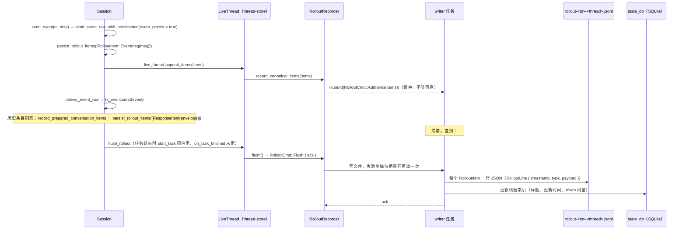
```mermaid
sequenceDiagram
  participant S as Session
  participant LT as LiveThread（thread-store）
  participant RR as RolloutRecorder
  participant W as writer 任务
  participant F as rollout-<ts>-<thread>.jsonl
  participant DB as state_db（SQLite）

  S->>S: send_event(tc, msg) → send_event_raw_with_persistence(event, persist = true)
  S->>S: persist_rollout_items([RolloutItem::EventMsg(msg)])
  S->>LT: live_thread.append_items(items)
  LT->>RR: record_canonical_items(items)
  RR->>W: tx.send(RolloutCmd::AddItems(items))（缓冲，不等落盘）
  S->>S: deliver_event_raw → tx_event.send(event)
  Note over S: 历史条目同理：record_prepared_conversation_items → persist_rollout_items([ResponseItem(envelope)])
  Note over W: 攒着，直到：
  S->>LT: flush_rollout（任务结束时 start_task 闭包里、on_task_finished 末尾）
  LT->>RR: flush() → RolloutCmd::Flush { ack }
  RR->>W: 写文件，失败关掉句柄重开再试一次
  W->>F: 每个 RolloutItem 一行 JSON（RolloutLine { timestamp, type, payload }）
  W->>DB: 更新线程索引（标题、更新时间、token 用量）
  W-->>RR: ack
```

| 环节 | 相关函数 | 要点 |
|---|---|---|
| 什么会写 | `send_event_raw_with_persistence`（事件）、`record_prepared_conversation_items`（历史条目）、上下文 diff（`TurnContext` / `WorldState`）、`replace_compacted_history`（`Compacted`） | 12 种 `RolloutItem` 里最常见的是 `EventMsg` 和 `ResponseItem`。**事件默认也写**，所以 rollout 能还原 UI 看到的一切 |
| 延迟创建 | `ensure_rollout_materialized(persist_context)` | 文件在第一条用户消息落历史时才真正创建（`record_user_prompt_and_emit_turn_item` 末尾）。`send_event_raw_without_materializing_rollout` 给启动阶段用 |
| 写入是异步的 | `record_canonical_items` 只是 `tx.send` | 真正写盘在 `flush` / `persist`。任务结束时两次 flush |
| 文件名 | — | `rollout-{timestamp}-{thread_id}.jsonl`，在 `~/.codex/sessions/` 下按日期分目录 |
| 写锁 | — | 同一个 rollout 同时只能有一个 writer，TUI 显示 "This thread is open elsewhere" 就是它 |
| SQLite | `state` crate | 线程列表、标题、排序用；rollout 文件仍是事实来源 |

### 12.2 客户端怎么拿到历史和实时更新

启动时 `SessionConfigured.initial_messages` 带上恢复的历史事件；之后全靠 `next_event`。app-server 把 `Event` 转成 `ServerNotification`（`ItemStarted` / `ItemCompleted` / `*Delta` / `TurnCompleted`）。TUI 不直接读 rollout 文件。

### 12.3 崩溃恢复：从 rollout 重建

`ThreadManager::resume_thread_from_rollout` 读文件 → `InitialHistory::Resumed` → `spawn_thread` → `Session::new` → `record_initial_history` → `apply_rollout_reconstruction` → `reconstruct_history_from_rollout`。

重建做的事：按 `TurnContext` 条目切段，`Compacted` 条目之后的段替换之前的，`ResponseItem` 逐条回填，最后一条 `TurnContext` 成为 `reference_context_item`（下一轮只发 diff），`TokenUsageRecord` 恢复 token 计数。最后一个事件是 `TurnAborted`/中断时 `agent_status` 置 `Interrupted`，客户端可以选择 `Op::RecoverTurn` 续跑。

**这是"所有输入都是 Op、所有事件都写盘"的红利**：不需要单独的 checkpoint 机制。对应的回放测试有两千多行，改这块先跑它。

### 12.4 worker 交接：`SuspendTurnAndShutdown`

`Op::SuspendTurnAndShutdown` → `turn_suspension::suspend_turn_and_shutdown`：停掉活跃根轮次**但不记录终止事件**，等历史落盘、writer 关闭后才让 `submission_loop` 退出。返回 `Suspended` 才退出进程；否则"这条线程的责任仍留在当前 worker"。另一个进程 `resume` + `RecoverTurn` 接着跑。这是云端多 worker 场景的设计，本地用不到。

---

## 13. 上下文：初始上下文怎么拼、以后怎么变

codex 没有"系统提示词"这个单一概念。`instructions` 字段只放 base instructions（模型自带的那份），其它一切（AGENTS.md、环境、技能清单、多 agent 模式）都是**历史里的 developer / user 消息**。

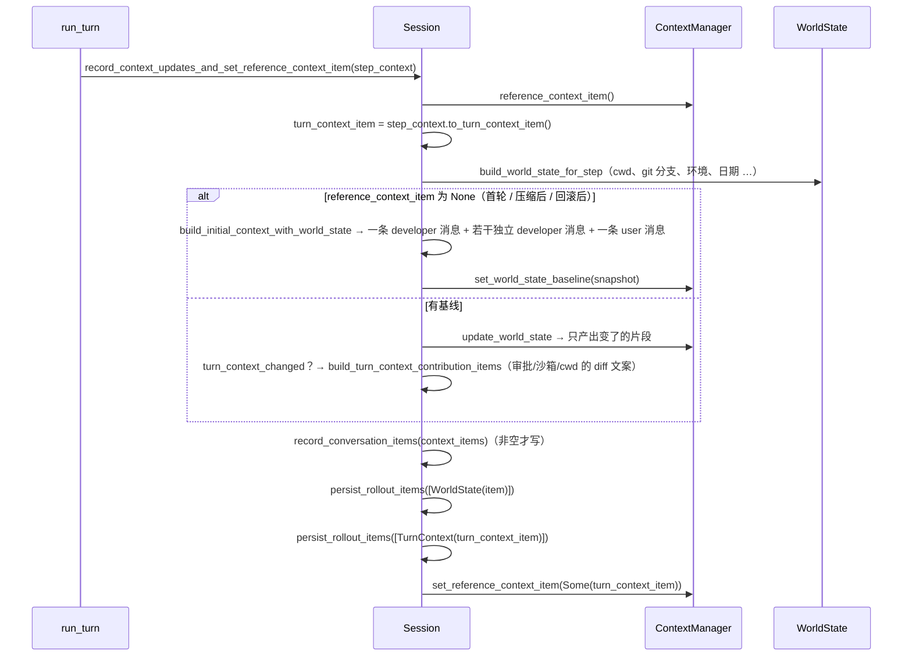
```mermaid
sequenceDiagram
  participant RT as run_turn
  participant S as Session
  participant CM as ContextManager
  participant WS as WorldState

  RT->>S: record_context_updates_and_set_reference_context_item(step_context)
  S->>CM: reference_context_item()
  S->>S: turn_context_item = step_context.to_turn_context_item()
  S->>WS: build_world_state_for_step（cwd、git 分支、环境、日期 …）
  alt reference_context_item 为 None（首轮 / 压缩后 / 回滚后）
    S->>S: build_initial_context_with_world_state → 一条 developer 消息 + 若干独立 developer 消息 + 一条 user 消息
    S->>CM: set_world_state_baseline(snapshot)
  else 有基线
    S->>CM: update_world_state → 只产出变了的片段
    S->>S: turn_context_changed？→ build_turn_context_contribution_items（审批/沙箱/cwd 的 diff 文案）
  end
  S->>S: record_conversation_items(context_items)（非空才写）
  S->>S: persist_rollout_items([WorldState(item)])
  S->>S: persist_rollout_items([TurnContext(turn_context_item)])
  S->>CM: set_reference_context_item(Some(turn_context_item))
```

`build_initial_context_with_world_state` 拼的东西：

| 段 | 角色 | 来源 |
|---|---|---|
| developer instructions | developer（合并进主 developer 消息） | `TurnContext.developer_instructions`（app-server 客户端给的） |
| 用户指令 / AGENTS.md | developer | `instructions` + `loaded_agents_md` |
| 环境上下文（cwd、沙箱、审批策略、日期、shell） | developer | `world_state.render_full()` 里 role 为 developer 的片段 |
| 多 agent 模式说明 | 独立 developer 消息 | `MULTI_AGENT_MODE_OPEN_TAG` 标记的片段单独一条 |
| 技能清单、推荐插件、MCP 结果 | user（"contextual user"） | `render_fragment` 后合成一条 user 消息 |
| guardian 策略 | 独立 developer 消息 | 仅 guardian 子 agent |

之后每轮只 diff：`TurnContextItem` 变了（比如用户改了审批策略）就追加一条说明；`WorldState` 变了（cwd/分支）就追加变化片段。`ThreadRollback` 回滚时如果切掉了混合的初始上下文，`reference_context_item` 清空，下一轮重新全量注入。

---

