## 1. crate 与源码目录

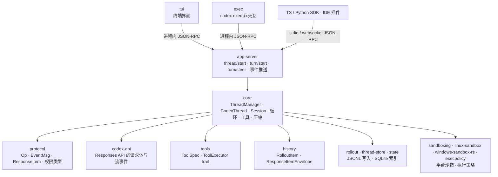
```mermaid
graph TD
  TUI["tui<br/>终端界面"] -->|进程内 JSON-RPC| APS
  EXEC["exec<br/>codex exec 非交互"] -->|进程内 JSON-RPC| APS
  SDK["TS / Python SDK · IDE 插件"] -->|stdio / websocket JSON-RPC| APS
  APS["app-server<br/>thread/start · turn/start · turn/steer · 事件推送"] --> CORE
  CORE["core<br/>ThreadManager · CodexThread · Session · 循环 · 工具 · 压缩"] --> PROTO
  CORE --> API
  CORE --> TOOLS
  CORE --> HIST
  CORE --> ROLL
  CORE --> SBX
  PROTO["protocol<br/>Op · EventMsg · ResponseItem · 权限类型"]
  API["codex-api<br/>Responses API 的请求体与流事件"]
  TOOLS["tools<br/>ToolSpec · ToolExecutor trait"]
  HIST["history<br/>RolloutItem · ResponseItemEnvelope"]
  ROLL["rollout · thread-store · state<br/>JSONL 写入 · SQLite 索引"]
  SBX["sandboxing · linux-sandbox · windows-sandbox-rs · execpolicy<br/>平台沙箱 · 执行策略"]
```

客户端通过 app-server 的 JSON-RPC 接口创建线程、提交输入和接收事件；执行循环及其状态归 core 管理。

本文沿本地源码中的 app-server → core 执行路径分析，源码路径以 `codex-rs/` 为根。主要入口位于 `core/src/thread_manager.rs`、`core/src/session/turn_input.rs`、`core/src/tasks/` 与 `core/src/session/turn.rs`。本文不据此推断托管服务实际采用的部署版本。

---

## 2. 线程创建：Session 与共享服务如何装配

先从创建线程的 `thread/start` 看起。它准备好会话、输入与事件通道、对话历史，以及模型和工具需要的服务。之后客户端发送 `turn/start`，才会在这个线程里开始处理输入。下面先看创建过程，再介绍这些会贯穿后续执行的对象。

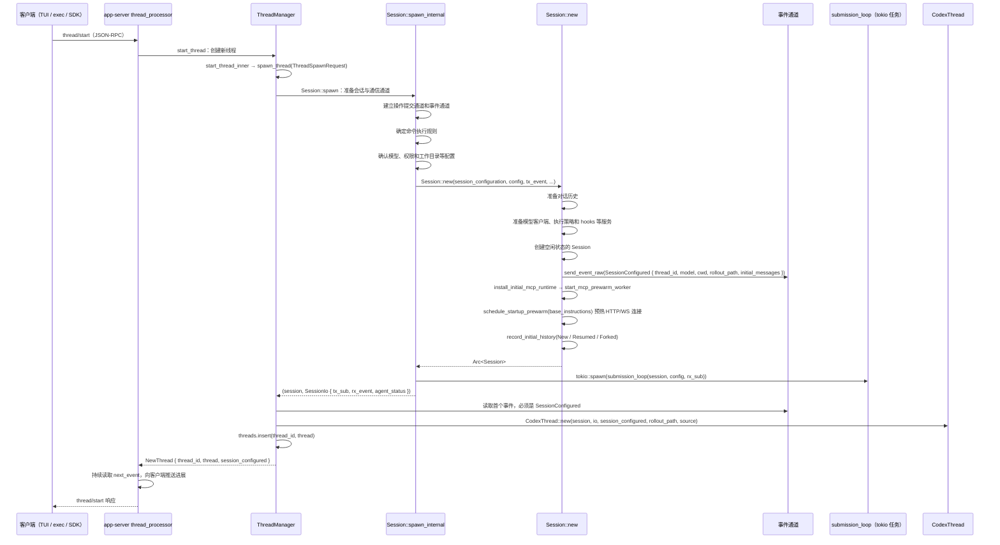
```mermaid
sequenceDiagram
  participant C as 客户端（TUI / exec / SDK）
  participant APS as app-server thread_processor
  participant TM as ThreadManager
  participant S as Session::spawn_internal
  participant SN as Session::new
  participant EC as 事件通道
  participant L as submission_loop（tokio 任务）
  participant CT as CodexThread

  C->>APS: thread/start（JSON-RPC）
  APS->>TM: start_thread：创建新线程
  TM->>TM: start_thread_inner → spawn_thread(ThreadSpawnRequest)
  TM->>S: Session::spawn：准备会话与通信通道
  S->>S: 建立操作提交通道和事件通道
  S->>S: 确定命令执行规则
  S->>S: 确认模型、权限和工作目录等配置
  S->>SN: Session::new(session_configuration, config, tx_event, ...)
  SN->>SN: 准备对话历史
  SN->>SN: 准备模型客户端、执行策略和 hooks 等服务
  SN->>SN: 创建空闲状态的 Session
  SN->>EC: send_event_raw(SessionConfigured { thread_id, model, cwd, rollout_path, initial_messages })
  SN->>SN: install_initial_mcp_runtime → start_mcp_prewarm_worker
  SN->>SN: schedule_startup_prewarm(base_instructions) 预热 HTTP/WS 连接
  SN->>SN: record_initial_history(New / Resumed / Forked)
  SN-->>S: Arc<Session>
  S->>L: tokio::spawn(submission_loop(session, config, rx_sub))
  S-->>TM: (session, SessionIo { tx_sub, rx_event, agent_status })
  TM->>EC: 读取首个事件，必须是 SessionConfigured
  TM->>CT: CodexThread::new(session, io, session_configured, rollout_path, source)
  TM->>TM: threads.insert(thread_id, thread)
  TM-->>APS: NewThread { thread_id, thread, session_configured }
  APS->>APS: 持续读取 next_event，向客户端推送进展
  APS-->>C: thread/start 响应
```

创建线程主要是在为后续对话做准备：确定模型和执行权限，建立输入与事件通道，并准备历史记录和各项服务。新建、恢复和 fork 都通过 `spawn_thread` 完成这些准备；区别在于从空白历史开始，还是沿用已有内容。

客户端首先收到 `SessionConfigured`，得知线程 id、模型和工作目录等基本信息，然后才会收到 MCP 连接等后续事件。模型连接也可以提前预热，减少第一轮请求的等待。

准备完成后，`submission_loop` 会在后台持续接收操作。此时会话已经可用，但还没有开始处理用户任务；之后发消息、插话或关闭会话，都通过这条输入通道进行。

**三个客户端怎么接**：

| 客户端 | 创建线程 | 提交输入 | 读取事件 |
|---|---|---|---|
| app-server（网络 / stdio） | `thread_processor` 处理 `thread/start` | `turn_processor` 调 `thread.start_or_steer_turn(...)` | 每线程一个 `next_event` 循环，转成 `ServerNotification` |
| TUI | `start_thread` → 发 `thread/start` 给进程内 app-server | `submit_op` → `AppCommand` → app-server 请求 | `app_server.next_event()` |
| `codex exec` | `InProcessAppServerClient::start` | `ClientRequest::TurnStart` | `client.next_event()` 循环，`TurnCompleted` 时退出 |

所以 core 的入口在三种模式下**完全一样**，差别只在 app-server 之上。

### 主要对象之间的关系

`ThreadManager` 管理多条线程，每条线程通过 `CodexThread` 对外提供接口。`CodexThread` 持有会话本身和通信通道；`Session` 再把对话状态、当前任务和所需服务放在一起。图中只保留这条主线上的字段，箭头表示持有关系。

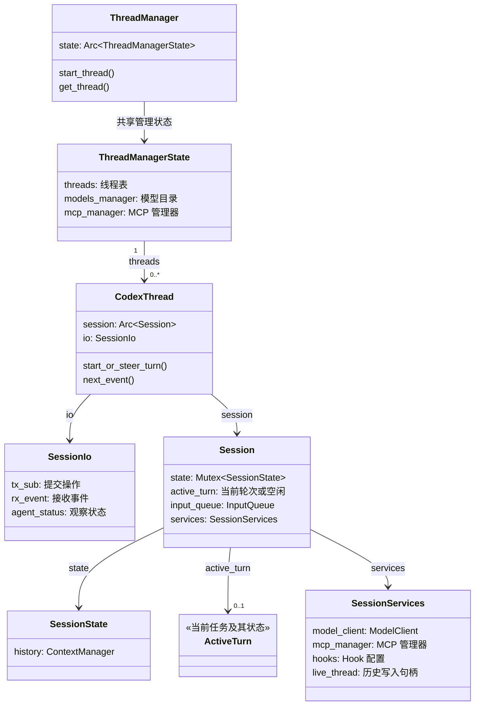
```mermaid
classDiagram
  direction TB
  class ThreadManager {
    state: Arc~ThreadManagerState~
    start_thread()
    get_thread()
  }
  class ThreadManagerState {
    threads: 线程表
    models_manager: 模型目录
    mcp_manager: MCP 管理器
  }
  class CodexThread {
    session: Arc~Session~
    io: SessionIo
    start_or_steer_turn()
    next_event()
  }
  class SessionIo {
    tx_sub: 提交操作
    rx_event: 接收事件
    agent_status: 观察状态
  }
  class Session {
    state: Mutex~SessionState~
    active_turn: 当前轮次或空闲
    input_queue: InputQueue
    services: SessionServices
  }
  class SessionState {
    history: ContextManager
  }
  class ActiveTurn {
    <<当前任务及其状态>>
  }
  class SessionServices {
    model_client: ModelClient
    mcp_manager: MCP 管理器
    hooks: Hook 配置
    live_thread: 历史写入句柄
  }
  ThreadManager --> ThreadManagerState : 共享管理状态
  ThreadManagerState "1" --> "0..*" CodexThread : threads
  CodexThread --> Session : session
  CodexThread --> SessionIo : io
  Session --> SessionState : state
  Session --> "0..1" ActiveTurn : active_turn
  Session --> SessionServices : services
```

线程创建后，`Session` 就一直存在；只有开始处理任务时，才会有对应的 `ActiveTurn`。`SessionServices` 中有些服务来自 `ThreadManagerState`，可以被多条线程共享，例如模型目录和 MCP 管理器。`CodexThread` 和 `SessionIo` 的输入、事件接口在 §4 展开，任务状态在 §5 展开。

### `ThreadManager`

`ThreadManager` 在进程内管理线程：创建线程、保存线程，并提供各线程共享的模型目录、MCP 管理器、技能服务、插件管理器和环境管理器。

| 方法 | 干什么 | 谁调它 |
|---|---|---|
| `new(config, auth_manager, session_source, ...)` | 准备线程管理器和可供各线程共享的服务 | app-server 启动时 |
| `start_thread(options)` | 创建一条新会话 | app-server `thread/start` |
| `resume_thread_from_rollout(...)` | 从保存的历史恢复会话 | `thread/resume` |
| `fork_thread(...)` | 从已有对话的某个位置分出一条新会话 | `thread/fork` |
| `spawn_subagent(...)` | 多 agent 子线程 | `spawn_agent` 工具 |
| `spawn_thread(request)` | 统一完成会话创建，确认初始化成功后登记线程，供后续请求查找 | 新建、恢复和 fork 流程 |
| `get_thread(thread_id)` | 按 id 找到已经创建的线程 | app-server 每个请求 |
| `shutdown_all_threads_bounded(timeout)` | 关闭所有线程，并在规定时间内等待它们退出 | 进程退出 |

### `Session`

`Session` 保存一次对话的历史、当前任务、待处理输入和各项服务。`submission_loop` 接收 Op，`send_event` 发送事件；实际请求模型和执行工具的循环由任务及 `run_turn` 负责。

**存什么数据**：

| 字段 | 含义 |
|---|---|
| `thread_id` | 线程 id，和 rollout 文件名里的一致 |
| `tx_event: Sender<Event>` | 事件出口。`send_event` 最终写这里 |
| `agent_status: watch::Sender<AgentStatus>` | 最新的 agent 状态（PendingInit / Running / Idle / Interrupted …），由事件推导（`deliver_event_raw`） |
| `state: Mutex<SessionState>` | **对话历史在这里面**（`SessionState.history`）。改历史要先拿这把锁 |
| `active_turn: Mutex<Option<ActiveTurn>>` | 当前活跃轮次。`None` 就是空闲。**启动新轮次、插话、审批回复全靠它判断** |
| `input_queue: InputQueue` | 邮箱和待处理输入的操作入口（真正的存储在 `ActiveTurn.turn_state.pending_input`） |
| `services: SessionServices` | 所有服务，见 §2 |
| `features: ManagedFeatures` | 控制实验功能和可选能力是否启用 |
| `conversation` / `realtime_history` | 实时语音对话的状态，本篇不讲 |
| `async_hook_results` | 异步 hook 跑完的结果通道，分别在处理新输入前、模型和工具返回后读取（§10） |

**能做什么**（只列主线用到的）：

| 方法 | 干什么 | 谁调它 |
|---|---|---|
| `spawn(args)` → `spawn_internal` | 创建可接收操作的会话，并向调用方提供通信接口 | `ThreadManager::spawn_thread` |
| `new(...)` | 准备历史、模型连接和 MCP 等服务，通知客户端会话已配置，并处理已有历史与启动预热 | `spawn_internal` |
| `send_event(turn_context, msg)` | 向客户端报告本轮进展，也处理需要同步给父 agent 等接收方的信息 | 全项目 |
| `send_event_raw_with_persistence(event, persist)` | 先提交事件的持久化记录，再通知客户端；提交写入不代表已经落盘 | `send_event` / `send_event_raw` |
| `record_conversation_items(tc, model_info, items)` | 统一保存对话条目及其元数据，并同步到持久化记录和事件通道 | 每条进历史的东西 |
| `record_user_prompt_and_emit_turn_item(...)` | 保存用户消息，让界面显示已接收，并确保历史文件已经创建 | `record_pending_input` |
| `capture_step_context(tc, token)` / `capture_step_context_inner` | 保存这次模型请求使用的配置、环境和工具列表，见 §6 | `run_turn` 每步 |
| `record_context_updates_and_set_reference_context_item(step)` | 给模型补充必要的上下文：首次提供完整内容，之后主要说明变化，见 §6 | `run_turn` |
| `request_command_approval(...)` | 向用户请求命令审批，并等待这次请求的答复 | exec / apply_patch 的审批 |
| `notify_approval(id, decision)` | 把用户决定交给正在等待的审批请求 | `handlers::exec_approval` |
| `spawn_task(tc, input, task)` | 用新任务替换当前任务 | 开新轮 |
| `start_task(tc, input, task)` | 启动后台任务，并负责保存运行状态和结束后的收尾 | `spawn_task` / `start_if_idle` / `maybe_start_turn_for_pending_work` |
| `abort_all_tasks(reason)` | 取消当前任务并通知客户端 | `interrupt_task` / `spawn_task` |
| `on_task_finished(tc, result)` | 保存未处理输入、报告执行结果并清理状态；邮箱有后续工作时继续启动任务 | `start_task` 里 spawn 的闭包 |
| `interrupt_task()` | 响应用户中断，停止当前任务 | `Op::Interrupt` |
| `clone_history()` | 取得一份历史快照，供请求准备等操作读取 | 每次发请求前 |
| `persist_rollout_items(items)` | 把历史记录提交给持久化服务 | 所有落盘 |

### `SessionServices`

`SessionServices` 集中保存会话使用的服务，字段主要是 `Arc<...>` 或资源句柄。与本文流程相关的字段如下：

| 字段 | 谁用它 |
|---|---|
| `model_client: ModelClient` | `run_turn` 通过 `new_session()` 创建模型客户端，或使用预热实例（§7） |
| `mcp_runtime` / `mcp_manager` / `mcp_handler_cache` | 每步获取 MCP 快照、注册 MCP 工具 |
| `unified_exec_manager: UnifiedExecProcessManager` | `exec_command` / `write_stdin` 的进程表 |
| `exec_policy: Arc<ExecPolicyManager>` | 命令要不要审批的规则引擎（starlark 规则文件） |
| `hooks: ArcSwap<Hooks>` | hook 配置，可热替换 |
| `extensions` / `thread_extension_data` / `session_extension_data` | 扩展注册表，以及按类型索引的状态存储（`ExtensionData`）；用于模块之间共享状态 |
| `agent_control: AgentControl` | 多 agent 的执行配额和父子关系 |
| `live_thread` / `thread_store` / `state_db` | 持久化相关对象：写 rollout 的句柄、线程元数据存储、SQLite 索引 |
| `executed_tool_calls` | 已执行工具调用的记录，发请求前会 `attach_to_prompt` |
| `code_mode_service` | Code Mode 的 V8 worker |
| `turn_environments: Arc<ThreadEnvironments>` | 执行环境（本机 / 远程 executor）的连接状态 |

---

## 3. 执行总览：会话、任务与模型调用

这里有三层执行过程：`Session` 通过 `submission_loop` 持续接收操作；`ActiveTurn` 保存当前任务及其状态；任务中的 `run_turn` 可以多次请求模型。模型返回一次响应后，代码还可能执行工具、再次请求模型，所以要分别看模型请求、`run_turn` 和整个任务什么时候结束。

下图标出了执行何时继续、压缩后从哪里重新开始，以及任务如何结束。错误、中断和输入被拒绝的情况在后面的章节展开。

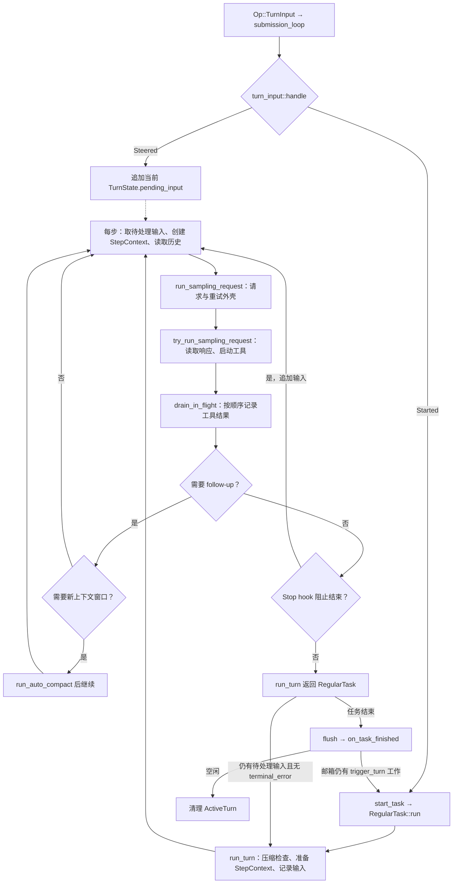
```mermaid
flowchart TD
  I["Op::TurnInput → submission_loop"] --> D{"turn_input::handle"}
  D -->|Steered| Q["追加当前 TurnState.pending_input"]
  D -->|Started| T["start_task → RegularTask::run"]
  T --> R["run_turn：压缩检查、准备 StepContext、记录输入"]
  R --> P["每步：取待处理输入、创建 StepContext、读取历史"]
  Q -.-> P
  P --> S["run_sampling_request：请求与重试外壳"]
  S --> M["try_run_sampling_request：读取响应、启动工具"]
  M --> F["drain_in_flight：按顺序记录工具结果"]
  F --> N{"需要 follow-up？"}
  N -->|是| C{"需要新上下文窗口？"}
  C -->|否| P
  C -->|是| CP["run_auto_compact 后继续"]
  CP --> P
  N -->|否| H{"Stop hook 阻止结束？"}
  H -->|是，追加输入| P
  H -->|否| O["run_turn 返回 RegularTask"]
  O -->|仍有待处理输入且无 terminal_error| R
  O -->|任务结束| E["flush → on_task_finished"]
  E -->|邮箱仍有 trigger_turn 工作| T
  E -->|空闲| Z["清理 ActiveTurn"]
```

线程创建好后，就可以接收输入并执行任务了。后文按这个顺序展开：§4–§5 介绍输入处理和任务启动，§6–§9 介绍请求准备、模型响应和工具执行，§10 解释任务何时继续或结束，§11–§13 介绍插话、重试和持久化。

---

## 4. 接收输入：启动新任务，还是插入当前任务

客户端通过 `CodexThread::start_or_steer_turn` 提交输入。Session 判断这次输入应该启动新任务、插入当前任务，还是拒绝接收，分别返回 `Started / Steered / NotSubmitted`。下图先跟踪这个判断过程，再介绍通道里传递的数据；返回成功不需要等模型运行完成。

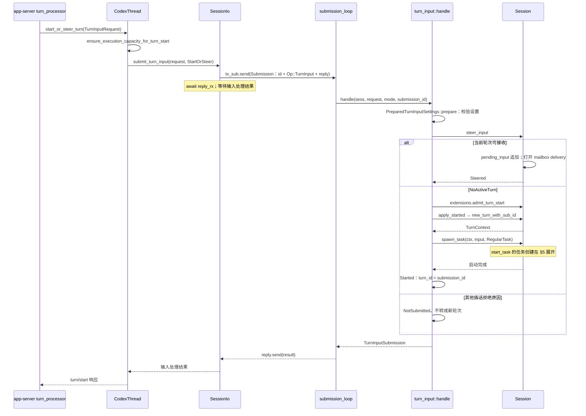
```mermaid
sequenceDiagram
  participant APS as app-server turn_processor
  participant CT as CodexThread
  participant IO as SessionIo
  participant L as submission_loop
  participant TI as turn_input::handle
  participant S as Session
  APS->>CT: start_or_steer_turn(TurnInputRequest)
  CT->>CT: ensure_execution_capacity_for_turn_start
  CT->>IO: submit_turn_input(request, StartOrSteer)
  IO->>L: tx_sub.send(Submission：id + Op::TurnInput + reply)
  Note over IO: await reply_rx；等待输入处理结果
  L->>TI: handle(sess, request, mode, submission_id)
  TI->>TI: PreparedTurnInputSettings::prepare：校验设置
  TI->>S: steer_input
  alt 当前轮次可接收
    S->>S: pending_input 追加；打开 mailbox delivery
    S-->>TI: Steered
  else NoActiveTurn
    TI->>S: extensions.admit_turn_start
    TI->>S: apply_started → new_turn_with_sub_id
    S-->>TI: TurnContext
    TI->>S: spawn_task(ctx, input, RegularTask)
    Note over S: start_task 的任务创建在 §5 展开
    S-->>TI: 启动完成
    TI->>TI: Started：turn_id = submission_id
  else 其他插话拒绝原因
    TI->>TI: NotSubmitted，不转成新轮次
  end
  TI-->>L: TurnInputSubmission
  L-->>IO: reply.send(result)
  IO-->>CT: 输入处理结果
  CT-->>APS: turn/start 响应
```

### `turn_input::handle`：三条路

| 模式 | 函数 | 功能 |
|---|---|---|
| `StartOrSteer` | `start_or_steer` | 正常发消息时使用：Codex 还在处理任务，就把新输入补充给它；没有任务在运行，就开始新一轮。如果当前任务不接受补充输入，会拒绝这次提交。 |
| `StartIfIdle` | `start_if_idle` | 只在空闲时开始新一轮，不打断正在进行的任务。自动触发的输入还要遵守 Plan 模式等限制，并给等待处理的触发消息让路。 |
| `Steer { expected_turn_id }` | `steer` | 给指定的当前轮次补充用户输入，比如追加要求或纠正方向。如果这一轮已经结束或被替换，就拒绝提交，避免把消息送到另一轮。 |
| 恢复 | `handle_recovery` | 不添加新的用户消息，沿用已有的对话内容继续请求模型，用于恢复执行。也需要等到会话空闲才能启动。 |

`steer_input` 负责判断当前任务能不能接收补充输入。比如，正在做 Review 或压缩上下文时就不能插话，也不能借插话改变这一轮约定的输出格式。接受的输入会先排队，等当前轮次处理；来自其他 agent 的邮箱消息也可以继续送入这一轮（见 §11）。

`apply_started` 负责准备新一轮执行所需的设置和上下文。如果用户发消息时顺便换了模型，这一轮就会使用更新后的设置。新轮次沿用这次提交的 id，方便调用方把提交结果和后续事件对应起来。

`spawn_task` 已经创建后台任务后才返回输入处理结果，因此不能把“HTTP / JSON-RPC 响应返回”画成模型开始运行的严格前置条件。输入响应、轮次事件和模型执行可以交错。

### `CodexThread`

`CodexThread` 是外部调用一条线程的接口。它持有 `Session` 和 IO 通道，提供提交 Op、读取事件等方法。

可以把它理解成对 `Session` 和 `SessionIo` 的一层包装：调用方通过它发送输入、读取事件、查询状态和关闭会话，大部分工作都会交给内部对象完成。

**存什么数据**：

| 字段 | 含义 |
|---|---|
| `session: Arc<Session>` | 运行时本体。`pub(crate)`，只有 core 内部能直接用 |
| `io: SessionIo` | 提交通道 + 事件通道 + agent 状态 watch |
| `session_source` | 谁开的这条线程（CLI / VSCode / 子 agent / 内部任务） |
| `session_configured` / `rollout_path` | 启动时的第一个事件和 rollout 文件路径，方便客户端随时再拿 |

**能做什么**：

| 方法 | 干什么 | 谁调它 |
|---|---|---|
| `submit(op)` | 提交一个操作，返回可用于关联结果的提交 id | 所有不需要回复的 Op |
| `start_or_steer_turn(request)` | 当前有任务就补充输入，否则开始新一轮 | app-server `turn/start` |
| `start_turn_if_idle(request)` | `StartIfIdle`，忙就拒 | 自动化触发（hook 继续执行、定时） |
| `steer_turn(request, expected_turn_id)` | 只向指定轮次补充输入，防止误投到另一轮 | app-server `turn/steer` |
| `submit_turn_input_with_mode` | 统一提交输入；可能启动新任务时，先检查执行配额 | 上面三个 |
| `recover_turn_if_idle` | `Op::RecoverTurn`，恢复被中断的轮次 | worker 交接 |
| `suspend_turn_and_shutdown` | `Op::SuspendTurnAndShutdown`，停轮但不记终止事件，让别的 worker 接手 | worker 交接接口 |
| `next_event()` | 等待并取出下一条执行事件 | app-server 每线程一个读循环 |
| `inject_if_running(items)` | 向正在运行的任务补充上下文；空闲时不接受这些内容 | hook 异步结果、IDE 上下文 |

### `SessionIo`

| 字段 / 方法 | 含义 |
|---|---|
| `tx_sub: Sender<Submission>` | 有界通道，容量 512（`SUBMISSION_CHANNEL_CAPACITY`）。另一头是 `submission_loop` |
| `rx_event: Receiver<Event>` | 无界通道。`Session.tx_event` 往里写 |
| `submit(op)` | 给操作分配 id 并发送给会话 |
| `submit_turn_input(request, mode)` | 提交输入并等待会话决定如何处理，因此返回时已经知道是启动、插话还是拒绝，不必等待模型完成 |
| `next_event()` | 收一个事件，通道关了返回 `InternalAgentDied` |

### 输入：从 `UserInput` 到 `TurnInput`

客户端通过 `turn/start` 或 `turn/steer` 提交文字、图片等 `UserInput`。app-server 会把输入转换成 core 使用的格式，并连同线程设置、新轮次参数一起交给 `CodexThread`。`TurnInputRequest` 保存这次提交的内容，`TurnInputMode` 表示如何处理它，`TurnInputSubmission` 则告诉调用方输入被启动、插入还是拒绝。

进了 core 之后，`UserInput` 有两个用处：

- 转成 `ResponseItem::Message` 写进历史，之后发给模型的就是这条（`record_user_prompt_and_emit_turn_item`）；
- 直接用 `UserInput` 生成 `TurnItem::UserMessage` 发给 UI，因为 `text_elements` 这类 UI 字段在 `ResponseItem` 里没有。

`Skill` / `Mention` 两种会在新轮次开始时展开成注入的上下文（§6）。


```mermaid
classDiagram
  class UserInput {
    <<enum>>
    Text(text, text_elements)
    Image(image_url, detail)
    LocalImage(path, detail)
    Audio(audio_url)
    LocalAudio(path)
    Skill(name, path)
    Mention(name, path)
  }
  class TurnInputRequest {
    input: TurnInput
    thread_settings: ThreadSettingsOverrides
    start: TurnStartOptions
    additional_context: BTreeMap~String,AdditionalContextEntry~
    responsesapi_client_metadata: Option~HashMap~
    trace: Option~W3cTraceContext~
  }
  class TurnInput_protocol {
    <<enum>>
    UserInput(content, client_id)
    ResponseItem(ResponseItem)
    InterAgentCommunication(InterAgentCommunication)
  }
  class TurnInputMode {
    <<enum>>
    StartOrSteer
    StartIfIdle
    Steer(expected_turn_id)
  }
  class TurnStartOptions {
    turn_trigger: Option~String~
    final_output_json_schema: Option~Value~
    service_tier: Option~String~
    parent_turn_id: Option~String~
    root_turn_id: Option~String~
    cyber_access_program: Option~CyberAccessProgram~
  }
  class TurnInputSubmission {
    <<enum>>
    Started(turn_id)
    Steered(turn_id)
    NotSubmitted(reason)
  }
  class NotSubmittedReason {
    <<enum>>
    ServerDraining
    NotIdle
    PendingTriggerTurn
    PlanMode
    NoActiveTurn
    ExpectedTurnMismatch(expected, actual)
    ActiveTurnNotSteerable(turn_kind)
    ActiveTurnOutputSchemaMismatch
    EmptyInput
  }
  class TurnInput_core {
    <<enum core 内部>>
    UserInput(content, client_id, acceptance_order)
    ResponseItem(ResponseItemEnvelope)
    FunctionCallOutput(ResponseItem)
    InterAgentCommunication(InterAgentCommunication)
  }
  TurnInputRequest --> TurnInput_protocol
  TurnInputRequest --> TurnStartOptions
  TurnInput_protocol --> UserInput
  TurnInputSubmission --> NotSubmittedReason
  TurnInput_protocol ..> TurnInput_core : pending_turn_input 转换
```

| 类型 | 作用 |
|---|---|
| `UserInput` | 七种。`Text` 里的 `text_elements` 是 UI 用的高亮区间，不发给模型。`Skill` / `Mention` 是 `@技能` `@应用` 的引用，§6 会展开成注入的上下文。 |
| `TurnInputRequest` | 一次提交的全部参数。`thread_settings` 是"顺便改一下线程设置"（模型、审批策略等），**开新轮和插话都会应用**，只是插话时对当前轮不生效。 |
| `TurnInput`（协议版） | 三种。`ResponseItem` 变体让客户端直接提交一条历史条目（比如 IDE 给的上下文）。 |
| `TurnInputMode` | 三种路由。`Steer { expected_turn_id }` 是乐观并发控制：你决定插话到 Session 收到之间那一轮可能已经结束，带上你以为的 turn_id，不匹配就拒绝。 |
| `TurnStartOptions` | 只在这次提交启动了新轮次时才用。`parent_turn_id` / `root_turn_id` 在多 agent 场景下记录父轮次和根轮次的 id。 |
| `TurnInputSubmission` | 三种结果。`Started` / `Steered` 只表示"core 收下了"，不等 hook、不等落盘、不等模型请求完成。 |
| `NotSubmittedReason` | 九种拒绝理由，每种对应的判断逻辑见 §4。 |
| `TurnInput`（core 版） | core 内部多了 `acceptance_order`（用户输入的受理顺序，用来在回放时排序）和 `FunctionCallOutput`（客户端直接提交的工具输出）。 |

### `CodexThread` 和 Session 之间：Op 进，Event 出

调用方通过 `Op` 告诉会话要做什么：提交输入、中断、答复审批、压缩或关闭。这些操作都由 `SessionIo` 的提交通道送入会话，外层的 `Submission` 为它们分配关联 id。需要确认处理结果的操作还会等待会话答复；执行过程中的进展则通过反方向的 `Event` 通道送出。

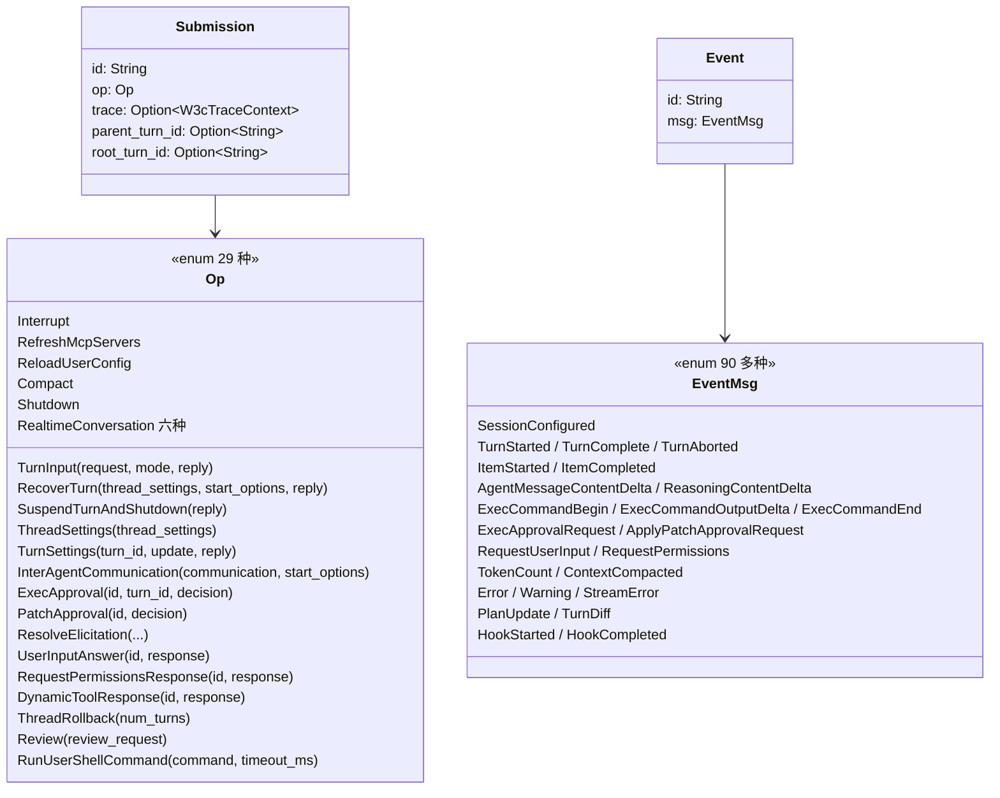
```mermaid
classDiagram
  class Submission {
    id: String
    op: Op
    trace: Option~W3cTraceContext~
    parent_turn_id: Option~String~
    root_turn_id: Option~String~
  }
  class Op {
    <<enum 29 种>>
    Interrupt
    TurnInput(request, mode, reply)
    RecoverTurn(thread_settings, start_options, reply)
    SuspendTurnAndShutdown(reply)
    ThreadSettings(thread_settings)
    TurnSettings(turn_id, update, reply)
    InterAgentCommunication(communication, start_options)
    ExecApproval(id, turn_id, decision)
    PatchApproval(id, decision)
    ResolveElicitation(...)
    UserInputAnswer(id, response)
    RequestPermissionsResponse(id, response)
    DynamicToolResponse(id, response)
    RefreshMcpServers
    ReloadUserConfig
    Compact
    ThreadRollback(num_turns)
    Review(review_request)
    Shutdown
    RunUserShellCommand(command, timeout_ms)
    RealtimeConversation 六种
  }
  class Event {
    id: String
    msg: EventMsg
  }
  class EventMsg {
    <<enum 90 多种>>
    SessionConfigured
    TurnStarted / TurnComplete / TurnAborted
    ItemStarted / ItemCompleted
    AgentMessageContentDelta / ReasoningContentDelta
    ExecCommandBegin / ExecCommandOutputDelta / ExecCommandEnd
    ExecApprovalRequest / ApplyPatchApprovalRequest
    RequestUserInput / RequestPermissions
    TokenCount / ContextCompacted
    Error / Warning / StreamError
    PlanUpdate / TurnDiff
    HookStarted / HookCompleted
  }
  Submission --> Op
  Event --> EventMsg
```

| 类型 | 作用 |
|---|---|
| `Submission` | `id` 是提交 id。**如果这次提交开了新轮次，轮次 id 就是它**（`Started { turn_id: submission_id }`）。 |
| `Op` | 表示发给会话的操作，例如输入、中断、审批答复和关闭。部分操作会等待会话返回处理结果，其余操作提交后便返回。 |
| `Event` | `id` 对应 `Submission.id`。启动阶段的事件 id 是常量 `INITIAL_SUBMIT_ID`。 |
| `EventMsg` | 90 多个变体。分五类：生命周期（Turn*/Item*）、流式增量（*Delta）、工具（Exec*/Patch*/McpToolCall*）、等用户（*ApprovalRequest/RequestUserInput/ElicitationRequest）、状态（TokenCount/Error/Warning）。 |

---

## 5. 任务启动：谁持有执行、取消与等待状态

上一段在启动分支生成了 `TurnContext` 并调用 `spawn_task`。接下来展开 `start_task`，看它如何将任务 handle、取消令牌和待处理输入保存在 `ActiveTurn` 中，供插话和中断操作查找。

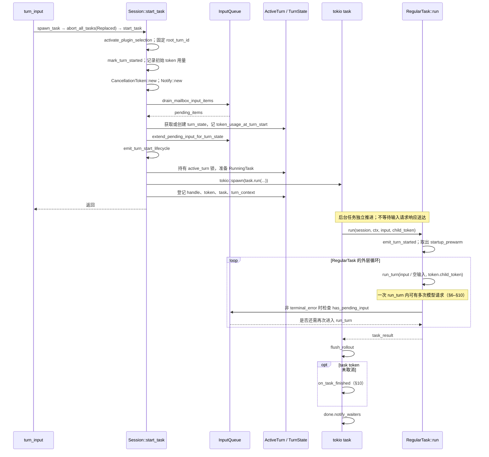
```mermaid
sequenceDiagram
  participant TI as turn_input
  participant S as Session::start_task
  participant IQ as InputQueue
  participant AT as ActiveTurn / TurnState
  participant TK as tokio task
  participant RG as RegularTask::run
  TI->>S: spawn_task → abort_all_tasks(Replaced) → start_task
  S->>S: activate_plugin_selection；固定 root_turn_id
  S->>S: mark_turn_started；记录初始 token 用量
  S->>S: CancellationToken::new；Notify::new
  S->>IQ: drain_mailbox_input_items
  IQ-->>S: pending_items
  S->>AT: 获取或创建 turn_state，记 token_usage_at_turn_start
  S->>IQ: extend_pending_input_for_turn_state
  S->>S: emit_turn_start_lifecycle
  S->>AT: 持有 active_turn 锁，准备 RunningTask
  S->>TK: tokio::spawn(task.run(...))
  S->>AT: 登记 handle、token、task、turn_context
  S-->>TI: 返回
  Note over TK,RG: 后台任务独立推进；不等待输入请求响应送达
  TK->>RG: run(session, ctx, input, child_token)
  RG->>RG: emit_turn_started；取出 startup_prewarm
  loop RegularTask 的外层循环
    RG->>RG: run_turn(input / 空输入, token.child_token)
    Note over RG: 一次 run_turn 内可有多次模型请求（§6–§10）
    RG->>IQ: 非 terminal_error 时检查 has_pending_input
    IQ-->>RG: 是否还需再次进入 run_turn
  end
  RG-->>TK: task_result
  TK->>TK: flush_rollout
  opt task token 未取消
    TK->>TK: on_task_finished（§10）
  end
  TK->>TK: done.notify_waiters
```

`ActiveTurn` 和 `RunningTask` 不是一回事。启动一轮时，会先创建 `ActiveTurn`，再准备上下文并创建任务。因此，已经有 `ActiveTurn`，不代表里面已经挂上了 `RunningTask`。`start_task` 往 `ActiveTurn` 里登记 `RunningTask` 时会一直持有 `active_turn` 锁；工具审批之类的等待信息则保存在共享的 `TurnState` 里，轮次结束时一起清掉。

任务跑完后，后台闭包会先 `flush_rollout`，再走正常的完成处理。如果任务被取消，就跳过这里的 `on_task_finished`，交给显式中断路径收尾，免得处理两遍。

### `ActiveTurn` / `RunningTask` / `TurnState`

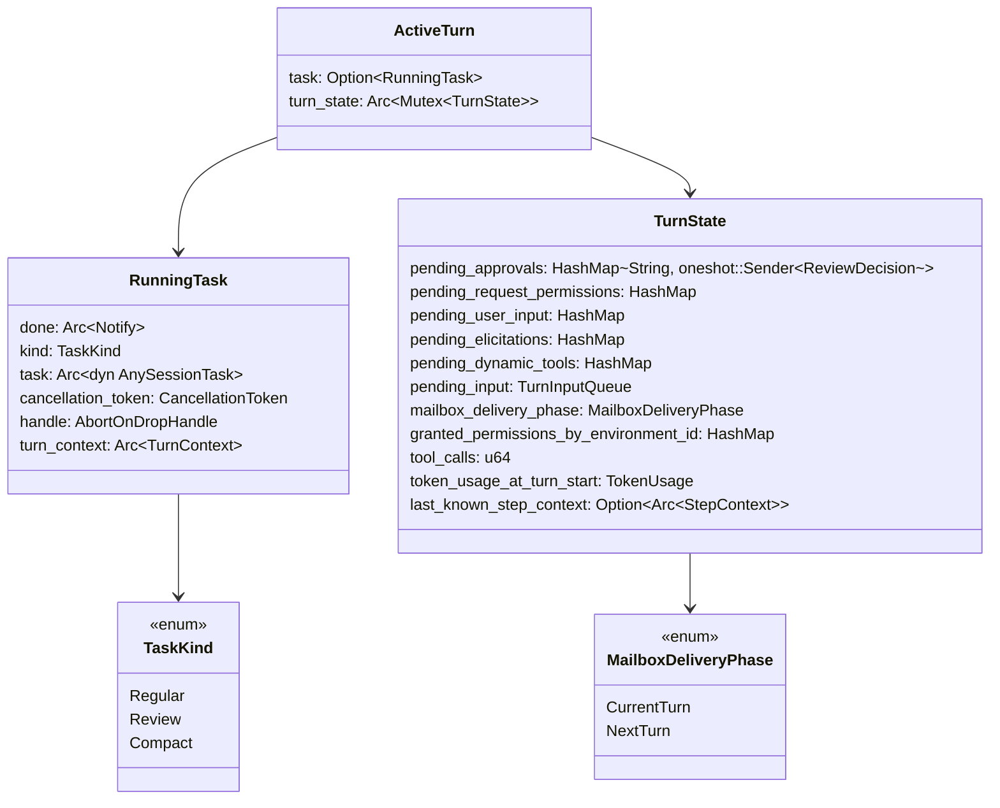
```mermaid
classDiagram
  class ActiveTurn {
    task: Option~RunningTask~
    turn_state: Arc~Mutex~TurnState~~
  }
  class RunningTask {
    done: Arc~Notify~
    kind: TaskKind
    task: Arc~dyn AnySessionTask~
    cancellation_token: CancellationToken
    handle: AbortOnDropHandle
    turn_context: Arc~TurnContext~
  }
  class TurnState {
    pending_approvals: HashMap~String, oneshot::Sender~ReviewDecision~~
    pending_request_permissions: HashMap
    pending_user_input: HashMap
    pending_elicitations: HashMap
    pending_dynamic_tools: HashMap
    pending_input: TurnInputQueue
    mailbox_delivery_phase: MailboxDeliveryPhase
    granted_permissions_by_environment_id: HashMap
    tool_calls: u64
    token_usage_at_turn_start: TokenUsage
    last_known_step_context: Option~Arc~StepContext~~
  }
  class MailboxDeliveryPhase {
    <<enum>>
    CurrentTurn
    NextTurn
  }
  class TaskKind {
    <<enum>>
    Regular
    Review
    Compact
  }
  ActiveTurn --> RunningTask
  ActiveTurn --> TurnState
  TurnState --> MailboxDeliveryPhase
  RunningTask --> TaskKind
```

| 类型 | 作用 |
|---|---|
| `ActiveTurn` | 表示会话已经为一轮执行占用了位置。任务可能还在准备中，这样能防止两个启动请求同时把会话当成空闲。 |
| `RunningTask` | 保存后台任务的句柄和取消信号，供中断和等待结束时使用；句柄被释放时也会终止对应任务。 |
| `TurnState` | 集中保存本轮的插话和等待用户答复的请求，包括审批、权限申请和补充信息。任务中断时，这些等待也会一起取消。 |
| `MailboxDeliveryPhase` | 这一轮还收不收子 agent 发来的邮件。开局是收（`CurrentTurn`）；模型给出最终答案后改成不收（`NextTurn`），晚到的邮件留到下一轮；接着又有工具调用或用户插话，就重新打开。详见 §11。 |

### `SessionTask` trait

| 方法 | 含义 |
|---|---|
| `kind()` | 区分普通执行、审查和压缩任务，决定是否允许插话等操作。 |
| `run(self, session, ctx, input, cancellation_token)` | 执行任务直到完成或取消，并返回最后一条 agent 消息或错误。 |
| `abort(session, ctx)` | 处理中断时的额外清理，例如退出审查模式；没有额外需要时可以不做处理。 |

`AnySessionTask` 让运行时可以通过同一个接口保存和调用不同类型的任务。

普通对话、审查和手动压缩都作为会话任务管理，因此可以共用运行状态、中断和收尾机制。

### `start_task` 做了什么

`start_task` 负责让一轮任务真正运行起来：确定本轮使用的插件和所属的根轮次，记录开始时的 token 用量，把邮箱里已有的消息加入待处理输入，并通知扩展任务已经开始。

它还会为整轮执行建立统一的取消信号，让模型请求和工具执行都能响应中断。任务在后台运行，相关句柄保存在 `RunningTask` 中，供后续插话、中断和等待结束时使用。

任务正常返回后，会保存历史并做完成处理；如果任务已经被取消，就由中断流程收尾，避免重复发送结束事件。

### `RegularTask::run`：外层循环

`RegularTask::run` 先通知客户端任务开始，再使用预热好的连接（如果有）进入 `run_turn`。

`run_turn` 返回时，可能又有新的用户插话或邮箱消息到达。只要还有允许本轮处理的输入，而且没有致命错误，`RegularTask` 就会再次调用 `run_turn`，让模型继续处理。没有待处理输入时，任务才结束。

这一层负责接住执行期间新到的输入；`run_turn` 内部则负责模型调用工具后继续请求模型。两层循环处理的是不同的继续执行场景。

---

## 6. 进入 run_turn：固定上下文并写入历史

`RegularTask::run` 调用 `run_turn` 后，第一次模型请求还不能立即发出。代码要先确定这一步使用哪套设置和工具，再把模型需要知道的运行状态、用户输入以及显式选择的 skill / plugin 依次写入历史。本节沿着这条数据流展开：`TurnContext` 先变成 `StepContext`，`StepContext` 再生成模型可见上下文，最后这些内容统一落成历史条目。

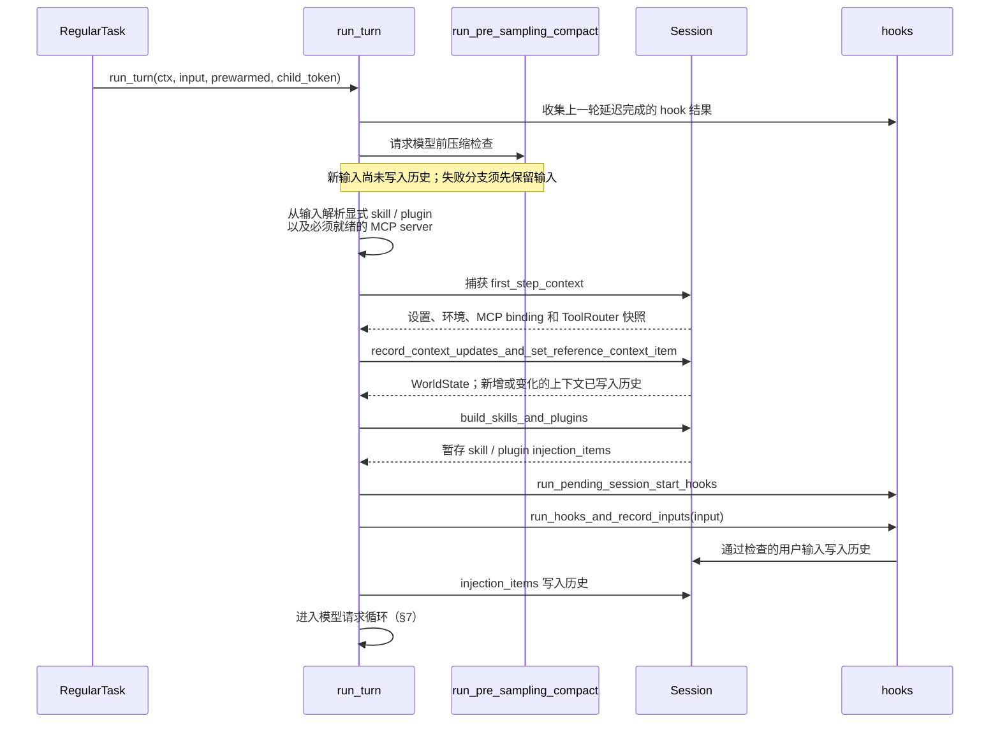
```mermaid
sequenceDiagram
  participant RG as RegularTask
  participant RT as run_turn
  participant CP as run_pre_sampling_compact
  participant S as Session
  participant HK as hooks
  RG->>RT: run_turn(ctx, input, prewarmed, child_token)
  RT->>HK: 收集上一轮延迟完成的 hook 结果
  RT->>CP: 请求模型前压缩检查
  Note over RT,CP: 新输入尚未写入历史；失败分支须先保留输入
  RT->>RT: 从输入解析显式 skill / plugin<br/>以及必须就绪的 MCP server
  RT->>S: 捕获 first_step_context
  S-->>RT: 设置、环境、MCP binding 和 ToolRouter 快照
  RT->>S: record_context_updates_and_set_reference_context_item
  S-->>RT: WorldState；新增或变化的上下文已写入历史
  RT->>S: build_skills_and_plugins
  S-->>RT: 暂存 skill / plugin injection_items
  RT->>HK: run_pending_session_start_hooks
  RT->>HK: run_hooks_and_record_inputs(input)
  HK->>S: 通过检查的用户输入写入历史
  RT->>S: injection_items 写入历史
  RT->>RT: 进入模型请求循环（§7）
```

这条顺序有两个容易混淆的地方。第一，捕获 `StepContext` 不会自动写历史；它只是固定接下来构造上下文和执行工具要使用的视图。第二，显式选择的 skill / plugin 会先解析成 `injection_items`，但要等会话启动 hook 和用户输入 hook 都通过后才真正写入；通用的 `WorldState` 上下文则在它们之前已经记录。

`TurnContext` 保存轮次信息和当前设置，`StepContext` 则保存这一次模型请求使用的设置、MCP 绑定和工具列表。设置中途发生变化，要等下次调用 `capture_step_context` 才会读到；当前请求和工具执行仍使用原来的那份配置。这样，发给模型的工具定义和实际执行时查找的工具保持一致，但远端 MCP 服务仍可能断连。

### `TurnContext` 与 `StepContext`

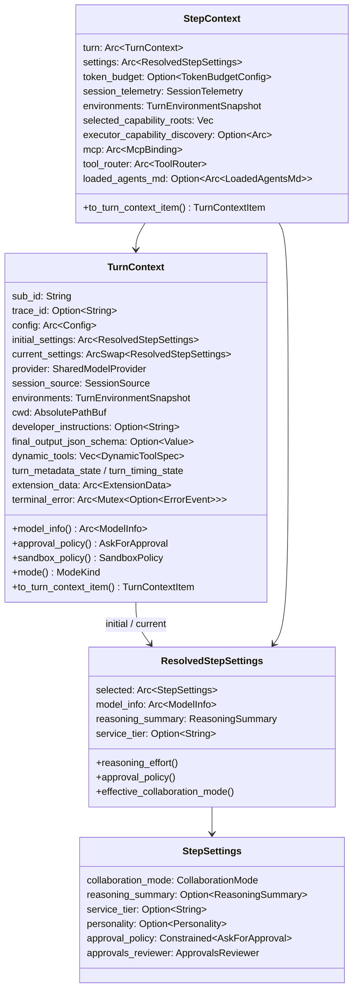
```mermaid
classDiagram
  class TurnContext {
    sub_id: String
    trace_id: Option~String~
    config: Arc~Config~
    initial_settings: Arc~ResolvedStepSettings~
    current_settings: ArcSwap~ResolvedStepSettings~
    provider: SharedModelProvider
    session_source: SessionSource
    environments: TurnEnvironmentSnapshot
    cwd: AbsolutePathBuf
    developer_instructions: Option~String~
    final_output_json_schema: Option~Value~
    dynamic_tools: Vec~DynamicToolSpec~
    turn_metadata_state / turn_timing_state
    extension_data: Arc~ExtensionData~
    terminal_error: Arc~Mutex~Option~ErrorEvent~~~
    +model_info() Arc~ModelInfo~
    +approval_policy() AskForApproval
    +sandbox_policy() SandboxPolicy
    +mode() ModeKind
    +to_turn_context_item() TurnContextItem
  }
  class ResolvedStepSettings {
    selected: Arc~StepSettings~
    model_info: Arc~ModelInfo~
    reasoning_summary: ReasoningSummary
    service_tier: Option~String~
    +reasoning_effort()
    +approval_policy()
    +effective_collaboration_mode()
  }
  class StepSettings {
    collaboration_mode: CollaborationMode
    reasoning_summary: Option~ReasoningSummary~
    service_tier: Option~String~
    personality: Option~Personality~
    approval_policy: Constrained~AskForApproval~
    approvals_reviewer: ApprovalsReviewer
  }
  class StepContext {
    turn: Arc~TurnContext~
    settings: Arc~ResolvedStepSettings~
    token_budget: Option~TokenBudgetConfig~
    session_telemetry: SessionTelemetry
    environments: TurnEnvironmentSnapshot
    selected_capability_roots: Vec
    executor_capability_discovery: Option~Arc~
    mcp: Arc~McpBinding~
    tool_router: Arc~ToolRouter~
    loaded_agents_md: Option~Arc~LoadedAgentsMd~~
    +to_turn_context_item() TurnContextItem
  }
  TurnContext --> ResolvedStepSettings : initial / current
  ResolvedStepSettings --> StepSettings
  StepContext --> TurnContext
  StepContext --> ResolvedStepSettings
```

| 类型 | 作用 |
|---|---|
| `TurnContext` | 轮次身份、初始配置和当前设置入口。`current_settings` 是 `ArcSwap`，`Op::TurnSettings` 能在轮次中途换模型或推理强度，但已经创建的 `StepContext` 不受影响。`terminal_error` 非空表示这轮已经报过致命错，外层循环看到它就不再继续执行。它在轮次开始时根据会话配置、环境和技能信息创建。 |
| `StepContext` | 一次模型请求使用的配置快照，包含环境、AGENTS.md、token 预算、MCP binding 和工具路由。请求中的工具定义与实际执行使用同一份绑定，避免准备请求和执行工具时各用一套配置；base instructions 仍由 `Session` 单独提供，远端 MCP 服务也仍可能断连。 |

### 首个 `StepContext` 怎样捕获

这里的“首个”是一次 `run_turn` 中供第一次模型请求使用的快照，不是线程创建后的第一个轮次。捕获之前，`run_turn` 先从本轮输入中找出必须就绪的 MCP server 和 plugin；随后 `capture_step_context_with_required_mcp_servers` 把当前设置、环境和工具绑定固定到同一个 `StepContext` 中。

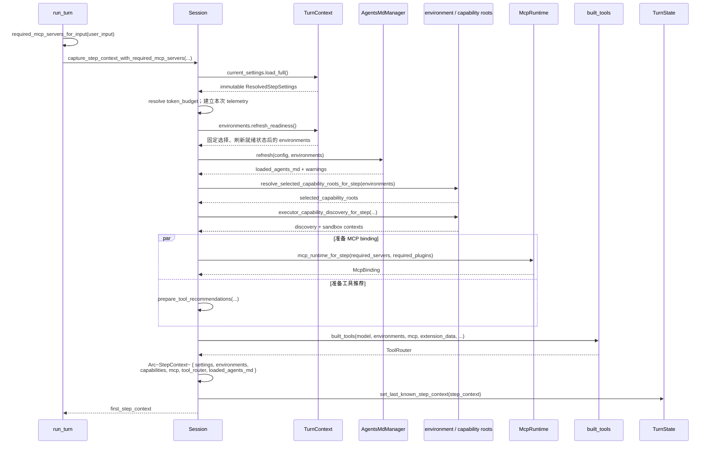
```mermaid
sequenceDiagram
  participant RT as run_turn
  participant S as Session
  participant TC as TurnContext
  participant AM as AgentsMdManager
  participant ER as environment / capability roots
  participant MCP as McpRuntime
  participant BT as built_tools
  participant TS as TurnState

  RT->>RT: required_mcp_servers_for_input(user_input)
  RT->>S: capture_step_context_with_required_mcp_servers(...)
  S->>TC: current_settings.load_full()
  TC-->>S: immutable ResolvedStepSettings
  S->>S: resolve token_budget；建立本次 telemetry
  S->>TC: environments.refresh_readiness()
  TC-->>S: 固定选择、刷新就绪状态后的 environments
  S->>AM: refresh(config, environments)
  AM-->>S: loaded_agents_md + warnings
  S->>ER: resolve_selected_capability_roots_for_step(environments)
  ER-->>S: selected_capability_roots
  S->>ER: executor_capability_discovery_for_step(...)
  ER-->>S: discovery + sandbox contexts
  par 准备 MCP binding
    S->>MCP: mcp_runtime_for_step(required_servers, required_plugins)
    MCP-->>S: McpBinding
  and 准备工具推荐
    S->>S: prepare_tool_recommendations(...)
  end
  S->>BT: built_tools(model, environments, mcp, extension_data, ...)
  BT-->>S: ToolRouter
  S->>S: Arc~StepContext~ { settings, environments,<br/>capabilities, mcp, tool_router, loaded_agents_md }
  S->>TS: set_last_known_step_context(step_context)
  S-->>RT: first_step_context
```

最先读取的是 `current_settings`。后面的 AGENTS.md、capability discovery、MCP 刷新和工具构建即使需要等待，也继续使用这份 settings；捕获期间新到的设置不会混入当前快照。环境选择同样保持不变，只刷新各环境是否已经就绪。

MCP binding 和工具推荐可以并行准备。拿到 binding 后，`built_tools` 再结合模型能力、权限、环境、Apps/plugins 和扩展工具生成最终的 `ToolRouter`。完成的 `StepContext` 会记到当前 `TurnState`，然后交回 `run_turn`，供后面的 `WorldState` 构造和第一次模型请求共同使用。这一步本身不写对话历史。

如果内层循环后来收到插话，或者需要重新读取动态设置，`run_turn` 可以再捕获一份新的 `StepContext`；下一次请求和工具执行改用新快照，并在请求前记录相应的 `WorldState` 变化。

### 上下文写到哪里：`SessionState` 与 `ContextManager`

捕获完成后，`StepContext` 只是生成上下文的依据，真正的消息仍要写进会话历史。`run_turn` 自己不持有历史：它通过 `Session.state` 取得 `SessionState`，再读写其中的 `ContextManager`。因此 `SessionState` 和 `ContextManager` 不是与 `StepContext` 并列的另一套上下文对象；前者保存会话状态，后者专门保存跨请求累积的历史。

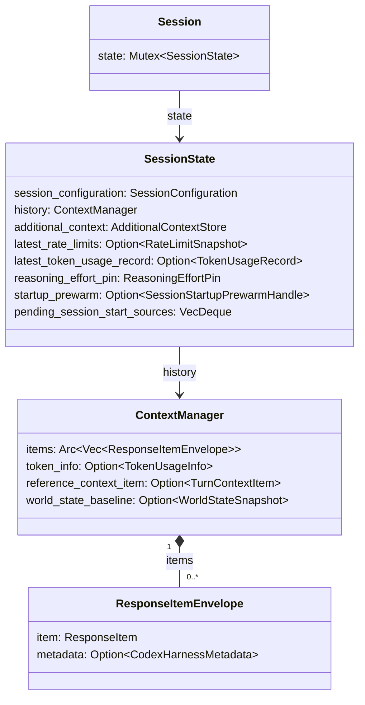
```mermaid
classDiagram
  class Session {
    state: Mutex~SessionState~
  }
  class SessionState {
    session_configuration: SessionConfiguration
    history: ContextManager
    additional_context: AdditionalContextStore
    latest_rate_limits: Option~RateLimitSnapshot~
    latest_token_usage_record: Option~TokenUsageRecord~
    reasoning_effort_pin: ReasoningEffortPin
    startup_prewarm: Option~SessionStartupPrewarmHandle~
    pending_session_start_sources: VecDeque
  }
  class ContextManager {
    items: Arc~Vec~ResponseItemEnvelope~~
    token_info: Option~TokenUsageInfo~
    reference_context_item: Option~TurnContextItem~
    world_state_baseline: Option~WorldStateSnapshot~
  }
  class ResponseItemEnvelope {
    item: ResponseItem
    metadata: Option~CodexHarnessMetadata~
  }
  Session --> SessionState : state
  SessionState --> ContextManager : history
  ContextManager "1" *-- "0..*" ResponseItemEnvelope : items
```

| 字段 | 含义 |
|---|---|
| `session_configuration` | 线程级设置：模型、审批策略、沙箱策略、cwd、provider、`base_instructions`。`Op::ThreadSettings` 改的就是它 |
| `history: ContextManager` | 对话历史本体，以及与历史一起维护的 token 统计和上下文 diff 基线 |
| `latest_rate_limits` / `latest_token_usage_record` | 最近一次响应里的限流和用量 |
| `additional_context: AdditionalContextStore` | 客户端通过 `TurnInputRequest.additional_context` 给的键值上下文，按 key 合并 |
| `reasoning_effort_pin` | 某个模型固定设置的推理强度 |
| `startup_prewarm` | 启动时预热的 HTTP/WebSocket 连接句柄，第一轮取出使用 |
| `pending_session_start_sources` | 还没跑的 SessionStart hook 来源（startup / resume / fork / clear） |

其中 `ContextManager` 的职责可以再拆成两部分：`items` 保存实际对话条目，其余字段维护请求前整理、压缩和上下文更新所需的状态。

| 字段 | 含义 |
|---|---|
| `items: Arc<Vec<ResponseItemEnvelope>>` | 对话历史。多个快照可以共享内容，只有修改时才按需复制 |
| `history_version` / `user_message_revision` | 追踪历史和用户消息是否发生变化，供需要判断内容是否更新的逻辑使用 |
| `token_info: Option<TokenUsageInfo>` | 最近一次响应报的用量，`get_total_token_usage` 从它算 |
| `reference_context_item: Option<TurnContextItem>` | 上下文 diff 的基线（§6）。`None` 表示下一轮要全量注入 |
| `world_state_baseline` | 保存上次提供给模型的工作目录、Git 分支等环境信息，用来识别后续变化。 |

| 方法 | 干什么 | 谁调它 |
|---|---|---|
| `record_items(items, policy)` / `record_annotated_items` | 追加。工具输出按 `policy` 截断 | `record_prepared_conversation_items` |
| `for_prompt(input_modalities)` | 把保存的历史整理成模型能够接收的消息列表 | `run_turn`、`run_sampling_request` |
| `normalize_history` | 四个不变量：每个工具调用都有输出（缺的补合成输出）、每个输出都有调用（孤儿删掉）、模型不支持图就删图、不支持音频就删音频 | `for_prompt` |
| `estimate_token_count` | 本地估算（按字节和条目类型加权），没有服务端用量时用 | 压缩判定 |
| `replace_compacted(items)` | 用压缩结果替换历史，并标记历史已经变化 | `replace_compacted_history` |
| `drop_last_n_user_turns(n)` | 按用户轮次回退对话，移除最近的若干轮 | `handlers::thread_rollback` |

### `StepContext` 怎样变成模型可见上下文

先把“系统提示词”拆开看。Codex 并不会在每一轮把所有规则拼成一个字符串。一次模型请求里的指令来自三个位置：

| 请求字段 | 从哪里来 | 什么时候更新 |
|---|---|---|
| `instructions` | `Session::get_prompt_base_instructions()` 返回的 base instructions | 每次模型请求都会带上。创建 Session 时按“配置显式覆盖 → 恢复记录中的 base instructions → 当前模型模板”的顺序确定 |
| `input` | `ContextManager::for_prompt()` 整理后的历史 | 用户消息、模型输出、工具结果，以及 Codex 追加的 developer / user 上下文都在这里 |
| `tools` | `StepContext.tool_router.model_visible_specs()` | 每次捕获新的 `StepContext` 时确定，和实际执行工具使用同一份绑定 |

所以 base instructions 最接近通常所说的 system prompt，但 AGENTS.md、权限、工作目录、skill 清单和多 agent 模式并不在这个字段里，它们都是 `input` 中的消息。`Responses Lite` 是个例外：base instructions 会被转成一条置于 `input` 开头的 developer 消息，工具定义也会变成 `AdditionalTools` 条目，`instructions` 和 `tools` 字段则留空。

#### `WorldState` 怎样做全量注入和 diff

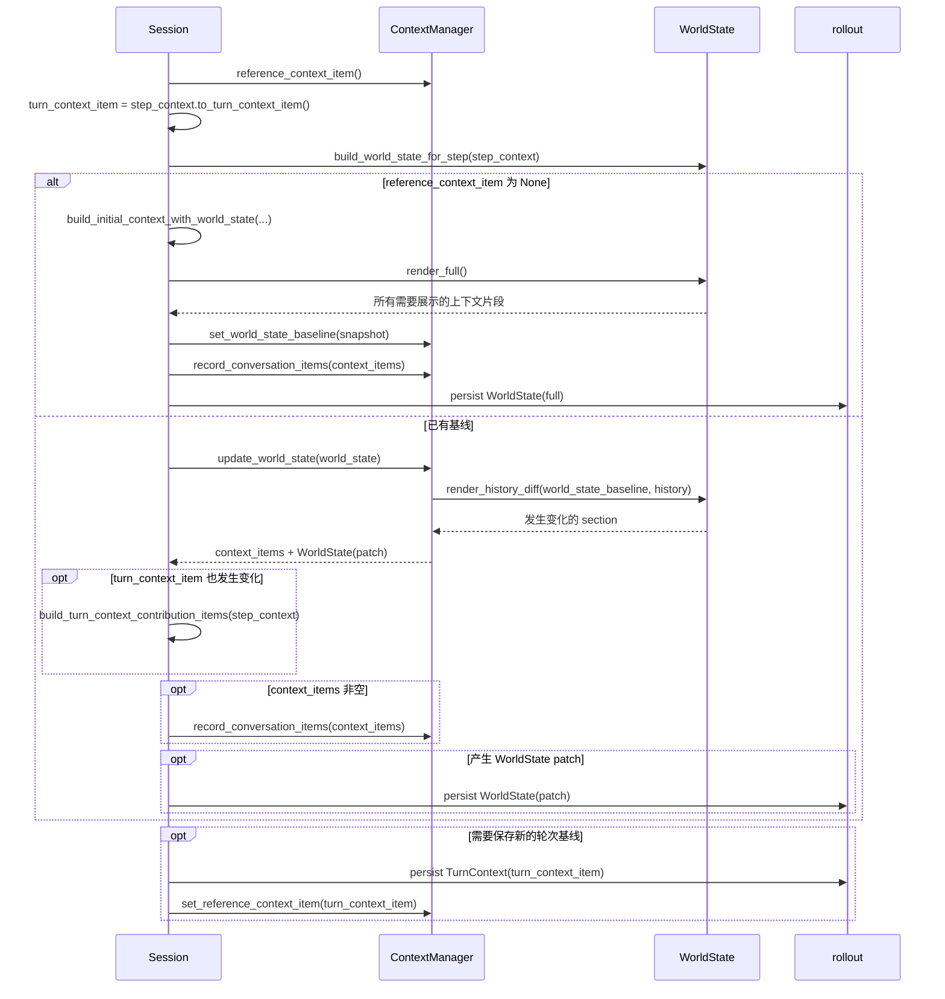
```mermaid
sequenceDiagram
  participant S as Session
  participant CM as ContextManager
  participant WS as WorldState
  participant RO as rollout

  S->>CM: reference_context_item()
  S->>S: turn_context_item = step_context.to_turn_context_item()
  S->>WS: build_world_state_for_step(step_context)
  alt reference_context_item 为 None
    S->>S: build_initial_context_with_world_state(...)
    S->>WS: render_full()
    WS-->>S: 所有需要展示的上下文片段
    S->>CM: set_world_state_baseline(snapshot)
    S->>CM: record_conversation_items(context_items)
    S->>RO: persist WorldState(full)
  else 已有基线
    S->>CM: update_world_state(world_state)
    CM->>WS: render_history_diff(world_state_baseline, history)
    WS-->>CM: 发生变化的 section
    CM-->>S: context_items + WorldState(patch)
    opt turn_context_item 也发生变化
      S->>S: build_turn_context_contribution_items(step_context)
    end
    opt context_items 非空
      S->>CM: record_conversation_items(context_items)
    end
    opt 产生 WorldState patch
      S->>RO: persist WorldState(patch)
    end
  end
  opt 需要保存新的轮次基线
    S->>RO: persist TurnContext(turn_context_item)
    S->>CM: set_reference_context_item(turn_context_item)
  end
```

`record_context_updates_and_set_reference_context_item` 只处理通用运行上下文及其基线，不处理用户刚发来的消息，也不注入本轮显式选择的 skill 正文。这里要区分两种状态：`WorldState` 比较模型可见的运行环境，`TurnContextItem` 保存恢复会话所需的轮次设置基线。

#### 首次全量注入包含什么

没有基线时，`build_initial_context_with_world_state` 调用 `WorldState::render_full()`，再按角色合并相邻片段。通常会形成一条合并后的 developer 消息、少量必须独立的 developer 消息，以及一条 contextual user 消息。主要来源如下：

| 段 | 角色 | 来源 |
|---|---|---|
| 客户端 developer instructions | developer | `TurnContext.developer_instructions`，合并进主 developer 消息 |
| 模型切换、personality、审批与沙箱、协作模式、持久执行规则 | developer | `build_world_state_for_step` 中对应的 `WorldStateSection` |
| 可用 skill 清单 | developer | skills extension 提供的 `skills` / `orchestrator_skills` / `host_skills` section，使用 `<skills_instructions>` 标记 |
| Apps / plugins 的通用使用规则 | developer | 当前确实有可用能力且模型配置允许时加入 |
| 多 agent 模式、token budget、guardian 或托管策略 | 独立 developer 消息 | 这些片段必须单独成条，不与普通 developer 内容合并 |
| AGENTS.md | user（contextual user） | `StepContext.loaded_agents_md`，使用 `# AGENTS.md instructions` 标记 |
| 环境信息 | user（contextual user） | cwd、Git 分支、日期、时区、shell、网络和文件系统等 `<environment_context>` |
| 推荐但尚未安装的插件 | user（contextual user） | `RecommendedPluginsInstructions`，使用 `<recommended_plugins>` 标记 |

这里的“contextual user”不是用户刚刚输入的消息，而是 Codex 以 `role: user` 写入历史的运行时上下文。它们会进入模型请求，但 UI 不必把它们当成一条普通聊天消息展示。

#### skill 有两层，更新方式不同

第一层是**可用 skill 清单**。捕获 `StepContext` 时，skills extension 会根据当前 cwd、选中的执行环境、插件和各类 skill provider 生成目录。目录作为 `WorldState` 的 section 写进 developer 上下文，只包含名称、描述和入口位置，不包含每个 `SKILL.md` 的完整正文。

第二层是**本轮选中的 skill 正文**。`build_skills_and_plugins` 从本轮用户输入里找显式 skill mention，只读取命中的主提示文件，并生成一条这样的 contextual user 消息：

```xml
<skill>
  <name>skill-name</name>
  <path>/path/to/SKILL.md</path>
  ...SKILL.md 正文...
</skill>
```

它在用户消息被接受后写入历史，供紧接着的模型请求使用。同一条 skill 如果已经由 extension 注入，`InjectedHostSkillPrompts` 会让 core 跳过重复副本。在捕获 `StepContext` 之前，`required_mcp_servers_for_input` 还会检查显式选中 skill 声明的 MCP 依赖，把它们加入 `required_servers`；这样本轮会先等相关服务就绪，再确定工具绑定。

显式 plugin mention 走相邻但不同的路径：Codex 会生成 developer 提示，说明这个 plugin 当前暴露了哪些 skill 前缀、Apps 和 MCP server，同时把明确选中的 connector 合并到会话选择中。

这三类内容的“生成”和“写入”不是同时发生的：

| 内容 | 什么时候生成 | 什么时候写入历史 |
|---|---|---|
| 通用 `WorldState` 上下文 | 捕获首个 `StepContext` 之后 | 有新增或变化时，立即由 `record_context_updates_and_set_reference_context_item` 写入 |
| 本轮用户输入及附加上下文 | 输入 hook 逐条检查时 | 每条通过检查后立即写入；如果全部被阻止，本次 `run_turn` 到此结束 |
| 显式选择的 skill / plugin 注入项 | `WorldState` 写入之后、输入 hook 之前先构造并暂存 | 用户输入被接受后再写入，因此不会把被拦截请求选择的能力正文留在历史里 |

因此历史在第一次请求前的典型顺序是：通用 developer / contextual user 上下文，真正的用户消息，然后是本轮选中的 skill 正文或 plugin 说明。它们最后都会进入同一份 `ContextManager.items`，但来源和生命周期并不相同。

#### 状态变化后怎么告诉模型

这里的两套基线不是同一份上下文保存了两遍。它们分别控制两个判断：历史里是否还有一套可信的完整上下文，以及在此基础上具体哪部分发生了变化。

| 基线 | 回答的问题 | 保存的内容 |
|---|---|---|
| `reference_context_item: Option<TurnContextItem>` | 历史里还能不能沿用此前的完整上下文？轮次设置是否变化？ | 最近一次持久化的轮次设置快照，同时充当完整上下文仍然有效的锚点 |
| `world_state_baseline: Option<WorldStateSnapshot>` | 和上次相比，具体哪个模型可见 section 变了？ | AGENTS.md、环境、权限、skill 清单等各个 `WorldStateSection` 的结构化快照 |

`record_context_updates_and_set_reference_context_item` 首先检查 `reference_context_item`：

- 如果它是 `None`，Codex 不再假设历史里还有完整上下文，而是重新注入全部 developer / contextual user 内容，并用这次的 `WorldState` 重建 `world_state_baseline`。
- 如果它存在，说明可以在已有上下文上继续。这时才用 `world_state_baseline` 逐 section 比较，只生成发生变化的内容；`TurnContextItem` 自身发生变化时，还会调用 extension 的 turn-context contributor。

两套基线不能合并，因为“还记得上次各项是什么”不等于“历史里仍然保留着上次的完整说明”。例如回滚删掉了最初的 AGENTS.md 上下文，但 AGENTS.md 文件本身没有变化：如果只看 `world_state_baseline`，diff 会认为无需追加任何内容，模型反而收不到 AGENTS.md。清除 `reference_context_item` 后，下一次会强制全量注入，从而重新建立一个可信的历史锚点。

这里的 diff 不是对整段提示词做文本差异。每个 section 都实现自己的比较和更新文案，然后把结果作为新的 developer 或 user 消息**追加**到历史，旧消息不会被原地改写。几个典型例子：

| 变化 | 追加给模型的内容 |
|---|---|
| skill 目录变化 | 新的 developer `<skills_instructions>`。内容没变则什么都不写；skill 全部消失时会明确说明当前没有可用 skill |
| 本轮显式选中一个 skill | 不走 world-state diff；读取该 `SKILL.md`，追加 user `<skill>` 正文 |
| cwd 改变，因而加载到另一组 AGENTS.md | 新的 user 指令会明确说明它替换此前所有 AGENTS.md；如果不再有 AGENTS.md，则追加失效说明 |
| Git 分支、日期、shell、网络或文件系统状态改变 | 追加 user `<environment_context>` 更新，只列需要告诉模型的变化 |
| 审批策略、沙箱、协作模式、personality 或模型改变 | 对应 section 追加 developer 更新；切换模型时还会补新模型自己的 instructions |
| Apps、plugins 或延迟工具的可用性改变 | 对应 section 需要时追加 developer 使用说明；真正的工具 schema 仍以当前 `StepContext.tools` 为准 |

同一轮里也可能发生变化。例如用户插话后重新捕获了 `StepContext`，`run_turn` 会在下一次请求前调用 `record_step_world_state_if_changed`，用本轮上一份 `WorldState` 做比较，把新增 diff 写进历史。因此变化不一定要等到下一轮才生效。

如果 `reference_context_item` 丢失——例如新线程、压缩后重建上下文，或回滚删掉了原来的初始上下文——下一次会重新走全量注入，并同时重建 `world_state_baseline`。`TurnContextItem` 和发生变化时的 `WorldStateItem` 还会写进 rollout；恢复会话时可以继续从正确的基线比较，不必把所有上下文再次塞一遍。

### 这些内容怎样存成历史条目

前面生成的用户输入、developer / user 上下文和 skill 正文，最终都会变成 `ResponseItem`。这是 OpenAI Responses API 的条目格式，Codex 也直接用它保存对话历史。历史里的条目有这几个来源：

- **用户输入**：`UserInput` 转成 `Message { role: "user" }`；
- **模型输出**：模型流里每个 `OutputItemDone` 带的就是一个 `ResponseItem`（助手消息、推理、工具调用），收到就写进历史（§8）；
- **工具结果**：工具执行完产出 `ResponseInputItem`，`into()` 成 `FunctionCallOutput` 等写进历史（§9）；
- **core 自己加的**：初始上下文和设置变化的 developer / user 消息，以及压缩后的摘要（§12）。

写进去之后有四个地方用它：

- 外面包一层 `ResponseItemEnvelope`，存在 `SessionState.history`（`ContextManager`）里；
- 每次请求模型前 `for_prompt` 去掉外层元数据，整个列表就是请求体的 `input`（§7）；
- 解析成 `TurnItem`，放进 `ItemStarted` / `ItemCompleted` 事件发给 UI；
- 以 `RolloutItem::ResponseItem` 写进 rollout 文件（§13）。

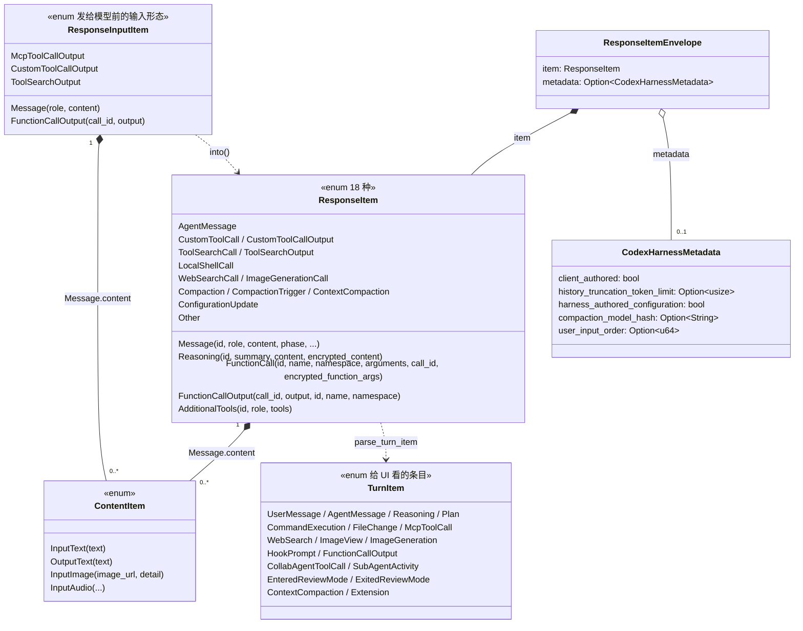
```mermaid
classDiagram
  class ResponseItem {
    <<enum 18 种>>
    Message(id, role, content, phase, ...)
    AgentMessage
    Reasoning(id, summary, content, encrypted_content)
    FunctionCall(id, name, namespace, arguments, call_id, encrypted_function_args)
    FunctionCallOutput(call_id, output, id, name, namespace)
    CustomToolCall / CustomToolCallOutput
    ToolSearchCall / ToolSearchOutput
    LocalShellCall
    WebSearchCall / ImageGenerationCall
    Compaction / CompactionTrigger / ContextCompaction
    ConfigurationUpdate
    AdditionalTools(id, role, tools)
    Other
  }
  class ContentItem {
    <<enum>>
    InputText(text)
    OutputText(text)
    InputImage(image_url, detail)
    InputAudio(...)
  }
  class ResponseInputItem {
    <<enum 发给模型前的输入形态>>
    Message(role, content)
    FunctionCallOutput(call_id, output)
    McpToolCallOutput
    CustomToolCallOutput
    ToolSearchOutput
  }
  class ResponseItemEnvelope {
    item: ResponseItem
    metadata: Option~CodexHarnessMetadata~
  }
  class CodexHarnessMetadata {
    client_authored: bool
    history_truncation_token_limit: Option~usize~
    harness_authored_configuration: bool
    compaction_model_hash: Option~String~
    user_input_order: Option~u64~
  }
  class TurnItem {
    <<enum 给 UI 看的条目>>
    UserMessage / AgentMessage / Reasoning / Plan
    CommandExecution / FileChange / McpToolCall
    WebSearch / ImageView / ImageGeneration
    HookPrompt / FunctionCallOutput
    CollabAgentToolCall / SubAgentActivity
    EnteredReviewMode / ExitedReviewMode
    ContextCompaction / Extension
  }
  ResponseInputItem "1" *-- "0..*" ContentItem : Message.content
  ResponseItem "1" *-- "0..*" ContentItem : Message.content
  ResponseItemEnvelope *-- ResponseItem : item
  ResponseItemEnvelope o-- "0..1" CodexHarnessMetadata : metadata
  ResponseInputItem ..> ResponseItem : into()
  ResponseItem ..> TurnItem : parse_turn_item
```

`ContentItem` 不是 `ResponseInputItem` 或 `ResponseItem` 的父类。它只表示 `Message.content` 里的一个内容块；两种 `Message` 都用 `Vec<ContentItem>` 保存文字、图片或音频。`ResponseInputItem` 则可以通过 `into()` 转成 `ResponseItem`，再写入历史。

| 类型 | 作用 |
|---|---|
| `ResponseItem` | **历史里存的就是它，发给模型的也是它**，没有第二套内部消息模型（对照 pi 的 `AgentMessage` → `Message` 两层）。18 个变体里 `Compaction` / `ContextCompaction` / `ConfigurationUpdate` / `AdditionalTools` 是 Codex 自己加的，发给非 OpenAI 提供方前会被处理。 |
| `ContentItem` | 消息正文的三种内容。`InputImage.detail` 发请求前会按模型能力归一化。 |
| `ResponseInputItem` | 准备加入对话的内容，包括工具输出和用户消息，之后统一转换成历史条目 |
| `ResponseItemEnvelope` | 历史里每条 `ResponseItem` 外面包一层元数据。**`ContextManager` 保存的是消息及其元数据，不只是消息本身。** |
| `CodexHarnessMetadata` | 五个字段全是“给回放和截断用的”，模型看不到。`history_truncation_token_limit` 记的是这条工具输出当时按什么预算截断的。 |
| `TurnItem` | 给 UI 的条目，`ItemStarted` / `ItemCompleted` 事件里带的就是它。由 `ResponseItem` 解析出来。 |

---

## 7. 请求模型：从 StepContext 和历史到请求体

此时，上下文和用户输入已经写入 `ContextManager`，但 `StepContext` 的工作并没有结束。一次请求由两路数据合成：`ContextManager` 提供模型已经看过的内容，整理后成为 `Prompt.input`；当前 `StepContext` 则继续提供模型能力、工具定义、输出约束，以及实际执行工具时使用的 MCP、权限和环境绑定。

这也是为什么不能只拿历史去请求模型。工具 schema 不属于对话历史，实际执行工具所需的本地对象也不能序列化进消息；它们必须继续由同一份 `StepContext` 持有，才能保证模型看到的工具和随后真正执行的工具来自同一个快照。

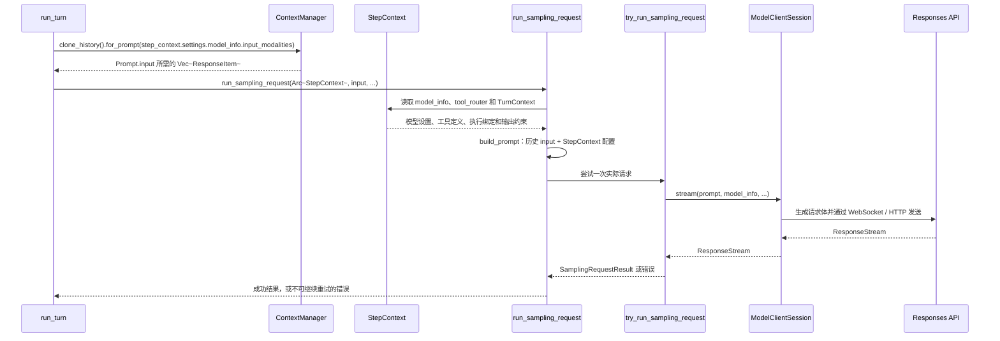
```mermaid
sequenceDiagram
  participant RT as run_turn
  participant CM as ContextManager
  participant SC as StepContext
  participant SR as run_sampling_request
  participant TR as try_run_sampling_request
  participant MC as ModelClientSession
  participant API as Responses API

  RT->>CM: clone_history().for_prompt(step_context.settings.model_info.input_modalities)
  CM-->>RT: Prompt.input 所需的 Vec~ResponseItem~
  RT->>SR: run_sampling_request(Arc~StepContext~, input, ...)
  SR->>SC: 读取 model_info、tool_router 和 TurnContext
  SC-->>SR: 模型设置、工具定义、执行绑定和输出约束
  SR->>SR: build_prompt：历史 input + StepContext 配置
  SR->>TR: 尝试一次实际请求
  TR->>MC: stream(prompt, model_info, ...)
  MC->>API: 生成请求体并通过 WebSocket / HTTP 发送
  API-->>MC: ResponseStream
  MC-->>TR: ResponseStream
  TR-->>SR: SamplingRequestResult 或错误
  SR-->>RT: 成功结果，或不可继续重试的错误
```

这张图中有两个容易被一句函数调用掩盖的步骤：第一段是 `for_prompt`，负责从“保存的历史”得到“本次可发送的历史”；第二段是 `run_sampling_request`，负责从这份历史得到 `Prompt`，并决定失败后是否再试。下面分别展开。

### `for_prompt`：把保存的历史整理成模型输入

`ContextManager` 保存的是 `Vec<ResponseItemEnvelope>`。其中既有要发给模型的 `ResponseItem`，也有只供 Codex 回放、截断使用的元数据。`run_turn` 先调用 `clone_history()` 得到一个历史快照，再在这个快照上调用 `for_prompt`。因此，下面的整理只影响这次请求使用的副本，不会把合成结果或媒体替换写回会话历史。

这里传入的 `input_modalities` 来自当前 `StepContext.settings.model_info`。也就是说，就连历史应该保留图片还是音频，也不是 `ContextManager` 自己决定的，而是由这一次请求选择的模型能力决定。

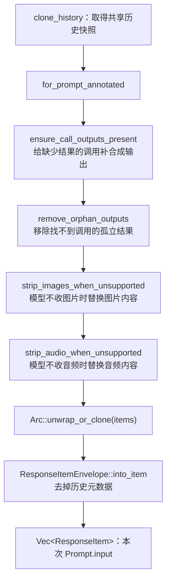
```mermaid
flowchart TD
  A["clone_history：取得共享历史快照"] --> B["for_prompt_annotated"]
  B --> C["ensure_call_outputs_present<br/>给缺少结果的调用补合成输出"]
  C --> D["remove_orphan_outputs<br/>移除找不到调用的孤立结果"]
  D --> E["strip_images_when_unsupported<br/>模型不收图片时替换图片内容"]
  E --> F["strip_audio_when_unsupported<br/>模型不收音频时替换音频内容"]
  F --> G["Arc::unwrap_or_clone(items)"]
  G --> H["ResponseItemEnvelope::into_item<br/>去掉历史元数据"]
  H --> I["Vec&lt;ResponseItem&gt;：本次 Prompt.input"]
```

这里整理的重点不是重新排列对话，而是保证请求里的调用链完整、内容类型可用：

| 历史里的情况 | `for_prompt` 怎样处理 |
|---|---|
| `FunctionCall`、`CustomToolCall`、`ToolSearchCall` 或 `LocalShellCall` 后没有对应结果 | 紧跟调用插入合成结果。普通函数、自定义工具和本地 shell 使用 `"aborted"`；工具搜索补一个空的已完成结果 |
| 有工具结果，却找不到相同 `call_id` 的调用 | 删除这个孤立结果；由服务端执行的工具搜索结果可以单独存在 |
| 当前模型不支持图片或音频 | 将消息和工具结果中的对应媒体换成“当前模型不支持该媒体”的文本；图片生成结果会清空 |
| `ResponseItemEnvelope` 带有截断预算等元数据 | 元数据留在 Codex 内部，只取出其中的 `ResponseItem` 发给模型 |

合成结果的 id 由原调用条目的 id 稳定生成。同一段历史在网络重试或恢复后再次执行 `for_prompt`，得到的合成 id 仍然相同，避免仅仅因为本地补全而破坏提示词缓存。整理结束后，条目的先后顺序仍然保持不变；唯一插入的新条目就是紧跟在缺失调用后的合成结果。

所以 `for_prompt` 不是普通的历史 getter。它是保存格式与模型请求格式之间的一道边界：历史里可以保留 Codex 自己需要的元数据，也可能留下中断造成的不完整调用；越过这道边界时，请求必须变成一组自洽的 `ResponseItem`。

### `run_sampling_request`：组装 `Prompt`，失败后决定从哪里再试

`run_sampling_request` 也不只是给 `ModelClientSession.stream` 换了一个名字。它包住的是“一次模型请求可以尝试多次”的过程，而 `try_run_sampling_request` 才负责其中一次实际请求以及随后对流式事件的处理。

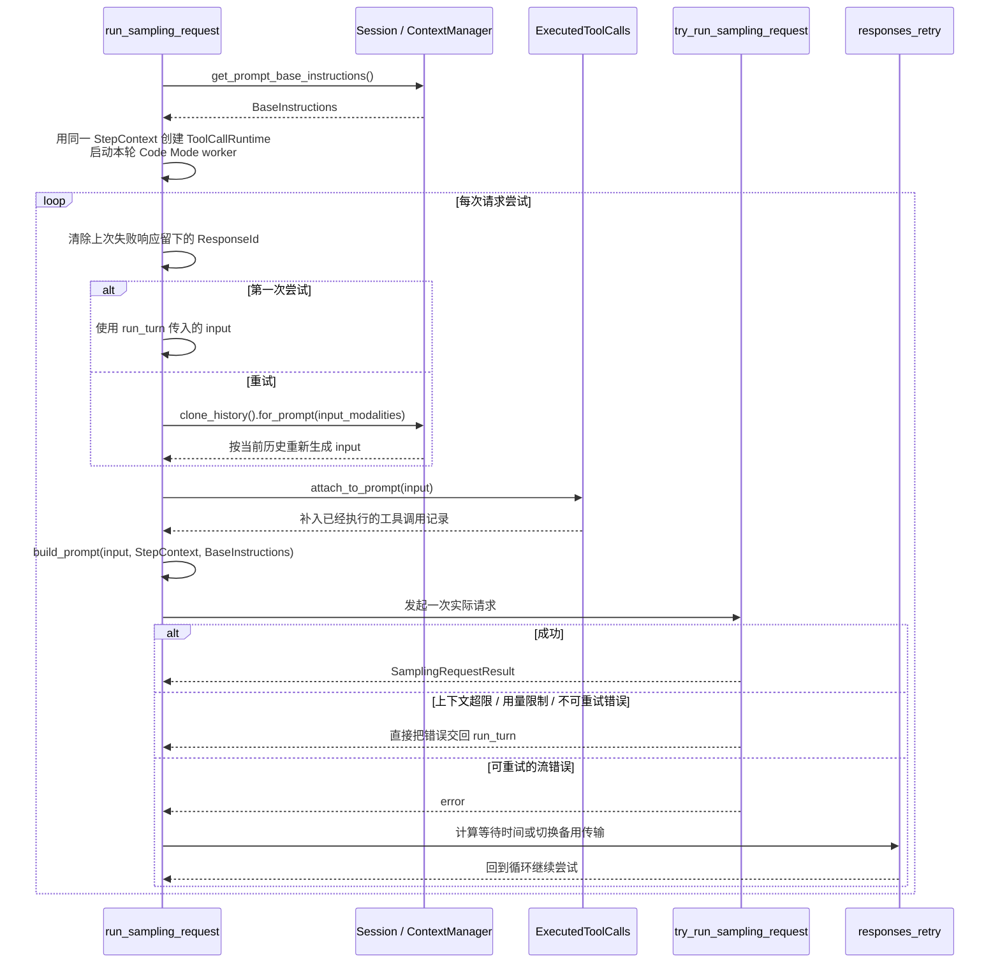
```mermaid
sequenceDiagram
  participant SR as run_sampling_request
  participant S as Session / ContextManager
  participant ET as ExecutedToolCalls
  participant TR as try_run_sampling_request
  participant RR as responses_retry

  SR->>S: get_prompt_base_instructions()
  S-->>SR: BaseInstructions
  SR->>SR: 用同一 StepContext 创建 ToolCallRuntime<br/>启动本轮 Code Mode worker
  loop 每次请求尝试
    SR->>SR: 清除上次失败响应留下的 ResponseId
    alt 第一次尝试
      SR->>SR: 使用 run_turn 传入的 input
    else 重试
      SR->>S: clone_history().for_prompt(input_modalities)
      S-->>SR: 按当前历史重新生成 input
    end
    SR->>ET: attach_to_prompt(input)
    ET-->>SR: 补入已经执行的工具调用记录
    SR->>SR: build_prompt(input, StepContext, BaseInstructions)
    SR->>TR: 发起一次实际请求
    alt 成功
      TR-->>SR: SamplingRequestResult
    else 上下文超限 / 用量限制 / 不可重试错误
      TR-->>SR: 直接把错误交回 run_turn
    else 可重试的流错误
      TR-->>SR: error
      SR->>RR: 计算等待时间或切换备用传输
      RR-->>SR: 回到循环继续尝试
    end
  end
```

第一次尝试直接使用 `run_turn` 已经准备好的 `input`。如果流在中途失败，第二次开始就不再复用这份旧数组，而是重新读取当前历史。原因是失败前已经完成的模型输出或工具结果可能已经写入 `ContextManager`；重建输入才能让下一次请求从实际进度继续，而不是让模型再生成一遍。最初那份输入仍会被保留下来，成功后随结果交回 `run_turn`，供旧版 after-agent hook 使用。

每次尝试都会重新执行三件事：把 `executed_tool_calls` 中需要呈现给模型的记录附到输入上；用同一个 `StepContext` 调用 `build_prompt`；清除失败响应留下的 `ResponseId`。最后一项避免重试后的工具调用仍被归到已经失败的响应下面。

`build_prompt` 本身很薄，但它把几类来源不同的数据固定在一起：

| `Prompt` 字段 | 来源 |
|---|---|
| `input` | 本次尝试整理出来的历史 |
| `tools` | `StepContext.tool_router.model_visible_specs()`，与实际执行工具使用同一份绑定 |
| `base_instructions` | `Session::get_prompt_base_instructions()`；进入重试循环前读取一次 |
| `parallel_tool_calls` | 固定为 `true` |
| `output_schema` / `output_schema_strict` | 当前 `TurnContext` 的最终输出约束 |
| `cyber_access_program` | 当前 `TurnContext` 的网络访问程序配置 |

重试没有重新捕获 `StepContext`。也就是说，同一个 `run_sampling_request` 内，模型、工具路由、权限和输出格式保持一致；变化的是根据当前历史重建的 `input`。普通流错误如何退避、WebSocket 何时降级到 HTTP，以及上下文超限为何要回到 `run_turn` 压缩历史，在后面的重试与压缩流程中再展开。

`ModelClient` 在会话创建时构造。`run_turn` 使用它创建 `ModelClientSession`，或直接使用启动时预热好的实例，完成后面的多次模型请求。每次请求使用哪份配置和工具定义，则由 `StepContext` 决定。连接可以复用，已经发出的请求不会随配置变化而改变。

### 模型客户端与请求对象

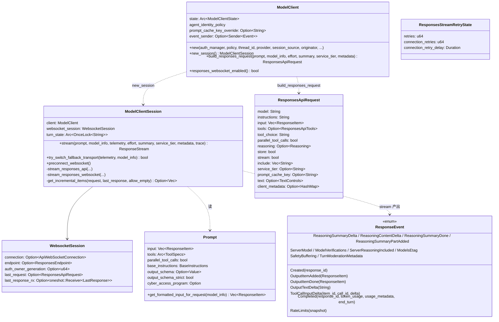
```mermaid
classDiagram
  class ModelClient {
    state: Arc~ModelClientState~
    agent_identity_policy
    prompt_cache_key_override: Option~String~
    event_sender: Option~Sender~Event~~
    +new(auth_manager, policy, thread_id, provider, session_source, originator, ...)
    +new_session() ModelClientSession
    +build_responses_request(prompt, model_info, effort, summary, service_tier, metadata) ResponsesApiRequest
    +responses_websocket_enabled() bool
  }
  class ModelClientSession {
    client: ModelClient
    websocket_session: WebsocketSession
    turn_state: Arc~OnceLock~String~~
    +stream(prompt, model_info, telemetry, effort, summary, service_tier, metadata, trace) ResponseStream
    +try_switch_fallback_transport(telemetry, model_info) bool
    +preconnect_websocket()
    -stream_responses_api(...)
    -stream_responses_websocket(...)
    -get_incremental_items(request, last_response, allow_empty) Option~Vec~
  }
  class WebsocketSession {
    connection: Option~ApiWebSocketConnection~
    endpoint: Option~ResponsesEndpoint~
    auth_owner_generation: Option~u64~
    last_request: Option~ResponsesApiRequest~
    last_response_rx: Option~oneshot::Receiver~LastResponse~~
  }
  class Prompt {
    input: Vec~ResponseItem~
    tools: Arc~ToolSpecs~
    parallel_tool_calls: bool
    base_instructions: BaseInstructions
    output_schema: Option~Value~
    output_schema_strict: bool
    cyber_access_program: Option
    +get_formatted_input_for_request(model_info) Vec~ResponseItem~
  }
  class ResponsesApiRequest {
    model: String
    instructions: String
    input: Vec~ResponseItem~
    tools: Option~ResponsesApiTools~
    tool_choice: String
    parallel_tool_calls: bool
    reasoning: Option~Reasoning~
    store: bool
    stream: bool
    include: Vec~String~
    service_tier: Option~String~
    prompt_cache_key: Option~String~
    text: Option~TextControls~
    client_metadata: Option~HashMap~
  }
  class ResponseEvent {
    <<enum>>
    Created(response_id)
    OutputItemAdded(ResponseItem)
    OutputItemDone(ResponseItem)
    OutputTextDelta(String)
    ToolCallInputDelta(item_id, call_id, delta)
    ReasoningSummaryDelta / ReasoningContentDelta / ReasoningSummaryDone / ReasoningSummaryPartAdded
    Completed(response_id, token_usage, usage_metadata, end_turn)
    RateLimits(snapshot)
    ServerModel / ModelVerifications / ServerReasoningIncluded / ModelsEtag
    SafetyBuffering / TurnModerationMetadata
  }
  class ResponsesStreamRetryState {
    retries: u64
    connection_retries: u64
    connection_retry_delay: Duration
  }
  ModelClient ..> ModelClientSession : new_session
  ModelClientSession --> WebsocketSession
  ModelClientSession ..> Prompt : 读
  ModelClient ..> ResponsesApiRequest : build_responses_request
  ModelClientSession ..> ResponseEvent : stream 产出
```

| 类型 | 作用 |
|---|---|
| `ModelClient` | 会话共用的模型客户端，负责连接模型服务，也能报告认证恢复等状态。 |
| `ModelClientSession` | 由 `run_turn` 创建或接收预热实例，供其中的多次模型请求使用。缓存 WebSocket 状态和 `x-codex-turn-state` 路由 token；源码将其定义为 turn-scoped，不能任意作为会话级对象跨轮复用 |
| `WebsocketSession` | 记住上次请求和响应。如果配置不变，新输入又完整延续了先前内容，就可以只发送新增部分 |
| `Prompt` | 一次请求的数据结构。`tools` 是 `Arc<[ToolSpec]>` 直接指向 `ToolRouter.model_visible_specs` |
| `ResponsesApiRequest` | 真正序列化的请求体，字段见 §7 |
| `ResponseEvent` | provider 流被归一化成的 18 种事件。`Completed.end_turn` 是 `Option<bool>`：`Some(false)` 表示模型明确说"我还没完"，会置 `needs_follow_up` |
| `ResponsesStreamRetryState` | 普通重试计数和连接重试计数分开 |

使用 Responses 接口时，模型客户端会优先尝试已启用的 WebSocket；需要降级时切到 HTTP，后续请求也继续使用 HTTP。

### 请求体的字段从哪来（`build_prompt` + `build_responses_request`）

| 字段 | 来源 | 每步会变吗 |
|---|---|---|
| `model` | 来自本次 `StepContext` 中选定的模型。 | 轮次中途 `Op::TurnSettings` 换模型时下一步变 |
| `instructions` | 会话的基础指令，会根据启用的能力调整内容。Responses lite 模式会把相关内容放进输入消息。 | 不变 |
| `input` | 已经整理好的对话历史，并结合工具调用记录和模型能力调整内容格式。发给其他提供方时会移除不适用的内部字段。 | 每步增长；压缩后整体替换 |
| `tools` | 本次 `ToolRouter` 向模型公开的工具定义。 | 同一轮内只在重新 `capture` 时变（插话提到新 MCP） |
| `tool_choice` | 常量 `"auto"` | 不变 |
| `parallel_tool_calls` | `Prompt.parallel_tool_calls`（`build_prompt` 写死 `true`）且非 lite | 不变 |
| `reasoning` | 本次请求的推理设置，优先采用用户指定值，其次是固定设置和模型默认值。 | 换设置时变 |
| `store` / `stream` | `false` / `true` | 不变 |
| `include` | `["reasoning.encrypted_content"]` | 不变 |
| `service_tier` | `model_info.service_tier_for_request(turn 级 service_tier)` | `TurnStartOptions.service_tier` 只管这一轮 |
| `prompt_cache_key` | `prompt_cache_key(responses_metadata)`：默认线程 id，审查子会话用父线程 id | 不变 |
| `text` | 回答详细程度和结构化输出要求，其中输出格式来自本轮约定的 schema。 | 不变 |
| `client_metadata` | 会话、线程、轮次、触发原因和客户端名称等关联信息。 | 每轮变 |
| 请求头 | 路由、客户端身份和能力标记等信息，其中路由 token 由 `ModelClientSession` 保存。 | 同轮内固定 |

---

## 8. 处理模型响应：流式事件、工具调用与历史记录

模型开始返回数据后，`try_run_sampling_request` 逐个处理 `ResponseEvent`：文本更新发给 UI，完成的消息写入历史，工具调用交给工具执行代码。等工具结果也写入历史后，再返回 `SamplingRequestResult`。

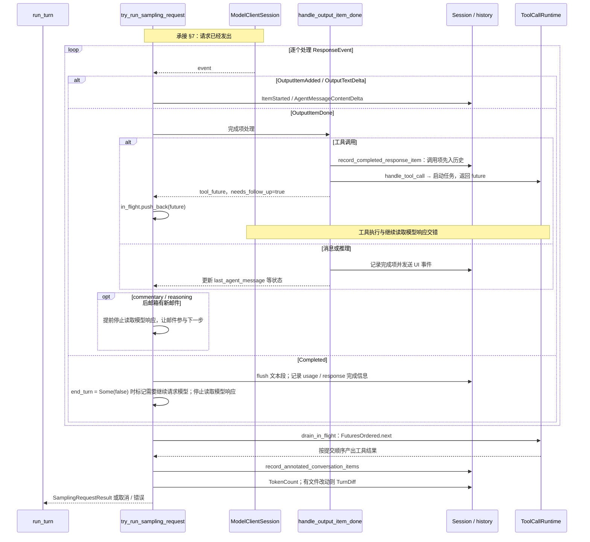
```mermaid
sequenceDiagram
  participant RT as run_turn
  participant SR as try_run_sampling_request
  participant MC as ModelClientSession
  participant HO as handle_output_item_done
  participant S as Session / history
  participant TR as ToolCallRuntime
  Note over SR,MC: 承接 §7：请求已经发出
  loop 逐个处理 ResponseEvent
    MC-->>SR: event
    alt OutputItemAdded / OutputTextDelta
      SR->>S: ItemStarted / AgentMessageContentDelta
    else OutputItemDone
      SR->>HO: 完成项处理
      alt 工具调用
        HO->>S: record_completed_response_item：调用项先入历史
        HO->>TR: handle_tool_call → 启动任务，返回 future
        HO-->>SR: tool_future，needs_follow_up=true
        SR->>SR: in_flight.push_back(future)
        Note over MC,TR: 工具执行与继续读取模型响应交错
      else 消息或推理
        HO->>S: 记录完成项并发送 UI 事件
        HO-->>SR: 更新 last_agent_message 等状态
      end
      opt commentary / reasoning 后邮箱有新邮件
        SR->>SR: 提前停止读取模型响应，让邮件参与下一步
      end
    else Completed
      SR->>S: flush 文本段；记录 usage / response 完成信息
      SR->>SR: end_turn = Some(false) 时标记需要继续请求模型；停止读取模型响应
    end
  end
  SR->>TR: drain_in_flight：FuturesOrdered.next
  TR-->>SR: 按提交顺序产出工具结果
  SR->>S: record_annotated_conversation_items
  SR->>S: TokenCount；有文件改动则 TurnDiff
  SR-->>RT: SamplingRequestResult 或取消 / 错误
```

这里有两个不同的顺序保证。调用项在启动工具前先记入历史，取消后仍能知道模型发起过什么调用；工具任务可以并发完成，但 `FuturesOrdered` 按提交顺序将结果写入历史。不能把 future 入队箭头理解为同步等待，也不能把 `Completed` 理解为工具全部完成。

处理 `OutputItemDone` 后，如果发现邮箱中有新消息，也可能提前停止读取模型响应，让新消息进入下一次请求。因此，退出这个循环不一定是收到了 `Completed`；还需要处理正在运行的工具，并检查任务是否被取消。

### 流事件分别表示什么

| `ResponseEvent` | 作用 |
|---|---|
| `Created` | 记录这次响应的 id，便于关联后续输出和工具调用。 |
| `OutputItemAdded` | 表示模型开始输出一条消息、推理内容或工具调用。客户端可以据此显示正在生成的条目；编辑工具还可以提前展示正在形成的改动。 |
| `OutputTextDelta` | 把新生成的文字逐段送到界面，过程中会处理计划标记等内部格式。 |
| `ToolCallInputDelta` | 补充正在生成的工具参数，例如让文件改动随着生成过程逐步显示。 |
| `ReasoningSummaryDelta` 等推理事件 | 更新界面上的推理说明和分段；具体使用增量还是完整摘要取决于功能设置。 |
| `OutputItemDone` | 一条输出已经完整，可以写入历史。消息会通知界面完成，工具调用则交给执行层处理。如果这时出现需要处理的邮箱消息，也可能提前结束当前响应，转入下一次请求。 |
| `Completed` | 本次模型响应结束，可以汇总用量。但工具可能还没执行完，模型也可能明确要求继续，所以它不代表整个任务结束。 |
| `RateLimits` | 更新服务端的额度和限流信息，随后随用量信息一起通知客户端。 |
| 模型信息、安全状态等事件 | 补充本次请求实际使用的模型和相关状态，供运行时或客户端使用。 |

停止读取模型响应后，还要等待已启动的工具，并按顺序记录结果。随后才汇报 token 用量和文件改动；如果任务被取消，则交给中断流程处理。

---

## 9. 执行工具：查找实现、请求批准与进入沙箱

这里展开上一图的 `ToolCallRuntime`，以 `exec_command` 为例。先看如何找到工具实现并记录结果，再沿 handler 进入审批与进程执行；审批请求和 reply 保留在同一张图中。

```mermaid
sequenceDiagram
  participant SR as try_run_sampling_request
  participant HO as handle_output_item_done
  participant TR as ToolCallRuntime
  participant RG as ToolRegistry
  participant HK as hook_runtime
  participant H as ExecCommandHandler
  participant S as Session
  SR->>HO: OutputItemDone(FunctionCall)
  HO->>HO: ToolRouter::build_tool_call
  HO->>S: 重新打开 mailbox delivery；调用项入历史
  HO->>TR: handle_tool_call(call, child_token)
  HO-->>SR: InFlightFuture + needs_follow_up
  SR->>SR: push_back 到 FuturesOrdered
  Note over TR: 下方在工具任务中执行
  TR->>TR: wait_until_ready；取得并行读锁或独占写锁
  TR->>RG: dispatch_tool_call_with_terminal_outcome
  RG->>RG: 计数；查 runtime；matches_kind
  RG->>HK: run_pre_tool_use_hooks
  break hook 拦截
    HK-->>RG: Blocked(message)
    RG-->>TR: 文本作为工具结果
  end
  RG->>S: notify_tool_start
  RG->>H: handle(invocation) → handle_call
  Note over H: 参数、审批与沙箱见下一张图
  H-->>RG: ToolOutput
  RG->>HK: run_post_tool_use_hooks
  RG->>S: notify_tool_finish
  RG-->>TR: AnyToolResult
  TR-->>SR: future 完成，释放并行门
  SR->>S: drain_in_flight 按提交顺序记录输出
```

### 工具执行时的三个保证

| 规则 | 相关函数 | 说明 |
|---|---|---|
| **工具调用项在执行前就入历史** | `record_completed_response_item` | 即使任务中途被取消，历史中也能看到模型发起过什么调用。后续请求前，会为缺失的结果补上一条合成输出。 |
| **结果按提交顺序写入历史** | `FuturesOrdered` | 工具可以并发执行，但结果仍按模型发起调用的顺序保存，避免完成时间改变对话顺序。 |
| **独占工具不能与其他调用同时执行** | `supports_parallel_tool_calls` | 允许并行的工具可以同时运行，需要独占的工具则等待其他调用结束。例如两个 `exec_command` 可以并发，`apply_patch` 需要独占。 |

### `ToolCallRuntime`

| 字段 / 方法 | 含义 |
|---|---|
| `parallel_execution: Arc<RwLock<()>>` | 协调工具之间的并发：允许并行的调用可以一起执行，需要独占的调用则单独执行。 |
| `handle_tool_call_with_source(call, source, token)` | 启动工具执行，协调就绪等待、并发限制和取消。如果用户中断尚未完成的调用，会向模型记录被中断的结果。 |

### `ToolRegistry` 与 `ToolRouter`

| 方法 | 干什么 |
|---|---|
| `ToolRegistry::add` / `add_with_exposure` | 注册内置工具，默认 `Direct` |
| `register_external` | 注册 MCP 或动态工具；出现重名时拒绝注册并记录冲突，避免调用含义不明确。 |
| `dispatch_any_with_terminal_outcome(invocation, reached)` | 找到对应工具并执行，前后运行工具 hook。执行前的 hook 可以阻止调用或修改参数，找不到工具时则把错误反馈给模型。 |
| `ToolRouter::build_tool_call(item)` | 识别模型输出中需要本地执行的工具调用，提取工具名、参数等信息。普通消息不会进入工具执行流程。 |
| `ToolRouter::model_visible_specs()` | 这一步发给模型的工具清单，`build_prompt` 直接用 |
| `ToolRouter::tool_supports_parallel(call)` | 查询这个工具是否允许并行；无法确认时按不允许处理。 |

`ToolRouter` 汇总内置工具、MCP 工具、扩展和客户端提供的动态工具，为本次请求确定可执行的工具和模型能看到的清单。启用 Code Mode 时，也会准备相应的命名空间。

### 工具接口和调用对象

工具层的类按调用顺序排成一条线，读图时从上往下看：

- **路由**：每一步的 `StepContext` 持有一个 `ToolRouter`，它包着 `ToolRegistry`（名字 → handler）和这一步给模型看的工具清单。
- **调度**：`ToolCallRuntime` 协调一次调用的执行，`ToolRouter` 补齐所需上下文，`ToolRegistry` 找到对应的处理器。
- **执行**：处理器通过 `CoreToolRuntime` 提供具体能力。执行命令或修改文件时，再使用 `ToolOrchestrator` 处理审批、沙箱和重试。

```mermaid
classDiagram
  direction TB
  class ToolCallRuntime {
    parallel_execution: RwLock 并行门
    +handle_tool_call(call, token)
  }
  class ToolRouter {
    registry: ToolRegistry
    model_visible_specs
    +build_tool_call(item) ToolCall
    +dispatch_tool_call(...)
  }
  class ToolRegistry {
    tools: name → RegisteredTool
    +dispatch_any(invocation) AnyToolResult
  }
  class ToolCall {
    tool_name / call_id / payload
  }
  class ToolInvocation {
    session / step_context / payload
    cancellation_token / tracker
  }
  class AnyToolResult {
    +into_response() ResponseItem
  }
  class CoreToolRuntime {
    <<trait>>
    +handle(invocation)
    +pre/post_tool_use_payload()
  }
  class XxxHandler {
    ExecCommandHandler
    ApplyPatchHandler ...
  }
  class ToolOrchestrator {
    +run(tool, req, ctx)
  }
  class ToolRuntime {
    <<trait>>
    UnifiedExecRuntime / ApplyPatchRuntime
    +exec_approval_requirement(req)
  }

  ToolCallRuntime ..> ToolCall : 接收
  ToolCallRuntime --> ToolRouter : dispatch
  ToolRouter *-- ToolRegistry
  ToolRouter ..> ToolInvocation : 造
  ToolRegistry o-- "N" CoreToolRuntime : 按名字查
  ToolRegistry ..> AnyToolResult : 返回
  CoreToolRuntime <|.. XxxHandler
  XxxHandler ..> ToolOrchestrator : 跑命令/改文件时
  ToolOrchestrator ..> ToolRuntime : 审批 + 沙箱 + 重试
```

上面的工具调用图对应 `ToolCallRuntime / ToolRegistry / ToolInvocation`；下面继续展开 handler 进入审批与执行环境后的路径。

### trait 与暴露方式

| 类型 | 作用 |
|---|---|
| `ToolExecutor<Invocation>` | 最小契约：名字、给模型看的 `ToolSpec`、`handle`。`supports_parallel_tool_calls` 默认 `false`；`exec_command` 覆盖为 `true` |
| `CoreToolRuntime` | core 内部扩展：传给 hook 的数据、就绪等待（MCP 工具要等服务器连上）、参数流式 diff。所有 handler 都实现它 |
| `ToolExposure` | 六种。`Direct` 进初始工具清单；`Deferred` 只能靠 `tool_search` 找到；`Hidden` 注册了但模型看不见（比如 hook 专用） |
| `ToolInvocation` | handler 收到的全部参数。`step_context` 是那一步的快照，`tracker` 是这一轮的文件 diff 累加器 |

### 从 handler 到进程：批准后才能执行

```mermaid
sequenceDiagram
  participant H as ExecCommandHandler
  participant PM as UnifiedExecProcessManager
  participant EP as ExecPolicyManager
  participant S as Session / TurnState
  participant U as 客户端
  participant SB as executor / sandbox
  H->>H: parse_arguments；resolve_tool_environment；权限参数
  H->>PM: exec_command → open_session_with_sandbox
  PM->>EP: create_exec_approval_requirement_for_shell
  EP-->>PM: Skip / NeedsApproval / Forbidden
  break Forbidden
    PM-->>H: 拒绝执行
  end
  opt NeedsApproval
    PM->>S: request_command_approval
    S->>S: pending_approvals[call_id] = oneshot sender
    S-->>U: ExecApprovalRequest
    U->>S: Op::ExecApproval
    S->>S: notify_approval；Abort 走中断路径
    S-->>PM: ReviewDecision
    break Denied / Abort
      PM-->>H: 拒绝或中断
    end
  end
  PM->>SB: 按环境、权限和 SandboxType 启动进程
  SB-->>PM: 输出、退出码或 SandboxDenied
  PM-->>H: ExecCommandToolOutput（可带 process_id）
  Note over H: 回到上一图的 ToolOutput → hooks → future → 历史
```

### 审批：谁决定要不要问

判定在 `default_exec_approval_requirement`，输入是审批策略和文件系统沙箱策略：

| `AskForApproval` | 命令要求提权（`with_escalated_permissions`）| 结果 |
|---|---|---|
| `Never` | 任意 | `Skip`（不问；`Forbidden` 只在命令明确要求绕过沙箱时） |
| `OnRequest` / `Granular` | 是 | `NeedsApproval` |
| `OnRequest` / `Granular` | 否 | `Skip`，先在沙箱里跑 |
| `UnlessTrusted` | 任意 | `NeedsApproval`（除非 execpolicy 规则说 `Allow`） |

命令会先匹配已有的执行规则：明确允许的可以直接执行，明确禁止的会被拒绝，要求询问的则进入审批。没有匹配规则时，再按上表中的默认策略决定。部分允许规则还会指定是否绕过沙箱。

需要审批时，`request_command_approval` 会把请求发给客户端，并让这次工具调用等待用户答复。系统通过请求 id 把决定送回正确的等待方。用户可以批准、拒绝或中断任务；选择本会话内批准后，同样的命令在这个会话中不必再次询问。

`apply_patch` 同样先检查审批要求，再尝试执行。如果因沙箱权限被拒绝，且策略允许放宽权限，会再次请求用户批准后重试。

### 沙箱：走哪个

沙箱类型由权限配置、平台和执行需求共同决定，可能使用 macOS Seatbelt、Linux Seccomp 或 Windows 受限令牌。执行服务按选定的限制启动进程；完全访问模式或明确允许绕过沙箱的规则可以不启用沙箱。

远程执行环境（`environment.is_remote()`）不在本机起沙箱，权限以 URI 形式发给远端 executor 自己执行。

### `ToolOrchestrator` 与 `ExecApprovalRequirement`

`ToolOrchestrator` 把审批、沙箱选择和受权限限制后的重试放在一起，让需要执行命令或改文件的工具共用这套处理。

`apply_patch` 的处理器直接使用它；`exec_command` 则在进程管理器准备执行环境时使用它。工具可以提供自己的审批要求，没有时使用默认策略。最终的决定由 `ExecApprovalRequirement` 表示：直接执行、先问用户，或拒绝执行。

### 工具结果怎么回到模型

工具结果会转换成对话中的工具输出，并通过 `call_id` 对应到模型之前的调用。结果写入历史后，下一次请求就能让模型看到它，并继续回答或调用其他工具。

过长的输出会按预算截断，历史元数据会记录当时采用的限制。能否继续读取完整输出取决于工具保留的进程或资源句柄，`chunk_id` 本身不能作为通用的原文读取接口。

### 三种"工具没跑成"的文案

| 情况 | 来源 | 模型看到什么 |
|---|---|---|
| 模型调了不存在的工具 | `unsupported_tool_call_message` | 一条说明工具不存在的工具输出 |
| hook 拦截 | `PreToolUseHookResult::Blocked(message)` | hook 给的文本作为输出 |
| 被中断 | `aborted_response(call, secs)` | "aborted by user after N seconds" |

### 内置工具清单

| 工具名 | 注册条件 |
|---|---|
| `exec_command` + `write_stdin` | `Feature::ShellTool` 且 `Feature::UnifiedExec`；关掉 UnifiedExec 就只有一次性的 `exec_command` |
| `apply_patch` | 模型的 `apply_patch_tool_type` 非空 |
| `update_plan` | `config.update_plan_enabled` |
| `request_user_input` / `request_user_input_async` / `send_message_to_user_async` | 实验开关 + 非子 agent |
| `request_permissions` | `Feature::RequestPermissionsTool` |
| `new_context_window` / `get_context_remaining` | `Feature::TokenBudget` |
| `current_time` / `sleep` | `Feature::CurrentTimeReminder` / `Feature::SleepTool` |
| `view_image` | `Feature::ViewImage` |
| `list_mcp_resources` / `read_mcp_resource` 等 | 有 MCP 资源 |
| `spawn_agent` / `send_message` / `wait_agent` / `list_agents` / `interrupt_agent` / `followup_task` | `collab_tools_enabled` |
| `tool_search` | 有 `Deferred` 工具时在 `finalize_tool_router` 里自动加 |
| `code_mode` / `code_mode_wait`（名字见 `codex_code_mode::PUBLIC_TOOL_NAME`） | `ToolMode::CodeMode` |

---

## 10. 继续执行还是结束：模型请求、循环与任务

`SamplingRequestResult` 返回后，`run_turn` 先判断是否还要请求模型；它返回后，`RegularTask` 再判断是否还有输入要处理；任务结束后，Session 才清理当前轮次。下图把这三处判断放在一起，注意每个 `continue` 回到的位置。

```mermaid
sequenceDiagram
  participant RT as run_turn
  participant IQ as InputQueue
  participant CP as run_auto_compact
  participant HK as Stop hooks
  participant RG as RegularTask
  participant S as Session::on_task_finished
  Note over RT: 模型响应和这次调用的工具均已处理完
  RT->>IQ: model_needs_follow_up 时重新允许当前轮次接收邮箱消息
  RT->>RT: can_drain=true；drain_async_hook_results
  RT->>IQ: has_pending_input
  RT->>RT: context_window_token_status；计算 needs_follow_up
  alt 需要继续执行，且达到压缩阈值或明确要求新窗口
    RT->>CP: run_auto_compact(MidTurn)
    CP-->>RT: 成功后更新 can_drain，continue
  else 需要继续执行
    RT->>RT: continue，回到 §7
  else 不需要继续执行
    RT->>HK: run_turn_stop_hooks
    alt hook 阻止结束并提供输入
      HK-->>RT: should_block + 文本
      RT->>RT: 输入入历史，continue
    else 可以结束
      RT->>RT: 按 hook 结果收尾，退出内层
      RT-->>RG: last_agent_message
    end
  end
  RG->>IQ: has_pending_input（外层复查）
  alt 有输入且没有 terminal_error
    RG->>RG: 空输入再次 run_turn（§6）
  else 任务返回且 token 未取消
    RG->>S: spawn 闭包先 flush，再 on_task_finished
    S->>S: task.take + handle.detach
    S->>IQ: take_pending_input_for_turn_state
    S->>S: 剩余输入经 hook 写入历史；计算用量
    S->>S: TurnComplete / TurnAborted；条件满足时清 active_turn
    S->>S: flush；maybe_start_turn_for_pending_work
  end
```

`needs_follow_up` 为真，表示模型还需要继续，或者队列里还有输入。它为假时，也要经过 Stop hook 才能结束。`run_turn` 返回后，`RegularTask` 会再检查一次队列；任务结束后，`on_task_finished` 处理剩余输入、发送轮次结束事件，再检查邮箱中是否有消息需要启动新任务。

清理 `active_turn` 还要检查 task 是否为空、turn_state 是否仍是同一个对象，避免旧轮次收尾误清掉后来登记的状态。已被取消的任务由中断路径处理，不能把这张正常完成图当作所有退出情况的统一顺序。

### 这些控制函数分别属于哪一层

| 函数 | 干什么 | 谁调它 |
|---|---|---|
| `run_turn` | 处理一批输入，准备上下文，并持续请求模型、执行工具，直到暂时没有后续工作或无法继续。 | `RegularTask::run` |
| `run_hooks_and_record_inputs` | 先让输入相关的 hook 检查消息，再把接受的内容写入历史；如果输入全部被拦截，就停止本次处理。 | `run_turn` 三处、`on_task_finished` |
| `run_pre_sampling_compact` | 在处理新输入前检查是否需要整理历史，兼顾模型切换和上下文长度限制。 | `run_turn` |
| `run_auto_compact` | 根据功能设置和模型服务的能力，选择窗口切换、远程压缩或本地总结。 | `run_pre_sampling_compact`、内层循环两处 |
| `build_prompt` | 汇总本次请求的历史、工具和指令（§7）。 | `run_sampling_request` |
| `run_sampling_request` | 负责一次请求及其重试，遇到临时错误时等待后再试，无法重试时把错误交回上层。 | 内层循环 |
| `try_run_sampling_request` | 发起一次实际请求，处理流式输出和工具调用，等待工具结果记录完成。 | `run_sampling_request` |
| `drain_in_flight` | 等待已经启动的工具，并按提交顺序保存结果。 | `try_run_sampling_request` |
| `built_tools` | 汇总本次可用的工具及其定义，建立查找和执行工具的入口。 | `capture_step_context_inner` |
| `handle_output_item_done` | 处理一条完整输出：保存消息并通知界面，或启动工具执行；无法解析的工具调用会得到错误结果。 | `try_run_sampling_request` |

### 内层循环每一圈做什么

每次请求模型前，循环会先接收允许处理的新输入，并让输入相关的 hook 检查它们。随后准备本次配置和工具清单，把时间、工作目录等变化补充进历史，再整理出模型可以接收的消息列表。

`can_drain_pending_input` 决定这一圈是否从队列取出插话。如果本次 `run_turn` 已经带了用户输入，第一圈先处理这批输入，模型请求完成后才允许取队列里的新消息；压缩后也可能暂时关闭读取，让模型先接着处理整理后的上下文。这样不会把原始输入、执行期间的插话和压缩后的续接内容混成同一次准备步骤。

模型响应和工具结果记录完成后，主要看三个问题：

- **还有内容需要模型处理吗？** 工具调用需要后续回答、模型明确要求继续，或者又有新输入到达，都会促成下一次请求。
- **上下文还放得下吗？** 如果需要继续，但上下文已达到阈值或明确要求换窗口，就先压缩或切换窗口，再继续执行。
- **现在可以结束吗？** 没有后续工作时，还会运行 Stop hook。Hook 可以补充要求，让模型再处理一轮；允许结束后，`run_turn` 才返回。

错误也会影响这个决定。用户中断会直接结束执行；部分上下文超限场景可以压缩后继续；其他无法继续的错误会通知客户端，结束这次执行，让用户之后仍能继续对话。

### `on_task_finished`

`on_task_finished` 负责一轮任务结束后的收尾。它会记录执行结果和本轮用量，保存还没来得及处理的插话，并向客户端报告任务完成或中断。保存这些插话不代表模型已经处理过它们，它们会留在历史里供后续执行使用。

随后清理当前任务状态并保存历史。清理前会确认状态仍属于这一轮，避免旧任务的收尾误删新任务。最后再看邮箱中是否有要求自动启动任务的消息；如果有，就接着开始下一轮。

---

## 11. 执行期间的新输入：插话、邮箱与中断

这一节回到 §4 的 Steered 分支。用户输入和 agent 邮箱有不同的存储与接收边界，下面分别看输入进入、邮箱开关和取消传播。

```mermaid
sequenceDiagram
  participant U as 用户
  participant CT as CodexThread
  participant L as submission_loop
  participant S as Session
  participant TS as TurnState.pending_input
  participant RT as run_turn（正在跑）

  Note over RT: 第 N 步正在等模型
  U->>CT: start_or_steer_turn("再加个测试")
  CT->>L: Op::TurnInput { mode: StartOrSteer }
  L->>S: steer_input(input, expected_turn_id = None)
  S->>S: active_turn 非空、任务是 Regular、输入非空、schema 一致
  S->>TS: extend_pending_input_and_accept_mailbox_delivery_for_turn_state([UserInput{acceptance_order}])
  S-->>L: Ok(turn_id)
  L-->>CT: Steered { turn_id }
  Note over RT: 第 N 步结束（模型有工具调用 → needs_follow_up）
  RT->>S: input_queue.get_pending_input(active_turn)
  S->>TS: split_off(0) 取走全部
  S-->>RT: [UserInput]
  RT->>RT: run_hooks_and_record_inputs → 入历史 + ItemCompleted(UserMessage)
  RT->>S: 重新 capture_step_context（插话可能 @ 了新服务器）
  RT->>RT: 第 N+1 步：历史里已包含插话

  Note over RT: 另一种：模型已回完文本，needs_follow_up = false
  RT->>S: has_pending_input → true（插话在模型回答期间到达）
  RT->>RT: needs_follow_up = true → continue，插话进下一步

  U->>CT: submit(Op::Interrupt)
  L->>S: interrupt_task → abort_all_tasks(Interrupted)
  S->>S: take_active_turn；task.cancellation_token.cancel()
  S->>S: handle_task_abort：task.abort()；等任务观察到取消
  S-->>U: TurnAborted { reason: Interrupted }
  S->>TS: clear_pending（清 waiters 和待处理输入）
  S->>S: maybe_start_turn_for_pending_work（邮箱有 trigger_turn 邮件就自动启动新轮次）
```

### `InputQueue`

`InputQueue` 提供插话和邮箱的读写方法。插话存在 `TurnState.pending_input`（轮次级），邮箱存在自己的 `mailbox_pending_mails`（会话级）。

| 方法 | 干什么 | 谁调它 |
|---|---|---|
| `extend_pending_input_for_turn_state(turn_state, items)` | 追加到轮次的待处理输入 | `steer_input`、`start_task` |
| `extend_pending_input_and_accept_mailbox_delivery_for_turn_state` | 追加，并重新允许当前轮次接收邮箱消息（`CurrentTurn`） | `steer_input` |
| `get_pending_input(active_turn)` | **取走**轮次待处理输入 + 取出邮箱中所有待处理消息（当前轮次允许接收时才取，见 §11）。返回 `(items, start_options)` | `run_turn` 每步开头 |
| `has_pending_input(active_turn)` | 有没有东西可取 | `RegularTask::run` 外层循环、`run_turn` |
| `drain_mailbox_input_items()` | 集中取出邮箱消息，并汇总自动启动下一轮所需的参数；只有消息的父轮次一致时才保留该关联。 | `get_pending_input`、`start_task` |
| `clear_pending(active_turn)` | 清理待处理输入，并结束仍在等待答复的请求。 | `abort_all_tasks` |
| `enqueue_mailbox_communication(...)` | 别的 agent 投递 | `Op::InterAgentCommunication` |

### 插话和 pi-mono 的差别

| | pi-mono | codex |
|---|---|---|
| 队列在哪 | `Agent.steeringQueue` / `followUpQueue`（内存数组） | `TurnState.pending_input`（轮次级）+ `InputQueue.mailbox_pending_mails`（会话级） |
| 两种语义 | steer（本轮）/ followUp（下一轮） | 只有一种：**都进当前轮**。`has_pending_input` 让外层循环在模型停下后再跑一轮，效果等于 followUp |
| 取的时机 | 轮次开头 `prepareNextTurn` 后 | 每步开头，但 `can_drain_pending_input` 在"这轮刚开始有新输入"和"刚压缩完"时为 `false`，先把新输入发给模型 |
| 一次取几条 | `one-at-a-time` 默认一条 | 一次取出当前可处理的全部输入 |
| 竞态处理 | 无 | `Steer { expected_turn_id }` 不匹配拒绝；`StartIfIdle` 先预留轮次，再准备上下文 |
| 排队消息的 UI 呈现 | 文本匹配 | `acceptance_order` 单调序号 + `ItemCompleted(UserMessage)` 事件 |

### 子 agent 的消息什么时候能插进来（`MailboxDeliveryPhase`）

**场景**：主 agent 用 `spawn_agent` 派出几个子 agent 并行干活。子 agent 干完或者有进展时，会给主 agent 发一条消息，放进会话级的"邮箱"。主 agent 每一步开头调 `get_pending_input` 时，会把用户插话和邮箱里的消息一起取走，拼进下一次请求。

**问题**：子 agent 的消息什么时候到是说不准的。设想主 agent 已经把最终答案输出给用户了，这时一条子 agent 消息才到。如果照常取走，`has_pending_input` 会返回 `true`，外层循环以为还有活，就会让模型再跑一步，于是用户看到答案后面又冒出一段内容。

**解法**：在 `TurnState` 上加一个开关，记录"这一轮还收不收邮件"。它就是 `MailboxDeliveryPhase`（`state/turn.rs:51`）。名字直译是"邮件投递阶段"，其实只有两个值：

- `CurrentTurn`：收。邮件可以并进这一轮。
- `NextTurn`：不收。邮件先留在邮箱里，等下一轮再处理。

**开关什么时候拨**：

| 时机 | 拨到 | 代码 |
|---|---|---|
| 新一轮开始 | 收（默认值） | `#[default] CurrentTurn` |
| 模型输出了一段给用户看的最终答案（`assistant` 消息、不是 `Commentary` 过程说明、文本非空） | 不收 | `handle_output_item_done` → `defer_mailbox_delivery_to_next_turn`（`input_queue.rs:213`） |
| 模型接着又发了工具调用，或者用户插话 | 收 | `handle_output_item_done`、`steer_input` → `accept_mailbox_delivery_for_current_turn` |

有一个例外：拨到"不收"之前会先看 `pending_input` 里有没有用户插话、工具输出，或者要求开新一轮（`trigger_turn`）的邮件。只要有，就不拨，因为这些是这一轮必须接着处理的。

**"不收"具体是什么效果**：留给下一轮的邮件不会被取出，也不会被算成本轮的待处理输入，因此不会仅仅因为晚到的邮件而继续请求模型。

**被留下的邮件去哪了**：一直留在 `mailbox_pending_mails` 里，有两条出路：

- 用户下次发消息开新一轮时，`start_task` 先把邮箱里的邮件取出来并进这一轮（§5）。
- 如果邮件带 `trigger_turn = true`，会话一空闲，`maybe_start_turn_for_pending_work`（`tasks/mod.rs:427`）就自动开一轮去处理它，不用等用户。

### 中断的传播路径

用户发出中断后，`Session::interrupt_task` 会取消当前任务，通知客户端，并清理这轮尚未处理的输入和等待中的审批等请求。启用了 Code Mode 时，也会中断正在执行的 V8 cell。

取消信号从任务一路传给 `run_turn`、模型请求和工具调用。因此，中断不必等工具正常执行完毕；工具调度层会尝试终止尚未完成的执行。

之后可以通过 `RecoverTurn` 沿用已有历史继续处理，不必再添加一条用户消息。若中断留下了只有调用、没有结果的工具记录，历史整理阶段会补上合成结果，让后续模型请求能够读取这段历史。

---

## 12. 重试与压缩：回到请求，还是回到下一步

请求过程中有两种看起来都像“再试一次”的情况，但回退位置不同。临时网络错误仍留在 `run_sampling_request` 内，等候或切换传输方式后再发同一次请求；模型已经完成这一步、但后续输入即将超过窗口时，则由 `run_turn` 压缩历史，再进入下一步。

```mermaid
sequenceDiagram
  participant RT as run_turn 内层循环
  participant SR as run_sampling_request
  participant RS as responses_retry
  participant MC as ModelClientSession
  participant CW as context_window_token_status
  participant AC as run_auto_compact
  participant S as Session

  alt try_run_sampling_request 返回可重试错误
    SR->>RS: handle_retryable_response_stream_error(...)
    alt ConnectionFailed 且允许持续重连
      RS->>RS: 等待；连接重试单独计数
    else 普通重试次数还没用完
      RS->>RS: 按服务端建议或本地退避等待
    else WebSocket 可降级
      RS->>MC: try_switch_fallback_transport → HTTP
    else 所有机会都已用完
      RS-->>SR: Err，并记录 ExhaustedResponseRetry
    end
    RS-->>SR: 可以继续时，回到请求循环
  else 上下文超限 / 用量限制 / 其他不可重试错误
    SR->>S: 按错误类型更新 token 或 rate limit 状态
    SR-->>RT: Err，退出请求循环
  end
  opt 请求成功，而且还有后续输入要处理
    SR-->>RT: SamplingRequestResult
    RT->>CW: context_window_token_status(sess, turn_context)
    CW-->>RT: 当前窗口是否达到压缩阈值
    alt needs_follow_up 且 token_limit_reached
      RT->>AC: run_auto_compact(..., ContextLimit, MidTurn)
      AC->>S: replace_compacted_history；重新计算 token 用量
      AC-->>RT: 从下一步继续
    end
  end
```

### 错误分类控制哪一层重试

`CodexErrorDetails` 的 `is_retryable()` 列出不可重试的错误，其余错误才进入重试策略。`TurnAborted`、`ContextWindowExceeded`、`UsageLimitReached`、`Sandbox`、`Fatal` 等不能按普通流错误退避重试。`run_sampling_request` 还会单独处理窗口溢出与用量限制，记录状态后将错误交回 `run_turn`。

这里的分界不是“有没有报错”，而是谁有能力修复当前状态：连接问题由请求层重连；历史过长只有 `run_turn` 改写 `ContextManager` 后才能继续。

### 重试

| 项 | 值 |
|---|---|
| 最大重试 | provider 配置 `stream_max_retries`，默认 5，硬上限 100 |
| 退避 | `200ms × 2^(n-1)`，乘 0.9~1.1 抖动；服务端给了 `retry_delay` 就用它 |
| 连接失败 | `Feature::UnboundedConnectionRetries` 开着且是 `ConnectionFailed`：5s 起翻倍，60s 封顶，**不计入 max_retries** |
| WebSocket 降级 | WebSocket 的普通重试耗尽后，还可以切到 HTTP，再按重试额度尝试。 |
| 不重试的错误 | 中断、权限拒绝等无法靠重连解决的问题会交回上层；上下文超限和用量限制也不会作为普通网络错误重试。 |
| 重试请求体 | 按当前历史重新准备内容，并移除失败响应的关联 id。 |
| 用尽后 | 记录这轮重试已经耗尽及其时间，供后续处理判断。 |

正式构建中，第一次 WebSocket 重试不会向用户报告流错误，避免短暂重连打断使用体验。

### 什么时候需要压缩

Codex 会结合最近一次响应报告的 token 用量、模型的上下文窗口大小和配置的压缩阈值，判断历史是否太长。某些配置只统计固定前缀之后的内容，token 预算模式还可以预留缓冲；无论如何，完整上下文窗口的上限也会参与判断。

检查发生在两个时点：

| 时机 | 为什么检查 | 压缩后怎么继续 |
|---|---|---|
| 处理本轮输入之前 | 已有历史可能太长；切换模型时，也可能需要先按原模型的方式整理历史。 | 之后再加入本轮输入，并补齐初始上下文。 |
| 模型响应和工具执行完成之后 | 新增的输出可能让历史达到阈值，而模型还有工作要继续。 | 在整理后的历史中补回必要的上下文，再发起下一次请求。 |

请求前的检查尚未计入即将加入的新输入，因此一次很长的新消息仍可能让压缩后的请求超出窗口。

### 三种压缩方式（`run_auto_compact`）

| 路径 | 条件 | 做什么 |
|---|---|---|
| token 预算 | `Feature::TokenBudget` | 开新上下文窗口而不是总结 |
| 远程 v2 | `provider.capabilities().remote_compaction == V2` | 发一个压缩请求让服务端返回 `Compaction` 项；保留最近的 agent 消息（最多 10000 token，`MAX_RETAINED_AGENT_MESSAGE_TOKENS`）；失败可用回退模型再试一次 |
| 本地 | 其它 provider | 见下 |

本地压缩由 `run_compact_task_inner_impl` 负责。它会暂时让模型专心总结已有对话，这次请求不提供工具。如果历史太长，连总结请求都放不下，就从较早的内容开始删减后再试。

得到摘要后，Codex 会用保留下来的用户消息和这份摘要替换原历史，再补回必要的初始上下文、更新 token 用量，并把压缩结果写入 rollout。用户消息也有长度限制，因此压缩后的历史不能视为原对话的完整副本。

客户端会收到压缩开始和完成的通知，以及多次压缩可能降低准确度的提醒。手动压缩也使用同一套压缩方式，前后分别运行 `PreCompact` 和 `PostCompact` hook。

---

## 13. 持久化与恢复：历史如何进入 rollout

前面多次出现“入历史”和“写 rollout”，两者的完成时点需要分开看。以下时序以事件写入为入口：append 提交给 writer，不代表文件已完成 flush。

### 一次写盘的完整路径

```mermaid
sequenceDiagram
  participant S as Session
  participant LT as LiveThread（thread-store）
  participant RR as RolloutRecorder
  participant W as writer 任务
  participant F as rollout-<ts>-<thread>.jsonl
  participant DB as state_db（SQLite）

  S->>S: send_event(tc, msg) → send_event_raw_with_persistence(event, persist = true)
  S->>S: persist_rollout_items([RolloutItem::EventMsg(msg)])
  S->>LT: live_thread.append_items(items)
  LT->>RR: record_canonical_items(items)
  RR->>W: tx.send(RolloutCmd::AddItems(items))（缓冲，不等落盘）
  S->>S: deliver_event_raw → tx_event.send(event)
  Note over S: 历史条目同理：record_prepared_conversation_items → persist_rollout_items([ResponseItem(envelope)])
  Note over W: 攒着，直到：
  S->>LT: flush_rollout（任务结束时 start_task 闭包里、on_task_finished 末尾）
  LT->>RR: flush() → RolloutCmd::Flush { ack }
  RR->>W: 写文件，失败关掉句柄重开再试一次
  W->>F: 每个 RolloutItem 一行 JSON（RolloutLine { timestamp, type, payload }）
  W->>DB: 更新线程索引（标题、更新时间、token 用量）
  W-->>RR: ack
```

| 环节 | 相关函数 | 说明 |
|---|---|---|
| 什么会写 | `send_event_raw_with_persistence`（事件）、`record_prepared_conversation_items`（历史条目）、上下文 diff（`TurnContext` / `WorldState`）、`replace_compacted_history`（`Compacted`） | 12 种 `RolloutItem` 里最常见的是 `EventMsg` 和 `ResponseItem`。**事件默认也写**，所以 rollout 也承载客户端历史重建所需的事件；具体记录仍受 persist 策略控制 |
| 延迟创建 | `ensure_rollout_materialized(persist_context)` | 第一条用户消息进入历史时才真正创建文件，启动阶段的通知不必立即创建历史文件。 |
| 写入是异步的 | `record_canonical_items` / `flush` | 提交记录后，由后台写入器处理；需要确认缓冲内容写出时会等待 flush，任务结束时也会做这一步。 |
| 文件名 | — | `rollout-{timestamp}-{thread_id}.jsonl`，在 `~/.codex/sessions/` 下按日期分目录 |
| 写锁 | — | 同一个 rollout 同时只能有一个 writer，TUI 显示 "This thread is open elsewhere" 就是它 |
| SQLite | `state` crate | 线程列表、标题、排序用；rollout 文件仍是事实来源 |

### RolloutItem 与恢复基线

rollout 是每个线程在磁盘上的一个 JSONL 文件（`~/.codex/sessions/` 下），每行一个 `RolloutItem`。Session 运行时往里写：历史条目、每轮的 `TurnContext` 设置快照、token 用量、压缩结果，以及发给客户端的事件（§13）。

读 rollout 的有两处：

- **core 恢复线程**：`thread/resume` 时 `ThreadManager::resume_thread_from_rollout` 读文件，用其中的 `ResponseItem` / `Compacted` / `TurnContext` 重建 `ContextManager`，模型接着之前的上下文继续（§13）；
- **app-server 返回历史给客户端**：用 `ThreadHistoryBuilder` 把 rollout 里的条目（主要是 `EventMsg`）重放成 `Turn` 列表，放进响应里。

所以 rollout 里同时存了两类数据：`ResponseItem` 是给模型恢复上下文用的，`EventMsg` 是给 UI 恢复界面用的。


```mermaid
classDiagram
  class RolloutItem {
    <<enum 一行 JSONL 一个>>
    SessionMeta(SessionMetaLine)
    ResponseItem(ResponseItemEnvelope)
    InterAgentCommunication(...)
    InterAgentCommunicationMetadata(trigger_turn)
    Compacted(CompactedItem)
    TurnContext(TurnContextItem)
    TokenUsageRecord(TokenUsageRecord)
    WorldState(WorldStateItem)
    SecurityRiskScore(...)
    RetainedContext(RetainedContextEvent)
    EventMsg(EventMsg)
    RealtimeItem(RealtimeItem)
  }
  class TurnContextItem {
    turn_id: Option~String~
    root_turn_id: Option~String~
    cwd: AbsolutePathBuf
    workspace_roots: Option~Vec~
    current_date / timezone
    approval_policy: AskForApproval
    sandbox_policy: SandboxPolicy
    permission_profile: Option~PermissionProfile~
    model / effort / summary
    cyber_access_program
  }
  RolloutItem --> TurnContextItem
```

| 类型 | 作用 |
|---|---|
| `RolloutItem` | 12 种。**`EventMsg` 也是一种**：发给客户端的每个事件默认都写进 rollout（由 `persist` 参数控制）。`TurnContext` 每个真实用户轮写一条，是恢复时的"设置基线"。 |
| `TurnContextItem` | 一轮的有效设置快照。§6 讲它怎么被拿来 diff。 |

### 客户端怎么拿到历史和实时更新

启动时 `SessionConfigured.initial_messages` 带上恢复的历史事件；之后全靠 `next_event`。app-server 把 `Event` 转成 `ServerNotification`（`ItemStarted` / `ItemCompleted` / `*Delta` / `TurnCompleted`）。TUI 不直接读 rollout 文件。

### 崩溃恢复：从 rollout 重建

恢复线程时，`ThreadManager::resume_thread_from_rollout` 会读取已保存的内容，并重新创建会话。恢复的重点是找回模型接下来需要的对话历史、有效设置和 token 用量。

如果历史经过压缩，就以压缩后的内容为基础，再接上后续消息。最近保存的设置则作为下一轮的比较基线，避免重复注入没有变化的上下文。若记录表明任务被中断，客户端可以选择 `RecoverTurn` 继续执行。

恢复依赖 rollout 中已经记录的内容，不会重新执行过去的操作，也不会恢复原任务的内存栈或工具进程。后续执行是在重建的会话上重新开始的。

### worker 交接：`SuspendTurnAndShutdown`

`SuspendTurnAndShutdown` 用于把仍未完成的任务交给另一个 worker。当前 worker 先暂停根轮次，保存历史并关闭写入器，但不把任务记成已经完成或中断。只有确认交接准备成功，原 worker 才能退出；另一个 worker 随后恢复会话并继续处理。

这条路径提供了进程间交接能力；仅凭本地源码，不能确认托管服务实际如何部署和使用它。
