## 1. 包与源码目录

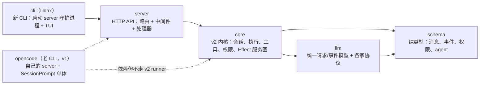
```mermaid
graph LR
  CLI["cli（lildax）<br/>新 CLI：启动 server 守护进程 + TUI"] --> SRV
  SRV["server<br/>HTTP API：路由 + 中间件 + 处理器"] --> CORE
  CORE["core<br/>v2 内核：会话、执行、工具、权限、Effect 服务图"] --> LLM
  CORE --> SCHEMA
  LLM["llm<br/>统一请求/事件模型 + 各家协议"] --> SCHEMA
  SCHEMA["schema<br/>纯类型：消息、事件、权限、agent"]
  OLD["opencode（老 CLI，v1）<br/>自己的 server + SessionPrompt 单体"] -.依赖但不走 v2 runner.-> CORE
  OLD -.-> SRV
```

| 包 | 目录 | 行数 | 干什么 |
|---|---|---|---|
| `@opencode-ai/core` | `core/src` | 32961 | v2 内核。会话门面、执行器、runner、工具、权限、事件总线、Effect 服务图 |
| `@opencode-ai/server` | `server/src` | 小 | 把 core 的服务挂成 HTTP API。`routes.ts` 是装配点 |
| `@opencode-ai/cli` | `cli/src` | 69 行入口 | 新 CLI，二进制名 `lildax`。`serve` 起 server，默认命令起 TUI 连 server |
| `@opencode-ai/llm` | `llm/src` | 2684 | `LLMRequest` / `LLMEvent` / `Message` 统一模型，8 种协议，13 家 provider |
| `@opencode-ai/schema` | `schema/src` | 2561 | 纯类型定义。`SessionMessage`、会话事件、权限规则、agent 信息都在这 |
| `opencode`（老包） | `opencode/src` | 76082 | v1 实现。它有自己的 HTTP server 和 1631 行的 `SessionPrompt`。 |

---

## 2. 先看执行边界

本文分析 OpenCode v2 的本地执行路径：HTTP 输入怎样持久化并唤醒 runner，runner 怎样准备一次请求、消费模型事件、并发执行工具，再根据收尾结果继续或退出。源码路径均相对于仓库的 `packages/`。旧 `opencode` 包的 v1 `SessionPrompt` 不在这条执行链上。

先看控制流的嵌套关系。`drain` 是 coordinator 安排的一次执行；其中 `run` 可以消费多条输入；一次 `runTurn` 又可能因压缩重新进入 attempt。上下文超限后的压缩重试只有一次机会，第二次再超就直接失败，详见 §9。

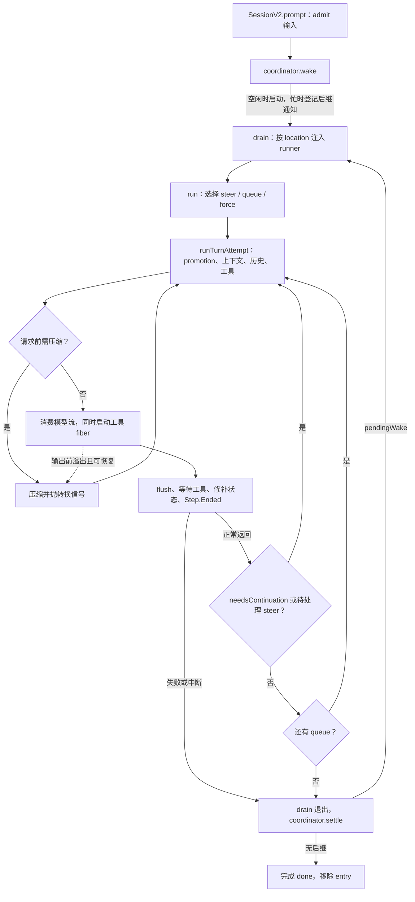
```mermaid
flowchart TD
  P["SessionV2.prompt：admit 输入"] --> W["coordinator.wake"]
  W -->|空闲时启动，忙时登记后继通知| D["drain：按 location 注入 runner"]
  D --> R["run：选择 steer / queue / force"]
  R --> A["runTurnAttempt：promotion、上下文、历史、工具"]
  A --> C{"请求前需压缩？"}
  C -->|是| X["压缩并抛转换信号"]
  X --> A
  C -->|否| M["消费模型流，同时启动工具 fiber"]
  M --> S["flush、等待工具、修补状态、Step.Ended"]
  S -->|正常返回| N{"needsContinuation 或待处理 steer？"}
  N -->|是| A
  N -->|否| Q{"还有 queue？"}
  Q -->|是| A
  S -->|失败或中断| E
  Q -->|否| E["drain 退出，coordinator.settle"]
  E -->|pendingWake| D
  E -->|无后继| I["完成 done，移除 entry"]
  M -.->|输出前溢出且可恢复| X
```

正文从一次 `prompt` 进入已有会话开始。§3–§4 解释调度，§5–§8 展开一次 attempt，§9–§10 处理压缩与持久化，最后在 §11 回看服务如何装配。图后的对象说明只展开当前阶段涉及的状态和方法。

---

## 3. 输入接收：从 prompt 到后台 drain

本段从 HTTP handler 进入，到 local execution 调用 runner 为止。先沿时序确认输入、通知和后台执行的关系，再看幂等与并发边界。

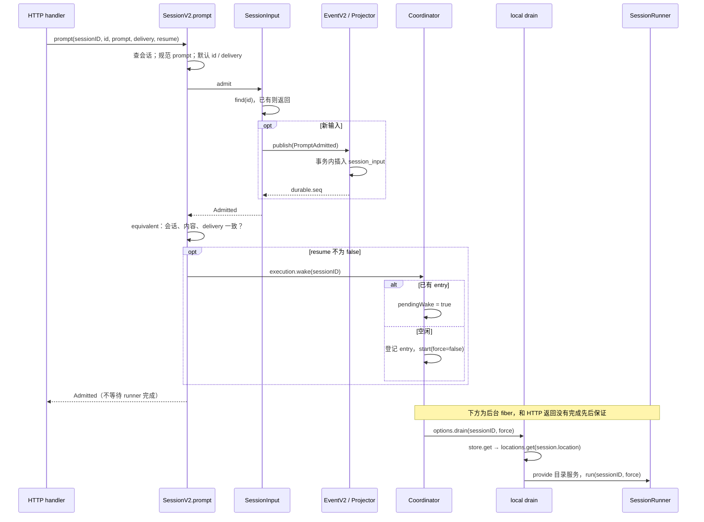
```mermaid
sequenceDiagram
  participant H as HTTP handler
  participant S as SessionV2.prompt
  participant IN as SessionInput
  participant EV as EventV2 / Projector
  participant CO as Coordinator
  participant EX as local drain
  participant RN as SessionRunner
  H->>S: prompt(sessionID, id, prompt, delivery, resume)
  S->>S: 查会话；规范 prompt；默认 id / delivery
  S->>IN: admit
  IN->>IN: find(id)，已有则返回
  opt 新输入
    IN->>EV: publish(PromptAdmitted)
    EV->>EV: 事务内插入 session_input
    EV-->>IN: durable.seq
  end
  IN-->>S: Admitted
  S->>S: equivalent：会话、内容、delivery 一致？
  opt resume 不为 false
    S->>CO: execution.wake(sessionID)
    alt 已有 entry
      CO->>CO: pendingWake = true
    else 空闲
      CO->>CO: 登记 entry，start(force=false)
    end
  end
  S-->>H: Admitted（不等待 runner 完成）
  Note over CO,RN: 下方为后台 fiber，和 HTTP 返回没有完成先后保证
  CO->>EX: options.drain(sessionID, force)
  EX->>EX: store.get → locations.get(session.location)
  EX->>RN: provide 目录服务，run(sessionID, force)
```

### 接收和取出执行，为什么是两个阶段

`prompt` 的关键路径如下，省略会话查询、附件解析和错误类型转换，保留操作顺序：

```ts
// core/src/session.ts，节选并省略外围定义
Effect.uninterruptible(
  Effect.gen(function* () {
    const admitted = yield* SessionInput.admit(db, events, {
      id: messageID,
      sessionID: input.sessionID,
      prompt,
      delivery,
    })
    if (!SessionInput.equivalent(admitted, expected))
      return yield* new PromptConflictError({ sessionID: input.sessionID, messageID })
    if (input.resume !== false) yield* execution.wake(admitted.sessionID)
    return admitted
  }),
)
```

`admit` 发布 `PromptAdmitted`，它的投影向 `session_input` 插入记录。记录里有两个序号：`admitted_seq` 表示接收事件的位置，`promoted_seq` 起初为空，表示尚未被取出执行。`SessionInput.hasPending` 就是按会话、`delivery` 和 `promoted_seq IS NULL` 查询。

直到 runner 发布 `Prompted`，投影才更新 `promoted_seq`，并向 `session_message` 写入 user 消息。这两个更新与持久化事件提交处于同一事务中。因此不会提交出“输入已标记为取出，但对应 user 消息没有写入”的半成品状态。

| 阶段 | `session_input` | 对话历史 | 谁推进 |
|---|---|---|---|
| `PromptAdmitted` | 新增记录，`promoted_seq` 为空 | 尚未新增 user 消息 | `SessionV2.prompt` |
| `Prompted` | 填入 `promoted_seq` | 新增 user 消息 | runner 中的 promotion |

这个拆分让输入接收不依赖 runner 当前是否空闲，也让 `steer` 和 `queue` 可以在不同执行边界进入历史。这里的“取出”只表示输入已进入历史，**不表示模型已经处理完成**；不能用 `promoted_seq` 判断一次用户任务是否成功。

`resume: false` 会跳过这次提交的 `wake`，但输入仍然入库。它并不是暂停会话的开关：如果 runner 已经在运行，后续查询仍可能取到这条输入。

### 重复提交靠 id 和内容校验共同处理

`admit` 先按输入 id 查询：已有记录就返回；没有才发布接收事件。投影插入使用 `onConflictDoNothing()`，没有插入成功则产生 `LifecycleConflict`。`admit` 在发布发生 defect 后会再次查询同一个 id；若记录已经存在，就返回它，否则重新抛出原 defect。这覆盖了两个请求最初都没查到记录、随后竞争插入的情况。

但“id 已存在”还不足以判定重试成功。回到 `prompt` 后，`equivalent` 继续比较 `sessionID`、`delivery` 和编码后的 prompt 内容；同 id 不同内容会返回 `PromptConflictError`，不会覆盖原输入。这个保证依赖客户端重用同一个 id：未提供 id 时，入口每次都会生成新的 message id。

重复提交且内容一致时，仍会走到 `wake`。所以第一次请求即使已经接收输入、客户端却没收到响应，重发也能再次通知执行器检查工作。

最外层的 `Effect.uninterruptible` 保护接收、校验和唤醒这段操作，避免 Effect 取消恰好落在持久化完成与唤醒之间。它不把数据库和内存调度变成一个事务，也不提供进程崩溃后的自动唤醒保证；崩溃恢复要另看 §10。

### 本段涉及的输入结构

```ts
// schema/src/session-input.ts 中 Admitted 的字段摘要
// 省略品牌类型和 Schema 声明；序号来自持久化事件。
type Admitted = {
  id: MessageID
  sessionID: SessionID
  prompt: Prompt
  delivery: "steer" | "queue"
  admittedSeq: number
  promotedSeq?: number
  timeCreated: DateTime
}
```

`Prompt` 保存规范化的 `text`、`files` 和 `agents`。`SessionV2` 负责输入规范化、幂等校验和调用执行接口；`SessionInput` 负责输入生命周期；`SessionExecutionLocal` 负责 location 路由。它们都不持有一份需要和数据库同步的 prompt 内存队列。

### `wake` 如何保证同一会话不会启动两个 runner

`SessionExecutionLocal` 在进程级服务中创建一个 coordinator，以 `sessionID` 为 key。它提供的 `drain(sessionID, force)` 每次先读取会话当前的 location，再通过 `locations.get(session.location)` 注入对应目录服务，最后调用 `runner.run({ sessionID, force })`。

因此，目录服务的选择由 local execution 完成；同一会话的执行串行化由 coordinator 完成。`runTurnAttempt` 还会校验会话的 location 是否仍匹配当前 runner，不匹配就中断。这套内存 coordinator 的串行保证限定在当前实例内，不是跨进程分布式锁。

Coordinator 的核心状态只有一张 `Map<Key, Entry>`：

```ts
// core/src/session/run-coordinator.ts
type Entry<E> = {
  readonly done: Deferred.Deferred<void, E>
  owner?: Fiber.Fiber<void, never>
  pendingWake: boolean
  stopping: boolean
}
```

`owner` 是执行 fiber，`done` 是调用方等待的完成信号，另外两个字段控制后继执行和中断。看 `wake` 就能理解为什么这里不需要为每次输入创建一个任务：

```ts
const wake = (key: Key) =>
  Effect.sync(() => {
    const entry = active.get(key)
    if (entry !== undefined) {
      entry.pendingWake = true
      return
    }

    const next = makeEntry()
    active.set(key, next)
    start(key, next, false)
  })
```

查询和修改 Map 在同一个同步回调中完成，没有 Effect 挂起点。空闲时先登记 entry 再启动 fiber；已有 entry 时只设置 `pendingWake`。连续到来的多次 wake 会合并成一个布尔标记。

合并不会丢掉输入数量，因为输入本身已经存在数据库中。这个标记只表达“当前执行期间又收到过工作通知，结束时需要再检查”，不携带 prompt，也不决定取出哪条输入。

### Runner 已经检查队列，为什么还需要 `pendingWake`

考虑 runner 即将退出时的一次交错：

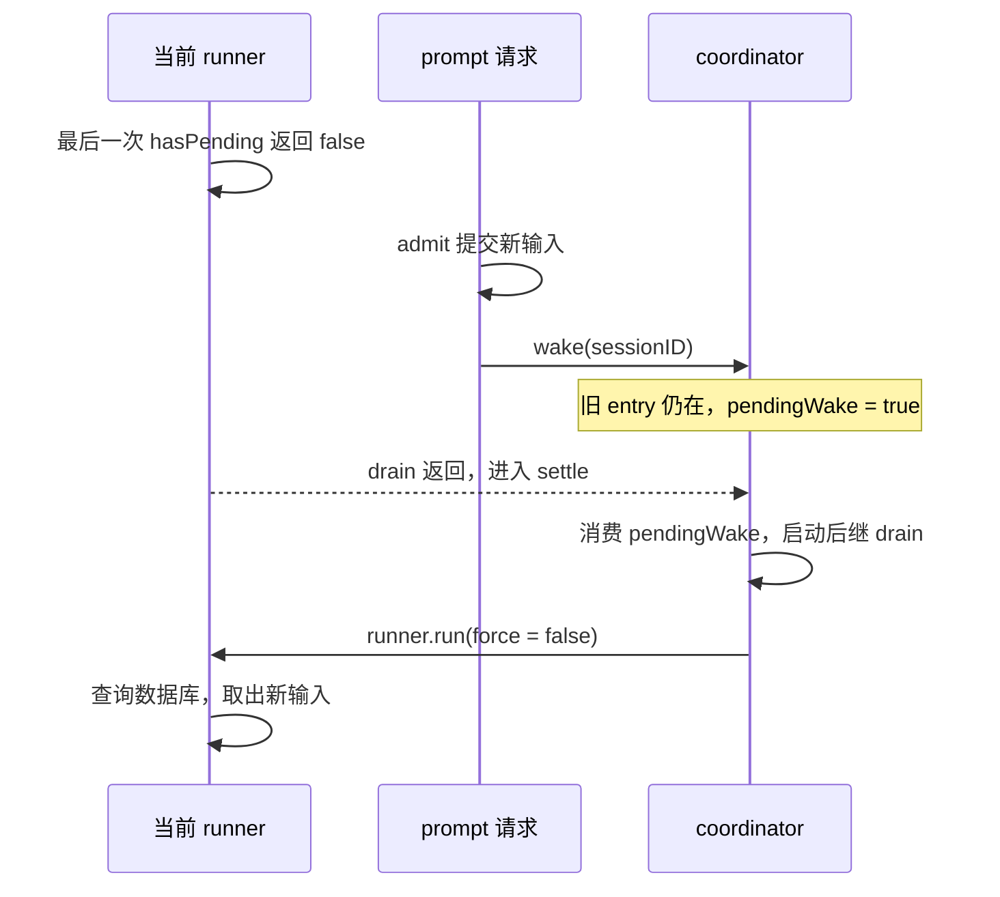
```mermaid
sequenceDiagram
  participant R as 当前 runner
  participant P as prompt 请求
  participant C as coordinator
  R->>R: 最后一次 hasPending 返回 false
  P->>P: admit 提交新输入
  P->>C: wake(sessionID)
  Note over C: 旧 entry 仍在，pendingWake = true
  R-->>C: drain 返回，进入 settle
  C->>C: 消费 pendingWake，启动后继 drain
  C->>R: runner.run(force = false)
  R->>R: 查询数据库，取出新输入
```

如果已有执行时直接忽略 wake，这条输入可能落在 runner 最后一次查询之后，当前执行又已经决定退出。`pendingWake` 将这次通知保留到 `settle`，补上退出边界上的检查。

反过来，如果输入到达得更早，当前 runner 已经取走了它，`pendingWake` 仍可能为真。后继 drain 会多检查一次数据库，但不会因此多调用一次模型：wake 启动的执行使用 `force = false`，runner 在没有待处理 steer 或 queue 时直接返回。

所以两层检查承担不同职责：runner 的 `hasPending` 决定当前循环是否继续；coordinator 的 `pendingWake` 保证执行交接时收到的通知不会被已有 entry 吞掉。

### 正常结束、失败和中断，怎样交接等待者

`settle` 不能一律“删 entry、唤醒等待者、再启动下一次”。它区分了当前执行的退出结果：

```ts
// core/src/session/run-coordinator.ts，settle 的关键分支
if (Exit.isSuccess(exit) && !entry.stopping && entry.pendingWake) {
  entry.pendingWake = false
  start(key, entry, false, true)
  return
}

const successor = entry.pendingWake ? makeEntry() : undefined
if (successor === undefined) active.delete(key)
else {
  active.set(key, successor)
  start(key, successor, false, true)
}
Deferred.doneUnsafe(entry.done, exit)
```

正常结束且有 pending wake 时，后继 drain 复用同一个 entry，暂不完成 `done`。正在等待这个 entry 的调用方，会继续等后继检查结束。若执行失败或处于 stopping 状态，则原 entry 的 `done` 以原退出结果完成；尚有新 wake 时，另建 entry 承接它，避免把原执行的失败隐藏到后继成功之中。

这里也解释了 `resume` 与 `wake` 的差别：local execution 将 `resume` 映射到 coordinator 的 `run`。`run` 在空闲时以 `force = true` 启动执行；已有执行时加入同一个 `done` 等待，不设置 `pendingWake`。若 entry 正在 stopping，则等待它退出后再调用 `run`。`wake` 则只登记通知，不等待执行完成。

`run` 用 `uninterruptibleMask` 保护创建和登记 entry，并通过 `restore` 允许取消对 `done` 的等待。执行 fiber 由 coordinator 的 `FiberSet` 持有，因此取消一个等待者不会同时取消共享执行；显式中断要走 `interrupt`。

`interrupt` 会先置 `stopping = true`、清掉已有 `pendingWake`，再中断 owner 并等待清理。清理期间若又收到新的 wake，它会重新置位；`settle` 随后创建后继 entry。这区分了中断前积累的通知与中断过程中到达的新通知，但清除通知并不会删除数据库中的输入。

后继 `start` 还会先经过 `Effect.yieldNow`，避免同步完成、同步自唤醒的 drain 在 `settle` 中不断递归启动。仓库的 `core/test/session-run-coordinator.test.ts` 分别覆盖了 wake 合并、失败时的后继执行、中断清理期间的新 wake，以及同步自唤醒；这些是阅读上述分支时可以对照的具体场景。

---

## 4. Runner 循环

上一段以 `runner.run({ sessionID, force })` 为出口。这个接口没有 prompt 参数：runner 从数据库查询待处理输入，`promotion` 决定下一次 attempt 取哪一类输入。下面用 A、B、C 三条输入观察两个循环的边界。

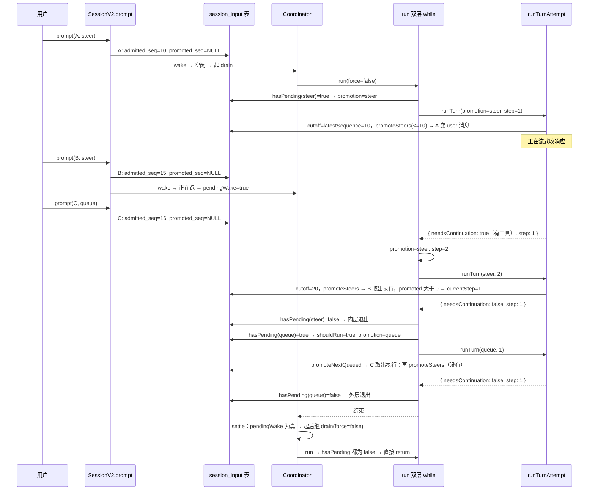
```mermaid
sequenceDiagram
  participant U as 用户
  participant SV as SessionV2.prompt
  participant DB as session_input 表
  participant CO as Coordinator
  participant RN as run 双层 while
  participant RT as runTurnAttempt

  U->>SV: prompt(A, steer)
  SV->>DB: A: admitted_seq=10, promoted_seq=NULL
  SV->>CO: wake → 空闲 → 起 drain
  CO->>RN: run(force=false)
  RN->>DB: hasPending(steer)=true → promotion=steer
  RN->>RT: runTurn(promotion=steer, step=1)
  RT->>DB: cutoff=latestSequence=10，promoteSteers(<=10) → A 变 user 消息
  Note over RT: 正在流式收响应
  U->>SV: prompt(B, steer)
  SV->>DB: B: admitted_seq=15, promoted_seq=NULL
  SV->>CO: wake → 正在跑 → pendingWake=true
  U->>SV: prompt(C, queue)
  SV->>DB: C: admitted_seq=16, promoted_seq=NULL
  RT-->>RN: { needsContinuation: true（有工具）, step: 1 }
  RN->>RN: promotion=steer, step=2
  RN->>RT: runTurn(steer, 2)
  RT->>DB: cutoff=20，promoteSteers → B 取出执行，promoted 大于 0 → currentStep=1
  RT-->>RN: { needsContinuation: false, step: 1 }
  RN->>DB: hasPending(steer)=false → 内层退出
  RN->>DB: hasPending(queue)=true → shouldRun=true, promotion=queue
  RN->>RT: runTurn(queue, 1)
  RT->>DB: promoteNextQueued → C 取出执行；再 promoteSteers（没有）
  RT-->>RN: { needsContinuation: false, step: 1 }
  RN->>DB: hasPending(queue)=false → 外层退出
  RN-->>CO: 结束
  CO->>CO: settle：pendingWake 为真 → 起后继 drain(force=false)
  CO->>RN: run → hasPending 都为 false → 直接 return
```
### 这一段的执行对象：SessionRunner

`SessionRunner` 从已经记录的历史出发，把待处理的输入跑完。对外接口只有一个方法 `run({ sessionID, force })`，不接收消息参数。

错误类型写在方法签名里（`index.ts`）：`RunError = LLMError | ModelError | MessageDecodeError | ContextSnapshotDecodeError | InitializationBlocked | ToolOutputStore.Error`。
少处理一种，编译就会报错。

字段（构造 layer 时取，`llm.ts`）：13 个服务加一个 `compaction` 对象。其中 `location` 是这个 runner 绑定的目录，后面用来检查会话是不是还在这个目录下。

内部主要函数：

| 函数 | 干什么 | 谁调它 |
|---|---|---|
| `run(input)` | 用双层循环把待处理输入跑完，详见 §4 | `SessionExecutionLocal.drain` |
| `runTurn(sessionID, promotion, step)` | 调 `runTurnAttempt` 并传入 `compaction.compactAfterOverflow` 作为溢出恢复函数；捕获 `TurnTransitionError`：压缩后重来一次 `runTurn`，溢出压缩后转 `runAfterOverflowCompaction` | `run` |
| `runAfterOverflowCompaction(...)` | 和 `runTurn` 一样但不传溢出恢复函数。再溢出就 die："Post-compaction provider attempt cannot recover another overflow" | `runTurn` |
| `runTurnAttempt(sessionID, promotion, step, recoverOverflow?)` | 完成一次 attempt：请求准备见 §5，流消费见 §6，收尾见 §8 | 上面两个 |
| `failInterruptedTools(sessionID)` | 遍历上下文里所有 assistant 的 tool 项，`pending` 或 `running` 的发 `Tool.Failed`，文案 "Tool execution interrupted" | `run` 开头 |
| `loadSystemContext(agent)` | 并发加载三个上下文源（注册表、技能引导、引用引导），`SystemContext.combine` | `runTurnAttempt` |
| `isUserDeclined(cause)` | 失败原因里有 `PermissionV2.DeclinedError` 或 `QuestionV2.RejectedError` 就算用户拒绝 | `runTurnAttempt` |

### `run`

```ts
const hasSteer = yield* SessionInput.hasPending(db, sessionID, "steer")
const hasQueue = hasSteer ? false : yield* SessionInput.hasPending(db, sessionID, "queue")  // 有 steer 就不看 queue
if (!input.force && !hasSteer && !hasQueue) return                                // wake 来的且没活 → 走人
yield* failInterruptedTools(input.sessionID)                                      // §10
let promotion = hasSteer ? "steer" : hasQueue ? "queue" : undefined
let shouldRun = input.force || hasSteer || hasQueue
while (shouldRun) {                                                               // 外层：queue
  let needsContinuation = true
  let step = 1
  while (needsContinuation) {                                                     // 内层：工具续接 + steer
    const result = yield* runTurn(sessionID, promotion, step)
    needsContinuation = result.needsContinuation
    step = result.step + 1                                                        // 注意 result.step 可能被重置成 1
    promotion = "steer"                                                           // 第二轮起只取出执行 steer
    if (!needsContinuation) needsContinuation = yield* hasPending(db, sessionID, "steer")   // 没工具了？看看有没有插话
  }
  shouldRun = yield* hasPending(db, sessionID, "queue")                           // 内层退出 → 看 queue
  promotion = shouldRun ? "queue" : undefined
}
```

### 与 pi-mono 对照

| pi-mono `runLoop` | opencode `run` | 差别 |
|---|---|---|
| `while (true)` | `while (shouldRun)` | pi 靠内部 break；opencode 靠查库 |
| `while (hasMoreToolCalls \|\| pending.length)` | `while (needsContinuation)` | 同构 |
| `pendingMessages = config.getSteeringMessages()` | `hasPending(db, "steer")` + 下轮 `promoteSteers` | 内存回调 → SQL 查询 |
| `followUp = config.getFollowUpMessages()` | `hasPending(db, "queue")` + `promoteNextQueued` | 同上 |
| steer 队列 `one-at-a-time` 或 `all` | steer 全部取出执行（cutoff 之前的），queue 一次一条 | opencode 没有模式开关 |
| `prepareNextTurn` 在轮次开头 | 取出执行 → 比对系统上下文 → 读历史，都在 `runTurnAttempt` 开头 | 同一位置 |

两边的循环结构基本一致，区别在于数据来源：pi 读内存，opencode 查数据库。这样换来了崩溃恢复和多进程运行的可能，但每轮至少要多跑五次 SQL。

`promotion` 在每次 attempt 返回后都变成 `steer`，因此工具续接期间可以接入插话，但不会顺手取走下一条 queue。只有内层结束，外层才检查 queue。取出新输入后 `currentStep` 重置为 1，所以循环里的 `step + 1` 必须基于 attempt 返回的 step。

`runTurnAttempt` 先读取 `latestSequence` 作为 cutoff，`promoteSteers` 只取 `admitted_seq <= cutoff` 的输入。`promoteNextQueued` 则不接收 cutoff，按接收序号取最早一条未处理 queue。这是两种取输入策略，不能理解成同一批快照。

这一段的出口是 `runTurn(sessionID, promotion, step)`。下一段展开其中一次 attempt；压缩导致的重入在 §9 展开。

---

## 5. runTurnAttempt：把输入、上下文和工具组装成请求

进入本段时，runner 已选定 promotion 与 step；离开时得到请求、工具执行入口和本次 publisher，或者通过压缩信号退出并重入。

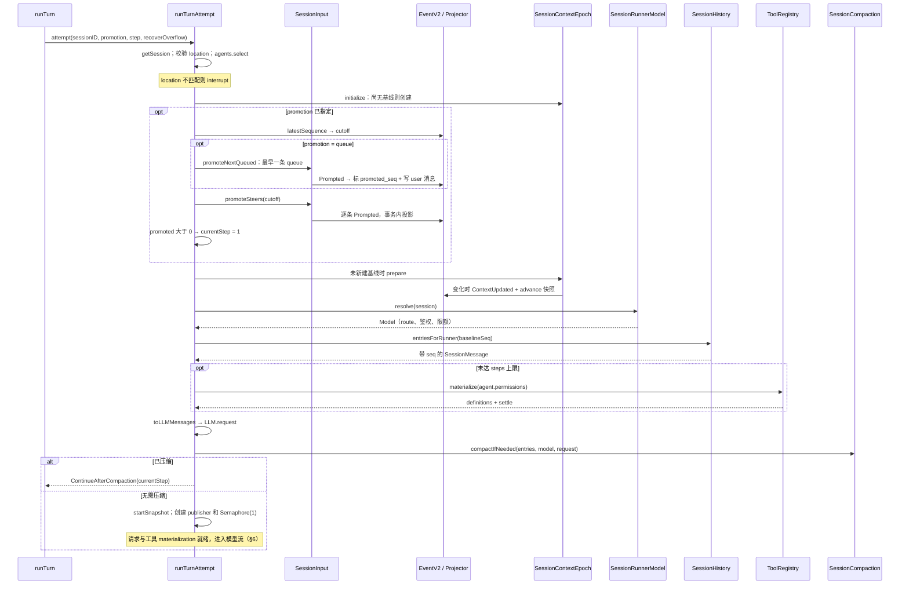
```mermaid
sequenceDiagram
  participant RN as runTurn
  participant RT as runTurnAttempt
  participant IN as SessionInput
  participant EV as EventV2 / Projector
  participant CE as SessionContextEpoch
  participant MO as SessionRunnerModel
  participant HI as SessionHistory
  participant TR as ToolRegistry
  participant CP as SessionCompaction
  RN->>RT: attempt(sessionID, promotion, step, recoverOverflow)
  RT->>RT: getSession；校验 location；agents.select
  Note over RT: location 不匹配则 interrupt
  RT->>CE: initialize：尚无基线则创建
  opt promotion 已指定
    RT->>EV: latestSequence → cutoff
    opt promotion = queue
      RT->>IN: promoteNextQueued：最早一条 queue
      IN->>EV: Prompted → 标 promoted_seq + 写 user 消息
    end
    RT->>IN: promoteSteers(cutoff)
    IN->>EV: 逐条 Prompted，事务内投影
    RT->>RT: promoted 大于 0 → currentStep = 1
  end
  RT->>CE: 未新建基线时 prepare
  CE->>EV: 变化时 ContextUpdated + advance 快照
  RT->>MO: resolve(session)
  MO-->>RT: Model（route、鉴权、限额）
  RT->>HI: entriesForRunner(baselineSeq)
  HI-->>RT: 带 seq 的 SessionMessage
  opt 未达 steps 上限
    RT->>TR: materialize(agent.permissions)
    TR-->>RT: definitions + settle
  end
  RT->>RT: toLLMMessages → LLM.request
  RT->>CP: compactIfNeeded(entries, model, request)
  alt 已压缩
    RT-->>RN: ContinueAfterCompaction(currentStep)
  else 无需压缩
    RT->>RT: startSnapshot；创建 publisher 和 Semaphore(1)
    Note over RT: 请求与工具 materialization 就绪，进入模型流（§6）
  end
```

图里有三处顺序不能乱。先 `initialize` 再 promotion：上下文初始化失败的话，输入还留在库里没取出，下次能重试。先 promotion 再读历史：这样本轮请求能看到刚取出的 user 消息。压缩判定放最后：token 预算要把 system、历史消息、工具定义加在一起算，请求拼好才能估。

另外注意 `materialize` 一次产出两样东西：给模型看的工具定义（definitions）和真正执行用的 `settle`，是同一份快照。到步数上限时会跳过这步。§6 收到本地 tool-call 时，就用这份 `settle` 执行。

### Context Epoch：存什么，如何跨 attempt 更新

每次请求模型，除了 agent 自身的指令，还需要提供工作目录、当前日期、`AGENTS.md`、可用技能等系统上下文。这些内容可能在会话进行中变化。opencode 用 Context Epoch 管理它们：先生成一份完整的系统上下文文本，后续变化通过追加消息告知模型，压缩后再重新生成完整文本。

这里的 **epoch 可以理解为“共用同一份系统上下文基线的一段时期”**。一次 attempt 是一次模型请求尝试；多个 attempt 可以使用同一个 epoch，只有建立新基线才进入新的阶段。`SessionContextEpoch` 是管理这份状态的服务。

#### 一个 epoch 实际存什么

`session_context_epoch` 表为每个会话保存一行当前状态：

| 字段 | 保存的数据 | 用途 |
|---|---|---|
| `session_id` | 所属会话的 ID | 找到这个会话的当前 epoch |
| `baseline` | 各系统上下文源渲染后拼成的完整文本 | 发给模型，作为这一阶段稳定的系统上下文前缀 |
| `snapshot` | 按上下文源的 key 保存的结构化快照，例如环境字段、日期、指令内容和技能清单对应的数据 | 留给程序逐源比对变化，不直接发给模型 |
| `baseline_seq` | 当前基线的序号边界；压缩后替换基线时设为 `compaction.seq` | 读取历史时，只保留此边界之后的 system 更新消息，避免重复携带已被新基线覆盖的更新 |

**`baseline` 是这一阶段固定的文本，`snapshot` 是最近一次已接受的上下文状态。** 后续发生变化时，快照会向前更新，基线仍保持原样。变化对应的文本另存为消息历史中的 `system` 消息，不是追加到这张表的 `baseline` 字段里。

这张表只负责系统上下文；用户消息、模型回复、工具结果存放在消息历史中。agent 自己的 `system` 指令也单独放在 baseline 前面，不属于这里的快照。

#### 用日期变化走一遍

下面只展示日期这个源，文字是概念示意，不是实际序列化格式。实际基线和快照还包含其他上下文源。

| 时点 | `baseline` 中的日期文本 | `snapshot` 中记录的日期 | 消息历史中的变化 |
|---|---|---|---|
| 首次请求，9 月 19 日 | 今天是 9 月 19 日 | 9 月 19 日 | 无需追加更新 |
| 下一次 attempt，日期没变 | 保持不变 | 9 月 19 日 | 无需追加更新 |
| 跨天后的 attempt | 仍然是“今天是 9 月 19 日” | 更新为 9 月 20 日 | 追加一条 system 消息：“当前日期已变为 9 月 20 日” |
| 再下一次 attempt，日期没变 | 保持不变 | 9 月 20 日 | 与更新后的快照比较，不会重复追加日期更新 |
| 压缩后成功重建基线 | 新基线写“今天是 9 月 20 日” | 9 月 20 日 | 更新 `baseline_seq`，已被新基线覆盖的旧 system 更新不再带入请求 |

跨天但尚未重建基线时，模型会同时读到旧基线和后面的日期更新；程序则用已经更新到 9 月 20 日的快照判断下一次是否有变化。**固定的是基线，不是模型能获知的上下文，也不是用于比对的快照。**

这样设计是为了保持请求前缀稳定，增加 provider 复用 prompt cache 的机会；实际缓存命中仍取决于 provider。压缩后的基线替换则把当前系统上下文重新渲染成完整文本，开始下一个 epoch。

#### 每次 attempt 如何准备这份状态

回到本段请求准备图中的 `initialize / prepare`：首次初始化会生成基线和快照；后续 attempt 根据是否出现新压缩，选择替换基线或比对变化。

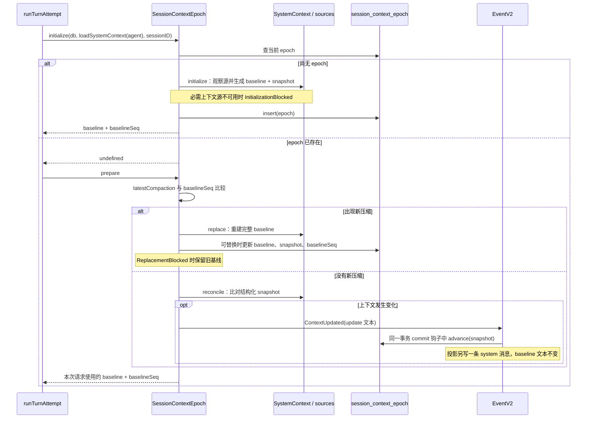
```mermaid
sequenceDiagram
  participant RT as runTurnAttempt
  participant EP as SessionContextEpoch
  participant SC as SystemContext / sources
  participant DB as session_context_epoch
  participant EV as EventV2
  RT->>EP: initialize(db, loadSystemContext(agent), sessionID)
  EP->>DB: 查当前 epoch
  alt 尚无 epoch
    EP->>SC: initialize：观察源并生成 baseline + snapshot
    Note over EP,SC: 必需上下文源不可用时 InitializationBlocked
    EP->>DB: insert(epoch)
    EP-->>RT: baseline + baselineSeq
  else epoch 已存在
    EP-->>RT: undefined
    RT->>EP: prepare
    EP->>EP: latestCompaction 与 baselineSeq 比较
    alt 出现新压缩
      EP->>SC: replace：重建完整 baseline
      EP->>DB: 可替换时更新 baseline、snapshot、baselineSeq
      Note over EP: ReplacementBlocked 时保留旧基线
    else 没有新压缩
      EP->>SC: reconcile：比对结构化 snapshot
      opt 上下文发生变化
        EP->>EV: ContextUpdated(update 文本)
        EV->>DB: 同一事务 commit 钩子中 advance(snapshot)
        Note over EV: 投影另写一条 system 消息，baseline 文本不变
      end
    end
    EP-->>RT: 本次请求使用的 baseline + baselineSeq
  end
```

`runTurnAttempt` 每次 attempt 处理系统上下文的逻辑：

| 情况 | 代码 | 结果 |
|---|---|---|
| 首次初始化 | `initialize`（`context-epoch.ts`） | 观察全部源，任一 `unavailable` 抛 `InitializationBlocked`（排空失败，输入留在库里可重试）。否则渲染 `baseline`，插表 |
| 后续 attempt，没新压缩 | `prepare` → `reconcile`（`system-context/index.ts`） | 逐源比对快照。没变 → 用旧基线。变了 → 拼 `update` 文案发 `ContextUpdated`（投影成 `system` 消息），并在同一事务 `advance` 快照。某个源不可用 → 保留旧值 |
| 后续 attempt，有新压缩 | `prepare` → `replace` | 重新渲染完整基线，`baseline_seq = compaction.seq`。有源不可用 → `ReplacementBlocked`，用旧基线 |

#### 系统上下文的数据从哪里来

`SystemContext` 把多个上下文源组合起来。每个源通过 `load` 读取结构化数据，通过 `baseline` 渲染完整文本，通过 `update` / `removed` 渲染变化说明。因此，同一份源数据可以用于生成模型可读的文本，也可以保存到快照供程序比对。

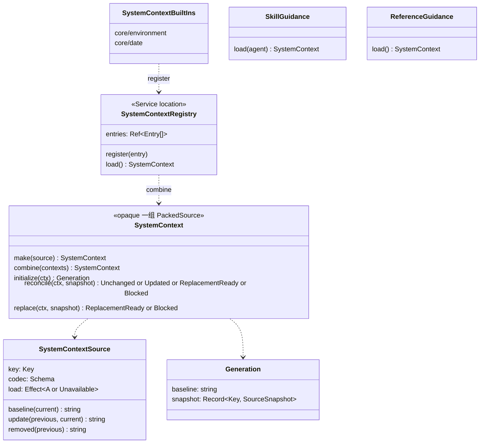
```mermaid
classDiagram
  class SystemContextSource {
    key: Key
    codec: Schema
    load: Effect~A or Unavailable~
    baseline(current) string
    update(previous, current) string
    removed(previous) string
  }
  class SystemContext {
    <<opaque 一组 PackedSource>>
    make(source) SystemContext
    combine(contexts) SystemContext
    initialize(ctx) Generation
    reconcile(ctx, snapshot) Unchanged or Updated or ReplacementReady or Blocked
    replace(ctx, snapshot) ReplacementReady or Blocked
  }
  class Generation {
    baseline: string
    snapshot: Record~Key, SourceSnapshot~
  }
  class SystemContextRegistry {
    <<Service location>>
    entries: Ref~Entry[]~
    register(entry)
    load() SystemContext
  }
  class SystemContextBuiltIns {
    core/environment
    core/date
  }
  class SkillGuidance {
    load(agent) SystemContext
  }
  class ReferenceGuidance {
    load() SystemContext
  }
  SystemContext ..> SystemContextSource
  SystemContext ..> Generation
  SystemContextRegistry ..> SystemContext : combine
  SystemContextBuiltIns ..> SystemContextRegistry : register
```

| 谁 | 文件 | 提供什么 |
|---|---|---|
| `SystemContextBuiltIns` | `core/src/system-context/builtins.ts` | 两个源：`core/environment`（`<env>` 块：工作目录、项目根、是否 git、平台）和 `core/date`（今天日期）。`baseline` 文案 "Here is some useful information about the environment you are running in:"，`update` 文案 "The environment you are running in is now:" |
| `InstructionContext` | `core/src/instruction-context.ts` | 全局和向上查找的 `AGENTS.md`（builtins 依赖它） |
| `SkillGuidance` | `core/src/skill/guidance.ts` | 当前 agent 有权限的技能清单，`<available_skills>` 块。按 agent 算，所以在 runner 里和注册表的源合并（`llm.ts`） |
| `ReferenceGuidance` | `core/src/reference/guidance.ts` | 引用引导 |

### SessionContextEpoch 的读写入口

`SessionContextEpoch` 管理 `session_context_epoch` 表，上图对应的入口如下。

| 函数 | 干什么 |
|---|---|
| `initialize(db, context, sessionID)` | 表里没有就观察一遍上下文源、拍快照、插一行，返回 `{ baseline, baselineSeq }`；有就返回 undefined |
| `prepare(db, events, context, sessionID)` | 表里已有：比对。有新压缩就 `replace`（整个换新基线）；否则 `reconcile`，变了就发 `ContextUpdated` 事件，并在事件的 `commit` 钩子里 `advance` 快照 |
| `reset(db, sessionID)` | 删行。会话移动目录时用 |

### 本段读哪些会话配置

`getSession` 返回 `Session.Info`，`agents.select` 返回当前 agent 的配置。它们影响请求的不同部分：

| 对象与字段 | 本段用途 | 后续影响 |
|---|---|---|
| `Session.Info.location` | 校验当前目录和 workspace | 会话已迁移时中断旧 runner |
| `Session.Info.agent` / `model` | 选择 agent、解析 provider / model / variant | 未指定时分别走默认选择 |
| `Agent.Info.system` | 放在上下文 baseline 前，构成 system parts | agent 自身指令与环境基线分开 |
| `Agent.Info.steps` | 与 `currentStep` 比较 | 最后一步禁用工具，并追加收尾提示 |
| `Agent.Info.permissions` | 传给 `tools.materialize` | 过滤定义；真正执行仍需工具内部授权 |

它们的定义分别在 `schema/src/session.ts` 与 `schema/src/agent.ts`。历史消息、模型协议消息和这两份配置在这里汇合，成为一次请求。

### 历史从哪里读：SessionHistory 与 SessionStore

| 函数 | 干什么 |
|---|---|
| `latestCompaction` | 查最新一条压缩消息的序号 |
| `messageRows` | 上下文的 SQL 定义：有压缩时取 `seq >= compaction.seq`，或者是 `system` 且 `seq > baselineSeq`；没压缩时取全部，但 `system` 消息只取 `seq > baselineSeq` 的 |
| `entriesForRunner` | 返回带序号的消息列表，压缩模块靠序号切分要总结和保留的部分 |

system 消息要看 `baselineSeq`，是因为基线序号之前的 system 消息已经被合并进系统上下文的 `baseline` 文本了，再发一遍就重复。

`SessionStore` 是只读的，给 runner 和门面提供会话信息和历史消息，全部直接查表。

| 方法 | 干什么 |
|---|---|
| `get(sessionID)` | 查 `session` 表一行，`fromRow` 转 `Info` |
| `context(sessionID)` | `SessionHistory.load`：最近一次压缩之后的全部消息，加上基线序号之后的 system 消息 |
| `runnerContext(sessionID, baselineSeq)` | 和 `context` 一样，只是调用方显式传基线序号，供 runner 用 |
| `message(messageID)` | 按 id 取单条消息 |

### SessionMessage 怎样转换成模型输入

`SessionMessage` 是事件投影生成的消息类型，对应的记录存放在 `session_message` 表中。下表第二列就是生成它的事件。类型定义在 `schema/src/session-message.ts`，core 里通过 `core/src/session/message.ts` 转发。

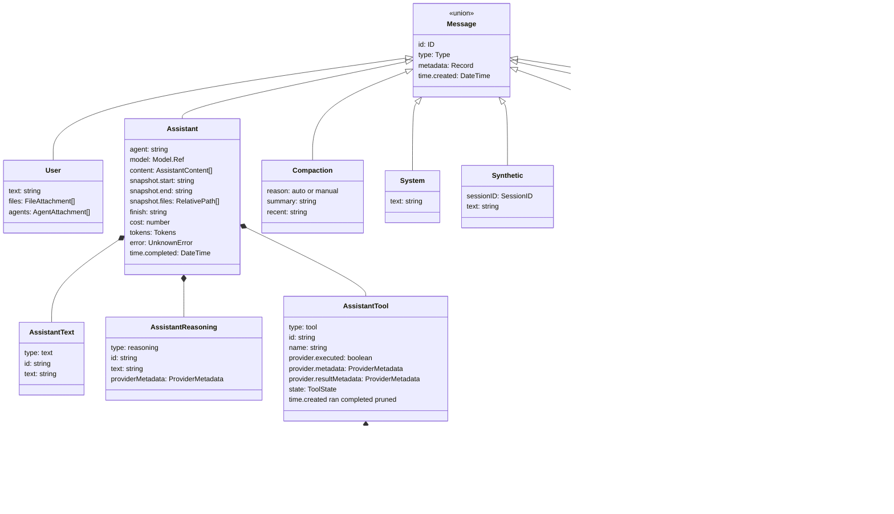
```mermaid
classDiagram
  class Message {
    <<union>>
    id: ID
    type: Type
    metadata: Record
    time.created: DateTime
  }
  class User {
    text: string
    files: FileAttachment[]
    agents: AgentAttachment[]
  }
  class Assistant {
    agent: string
    model: Model.Ref
    content: AssistantContent[]
    snapshot.start: string
    snapshot.end: string
    snapshot.files: RelativePath[]
    finish: string
    cost: number
    tokens: Tokens
    error: UnknownError
    time.completed: DateTime
  }
  class Compaction {
    reason: auto or manual
    summary: string
    recent: string
  }
  class System {
    text: string
  }
  class Synthetic {
    sessionID: SessionID
    text: string
  }
  class Shell {
    callID: string
    command: string
    output: string
    time.completed: DateTime
  }
  class AgentSwitched {
    agent: string
  }
  class ModelSwitched {
    model: Model.Ref
  }
  class AssistantText {
    type: text
    id: string
    text: string
  }
  class AssistantReasoning {
    type: reasoning
    id: string
    text: string
    providerMetadata: ProviderMetadata
  }
  class AssistantTool {
    type: tool
    id: string
    name: string
    provider.executed: boolean
    provider.metadata: ProviderMetadata
    provider.resultMetadata: ProviderMetadata
    state: ToolState
    time.created ran completed pruned
  }
  class ToolState {
    <<union>>
    status: pending or running or completed or error
  }
  Message <|-- User
  Message <|-- Assistant
  Message <|-- Compaction
  Message <|-- System
  Message <|-- Synthetic
  Message <|-- Shell
  Message <|-- AgentSwitched
  Message <|-- ModelSwitched
  Assistant *-- AssistantText
  Assistant *-- AssistantReasoning
  Assistant *-- AssistantTool
  AssistantTool *-- ToolState
```

| 类型 | 谁生成它 | 发给模型时变成什么（`to-llm-message.ts`） |
|---|---|---|
| `user` | `Prompted` 事件投影（`message-updater.ts`） | 一条 `role: user`，文本 + 附件转 media |
| `assistant` | `Step.Started` 事件新建，后续事件逐步填 `content` | 一条 `role: assistant`（text / reasoning / tool-call），每个本地执行的工具结果单独一条 `role: tool` |
| `compaction` | `Compaction.Ended` 事件 | 一条 `role: user`，内容是 `<conversation-checkpoint>` 包着 summary 和 recent |
| `system` | `ContextUpdated` 事件，系统上下文变化时追加 | `Message.system(text)` |
| `synthetic` | `Synthetic` 事件，目前只有 v1 兼容路径会发 | 一条 `role: user` |
| `shell` | `Shell.Started/Ended`，v2 门面的 `shell` 方法还没实现（`session.ts`） | 一条 `role: user`，"Shell command: … 输出" |
| `agent-switched` / `model-switched` | `AgentSwitched` / `ModelSwitched` 事件 | 不发，返回空数组 |

`ToolState` 的四种状态对应一个工具调用的生命周期：

| 状态 | 字段 | 进入这个状态的事件 |
|---|---|---|
| `pending` | `input: string`（还在流式接收的原始 JSON 文本） | `Tool.Input.Started`（`message-updater.ts`） |
| `running` | `input: Record`、`structured`、`content` | `Tool.Called`，input 已经是解析好的对象 |
| `completed` | `input`、`content`、`structured`、`outputPaths`、`attachments`、`result` | `Tool.Success` |
| `error` | `input`、`content`、`structured`、`error`、`result` | `Tool.Failed` |

`provider.executed` 为真表示这个工具是模型供应商自己执行的（比如内置 web search），本地不跑。
发给模型时，供应商执行的工具把 call 和 result 都放进 assistant 消息的 content 里；本地执行的只放 call，
result 单独成一条 `role: tool` 消息（`to-llm-message.ts`）。

### 解析模型：SessionRunnerModel

`SessionRunnerModel` 把会话的 `model: { providerID, id, variant }` 变成 llm 包的 `Model`（带路由、鉴权、限额）。

| 方法 | 干什么 |
|---|---|
| `resolve(session)` | 会话指定了模型就从目录里找；没指定用 `catalog.model.default()`；默认的不支持就找第一个支持的。找不到分别抛 `ModelUnavailableError` / `ModelNotSelectedError` |
| `fromCatalogModel(model, credential)` | 只支持三种 API：`@ai-sdk/openai`（走 Responses 协议）、`@ai-sdk/anthropic`、`@ai-sdk/openai-compatible`（必须有 url）。其他抛 `UnsupportedApiError` |
| `withVariant(model, variantID)` | 变体的 headers / body 用 immer 合并进模型 |
| `withDefaults(model, route)` | 把目录里的 `limit.context` / `limit.output` 塞进 route 的 `limits`，压缩判定读的就是这里 |

### 请求与模型协议类型

OpenCode 封装了一套 LLMClient（`@opencode-ai/llm`）。每轮把 `SessionMessage` 转成这里的 `Message`，拼成 `LLMRequest` 发出去；模型返回 `LLMEvent` 流，再由发布器转成会话事件。

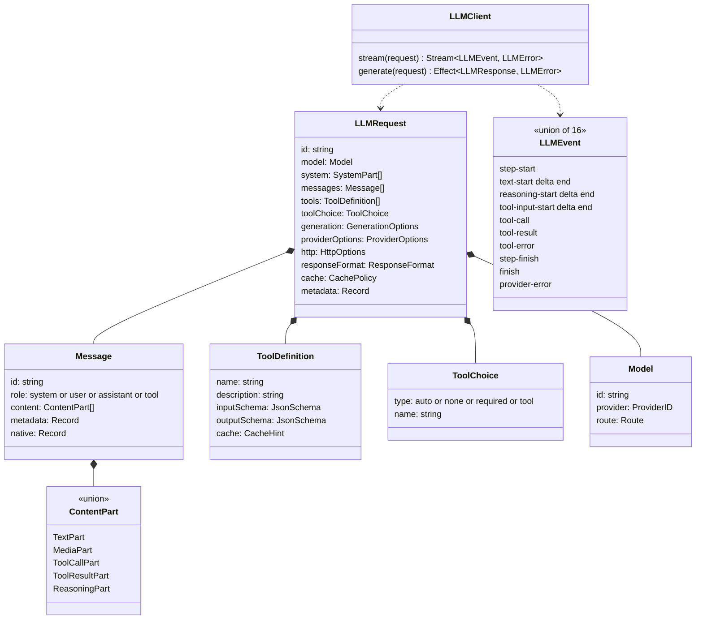
```mermaid
classDiagram
  class LLMRequest {
    id: string
    model: Model
    system: SystemPart[]
    messages: Message[]
    tools: ToolDefinition[]
    toolChoice: ToolChoice
    generation: GenerationOptions
    providerOptions: ProviderOptions
    http: HttpOptions
    responseFormat: ResponseFormat
    cache: CachePolicy
    metadata: Record
  }
  class Message {
    id: string
    role: system or user or assistant or tool
    content: ContentPart[]
    metadata: Record
    native: Record
  }
  class ContentPart {
    <<union>>
    TextPart
    MediaPart
    ToolCallPart
    ToolResultPart
    ReasoningPart
  }
  class ToolDefinition {
    name: string
    description: string
    inputSchema: JsonSchema
    outputSchema: JsonSchema
    cache: CacheHint
  }
  class ToolChoice {
    type: auto or none or required or tool
    name: string
  }
  class LLMEvent {
    <<union of 16>>
    step-start
    text-start delta end
    reasoning-start delta end
    tool-input-start delta end
    tool-call
    tool-result
    tool-error
    step-finish
    finish
    provider-error
  }
  class Model {
    id: string
    provider: ProviderID
    route: Route
  }
  class LLMClient {
    stream(request) Stream~LLMEvent, LLMError~
    generate(request) Effect~LLMResponse, LLMError~
  }
  LLMRequest *-- Message
  LLMRequest *-- ToolDefinition
  LLMRequest *-- ToolChoice
  LLMRequest *-- Model
  Message *-- ContentPart
  LLMClient ..> LLMRequest
  LLMClient ..> LLMEvent
```

| 类 | 文件 | 说明 |
|---|---|---|
| `LLMRequest` | `llm/src/schema/messages.ts` | runner 每轮用 `LLM.request({...})`（`llm/src/llm.ts`）构造，字段来源见下表。 |
| `Message` | | 四种角色。`native` 是 provider 原生字段的透传。 |
| `ToolDefinition` | | `Tool.make` 的 `definition(name)` 把 Effect Schema 转成 JSON Schema 填进来（`core/src/tool/tool.ts`）。 |
| `LLMEvent` | `llm/src/schema/events.ts` | 16 种。runner 的发布器把它们一一映射成会话事件（§6）。`ProviderErrorEvent` 带 `classification`，值为 `context-overflow` 时触发溢出压缩。 |
| `Model` | `route/client.ts` | 不只是 id，还带 `route`（协议、端点、鉴权、默认限额）。`model.route.defaults.limits.context` 就是上下文窗口大小，压缩判定用它。 |
| `LLMClient` | `llm/src/route/client.ts` | 没有重试。`grep -n 'retry' llm/src/route/*.ts` 是空的。`specs/v2/session.md` 明说"Provider timeout, retry, and watchdog policy is intentionally deferred"。 |
| `isContextOverflowFailure` | `llm/src/provider-error.ts` | 判断一个错误是不是上下文溢出。匹配用的文案正则有 28 条。 |

### 请求字段从哪里来

| 字段 | 值 | 来源 |
|---|---|---|
| `model` | `models.resolve(session)` 的结果 | `SessionRunnerModel.resolve`，变体的 headers/body 已合并 |
| `http.headers` | `x-session-affinity: <sessionID>`、`X-Session-Id: <sessionID>`、有父会话再加 `x-parent-session-id` | 写死 |
| `providerOptions.openai.promptCacheKey` | 会话 id 去掉 `ses_` 前缀（正则匹配 `ses_[0-9a-f]{64}` 时），否则原 id | 让 OpenAI 的 prompt cache 按会话命中 |
| `system` | `[agent.info.system, epoch.baseline]` 过滤空串，各成一个 `SystemPart` | agent 专属提示词在前，系统上下文基线在后。基线更新流程见本节后半部分 |
| `messages` | `toLLMMessages(context, model)`，最后一步再追加一条 `Message.assistant(MAX_STEPS_PROMPT)` | 由 `toLLMMessages` 转换；`MAX_STEPS_PROMPT` 在 `runner/max-steps.ts` |
| `tools` | `toolMaterialization.definitions`，最后一步是 `[]` | |
| `toolChoice` | 最后一步 `"none"`，否则 undefined | |
| `generation` | 不传。温度、maxTokens 全靠 route 默认 | — |

每轮会变的字段：`messages`（历史变长、steer 被取出执行）、`system`（压缩后基线被替换时）、`tools`（agent 权限变了或到最后一步）。
不变的字段：headers、cacheKey、`generation`。
v2 还没有的：v1 里的每次 prompt 覆盖系统文本、插件修改请求、结构化输出策略，在 v2 里都还是 `missing`（`specs/v2/session.md` 那张表）。

### 步数上限如何同时约束请求和执行

到达 `steps` 上限时会同时做三件事：`tools: []`、`toolChoice: "none"`、消息末尾追加一条 assistant 消息（`max-steps.ts`）：
"CRITICAL - MAXIMUM STEPS REACHED … Tools are disabled until next user input. Respond with text only."
模型如果还是发了 tool-call，会直接 `failUnsettledTools("Tools are disabled after the maximum agent steps")`，不执行。
有新用户输入就 `currentStep = 1`，所以这个上限指的是每次用户输入之后最多跑 N 轮。

---

## 6. 消费模型流：发布状态与启动工具

本段接过 §5 的 request、materialization 和 publisher。工具执行的内部调用在 §7 展开，本图先看它如何与模型流交错，以及哪些状态要留到 §8 收尾。

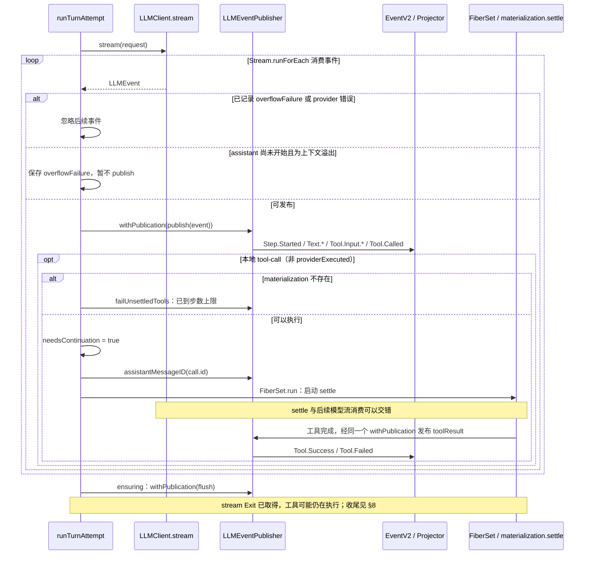
```mermaid
sequenceDiagram
  participant RT as runTurnAttempt
  participant LM as LLMClient.stream
  participant PB as LLMEventPublisher
  participant EV as EventV2 / Projector
  participant FS as FiberSet / materialization.settle
  RT->>LM: stream(request)
  loop Stream.runForEach 消费事件
    LM-->>RT: LLMEvent
    alt 已记录 overflowFailure 或 provider 错误
      RT->>RT: 忽略后续事件
    else assistant 尚未开始且为上下文溢出
      RT->>RT: 保存 overflowFailure，暂不 publish
    else 可发布
      RT->>PB: withPublication(publish(event))
      PB->>EV: Step.Started / Text.* / Tool.Input.* / Tool.Called
      opt 本地 tool-call（非 providerExecuted）
        alt materialization 不存在
          RT->>PB: failUnsettledTools：已到步数上限
        else 可以执行
          RT->>RT: needsContinuation = true
          RT->>PB: assistantMessageID(call.id)
          RT->>FS: FiberSet.run：启动 settle
          Note over LM,FS: settle 与后续模型流消费可以交错
          FS->>PB: 工具完成，经同一个 withPublication 发布 toolResult
          PB->>EV: Tool.Success / Tool.Failed
        end
      end
    end
  end
  RT->>PB: ensuring：withPublication(flush)
  Note over RT,FS: stream Exit 已取得，工具可能仍在执行；收尾见 §8
```

图中的工具返回箭头表示完成时的回调，不是 `Stream.runForEach` 在每个 tool-call 后等待工具。`FiberSet.run` 注册 fiber 后继续消费模型事件；工具分支和模型分支通过同一个 `Semaphore(1)` 串行发布会话事件。这里同时存在两种关系：工具执行可以并发，publisher 的状态更新按 permit 串行。

`step-finish` 也不等于立即提交 `Step.Ended`。publisher 先记下 finish 和 token 等 settlement 信息，attempt 等工具结束后才完成 step 收尾。模型流失败时 `ensuring(flush)` 仍执行，防止文本或工具输入的流式片段停留在未关闭状态。

### 流内状态由谁持有：LLMEventPublisher

`createLLMEventPublisher` 把 `llm.stream` 返回的 16 种 `LLMEvent` 转成会话事件，再 `events.publish`。每轮创建一个，只在这一轮内使用。
文件注释："Persist one provider turn without executing tools or starting a continuation turn."

字段：

| 字段 | 含义 |
|---|---|
| `tools: Map<callID, {assistantMessageID, name, inputEnded, called, settled, providerExecuted, providerMetadata}>` | 这一轮见过的每个工具调用的状态机 |
| `assistantMessageID` | 这一轮的 assistant 消息 id。第一个需要它的事件到来时才创建（`startAssistant`），创建时发 `Step.Started` |
| `assistantActive` / `assistantFailed` / `providerFailed` | 三个布尔。runner 收尾时靠它们决定发什么 |
| `stepSettlement` | `step-finish` 事件带来的 `finish` 原因和 token 用量 |
| `text` / `reasoning` / `toolInput` | 三个 `fragments` 累加器：`start(id)` 开一个桶，`append` 攒，`end` 把桶里的拼成完整字符串发 `*.Ended` 事件 |

主要方法：

| 方法 | 干什么 |
|---|---|
| `publish(event, outputPaths)` | 大 switch。`text-delta` 发 `Text.Delta`（不持久化）并攒桶；`text-end` 发 `Text.Ended`（持久化）。`tool-call`：桶没关先关，发 `Tool.Called`。`tool-result`：成功发 `Tool.Success`，错误发 `Tool.Failed`。`step-finish`：flush 全部桶，记 `stepSettlement`。`provider-error`：`providerFailed = true`，`failAssistant` |
| `flush()` | 把三个桶里没关的都关掉（发 Ended 事件）。runner 用 `Effect.ensuring` 保证流结束一定 flush（`llm.ts`） |
| `failAssistant(message)` | 发 `Step.Failed`。只发一次 |
| `failUnsettledTools(message, hostedOnly)` | 所有没 `settled` 的工具发 `Tool.Failed`。`hostedOnly` 为真只处理 provider 执行的 |
| `assistantMessageID(callID)` | 给 runner 查这个工具调用属于哪条 assistant |

一致性检查很严格：同一个 id 重复 start、name 变了、result 比 call 先到，都会 `Effect.die`。
也就是不假设 provider 返回的流式数据一定正确。

### 模型事件映射成哪些会话事件

会话事件是 v2 的数据来源，最后一列说明了每种事件会更新哪张表。事件定义在 `schema/src/session-event.ts`。每个事件用 `Event.define({ type, durable?, schema })` 造（`schema/src/event.ts`）。
带 `durable: { aggregate: "sessionID", version }` 的事件会写库，不带的只广播。

| 事件族 | 类型名前缀 | 持久化？ | 谁发 | 投影成什么 |
|---|---|---|---|---|
| `PromptAdmitted` | `session.next.prompt.admitted` | 是 | `SessionInput.admit`（`input.ts`） | 插一行 `session_input`（`projector.ts`） |
| `Prompted` | `session.next.prompted` | 是 | `SessionInput.publish`（`input.ts`），取出执行时 | 给 `session_input` 行填 `promoted_seq` 并 插一条 `user` 消息（`projector.ts`），同一个事务 |
| `Step.Started / Ended / Failed` | `session.next.step.*` | 是（Ended/Failed 是 v2 版本） | 发布器 `startAssistant`（`publish-llm-event.ts`）/ runner / `failAssistant` | 新建 / 收尾 / 标错一条 `assistant` 消息 |
| `Text.Started / Ended` | `session.next.text.*` | 是 | 发布器 | 往 assistant 的 `content` 加一段 text |
| `Text.Delta` | `session.next.text.delta` | 否 | 发布器 | 在线订阅者拿到增量，`message-updater` 也会累加（内存投影用） |
| `Reasoning.*` | `session.next.reasoning.*` | Started/Ended 是，Delta 否 | 发布器 | 和上面 text 一样，只是写 reasoning 段 |
| `Tool.Input.Started / Ended` | `session.next.tool.input.*` | 是 | 发布器 | 新建一个 `pending` 状态的 tool 项；Ended 填原始 input 文本 |
| `Tool.Input.Delta` | | 否 | 发布器 | 不投影（`message-updater.ts`） |
| `Tool.Called` | `session.next.tool.called` | 是 | 发布器 | tool 项转 `running`，input 变成对象 |
| `Tool.Progress / Success / Failed` | `session.next.tool.*` | 是 | 工具执行完 / 失败 / 中断 | tool 项转 `completed` / `error` |
| `ContextUpdated` | `session.next.context.updated` | 是 | `SessionContextEpoch.prepare`（`context-epoch.ts`） | 插一条 `system` 消息 |
| `Compaction.Started / Ended` | `session.next.compaction.*` | 是 | `SessionCompaction.compactAfterOverflow`（`compaction.ts`） | Ended 插一条 `compaction` 消息 |
| `Compaction.Delta` | | 否 | 目前没人发 | — |
| `AgentSwitched / ModelSwitched` | | 是 | 门面 `switchAgent` / `switchModel`（`session.ts`） | 改 `session` 表的 agent/model 列，并插一条标记消息 |
| `RevertEvent.Staged / Cleared / Committed` | | 是 | `SessionRevert`（`revert.ts`） | 改 `session.revert` 列；Committed 删掉边界之后的消息和输入行（`projector.ts`） |
| `Retried` | `session.next.retried` | 是 | 目前没人发（投影那行被注释掉了，`projector.ts`） | — |
| `Moved` | | 是 | 会话跨目录移动 | 改 `session` 表的 directory/workspace |

持久化事件的完整清单在 `session-event.ts` 的 `DurableDefinitions` 里。

---

## 7. 执行工具：权限等待、文件修改与结果回写

这里展开上一图的 materialization.settle。审批等待与实际执行必须放在同一条调用链中看：等待发生在工具 fiber 内，决定返回后才能继续执行并生成 settlement。

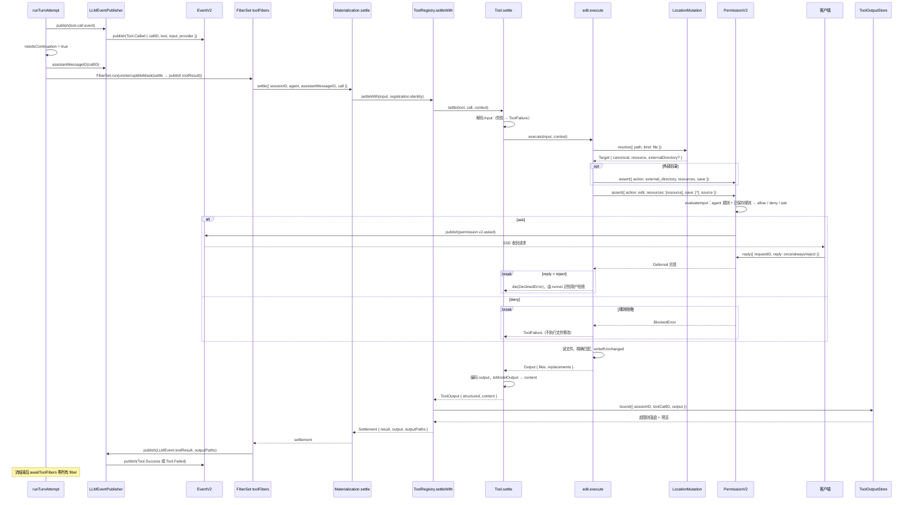
```mermaid
sequenceDiagram
  participant RT as runTurnAttempt
  participant PB as LLMEventPublisher
  participant EV as EventV2
  participant FS as FiberSet toolFibers
  participant MT as Materialization.settle
  participant TR as ToolRegistry.settleWith
  participant TL as Tool.settle
  participant EX as edit.execute
  participant LM as LocationMutation
  participant PM as PermissionV2
  participant UI as 客户端
  participant OS as ToolOutputStore

  RT->>PB: publish(tool-call event)
  PB->>EV: publish(Tool.Called { callID, tool, input, provider })
  RT->>RT: needsContinuation = true
  RT->>PB: assistantMessageID(callID)
  RT->>FS: FiberSet.run(uninterruptibleMask(settle → publish toolResult))
  FS->>MT: settle({ sessionID, agent, assistantMessageID, call })
  MT->>TR: settleWith(input, registration.identity)
  TR->>TL: settle(tool, call, context)
  TL->>TL: 解码 input（失败 → ToolFailure）
  TL->>EX: execute(input, context)
  EX->>LM: resolve({ path, kind: file })
  LM-->>EX: Target { canonical, resource, externalDirectory? }
  opt 外部目录
    EX->>PM: assert({ action: external_directory, resources, save })
  end
  EX->>PM: assert({ action: edit, resources: [resource], save: [*], source })
  PM->>PM: evaluateInput：agent 规则 + 已保存规则 → allow / deny / ask
  alt ask
    PM->>EV: publish(permission.v2.asked)
    EV-->>UI: SSE 收到请求
    UI->>PM: reply({ requestID, reply: once/always/reject })
    PM-->>EX: Deferred 兑现
    break reply = reject
      EX-->>TL: die(DeclinedError)，由 runner 识别用户拒绝
    end
  else deny
    break 规则拒绝
      PM-->>EX: BlockedError
      EX-->>TL: ToolFailure（不执行文件修改）
    end
  end
  EX->>EX: 读文件、精确匹配、writeIfUnchanged
  EX-->>TL: Output { files, replacements }
  TL->>TL: 编码 output，toModelOutput → content
  TL-->>TR: ToolOutput { structured, content }
  TR->>OS: bound({ sessionID, toolCallID, output })
  OS-->>TR: 超限则落盘 + 预览
  TR-->>MT: Settlement { result, output, outputPaths }
  MT-->>FS: settlement
  FS->>PB: publish(LLMEvent.toolResult, outputPaths)
  PB->>EV: publish(Tool.Success 或 Tool.Failed)
  Note over RT: 流结束后 awaitToolFibers 等所有 fiber
```

### 执行规则

1. 先记录再执行（`llm.ts`）：`publish(event)` 发出 `Tool.Called` 并写库之后，才调 `settle`。进程在这之间挂掉，重启后 `failInterruptedTools` 能看到一个 `running` 的工具并标失败。
2. 工具执行与结果发布的取消边界不同：`uninterruptibleMask` 中的 `restore` 让 settle 本身可中断，成功后的 `publish(toolResult)` 留在 mask 内，避免 Effect 取消插在取得 settlement 与发布结果之间。这不覆盖进程崩溃或写库失败，不能当成副作用与结果记录的原子事务。
3. 并行执行，串行发布：每个 tool-call 立刻进 `FiberSet`，互不等待；但 `withPublication` 信号量让事件一条一条发。文档："Eager local-tool execution is intentionally unbounded in the current local slice."

### 工具结果回传

下一轮 `entriesForRunner` 读到这条 assistant 消息，`content` 里的 tool 项已经是 `completed`。`to-llm-message.ts` 把每个本地执行的 tool 项转成一条 `role: tool` 消息，
内容是 `ToolOutput.toResultValue({ structured, content })`。`outputPaths` 里的落盘路径已经写进 content 的预览文本里了。

### 工具无结果时的文案

| 文案 | 在哪发 | 什么情况 |
|---|---|---|
| `Tool execution interrupted` | `llm.ts` | 上次崩溃留下的；用户拒绝权限；流或工具被中断；provider 报错 |
| `Provider did not return a tool result` | | provider 执行的工具没给结果 |
| `Tools are disabled after the maximum agent steps` | | 最后一步模型还在调工具 |
| `Tool execution failed: …` | | 工具 fiber 以非中断原因失败（一般是 `ToolOutputStore.Error`） |
| `Stale tool call: …` / `Unknown tool: …` | `registry.ts` | 工具在 materialize 之后被替换或注销 |

### 本段对象关系


```mermaid
classDiagram
  class ToolDefinition_opaque {
    <<Tool.make 返回值 冻结空对象>>
  }
  class ToolRuntime {
    permission: string
    definition(name) ToolDefinition
    settle(call, context) Effect~ToolOutput, ToolFailure~
  }
  class ToolConfig {
    description: string
    input: Schema
    output: Schema
    structured: Schema
    toStructuredOutput(input, output)
    execute(input, context) Effect~Output, ToolFailure~
    toModelOutput(input, output) Content[]
  }
  class ToolContext {
    sessionID: SessionID
    agent: Agent.ID
    assistantMessageID: Message.ID
    toolCallID: string
  }
  class ToolRegistry {
    <<Service location>>
    local: Map~name, registration[]~
    applications: ApplicationTools
    resources: ToolOutputStore
    materialize(permissions) Materialization
    register(tools)
    settleWith(input, advertised) Settlement
  }
  class Materialization {
    definitions: ToolDefinition[]
    settle(input) Effect~Settlement~
  }
  class Settlement {
    result: ToolResultValue
    output: ToolOutput
    outputPaths: string[]
  }
  class ApplicationTools {
    <<Service global>>
    entries() Map~name, Entry~
    register(tools)
  }
  class ToolOutputStore {
    <<Service location>>
    MAX_LINES 2000
    MAX_BYTES 50KB
    RETENTION 7d
    bound(input) BoundResult
    cleanup()
  }
  class PermissionV2 {
    <<Service location>>
    pending: Map~ID, Pending~
    ask(input) AskResult
    assert(input)
    reply(input)
    get(id) Request
    forSession(sessionID) Request[]
    list() Request[]
    evaluate(action, resource, rulesets) Rule
  }
  class QuestionV2 {
    <<Service location>>
    pending: Map~ID, Pending~
    ask(input) Answer[]
    reply(input)
    reject(requestID)
  }
  class LocationMutation {
    <<Service location>>
    resolve(input) Target
  }
  class Target {
    canonical: string
    resource: string
    externalDirectory: action directory resource save
  }
  class BashTool
  class EditTool
  class ReadTool
  class WriteTool
  class QuestionTool
  ToolDefinition_opaque ..> ToolRuntime : WeakMap 关联
  ToolRuntime ..> ToolConfig : 闭包持有
  ToolRuntime ..> ToolContext
  ToolRegistry --> ApplicationTools : 兜底查
  ToolRegistry --> ToolOutputStore : bound
  ToolRegistry ..> Materialization : 返回
  Materialization ..> Settlement
  BashTool ..> PermissionV2 : assert
  BashTool ..> LocationMutation : resolve
  EditTool ..> PermissionV2
  EditTool ..> LocationMutation
  ReadTool ..> PermissionV2
  WriteTool ..> PermissionV2
  QuestionTool ..> QuestionV2 : ask
  QuestionTool ..> PermissionV2
  LocationMutation ..> Target
```

### `Tool.make`

`Tool.make(config)` 定义一个具体工具：`config` 提供描述、输入和输出 Schema，以及真正执行业务的 `config.execute`。调用 `Tool.make` 时只创建工具，不会执行它。

返回的工具值是 `Object.freeze({})`，对应的 `Runtime` 保存在模块级 `WeakMap` 中。外部通过 `Tool.definition`、`Tool.settle` 等函数访问这些能力，不直接操作内部实现。

| `Runtime` 成员 | 职责 |
|---|---|
| `definition(name)` | 把输入、输出 Schema 转成 JSON Schema，生成并按名字缓存 `ToolDefinition`，供模型了解如何调用工具 |
| `settle(call, context)` | 解码输入、调用 `config.execute`、编码输出，最终生成 `ToolOutput`；具体流程见下文 |
| `permission` | 工具用于目录过滤的权限动作名。`Tool.withPermission(tool, "edit")` 可覆盖默认名字；例如 `edit` / `write` / `apply_patch` 都使用 `edit`，让同一条规则覆盖这些工具 |

这里的 `settle` 负责**一个具体工具的执行过程**：

```text
call.input
  → 按 config.input 解码、校验
  → config.execute(input, context)          真正执行工具业务
  → 按 config.output 编码、校验返回值
  → 配置了 structured 和 toStructuredOutput 时，生成独立的 structured 输出
  → 用 toModelOutput 生成模型可读的 content
  → 返回 ToolOutput { structured, content }
```

输入不合法时返回 `ToolFailure`，不会进入 `config.execute`；输出不符合 Schema 时也返回 `ToolFailure`。没有独立的 structured 转换时，`structured` 使用编码后的 output。没有配置 `toModelOutput` 时，字符串 output 默认变成 text content，其他类型默认不生成 content。

`Tool.settle(tool, call, context)` 只是从 `WeakMap` 找到这个工具的 `Runtime`，再调用上述 `Runtime.settle`。

### `ToolRegistry`

`ToolRegistry` 管理当前目录可用的工具。它把进程级的 `ApplicationTools` 和目录级的本地注册项合在一起，为本次 attempt 返回 `Materialization { definitions, settle }`：`definitions` 发给模型，`settle` 留给 runner 处理模型返回的 tool-call。

**`Materialization.settle` 是外层入口，内部会调用 `Tool.make` 保存的 `Runtime.settle`。两者串在同一条调用链上，`config.execute` 只执行一次。**

```text
runner 收到 tool-call
  → Materialization.settle(input)
    → ToolRegistry 的 settleWith(input, registration.identity)
      → 按 call.name 找到当前注册项，检查 identity 是否仍与本次提供给模型的一致
      → Tool.settle(tool, call, context)
        → Runtime.settle(call, context)
          → 输入解码 → config.execute → 输出编码 → ToolOutput
      → ToolOutputStore.bound(...) 处理输出大小
      → 返回 Settlement { result, output?, outputPaths? }
```

所以，`Runtime.settle` 关注输入、业务执行和输出类型；`ToolRegistry` 的 `settle` 关注工具选择、注册项是否过期，以及怎样把执行结果交回 runner。

| 方法 | 职责 | 调用方 |
|---|---|---|
| `register(tools)` | 校验名字（`/^[A-Za-z][A-Za-z0-9_-]{0,63}$/`），按名字压栈。Scope 关闭时通过 `addFinalizer` 移除本次注册项，恢复之前的同名工具 | 工具的 layer（`bash.ts`, `edit.ts` 等） |
| `materialize(permissions)` | 以 `ApplicationTools` 为基础，用本地注册项覆盖同名工具；过滤 `whollyDisabled` 的工具（规则 `resource: "*"` 且 `effect: "deny"`），返回持有本次注册表快照的 `{ definitions, settle }` | `runTurnAttempt` |
| `settleWith(input, advertised)` | 重新查找注册项（本地优先），用 `identity` 检查它是否仍是之前提供给模型的那个工具；通过后调用 `Tool.settle`，再整理结果 | `Materialization.settle` |

如果模型调用的名字不在本次 `Materialization` 中，返回 `Unknown tool`；如果原来提供的注册项已消失或被替换，返回 `Stale tool call`，不会执行新的同名工具。`Tool.settle` 返回的 `ToolFailure` 会转换成 `Settlement.result` 中的 error；成功输出则交给 `ToolOutputStore.bound`，再生成 `result` 和可选的 `outputPaths`。

这里的权限过滤只决定哪些工具定义提供给模型。针对具体路径、命令等资源的执行授权，仍由工具自己的 `config.execute` 调用 `PermissionV2` 完成。职责分别是：`ToolRegistry` 选择和检查注册项，`Runtime.settle` 包装业务执行，`ToolOutputStore.bound` 处理过大的输出。

### `ToolOutputStore`

`ToolOutputStore` 在工具输出太长时把完整内容写到文件，只给模型头尾预览和文件路径。

`bound(input)`：把 content 里的 text 拼起来（没 content 就 JSON 化 `structured`）；
行数 ≤ 2000 且字节 ≤ 50KB 原样返回；否则写到 `<data>/tool-output/tool_<id>`，返回 `boundedPreview`（头 + "... output truncated; full content saved to … ..." + 尾）。
限额可以在配置的 `tool_output.max_lines / max_bytes` 改。`cleanup` 删 7 天前的文件，server 启动时挂了个 `cleanupNode`。

### `PermissionV2`

`PermissionV2` 是工具副作用之前的一道门。它不负责执行工具，只回答三个结果：

```text
allow：直接继续执行
deny：直接阻止，不询问用户
ask：暂停当前工具，等用户选择 once / always / reject
```

权限实际在两个时机使用：

1. `ToolRegistry.materialize` 在把工具列表发给模型前，隐藏被规则完整禁用的工具。例如某个 action 对 `resource: "*"` 是 deny，模型就不会看到它。
2. 模型真的调用工具后，工具在产生副作用之前调用 `permission.assert(...)`，对这一次操作的具体目标再判断。第一步只是减少模型可见的工具，不代替这里的执行检查。

`Tool.withPermission(tool, "edit")` 只告诉注册表“这个工具按哪个 action 做可见性过滤”，不会自动执行授权；真正的 `assert` 仍由工具在正确的副作用边界前调用。

#### 一次权限请求里有什么

假设模型要运行 `git status`，工具会构造类似这样的请求：

```ts
yield* permission.assert({
  sessionID,
  agent,
  action: "bash",
  resources: ["git status"],
  save: ["git status"],
  source: { type: "tool", messageID, callID },
})
```

| 字段 | 含义 |
|---|---|
| `action` | 要做哪类操作。通常是工具名，也可以是 `edit`、`external_directory` 这类共用权限名 |
| `resources` | 这次实际要操作什么。它只是用于匹配规则的字符串；这里是命令，读写工具里通常是文件路径 |
| `save` | 用户选择 `always` 时要记住哪些字符串。它可以和 `resources` 不同，也可以不提供 |
| `sessionID` / `agent` | 用哪个会话和 agent 的规则来判断 |
| `source` | 是哪条 assistant 消息里的哪个 tool call 发起了请求，供客户端定位和显示 |

一条规则就是 `{ action, resource, effect }`。`action` 和 `resource` 都支持通配符；多条规则同时匹配时，排在最后的那条生效。
例如：

```ts
[
  { action: "*",    resource: "*",             effect: "allow" },
  { action: "read", resource: "*.env",         effect: "ask" },
  { action: "read", resource: "*.env.example", effect: "allow" },
]
```

这表示一般操作允许，读取 `.env` 要问用户，而读取 `.env.example` 仍然允许。完全没有规则匹配时，默认结果是 `ask`，不是自动允许。

#### `assert` 怎样暂停工具，再由 UI 唤醒

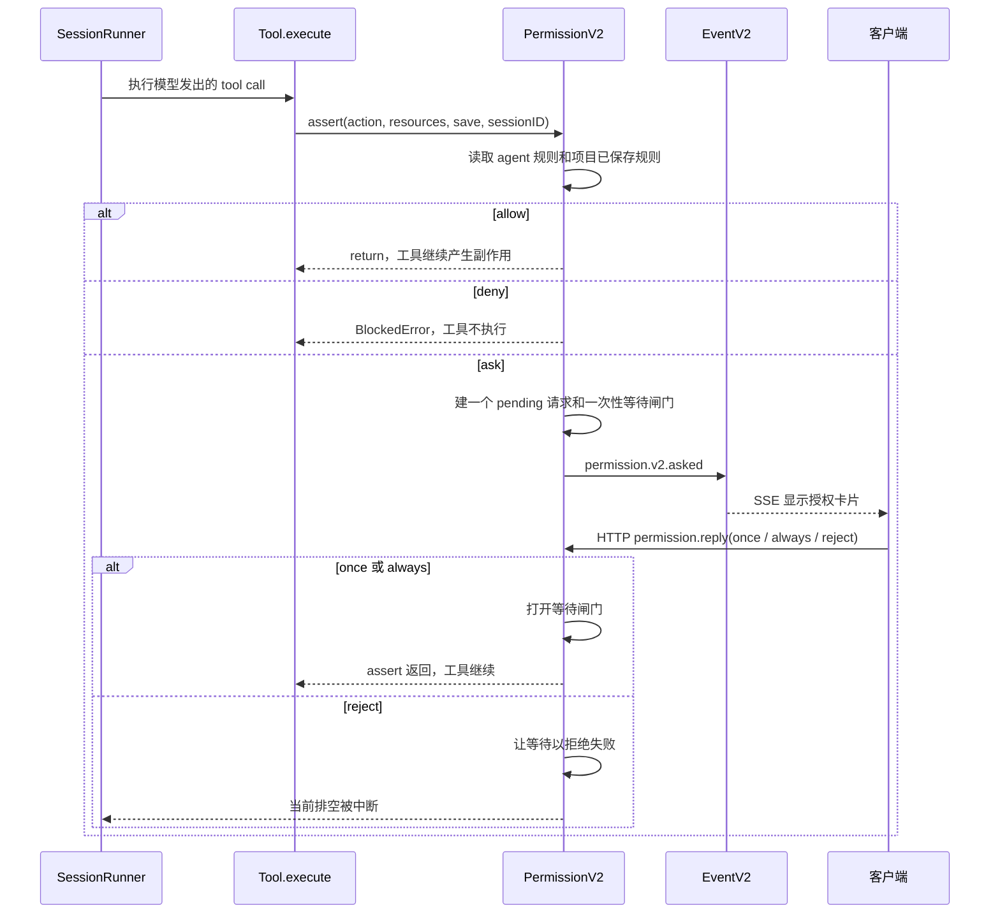
```mermaid
sequenceDiagram
  participant RN as SessionRunner
  participant TL as Tool.execute
  participant PM as PermissionV2
  participant EV as EventV2
  participant UI as 客户端

  RN->>TL: 执行模型发出的 tool call
  TL->>PM: assert(action, resources, save, sessionID)
  PM->>PM: 读取 agent 规则和项目已保存规则
  alt allow
    PM-->>TL: return，工具继续产生副作用
  else deny
    PM-->>TL: BlockedError，工具不执行
  else ask
    PM->>PM: 建一个 pending 请求和一次性等待闸门
    PM->>EV: permission.v2.asked
    EV-->>UI: SSE 显示授权卡片
    UI->>PM: HTTP permission.reply(once / always / reject)
    alt once 或 always
      PM->>PM: 打开等待闸门
      PM-->>TL: assert 返回，工具继续
    else reject
      PM->>PM: 让等待以拒绝失败
      PM-->>RN: 当前排空被中断
    end
  end
```

代码里的 `Deferred` 就是图中的“一次性等待闸门”：`assert` 在 `Deferred.await` 停住；`reply` 成功或失败这个 Deferred，原来那个工具 fiber 才继续或退出。
等待中的请求放在 `pending` Map，客户端也通过 `list` / `forSession` / `get` 读取它们。目录服务被释放时，所有还在等待的 Deferred 都会按拒绝处理，避免工具永远挂住。

三个回复的区别：

| 回复 | 后果 |
|---|---|
| `once` | 只打开当前请求的等待闸门，不写数据库；下次相同操作仍重新判断 |
| `always` | 请求带有 `save` 时，把其中的字符串作为 allow 规则写进当前 project 的 `PermissionSaved` 表，再放行当前请求；同会话里其他现在也能命中这些规则的 pending 请求会一起放行。没有 `save` 时只放行当前请求 |
| `reject` | 拒绝当前请求，并把同一会话里其他 pending 请求一起拒绝；没有反馈文案时，runner 把它识别成用户拒绝并停止本次排空 |

#### 规则最终怎样合并

判断顺序不是简单地把所有规则拼起来：

1. 根据 `sessionID` 找到会话，再确定当前 agent，取它配置的 permission rules；找不到 agent 时使用全 deny。
2. 先只看 agent 规则。如果这次任一 resource 被 agent 明确 deny，立即 deny。项目里记住的 `always` 不能覆盖 agent 的硬禁止。
3. 没有硬禁止，再把项目已保存的 allow 规则放到 agent 规则后面。因为后面的匹配规则优先，它可以把原来的 ask 变成 allow。
4. 一个请求可以有多个 resources：任一个 deny，整体 deny；否则任一个 ask，整体 ask；全部 allow 才整体 allow。

主要入口可以归纳成：

| 方法 | 谁使用 | 行为 |
|---|---|---|
| `assert(input)` | 工具执行代码 | 完成判断；allow 立即返回，deny 报错，ask 发事件并等待用户回复 |
| `ask(input)` | `session.permission.create` HTTP 接口 | 只判断并在需要时创建 pending，请求本身不等待；返回 `{ id, effect }` |
| `reply(input)` | 客户端的授权按钮 | 回复 pending 请求，让等待中的 `assert` 继续或失败 |
| `list()` / `forSession()` / `get()` | HTTP 接口和客户端同步 | 查询当前还在等待用户处理的请求 |

内置 build agent 的规则是 `*` allow 打底，但外部目录默认 ask，读取敏感环境文件也会 ask；`plan`、`explore` 等 agent 再追加更严格的规则。

### `QuestionV2`

和 `PermissionV2` 结构一样：`pending` Map + Deferred。`ask` 发 `Asked` 事件后等答复；`reply` 返回答复；`reject` 以 `RejectedError` 失败。
`question` 工具（`tool/question.ts`）先 `permission.assert({ action: "question" })` 再 `question.ask`。

### `LocationMutation.resolve`

`LocationMutation.resolve` 把工具传进来的路径解析成规范路径、权限资源名，以及是否属于外部目录。

规则：相对路径必须落在 Location 内（否则 `relative_escape`）；绝对路径落在 Location 内但 realpath 逃出去了是 `location_escape`；
绝对路径在 Location 外算外部路径，资源名用规范绝对路径，并附一个 `externalDirectory` 授权描述（action `external_directory`，resource `<目录>/*`）。
内部路径的资源名是相对路径。

---

## 8. 收尾：等待工具，提交 step，再决定续接

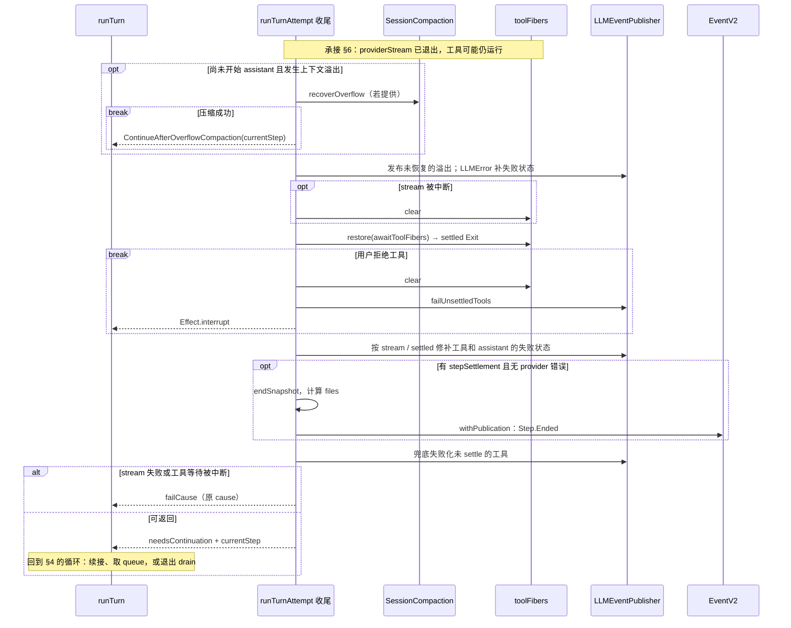
```mermaid
sequenceDiagram
  participant RN as runTurn
  participant RT as runTurnAttempt 收尾
  participant CP as SessionCompaction
  participant FS as toolFibers
  participant PB as LLMEventPublisher
  participant EV as EventV2
  Note over RT,FS: 承接 §6：providerStream 已退出，工具可能仍运行
  opt 尚未开始 assistant 且发生上下文溢出
    RT->>CP: recoverOverflow（若提供）
    break 压缩成功
      RT-->>RN: ContinueAfterOverflowCompaction(currentStep)
    end
  end
  RT->>PB: 发布未恢复的溢出；LLMError 补失败状态
  opt stream 被中断
    RT->>FS: clear
  end
  RT->>FS: restore(awaitToolFibers) → settled Exit
  break 用户拒绝工具
    RT->>FS: clear
    RT->>PB: failUnsettledTools
    RT-->>RN: Effect.interrupt
  end
  RT->>PB: 按 stream / settled 修补工具和 assistant 的失败状态
  opt 有 stepSettlement 且无 provider 错误
    RT->>RT: endSnapshot，计算 files
    RT->>EV: withPublication：Step.Ended
  end
  RT->>PB: 兜底失败化未 settle 的工具
  alt stream 失败或工具等待被中断
    RT-->>RN: failCause（原 cause）
  else 可返回
    RT-->>RN: needsContinuation + currentStep
    Note over RN: 回到 §4 的循环：续接、取 queue，或退出 drain
  end
```

收尾位于 `Effect.uninterruptibleMask` 中，但 providerStream、溢出恢复和等待工具通过 `restore` 保持可中断。退出结果被保存成 `Exit`，之后才能区分“模型流失败”“工具等待失败”和“用户明确拒绝”。不能在模型流停止时直接返回，否则正在执行的工具以及 publisher 中的未完成项都失去了收尾位置。

`Step.Ended` 的判定是存在 `stepSettlement` 且没有 provider 错误，不是简单的“所有工具成功”。工具的失败状态和 step 的结束信息分别记录；最终是否向上抛 cause，再由后面的分支决定。

收尾时按这个顺序判断：

| 步 | 条件 | 动作 |
|---|---|---|
| ① | 传了 `recoverOverflow`、还没开始输出、错误是溢出、压缩成功 | `die(continueAfterOverflowCompaction)` |
| ② | 有记下的溢出错误但没能恢复 | 现在把它 publish 出去（变成 `Step.Failed`） |
| ③ | 流以 `LLMError` 失败且发布器还没记 provider 错误 | `failUnsettledTools("Provider did not return a tool result", hostedOnly=true)` + `failAssistant(reason)` |
| ④ | 流被中断 | 清掉工具 fiber（不等它们） |
| ⑤ | — | `awaitToolFibers`：等全部工具 settle |
| ⑥ | 工具失败原因是用户拒绝 | 清 fiber，`failUnsettledTools("Tool execution interrupted")`，`Effect.interrupt` 结束整个排空 |
| ⑦ | 流或工具被中断 | `failUnsettledTools`，assistant 还活着就 `failAssistant("Provider turn interrupted")` |
| ⑧ | 工具以非中断原因失败 | `failUnsettledTools("Tool execution failed: …")` |
| ⑨ | 有 `stepSettlement` 且没 provider 错误 | 拍结束快照，算改动文件列表，发 `Step.Ended { finish, cost: 0, tokens, snapshot, files }` |
| ⑩ | 兜底 | 有 provider 错误再 fail 一次未 settle 的；流正常结束但 provider 执行的工具没给结果也 fail |
| ⑪ | 流失败 / 工具中断 | 把失败原因原样往上抛 |
| ⑫ | 正常 | 返回 `{ needsContinuation: 没 provider 错误 && needsContinuation, step }` |

---

## 9. 压缩：怎样退出并重新进入 attempt

本段展开 §5 请求前和 §8 输出前溢出两条转换路径。转换带回当前 step；重入时要重新读取历史，不能沿用压缩前已构造好的 request。

opencode v2 目前没有 provider 重试。`LLMClient` 里没有 retry，runner 头注释 "Bound provider retries" 没勾，
`SessionEvent.Retried` 定义了但没人发。一次 `LLMError` 就是这轮失败：`Step.Failed` 落库，排空结束。
所以循环外面的处理只有压缩这一种。

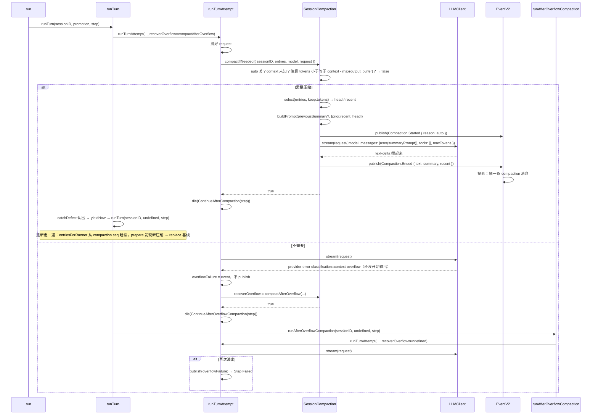
```mermaid
sequenceDiagram
  participant RN as run
  participant T as runTurn
  participant A as runTurnAttempt
  participant C as SessionCompaction
  participant LLM as LLMClient
  participant EV as EventV2
  participant R as runAfterOverflowCompaction

  RN->>T: runTurn(sessionID, promotion, step)
  T->>A: runTurnAttempt(..., recoverOverflow=compactAfterOverflow)
  A->>A: 拼好 request
  A->>C: compactIfNeeded({ sessionID, entries, model, request })
  C->>C: auto 关？context 未知？估算 tokens 小于等于 context - max(output, buffer)？→ false
  alt 需要压缩
    C->>C: select(entries, keep.tokens) → head / recent
    C->>C: buildPrompt(previousSummary?, [prior.recent, head])
    C->>EV: publish(Compaction.Started { reason: auto })
    C->>LLM: stream(request{ model, messages: [user(summaryPrompt)], tools: [], maxTokens })
    LLM-->>C: text-delta 攒起来
    C->>EV: publish(Compaction.Ended { text: summary, recent })
    EV->>EV: 投影：插一条 compaction 消息
    C-->>A: true
    A->>A: die(ContinueAfterCompaction(step))
    T->>T: catchDefect 认出 → yieldNow → runTurn(sessionID, undefined, step)
    Note over T: 重新走一遍：entriesForRunner 从 compaction.seq 起读，prepare 发现新压缩 → replace 基线
  else 不需要
    A->>LLM: stream(request)
    LLM-->>A: provider-error classification=context-overflow（还没开始输出）
    A->>A: overflowFailure = event，不 publish
    A->>C: recoverOverflow = compactAfterOverflow(...)
    C-->>A: true
    A->>A: die(ContinueAfterOverflowCompaction(step))
    T->>R: runAfterOverflowCompaction(sessionID, undefined, step)
    R->>A: runTurnAttempt(..., recoverOverflow=undefined)
    A->>LLM: stream(request)
    alt 再次溢出
      A->>A: publish(overflowFailure) → Step.Failed
    end
  end
```

### 压缩判定

```
estimate({ system, messages, tools }) > context - max(generation.maxTokens ?? limits.output, buffer)
```

`estimate` 是 `Token.estimate(JSON.stringify(...))`，粗估。`context` 来自 `model.route.defaults.limits.context`（目录里的 `limit.context`）。
`buffer` 默认 20000。`auto: false` 可以关掉。

### 压缩实现

1. `select`：非 compaction 消息序列化成行（user / assistant / tool call / tool result 截 2000 字 / system / synthetic / shell），从尾往头攒 8000 token 当 `recent`，其余是 `head`。
2. 有旧 `compaction` 消息就把它的 `recent` 拼在 `head` 前面，`summary` 当 `previousSummary`。这样摘要是滚动更新的。
3. 摘要提示词本身超过 `context - summaryOutput` 就放弃。
4. 用同一个模型发请求，`tools: []`，`maxTokens = min(output, 4096)`。注意用的是当前 agent，不是那个叫 `compaction` 的隐藏 agent（那是 v1 用的）。
5. 成功发 `Compaction.Ended`，投影插一条 `compaction` 消息，`seq` 是这条事件的序号。

### 压缩后的历史

`SessionHistory.messageRows`（`history.ts`）：有 compaction 时取 `seq >= compaction.seq`，所以历史变成 `[compaction 消息, 之后的所有消息]`。
`to-llm-message.ts` 把 compaction 消息渲染成一条 user 消息：`<conversation-checkpoint><summary>…</summary><recent-context>…</recent-context></conversation-checkpoint>`。
同时 `SessionContextEpoch.prepare`（`context-epoch.ts`）发现 `compaction.seq > baseline_seq`，走 `replace` 重新渲染一份完整基线，`baseline_seq` 设成 compaction 的 seq。
所以压缩后的第一轮请求里，系统提示词是重新生成的完整基线，历史只有一条 checkpoint 加上之后的消息。

### 溢出恢复

`runTurn` 传 `compactAfterOverflow` 进去；`runAfterOverflowCompaction` 不传。
第二次溢出时 `recoverOverflow` 是 undefined，溢出恢复的条件不成立，于是把溢出错误 publish 出去变成 `Step.Failed`。
如果溢出发生在已经开始输出之后（`hasAssistantStarted()` 为真），不恢复，直接当普通错误。文档："recovery never loops or replays partial side effects."

### 转换信号：TurnTransitionError

名字叫 Error，实际是用来控制流程的信号。`runTurnAttempt` 在请求前压缩成功或流退出后溢出恢复成功时，通过 `Effect.die(new TurnTransitionError(...))` 将转换信号交给外层。`runTurn` 的 `catchDefect` 识别信号，选择再次调用自己或切换到 `runAfterOverflowCompaction`。这条路径跨过了普通的 `{ needsContinuation, step }` 返回值。
两种转换：`ContinueAfterCompaction`（主动压缩完成）和 `ContinueAfterOverflowCompaction`（溢出后压缩完成），都带当前 `step`。

### 压缩对象与预算

`SessionCompaction` 集中实现图中的预算判断、摘要请求与压缩事件发布。`make({ events, llm, config })` 返回两个函数。

| 函数 / 常量 | 内容 |
|---|---|
| `DEFAULT_BUFFER = 20_000` | 上下文窗口要留的余量（token） |
| `DEFAULT_KEEP_TOKENS = 8_000` | 压缩后保留最近原文的 token 预算 |
| `TOOL_OUTPUT_MAX_CHARS = 2_000` | 序列化进摘要提示词时每个工具输出截到多长 |
| `SUMMARY_OUTPUT_TOKENS = 4_096` | 摘要请求的 `maxTokens` 上限 |
| `SUMMARY_TEMPLATE` | 摘要必须遵守的 Markdown 模板：Objective / Important Details / Work State(Completed, Active, Blocked) / Next Move / Relevant Files |
| `settings(config)` | 从配置文档里取 `compaction.auto` / `buffer` / `keep.tokens`，多份配置后者覆盖前者 |
| `select(entries, tokens)` | 把非 compaction 消息序列化成文本行，从尾往头攒到 `tokens` 预算为止，切成 `head`（要总结的）和 `recent`（保留原文的） |
| `buildPrompt({ previousSummary, context })` | 有旧摘要就带上 `<prior-summary>` 和合并规则 |
| `compactIfNeeded(input)` | `auto` 关了返回 false；估算 `system + messages + tools` 的 token，超过 `context - max(output, buffer)` 就调 `compactAfterOverflow` |
| `compactAfterOverflow(input)` | 主体逻辑。发 `Compaction.Started` → 用同一个模型发一次无工具请求→ 拼文本 → 发 `Compaction.Ended`。任何一步失败返回 false |

---

## 10. 事件提交：持久化、客户端同步与恢复

前面的 publish 最终汇到这里。先看一次持久化事件的事务边界，再看投影对象和表结构；恢复能做什么，取决于这些边界已经提交了什么。

### 事件写库

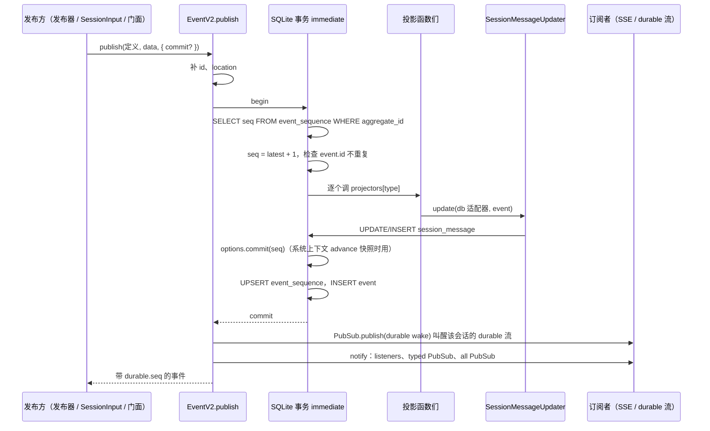
```mermaid
sequenceDiagram
  participant P as 发布方（发布器 / SessionInput / 门面）
  participant EV as EventV2.publish
  participant TX as SQLite 事务 immediate
  participant PJ as 投影函数们
  participant MU as SessionMessageUpdater
  participant SUB as 订阅者（SSE / durable 流）

  P->>EV: publish(定义, data, { commit? })
  EV->>EV: 补 id、location
  EV->>TX: begin
  TX->>TX: SELECT seq FROM event_sequence WHERE aggregate_id
  TX->>TX: seq = latest + 1，检查 event.id 不重复
  TX->>PJ: 逐个调 projectors[type]
  PJ->>MU: update(db 适配器, event)
  MU->>TX: UPDATE/INSERT session_message
  TX->>TX: options.commit(seq)（系统上下文 advance 快照时用）
  TX->>TX: UPSERT event_sequence，INSERT event
  TX-->>EV: commit
  EV->>SUB: PubSub.publish(durable wake) 叫醒该会话的 durable 流
  EV->>SUB: notify：listeners、typed PubSub、all PubSub
  EV-->>P: 带 durable.seq 的事件
```

`event` 表是数据的来源，`session_message` 相当于缓存。两者在同一个事务里写入，所以不会出现事件写进去了、消息却没更新的情况。
投影函数抛异常整个事务回滚，发布方拿到的是 defect。

### 事务内的投影：SessionProjector

`SessionProjector` 负责把事件投影成表里的数据。它在 `EventV2` 上用 `events.project(定义, 函数)` 注册了 29 个投影函数，
投影和事件写库在同一个事务里执行（`event.ts`）。

主要方法：

| 方法 | 干什么 |
|---|---|
| `run(db, event)` | 造一个 `SessionMessageUpdater.Adapter`，六个回调全是查表/改表，然后交给 `SessionMessageUpdater.update` |
| `insertMessage(db, event, message)` | `seq = event.durable.seq`，`data` 是消息去掉 `id` / `type` 后的 JSON |
| `getCurrentAssistant` 适配器 | 取 `seq` 最大的 assistant，且 `time.completed` 为空的才算"当前"。注释：新一轮开始时旧的未完成 assistant 被视为过期，不再续写 |

### 同一份消息更新逻辑：SessionMessageUpdater

`SessionMessageUpdater` 是一个纯函数 `update(adapter, event)`，对 33 种会话事件各写了一个 case，决定每个事件怎么修改消息。
它不知道底下是 SQLite 还是内存数组：`memory(state)` 给了一个数组版适配器，前端也用它。

§6 列出了事件族与主要投影结果，这里补充两条消息更新规则：

- `step.started`：先把上一条未完成的 assistant 标成 `completed`，再新建一条空 content 的 assistant。
  `snapshot.start` 从事件里带过来。
- `tool.failed`：只有 `pending` 或 `running` 才转 `error`。已经 `completed` 的不动。

### 事件服务的接口

`EventV2` 既是事件总线，也负责存储事件。

| 方法 | 干什么 |
|---|---|
| `publish(definition, data, options)` | 补 `id`（`evt_`）、`location`（从当前 Effect 环境里取 `Location.Service`，没有就不带），进 `publishEvent` |
| `publishEvent` | 定义带 `durable` 就先 `commitDurableEvent`，再 `notify`；不带直接 `notify` |
| `commitDurableEvent` | 一个 SQLite 事务（`behavior: "immediate"`）：读 `event_sequence` 拿 `latest` → `seq = latest + 1` → 检查 id 没重复 → 跑这个类型注册的全部投影函数→ 跑 `options.commit(seq)` 钩子→ upsert `event_sequence` → 插 `event`。事务外：叫醒这个聚合的 durable 订阅者 |
| `notify(event, isolate)` | 依次调 `listeners`（durable 事件时隔离异常）、按类型的 PubSub、全局 PubSub |
| `project(definition, projector)` | 注册投影函数。`SessionProjector` 的 layer 就是一串 `project` 调用 |
| `durable({ aggregateID, after })` | 返回一个流：先 `readAfter` 把库里 `seq > after` 的全读出来，再 `Stream.concat` 一个实时流，每次被唤醒就再读一次。叫醒信号是 `PubSub.sliding(1)`，连续提交合并 |
| `replay` / `replayAll` / `claim` / `remove` | 跨节点同步用的。序号不连续、owner 不匹配都会 die |

因为投影在事务里执行，事件写入和状态表更新要么都成功，要么都失败。`Prompted` 事件的投影（写 user 消息 + 标 promoted）也因此原子。

### 持久化表结构

上面这些数据最终落在六张表里。`event` 表存全部持久化事件；`session_message` 和 `session_input` 由事件投影维护；`session_context_epoch` 由 `SessionContextEpoch` 写（§5）；`session` 表目前还是由 v1 的会话事件投影。

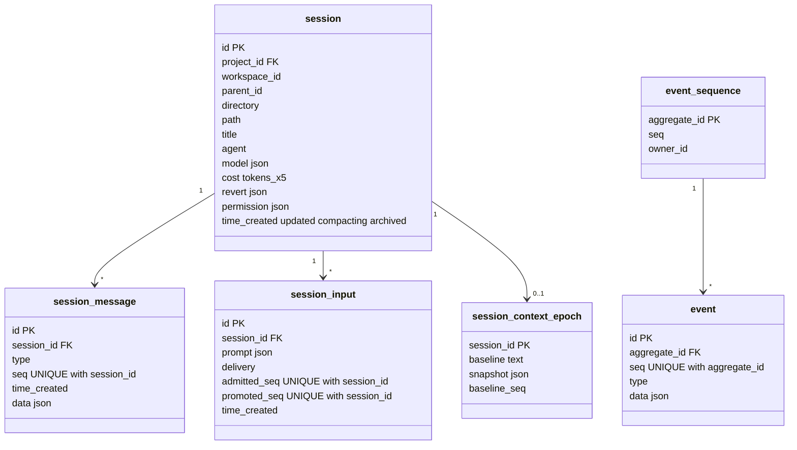
```mermaid
classDiagram
  class session {
    id PK
    project_id FK
    workspace_id
    parent_id
    directory
    path
    title
    agent
    model json
    cost tokens_x5
    revert json
    permission json
    time_created updated compacting archived
  }
  class session_message {
    id PK
    session_id FK
    type
    seq  UNIQUE with session_id
    time_created
    data json
  }
  class session_input {
    id PK
    session_id FK
    prompt json
    delivery
    admitted_seq UNIQUE with session_id
    promoted_seq UNIQUE with session_id
    time_created
  }
  class session_context_epoch {
    session_id PK
    baseline text
    snapshot json
    baseline_seq
  }
  class event {
    id PK
    aggregate_id FK
    seq UNIQUE with aggregate_id
    type
    data json
  }
  class event_sequence {
    aggregate_id PK
    seq
    owner_id
  }
  session "1" --> "*" session_message
  session "1" --> "*" session_input
  session "1" --> "0..1" session_context_epoch
  event_sequence "1" --> "*" event
```

| 表 | 定义 | 谁写 | 说明 |
|---|---|---|---|
| `session` | `core/src/session/sql.ts` | `SessionV1.Event.Created/Updated` 的投影（`projector.ts`） | 创建会话仍然走 v1 事件，v2 只是投影它。 |
| `session_message` | | `insertMessage`（`projector.ts`）和 `updateMessage` | `seq` 就是产生它的那条事件的会话序号。历史顺序按 `seq` 排，不按时间。 |
| `session_input` | | `SessionInput.projectAdmitted` / `projectPrompted` | 索引 `(session_id, promoted_seq, delivery, admitted_seq)` 就是为 `hasPending` 和 `promoteSteers` 建的。 |
| `session_context_epoch` | | `SessionContextEpoch.insert / replace / advance` | 一个会话一行。`baseline` 是发给模型的系统提示词原文，`snapshot` 是结构化快照用来比对。 |
| `event` / `event_sequence` | `core/src/event/sql.ts` | `EventV2.commitDurableEvent`（`event.ts`） | `event_sequence` 存每个聚合（会话）的最新序号；写事件时在同一个事务里读序号、跑投影、写两张表。 |

SQLite 连接在 `core/src/database/database.ts`：WAL 模式、`synchronous = NORMAL`、`busy_timeout = 5000`。
库文件位置由 `path()` 决定，`OPENCODE_DB` 环境变量可以指到 `:memory:`。

### 客户端同步

`session.events` 处理器（`server/src/handlers/session.ts`）返回 `session.events({ sessionID, after })` 的 SSE。
底层 `EventV2.durable`（`event.ts`）：先一次性读 `seq > after` 的全部，再接一个流，每次被唤醒就再查一次。
叫醒信号是容量 1 的 sliding PubSub，连续多次提交合并成一次查询。只有持久化事件会走这条流；`Text.Delta` 这类要另外订阅 `EventV2.subscribe`。
文档："The first `sessions.events(...)` contract is durable-only during both replay and live tailing."

### 崩溃恢复

进程挂了，内存里什么都没了，库里有：`session_input`（哪些输入还没取出执行）、`session_message`（历史，包括 `running` 状态的工具）、`event`（全部事件）。
重启后：

1. 客户端调 `session.resume`（或再发一条 prompt）→ `coordinator.run`（force）或 `wake`。
2. `run` 先检查 force 和待处理输入；确定需要执行后，`failInterruptedTools`（`llm.ts`）给上下文中所有 `pending` / `running` 的工具项发 `Tool.Failed("Tool execution interrupted")`。
3. 进入循环，按 promotion 取出输入并重新准备请求；空队列的显式 resume 也可以从既有历史继续。

文档里写明了还没做的部分："Post-crash continuation recovery is intentionally deferred. A wake does not infer that ambiguous provider work is safe to retry after an input has already been promoted."
也就是说：输入已取出执行、请求已发出、进程挂了，重启后 `wake` 不会自动重发请求；要靠显式 `resume`。

### 中断

`session.interrupt` → `coordinator.interrupt`（`run-coordinator.ts`）→ `Fiber.interrupt(owner)`。
runner 的 `uninterruptibleMask` 保证中断只落在 `restore` 包住的地方：等 provider 流、等工具 fiber、等权限答复。
收尾（`llm.ts`）把没结果的工具标 `Tool execution interrupted`，assistant 标 `Provider turn interrupted`。
已入库的输入不会因此删除。下次 wake 会处理尚未 promoted 的输入；已经进入历史的输入能否续跑，仍需区分显式 resume 与普通 wake。

---

## 11. 回看启动：这些服务怎样装配

运行路径中的 SessionExecution、runner 和目录上下文都通过 Effect 服务取得。本段从 CLI 启动进入，解释为何 execution 是进程级、runner 是目录级，以及接口在哪里替换成 local 实现。


```mermaid
sequenceDiagram
  participant CLI as lildax cli
  participant D as Daemon
  participant S as server routes.ts
  participant B as AppNodeBuilder
  participant LN as LayerNode
  participant LM as LocationServiceMap
  participant HTTP as HttpApiBuilder

  CLI->>D: 默认命令 daemon.transport()
  D->>D: 读 server.json 健康检查
  alt 没有健康的 server
    D->>CLI: spawn(execPath, [serve, --register])
    CLI->>S: serve 处理器 createRoutes(password)
  end
  S->>B: build(applicationServices, [[SessionExecution.node, SessionExecutionLocal.node]])
  B->>LN: hasUnbound(root, LocationServiceMap.node)
  LN-->>B: true
  B->>LM: buildLocationServiceMap(replacements)
  B->>LN: compile(root, replacements + LocationServiceMap 替换)
  LN-->>S: serviceLayer（Database, EventV2, SessionV2, SessionExecutionLocal ...）
  S->>HTTP: HttpApiBuilder.layer(Api) provide handlers, 中间件, auth, serviceLayer
  HTTP-->>CLI: 监听端口（4096 起找空闲）
  Note over LM: 目录服务此时还没建
  CLI->>HTTP: 第一个带 sessionID 的请求
  HTTP->>LM: sessionLocationLayer 查 session 表拿目录 → locations.get(ref)
  LM->>LN: hoist(locationServices, global, [Location 绑定 ref])
  LM->>LN: compile(目录级) fresh，provide compile(进程级)
  Note over LM: 构建该 Ref 的 location 服务，含 BuiltInTools、SessionRunnerLLM
  LM-->>HTTP: 提供该 Ref 的服务 Context（闲置 TTL 为 60 分钟）
```

| 步 | 代码 | 说明 |
|---|---|---|
| 1 | `cli/src/index.ts` | 命令表。默认命令 `default.ts`：取 daemon 传输参数，动态 import TUI 连上去 |
| 2 | `cli/src/services/daemon.ts` | 没有健康 server 时 `spawn` 自己跑 `serve --register` |
| 3 | `cli/src/commands/handlers/serve.ts` | `HttpRouter.serve(createRoutes(password))`，端口从 4096 往上试 |
| 4 | `server/src/routes.ts` | 装配。`SessionExecution` 未绑定节点在这里被换成本地实现 |
| 5 | `core/src/effect/app-node-builder.ts` | 自动补 `LocationServiceMap` |
| 6 | `core/src/location-services.ts` | 目录服务懒建 |
| 7 | `server/src/middleware/session-location.ts` | 每个会话请求进来先查目录再 provide |

server 启动时先构建 global 服务；某个 Location 首次被使用时，才会构建它对应的 location 服务，包括工具注册和 runner。

### 先用两个目录看这套机制在做什么

假设 server 同时处理 `/repo-a` 和 `/repo-b`。它们使用同一个 `Database`，但有各自的 `ToolRegistry`：A 注册的工具不能跑到 B 的注册表里。

如果用普通 JavaScript 手动组织，大致会写成下面这样。这里只演示对象关系，不是 OpenCode 的实际代码：

```js
const database = createDatabase()

const servicesA = {
  database,
  tools: createToolRegistry(),
}
const servicesB = {
  database,
  tools: createToolRegistry(),
}

function handleRequest(services) {
  // 使用传进来的那一份 ToolRegistry
  services.tools.materialize()
}

handleRequest(servicesA) // 使用 A 的 ToolRegistry
handleRequest(servicesB) // 使用 B 的 ToolRegistry
```

**OpenCode 也是先选好一组对象，再让处理请求的代码使用它们。** Effect 帮它传递这些对象，不用每层函数都手动接收 `services` 参数。这就是这里的依赖注入（DI）。

### `Service`：代码怎样取得这些对象

上面的 `services.tools`，在 Effect 中写成：

```ts
const tools = yield* ToolRegistry.Service
```

`ToolRegistry.Service` 是取对象用的 key。外层提供 A 的对象，这里拿到 A；外层提供 B 的对象，这里拿到 B。Effect 把保存这组对象的地方叫作 `Context`。

外层通过 `Effect.provide` 指定使用哪一组：

```ts
const program = Effect.gen(function* () {
  const tools = yield* ToolRegistry.Service
  return yield* tools.materialize()
})

// 运行 program 时，提供 A 的服务
program.pipe(Effect.provide(locations.get(refA)))

// 同一段 program，换成 B 的服务再运行
program.pipe(Effect.provide(locations.get(refB)))
```

`locations` 是 `LocationServiceMap` 的实例，负责按 Location 找到对应的服务。真实请求里，外层先从 `session` 查出 `session.location`，再选择那一组对象；`ToolRegistry` 自己不需要判断当前请求属于哪个目录。

### `Layer` 和 `LayerNode`：这些对象怎样创建

前面的示意代码直接调用了 `createToolRegistry()`。在 OpenCode 中，创建逻辑写在 `Layer` 里：先取得 `ApplicationTools`、`ToolOutputStore` 等依赖，再创建注册表和 `register`、`materialize` 方法。

具体怎么使用 Layer？下面用一个只有 `list()` 方法的 `DemoTools` 演示完整过程。它是教学示例，不是 OpenCode 的真实 `ToolRegistry`。

```ts
import { Context, Effect, Layer } from "effect"

// 定义取对象用的 key，以及对象应该有哪些方法
class DemoTools extends Context.Service<
  DemoTools,
  { readonly list: () => ReadonlyArray<string> }
>()("DemoTools") {}

// ① 定义 Layer：说明怎样创建 DemoTools 对象
const toolsLayer = Layer.effect(
  DemoTools,
  Effect.sync(() => {
    const names = ["read", "bash"]
    return { list: () => names }
  }),
)

// ② 编写使用对象的代码：这里只要求有 DemoTools，不负责创建它
const program = Effect.gen(function* () {
  const tools = yield* DemoTools
  return tools.list()
})

// ③ 把 Layer 提供给 program，再运行
const result = await Effect.runPromise(
  program.pipe(Effect.provide(toolsLayer)),
)
// result: ["read", "bash"]
```

运行到第三步时，Effect 执行 `toolsLayer` 中的创建逻辑，得到 `{ list: ... }` 对象，把它放到 `DemoTools` 这个 key 下，然后运行 `program`。所以 `yield* DemoTools` 能拿到刚才创建的对象。

注意三个动作的区别：`Layer.effect` **定义创建逻辑**；`Effect.provide(toolsLayer)` **把这份创建逻辑接给 program**；`Effect.runPromise` **开始执行，触发对象创建和 program 运行**。前两步只是组合代码，还没有执行 `names` 的初始化。

实际的 `ToolRegistry` 也是这个用法，只是创建逻辑更长，而且要先拿到 `ApplicationTools` 和 `ToolOutputStore`。这些依赖的 Layer 可以先接到它的 Layer 上，写法示意如下：

```ts
const readyLayer = registryLayer.pipe(
  Layer.provide(dependencyLayers),
)

// readyLayer 已接好依赖，再提供给使用 ToolRegistry 的业务代码
const runnable = program.pipe(Effect.provide(readyLayer))
```

这里 `dependencyLayers` 表示已经准备好的依赖 Layer，`program` 表示使用 `ToolRegistry.Service` 的业务 Effect。`Layer.provide` 给创建过程提供依赖，`Effect.provide` 给业务代码提供服务。

**上面显式提供依赖的操作，是 Effect 的 Layer 使用方式，不是 OpenCode 额外要求业务代码做的事情。** Effect 提供服务读取、依赖类型检查、实例构建和资源释放，但原生 Layer 不会像自动装配的 DI 容器那样，根据服务类型自动寻找并连接对应的实现。即使类型已经说明 `ToolRegistry` 需要 `ApplicationTools.Service`，应用仍要指定由哪个 Layer 提供它，并通过 `provide` 等组合操作接起来。这些连接通常集中在装配入口，不需要每个业务函数都写一遍。

OpenCode 为了减少这种手动组合，额外实现了 `LayerNode`：各模块在 `deps` 中声明直接依赖，`LayerNode.compile` 统一生成相应的 `Layer.provide` 连接。**依赖关系仍需显式声明，省掉的是各处手写 Layer 组合的代码。** 例如 `ToolRegistry.node`：

```ts
export const node = makeLocationNode({
  service: Service, // 本模块的 ToolRegistry.Service
  layer,           // 创建这个服务的 Layer
  deps: [ApplicationTools.node, ToolOutputStore.node],
})
```

这段声明只表达三件事：

- `service`：创建好的对象通过哪个 key 提供给业务代码。
- `layer`：用哪份创建逻辑。
- `deps`：创建前需要准备哪些依赖。

外面的 `makeLocationNode` 再说明：这个服务要按 Location 分别创建。如果用 `makeGlobalNode`，则是在这套 server 装配中共享的服务。

所以 **`LayerNode` 是一条装配记录，保存 Layer、依赖关系和 global / location 标记**。它不是服务实例。`LayerNode.compile` 沿着 `deps` 把各个 Layer 接好，之后交给 Effect 创建对象。

可以直接对照前面的普通 JavaScript：

| 普通 JavaScript 中的工作 | 这里由谁负责 |
|---|---|
| 编写 `createToolRegistry()` | `Layer` 保存创建逻辑 |
| 先准备依赖，再调用创建函数 | `LayerNode` 记录依赖，`compile` 连接各个 Layer |
| 把 `servicesA` 传给处理函数 | `Effect.provide` 提供这一组对象 |
| 从 `services.tools` 取对象 | `yield* ToolRegistry.Service` |

### global / location：什么时候创建，什么时候释放

`Database`、`EventV2` 等 global 服务在这套 server 中共享；`Config`、`ToolRegistry`、`Watcher`、`SessionRunner` 等 location 服务按 Location 分开。

`LocationServiceMap` 管理每个 Location 的那一组对象，可以先把它理解成下面这张表：

```text
LocationServiceMap
  refA → Config A、ToolRegistry A、Watcher A、SessionRunner A ...
  refB → Config B、ToolRegistry B、Watcher B、SessionRunner B ...

两组服务共用 Database、EventV2 等 global 依赖。
```

这里的 key 是 `Location.Ref`，包含 `directory` 和可选的 `workspaceID`。同一个 Ref 下的多个 session 使用同一组服务，不会每个 session 都新建一个 `ToolRegistry`。

它的生命周期按下面的顺序发生：

1. **server 启动：**先创建 global 服务，包括 `LocationServiceMap`。此时不必创建 A、B 的 location 服务。
2. **A 第一次被使用：**创建 A 的服务并保存下来。创建时只为 A 新建 location 部分，global 依赖继续共享。
3. **A 再次被使用：**取出已有对象；B 第一次被使用时，另建 B 的对象。
4. **A 暂时没人使用：**保留这组对象，方便后续请求复用。持续闲置 60 分钟后才释放；仍有人使用时不按这个闲置期限回收。
5. **释放后再次使用 A：**重新创建 A 的服务。

代码在 `core/src/location-services.ts` 的 `buildLocationServiceMap` 中实现这套规则：`LayerMap` 负责按 Ref 缓存和闲置回收；`hoist` 分离 global 依赖，`Layer.fresh` 让每个 Location 创建自己的 location 对象。

释放服务时，也要关闭它持有的资源。例如 `Watcher` 创建文件监听时登记一个清理函数，释放时执行 `unsubscribe()`。Effect 用 `Scope` 统一管理这些清理函数；管理整张 `LayerMap` 的 Scope 关闭时，也会释放它管理的资源。

### 接回一次 session 的执行

有了上面的对象关系，再看实际调用就只剩三步：

```text
SessionExecutionLocal 收到 sessionID
  → SessionStore 查出 session.location
  → LocationServiceMap 取得或创建这一组服务
  → 使用其中的 SessionRunner 执行这个 session
```

源码里最后两步写成：

```ts
SessionRunner.Service.use((runner) => runner.run({ sessionID, force })).pipe(
  Effect.provide(locations.get(session.location)),
)
```

读这段时，可以先看下面一行：`provide` 根据 `session.location` 提供对象；再看上面一行：`Service.use` 取得其中的 `SessionRunner`，调用 `run`。

`SessionExecutionLocal` 自身是 global 服务，但它没有固定保存 A 或 B 的 runner。每次执行时根据 session 选择，所以一个执行器可以处理多个 Location。

### server 装配

`applicationServices` 是进程级组：Database、EventV2、httpClient、ToolOutputStore.cleanupNode、SessionV2、PermissionSaved、PtyTicket、Credential、PtyEnvironment、LocationServiceMap。

`makeRoutes`：`AppNodeBuilder.build(applicationServices, [[SessionExecution.node, SessionExecutionLocal.node]])`，
v2 的执行器就是在这一行接进来的。`AppNodeBuilder.build`（`app-node-builder.ts`）发现图里有未绑定的 `LocationServiceMap.node` 就自动用 `buildLocationServiceMap` 补上。

两个中间件决定请求在哪个目录下执行：`sessionLocationLayer`（`server/src/middleware/session-location.ts`）从路径里的 `sessionID` 查 `session` 表拿目录；
`locationLayer`（`server/src/location.ts`）从 query `location[directory]` 或 header `x-opencode-directory` 拿，默认 `process.cwd()`。

### 本地执行实现怎样绑定到接口

`SessionExecutionLocal` 负责根据会话 id 找到会话所在目录的 runner。文件头注释：*"Current-process routing for implicit-local Locations. Future remote placement belongs here."*

它不是在收到 `wake` 时临时创建协调器。`SessionExecutionLocal` 的 layer 初始化时先取出全局的 `SessionStore` 和 `LocationServiceMap`，
然后立刻调用 `SessionRunCoordinator.make({ drain })` 创建一个进程内协调器。这里传入的 `drain(sessionID, force)` 是 local 定义的闭包：

1. 用 `SessionStore.get(sessionID)` 查出会话，拿到它的 `location`。
2. 用 `locations.get(session.location)` 取出该目录的 Effect layer。
3. 把这层目录服务 `provide` 给 `SessionRunner.Service.use(...)`，再调用 `runner.run({ sessionID, force })`。
4. 非中断错误先记日志，再原样返回给协调器处理。

`make()` 返回协调器后，local 用它组装出真正注册到 `SessionExecution.Service` token 下的对象：

```ts
SessionExecution.Service.of({
  active: coordinator.active,
  interrupt: coordinator.interrupt,
  resume: coordinator.run,
  wake: coordinator.wake,
})
```

所以运行时没有一层额外的 `SessionExecutionLocal.wake()` 转发：`SessionV2` 拿到的 `execution.wake` 本身就是这个协调器的 `wake` 函数。
反过来，协调器的 `start()` 最终执行的 `options.drain(key, force)`，就是创建协调器时由 local 传进去的那个闭包。
两者由此形成闭环：local 把并发调度交给 Coordinator，Coordinator 需要真正排空会话时再回调 local；local 再负责按 location 找到 `SessionRunner`。

### 会话门面的其他入口

`SessionV2.Service` 是 HTTP 处理器调用的会话接口，只负责查询、写库和唤醒执行器，自己不跑循环。

它本身没有状态，构造时取六个依赖：`Database`、`EventV2`、`ProjectV2`、`SessionExecution`、`SessionStore`、`LocationServiceMap`。

主要方法：

| 方法 | 干什么 | 谁调它 |
|---|---|---|
| `create(input)` | 已存在直接返回；否则 upsert `project` 表，发 v1 的 `Session.Created` 事件（投影时插 `session` 表）。并发创建撞车时 `SessionAlreadyProjected` 被捕获，读已存在的那条返回 | `session.create` 处理器 |
| `get` / `list` / `messages` / `message` / `context` | 都是读操作。`messages` 按 `seq` 分页，游标是 messageID | 各处理器 |
| `events(input)` | 先回放库里的事件，再接上实时事件，最后过滤成会话事件（§10） | `session.events` 处理器（SSE） |
| `history(input)` | 按分页获取会话的事件历史 | `session.history` 处理器 |
| `prompt(input)` | 完整流程见 §3，大步骤是（整个过程不可中断）：查会话存在 → `resolvePrompt` → 没给 id 就 `msg_` 新建 → `delivery` 默认 `steer` → `SessionInput.admit` → 比对幂等 → `resume !== false` 就 `execution.wake` → 返回 `Admitted` | `session.prompt` 处理器 |
| `switchAgent` / `switchModel` | 只发切换事件，不做其他事。换成同个模型同变体就直接返回 | 处理器 |
| `compact` / `wait` / `shell` / `skill` | 全部返回 `OperationUnavailableError`。v2 还没实现 | 处理器映射成 503 |
| `active` | 直接返回协调器里正在运行的会话集合 | `session.active` |
| `resume(sessionID)` | 强制跑一次，把积压的待处理输入跑完 | 客户端显式续跑 |
| `interrupt(sessionID)` | 调执行器的中断接口，外面包一层不可中断保证能发出去 | `session.interrupt` |
| `revert.stage / clear / commit` | 委托 `SessionRevert`，注意 `stage` 和 `clear` 要 `Effect.provide(locations.get(session.location))`，因为 `Snapshot` 是目录级服务 | 处理器 |
