## 1. 包与依赖

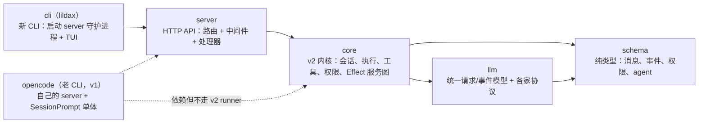
```mermaid
graph LR
  CLI["cli（lildax）<br/>新 CLI：启动 server 守护进程 + TUI"] --> SRV
  SRV["server<br/>HTTP API：路由 + 中间件 + 处理器"] --> CORE
  CORE["core<br/>v2 内核：会话、执行、工具、权限、Effect 服务图"] --> LLM
  CORE --> SCHEMA
  LLM["llm<br/>统一请求/事件模型 + 各家协议"] --> SCHEMA
  SCHEMA["schema<br/>纯类型：消息、事件、权限、agent"]
  OLD["opencode（老 CLI，v1）<br/>自己的 server + SessionPrompt 单体"] -.依赖但不走 v2 runner.-> CORE
  OLD -.-> SRV
```

| 包 | 目录 | 行数 | 干什么 | 本篇重点 |
|---|---|---|---|---|
| `@opencode-ai/core` | `core/src` | 32961 | v2 内核。会话门面、执行器、runner、工具、权限、事件总线、Effect 服务图 | §2–§15 全部 |
| `@opencode-ai/server` | `server/src` | 小 | 把 core 的服务挂成 HTTP API。`routes.ts` 是装配点 | §6、§7 |
| `@opencode-ai/cli` | `cli/src` | 69 行入口 | 新 CLI，二进制名 `lildax`。`serve` 起 server，默认命令起 TUI 连 server | §7 |
| `@opencode-ai/llm` | `llm/src` | 2684 | `LLMRequest` / `LLMEvent` / `Message` 统一模型，8 种协议，13 家 provider | §2.3、§5.3 |
| `@opencode-ai/schema` | `schema/src` | 2561 | 纯类型定义。会话消息、会话事件、权限规则、agent 信息都在这 | §2 |
| `opencode`（老包） | `opencode/src` | 76082 | v1 实现。它有自己的 HTTP server 和 1631 行的 `SessionPrompt`。 |  |

---

## 2. 数据模型

这一节先讲清楚数据怎么流转，再分别看每类数据的定义。

pi 的状态放在内存里，事件只用来通知上层应用。opencode v2 反过来，把会话事件当成唯一的数据来源：会话里的任何变化都先写成一条事件存进数据库，会话消息、待处理输入这些表，都是根据事件内容更新出来的（代码里叫投影，projection）。`session_message` 表只有 `projector.ts` 里的投影函数会写，其他地方都只读。

一次对话里数据是这样转的：

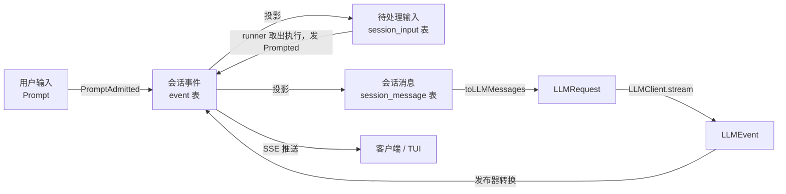
```mermaid
graph LR
  P["用户输入<br/>Prompt"] -->|"PromptAdmitted"| EV["会话事件<br/>event 表"]
  EV -->|"投影"| IN["待处理输入<br/>session_input 表"]
  IN -->|"runner 取出执行，发 Prompted"| EV
  EV -->|"投影"| MSG["会话消息<br/>session_message 表"]
  MSG -->|"toLLMMessages"| REQ["LLMRequest"]
  REQ -->|"LLMClient.stream"| LE["LLMEvent"]
  LE -->|"发布器转换"| EV
  EV -->|"SSE 推送"| APP["客户端 / TUI"]
```

和 pi 对照着看：

- 会话事件：相当于 pi 的 `AgentEvent`，但用处更多。pi 的事件只推给上层应用；opencode 的会话事件一边推给客户端，一边是写库的唯一入口。
- 会话消息：相当于 pi 的 `AgentMessage`，是产品层的对话历史，类型比模型需要的多（压缩摘要、shell 输出、agent 切换等）。runner 读它来构造请求，客户端读它来显示历史。
- llm 包的 `Message` / `LLMRequest`：相当于 pi 的 `Message` / `Context`，是真正发给模型的格式。每轮由 `toLLMMessages` 从会话消息转出来，不存库。
- `LLMEvent`：相当于 pi 的 `AssistantMessageEvent`，是模型流式返回的原始事件，由发布器（§4.5）转成会话事件后才进入系统。
- 用户输入：不会直接变成消息，先作为待处理输入排队，等 runner 取出执行时才生成 user 消息（§10）。

另外还有两类配置数据：会话信息（用哪个 agent、哪个模型）和 agent 信息（系统提示词、步数上限、权限规则），runner 构造请求时会读。

### 2.1 会话事件

会话事件是 v2 的数据来源，最后一列说明了每种事件会更新哪张表。事件定义在 `schema/src/session-event.ts`。每个事件用 `Event.define({ type, durable?, schema })` 造（`schema/src/event.ts`）。
带 `durable: { aggregate: "sessionID", version }` 的事件会写库，不带的只广播。

| 事件族 | 类型名前缀 | 持久化？ | 谁发 | 投影成什么 |
|---|---|---|---|---|
| `PromptAdmitted` | `session.next.prompt.admitted` | 是 | `SessionInput.admit`（`input.ts`） | 插一行 `session_input`（`projector.ts`） |
| `Prompted` | `session.next.prompted` | 是 | `SessionInput.publish`（`input.ts`），取出执行时 | 给 `session_input` 行填 `promoted_seq` 并 插一条 `user` 消息（`projector.ts`），同一个事务 |
| `Step.Started / Ended / Failed` | `session.next.step.*` | 是（Ended/Failed 是 v2 版本） | 发布器 `startAssistant`（`publish-llm-event.ts`）/ runner / `failAssistant` | 新建 / 收尾 / 标错一条 `assistant` 消息 |
| `Text.Started / Ended` | `session.next.text.*` | 是 | 发布器 | 往 assistant 的 `content` 加一段 text |
| `Text.Delta` | `session.next.text.delta` | 否 | 发布器 | 在线订阅者拿到增量，`message-updater` 也会累加（内存投影用） |
| `Reasoning.*` | `session.next.reasoning.*` | Started/Ended 是，Delta 否 | 发布器 | 和上面 text 一样，只是写 reasoning 段 |
| `Tool.Input.Started / Ended` | `session.next.tool.input.*` | 是 | 发布器 | 新建一个 `pending` 状态的 tool 项；Ended 填原始 input 文本 |
| `Tool.Input.Delta` | | 否 | 发布器 | 不投影（`message-updater.ts`） |
| `Tool.Called` | `session.next.tool.called` | 是 | 发布器 | tool 项转 `running`，input 变成对象 |
| `Tool.Progress / Success / Failed` | `session.next.tool.*` | 是 | 工具执行完 / 失败 / 中断 | tool 项转 `completed` / `error` |
| `ContextUpdated` | `session.next.context.updated` | 是 | `SessionContextEpoch.prepare`（`context-epoch.ts`） | 插一条 `system` 消息 |
| `Compaction.Started / Ended` | `session.next.compaction.*` | 是 | `SessionCompaction.compactAfterOverflow`（`compaction.ts`） | Ended 插一条 `compaction` 消息 |
| `Compaction.Delta` | | 否 | 目前没人发 | — |
| `AgentSwitched / ModelSwitched` | | 是 | 门面 `switchAgent` / `switchModel`（`session.ts`） | 改 `session` 表的 agent/model 列，并插一条标记消息 |
| `RevertEvent.Staged / Cleared / Committed` | | 是 | `SessionRevert`（`revert.ts`） | 改 `session.revert` 列；Committed 删掉边界之后的消息和输入行（`projector.ts`） |
| `Retried` | `session.next.retried` | 是 | 目前没人发（投影那行被注释掉了，`projector.ts`） | — |
| `Moved` | | 是 | 会话跨目录移动 | 改 `session` 表的 directory/workspace |

持久化事件的完整清单在 `session-event.ts` 的 `DurableDefinitions` 里。

### 2.2 会话消息

会话消息是由事件投影出来的对话历史，下表第二列就是生成它的事件。定义在 `schema/src/session-message.ts`，core 里通过 `core/src/session/message.ts` 转发。

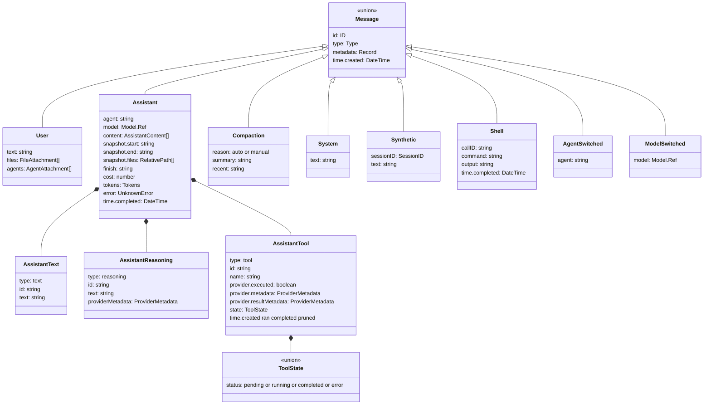
```mermaid
classDiagram
  class Message {
    <<union>>
    id: ID
    type: Type
    metadata: Record
    time.created: DateTime
  }
  class User {
    text: string
    files: FileAttachment[]
    agents: AgentAttachment[]
  }
  class Assistant {
    agent: string
    model: Model.Ref
    content: AssistantContent[]
    snapshot.start: string
    snapshot.end: string
    snapshot.files: RelativePath[]
    finish: string
    cost: number
    tokens: Tokens
    error: UnknownError
    time.completed: DateTime
  }
  class Compaction {
    reason: auto or manual
    summary: string
    recent: string
  }
  class System {
    text: string
  }
  class Synthetic {
    sessionID: SessionID
    text: string
  }
  class Shell {
    callID: string
    command: string
    output: string
    time.completed: DateTime
  }
  class AgentSwitched {
    agent: string
  }
  class ModelSwitched {
    model: Model.Ref
  }
  class AssistantText {
    type: text
    id: string
    text: string
  }
  class AssistantReasoning {
    type: reasoning
    id: string
    text: string
    providerMetadata: ProviderMetadata
  }
  class AssistantTool {
    type: tool
    id: string
    name: string
    provider.executed: boolean
    provider.metadata: ProviderMetadata
    provider.resultMetadata: ProviderMetadata
    state: ToolState
    time.created ran completed pruned
  }
  class ToolState {
    <<union>>
    status: pending or running or completed or error
  }
  Message <|-- User
  Message <|-- Assistant
  Message <|-- Compaction
  Message <|-- System
  Message <|-- Synthetic
  Message <|-- Shell
  Message <|-- AgentSwitched
  Message <|-- ModelSwitched
  Assistant *-- AssistantText
  Assistant *-- AssistantReasoning
  Assistant *-- AssistantTool
  AssistantTool *-- ToolState
```

| 类型 | 谁生成它 | 发给模型时变成什么（`to-llm-message.ts`） |
|---|---|---|
| `user` | `Prompted` 事件投影（`message-updater.ts`） | 一条 `role: user`，文本 + 附件转 media |
| `assistant` | `Step.Started` 事件新建，后续事件逐步填 `content` | 一条 `role: assistant`（text / reasoning / tool-call），每个本地执行的工具结果单独一条 `role: tool` |
| `compaction` | `Compaction.Ended` 事件 | 一条 `role: user`，内容是 `<conversation-checkpoint>` 包着 summary 和 recent |
| `system` | `ContextUpdated` 事件，系统上下文变化时追加 | `Message.system(text)` |
| `synthetic` | `Synthetic` 事件，目前只有 v1 兼容路径会发 | 一条 `role: user` |
| `shell` | `Shell.Started/Ended`，v2 门面的 `shell` 方法还没实现（`session.ts`） | 一条 `role: user`，"Shell command: … 输出" |
| `agent-switched` / `model-switched` | `AgentSwitched` / `ModelSwitched` 事件 | 不发，返回空数组 |

`ToolState` 的四种状态对应一个工具调用的生命周期：

| 状态 | 字段 | 进入这个状态的事件 |
|---|---|---|
| `pending` | `input: string`（还在流式接收的原始 JSON 文本） | `Tool.Input.Started`（`message-updater.ts`） |
| `running` | `input: Record`、`structured`、`content` | `Tool.Called`，input 已经是解析好的对象 |
| `completed` | `input`、`content`、`structured`、`outputPaths`、`attachments`、`result` | `Tool.Success` |
| `error` | `input`、`content`、`structured`、`error`、`result` | `Tool.Failed` |

`provider.executed` 为真表示这个工具是模型供应商自己执行的（比如内置 web search），本地不跑。
发给模型时，供应商执行的工具把 call 和 result 都放进 assistant 消息的 content 里；本地执行的只放 call，
result 单独成一条 `role: tool` 消息（`to-llm-message.ts`）。

### 2.3 llm 包

他自己封装了一套 LLMClient（`@opencode-ai/llm`）。每轮把会话消息转成这里的 `Message`，拼成 `LLMRequest` 发出去；模型返回 `LLMEvent` 流，再由发布器转成会话事件。

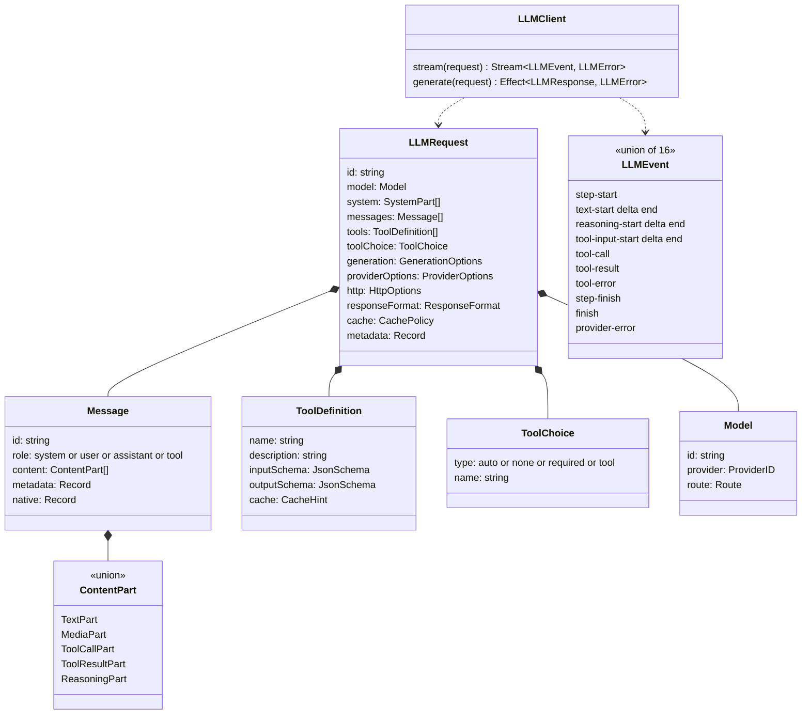
```mermaid
classDiagram
  class LLMRequest {
    id: string
    model: Model
    system: SystemPart[]
    messages: Message[]
    tools: ToolDefinition[]
    toolChoice: ToolChoice
    generation: GenerationOptions
    providerOptions: ProviderOptions
    http: HttpOptions
    responseFormat: ResponseFormat
    cache: CachePolicy
    metadata: Record
  }
  class Message {
    id: string
    role: system or user or assistant or tool
    content: ContentPart[]
    metadata: Record
    native: Record
  }
  class ContentPart {
    <<union>>
    TextPart
    MediaPart
    ToolCallPart
    ToolResultPart
    ReasoningPart
  }
  class ToolDefinition {
    name: string
    description: string
    inputSchema: JsonSchema
    outputSchema: JsonSchema
    cache: CacheHint
  }
  class ToolChoice {
    type: auto or none or required or tool
    name: string
  }
  class LLMEvent {
    <<union of 16>>
    step-start
    text-start delta end
    reasoning-start delta end
    tool-input-start delta end
    tool-call
    tool-result
    tool-error
    step-finish
    finish
    provider-error
  }
  class Model {
    id: string
    provider: ProviderID
    route: Route
  }
  class LLMClient {
    stream(request) Stream~LLMEvent, LLMError~
    generate(request) Effect~LLMResponse, LLMError~
  }
  LLMRequest *-- Message
  LLMRequest *-- ToolDefinition
  LLMRequest *-- ToolChoice
  LLMRequest *-- Model
  Message *-- ContentPart
  LLMClient ..> LLMRequest
  LLMClient ..> LLMEvent
```

| 类 | 文件 | 说明 |
|---|---|---|
| `LLMRequest` | `llm/src/schema/messages.ts` | runner 每轮用 `LLM.request({...})`（`llm/src/llm.ts`）构造。§8.3 逐字段讲每个字段从哪来。 |
| `Message` | | 四种角色。`native` 是 provider 原生字段的透传。 |
| `ToolDefinition` | | `Tool.make` 的 `definition(name)` 把 Effect Schema 转成 JSON Schema 填进来（`core/src/tool/tool.ts`）。 |
| `LLMEvent` | `llm/src/schema/events.ts` | 16 种。runner 的发布器把它们一一映射成会话事件（§4.5）。`ProviderErrorEvent` 带 `classification`，值为 `context-overflow` 时触发溢出压缩。 |
| `Model` | `route/client.ts` | 不只是 id，还带 `route`（协议、端点、鉴权、默认限额）。`model.route.defaults.limits.context` 就是上下文窗口大小，压缩判定用它。 |
| `LLMClient` | `llm/src/route/client.ts` | 没有重试。`grep -n 'retry' llm/src/route/*.ts` 是空的。`specs/v2/session.md` 明说"Provider timeout, retry, and watchdog policy is intentionally deferred"。 |
| `isContextOverflowFailure` | `llm/src/provider-error.ts` | 判断一个错误是不是上下文溢出。匹配用的文案正则有 28 条。 |

### 2.4 输入与配置

用户输入先规范成 `Prompt`，入库后是一条 `Admitted` 记录，存在 `session_input` 表里排队。`Session.Info`、`Agent.Info` 和权限规则是 runner 构造请求、执行工具时要读的配置。

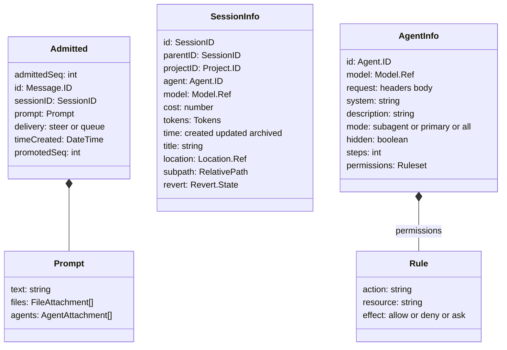
```mermaid
classDiagram
  class Prompt {
    text: string
    files: FileAttachment[]
    agents: AgentAttachment[]
  }
  class Admitted {
    admittedSeq: int
    id: Message.ID
    sessionID: SessionID
    prompt: Prompt
    delivery: steer or queue
    timeCreated: DateTime
    promotedSeq: int
  }
  class SessionInfo {
    id: SessionID
    parentID: SessionID
    projectID: Project.ID
    agent: Agent.ID
    model: Model.Ref
    cost: number
    tokens: Tokens
    time: created updated archived
    title: string
    location: Location.Ref
    subpath: RelativePath
    revert: Revert.State
  }
  class AgentInfo {
    id: Agent.ID
    model: Model.Ref
    request: headers body
    system: string
    description: string
    mode: subagent or primary or all
    hidden: boolean
    steps: int
    permissions: Ruleset
  }
  class Rule {
    action: string
    resource: string
    effect: allow or deny or ask
  }
  Admitted *-- Prompt
  AgentInfo *-- Rule : permissions
```

| 类 | 文件 | 说明 |
|---|---|---|
| `Prompt` | `schema/src/prompt.ts` | 用户输入的规范形式。`FileAttachment` 带 `uri` / `mime` / `name` / `description`。门面层的 `resolvePrompt`（`core/src/session.ts`）负责从 `data:` URI 或文件名推 mime。 |
| `Admitted` | `schema/src/session-input.ts` | `session_input` 表的一行。`admittedSeq` 是 `PromptAdmitted` 事件的会话序号；`promotedSeq` 为空表示还没被取出执行。`hasPending` 查的就是 `promoted_seq IS NULL`。 |
| `Session.Info` | `schema/src/session.ts` | 从 `session` 表一行转出来（`core/src/session/info.ts`）。注意 `agent` 和 `model` 都可选，runner 用 `agents.select` 和 `models.resolve` 兜底。 |
| `Agent.Info` | `schema/src/agent.ts` | `steps` 是步数上限，`permissions` 是规则列表，`system` 是这个 agent 专属的系统提示词。内置七个 agent 在 `core/src/plugin/agent.ts` 注册。 |
| `Rule` / `Ruleset` | `schema/src/permission.ts` | 权限规则。`action` 是工具名或 `edit` / `external_directory` 这类动作名，`resource` 是通配符。后写的规则赢（`findLast`，§5.4）。 |

### 2.5 数据库表

上面这些数据最终落在六张表里。`event` 表存全部持久化事件；`session_message` 和 `session_input` 由事件投影维护；`session_context_epoch` 由 `SessionContextEpoch` 写（§13）；`session` 表目前还是由 v1 的会话事件投影。

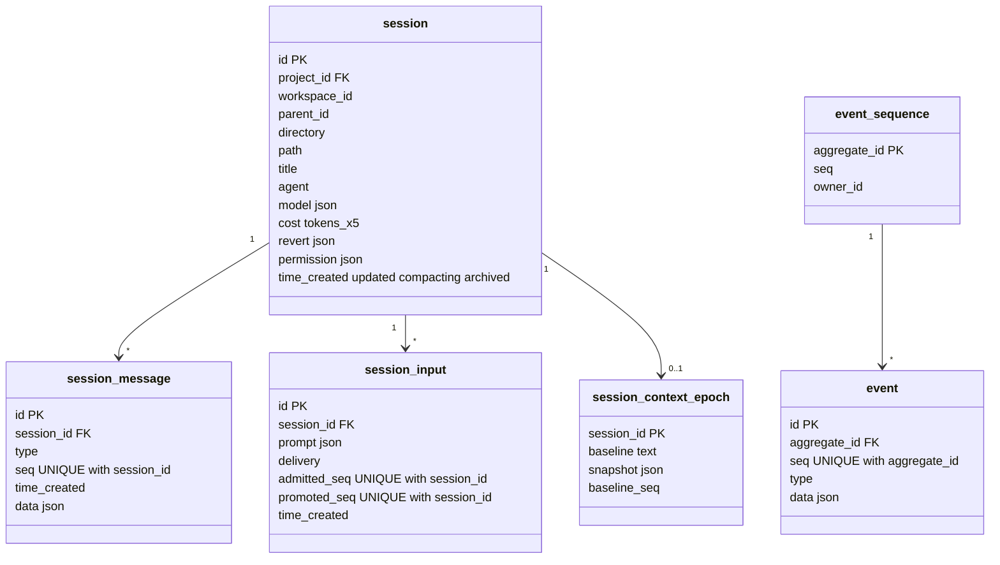
```mermaid
classDiagram
  class session {
    id PK
    project_id FK
    workspace_id
    parent_id
    directory
    path
    title
    agent
    model json
    cost tokens_x5
    revert json
    permission json
    time_created updated compacting archived
  }
  class session_message {
    id PK
    session_id FK
    type
    seq  UNIQUE with session_id
    time_created
    data json
  }
  class session_input {
    id PK
    session_id FK
    prompt json
    delivery
    admitted_seq UNIQUE with session_id
    promoted_seq UNIQUE with session_id
    time_created
  }
  class session_context_epoch {
    session_id PK
    baseline text
    snapshot json
    baseline_seq
  }
  class event {
    id PK
    aggregate_id FK
    seq UNIQUE with aggregate_id
    type
    data json
  }
  class event_sequence {
    aggregate_id PK
    seq
    owner_id
  }
  session "1" --> "*" session_message
  session "1" --> "*" session_input
  session "1" --> "0..1" session_context_epoch
  event_sequence "1" --> "*" event
```

| 表 | 定义 | 谁写 | 说明 |
|---|---|---|---|
| `session` | `core/src/session/sql.ts` | `SessionV1.Event.Created/Updated` 的投影（`projector.ts`） | 创建会话仍然走 v1 事件，v2 只是投影它。 |
| `session_message` | | `insertMessage`（`projector.ts`）和 `updateMessage` | `seq` 就是产生它的那条事件的会话序号。历史顺序按 `seq` 排，不按时间。 |
| `session_input` | | `SessionInput.projectAdmitted` / `projectPrompted` | 索引 `(session_id, promoted_seq, delivery, admitted_seq)` 就是为 `hasPending` 和 `promoteSteers` 建的。 |
| `session_context_epoch` | | `SessionContextEpoch.insert / replace / advance` | 一个会话一行。`baseline` 是发给模型的系统提示词原文，`snapshot` 是结构化快照用来比对。 |
| `event` / `event_sequence` | `core/src/event/sql.ts` | `EventV2.commitDurableEvent`（`event.ts`） | `event_sequence` 存每个聚合（会话）的最新序号；写事件时在同一个事务里读序号、跑投影、写两张表。 |

SQLite 连接在 `core/src/database/database.ts`：WAL 模式、`synchronous = NORMAL`、`busy_timeout = 5000`。
库文件位置由 `path()` 决定，`OPENCODE_DB` 环境变量可以指到 `:memory:`。

---

## 3. 会话门面层

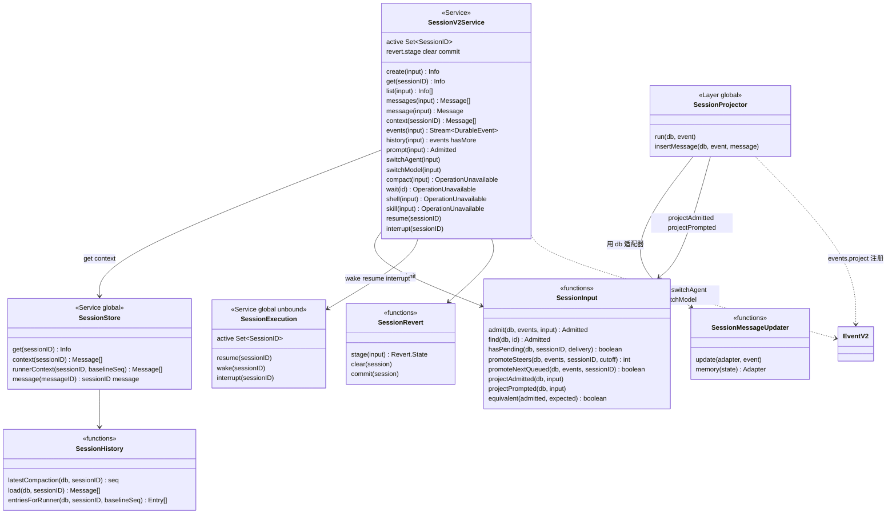
```mermaid
classDiagram
  class SessionV2Service {
    <<Service>>
    create(input) Info
    get(sessionID) Info
    list(input) Info[]
    messages(input) Message[]
    message(input) Message
    context(sessionID) Message[]
    events(input) Stream~DurableEvent~
    history(input) events hasMore
    prompt(input) Admitted
    switchAgent(input)
    switchModel(input)
    compact(input) OperationUnavailable
    wait(id) OperationUnavailable
    shell(input) OperationUnavailable
    skill(input) OperationUnavailable
    active Set~SessionID~
    resume(sessionID)
    interrupt(sessionID)
    revert.stage clear commit
  }
  class SessionStore {
    <<Service global>>
    get(sessionID) Info
    context(sessionID) Message[]
    runnerContext(sessionID, baselineSeq) Message[]
    message(messageID) sessionID message
  }
  class SessionInput {
    <<functions>>
    admit(db, events, input) Admitted
    find(db, id) Admitted
    hasPending(db, sessionID, delivery) boolean
    promoteSteers(db, events, sessionID, cutoff) int
    promoteNextQueued(db, events, sessionID) boolean
    projectAdmitted(db, input)
    projectPrompted(db, input)
    equivalent(admitted, expected) boolean
  }
  class SessionHistory {
    <<functions>>
    latestCompaction(db, sessionID) seq
    load(db, sessionID) Message[]
    entriesForRunner(db, sessionID, baselineSeq) Entry[]
  }
  class SessionProjector {
    <<Layer global>>
    run(db, event)
    insertMessage(db, event, message)
  }
  class SessionMessageUpdater {
    <<functions>>
    update(adapter, event)
    memory(state) Adapter
  }
  class SessionRevert {
    <<functions>>
    stage(input) Revert.State
    clear(session)
    commit(session)
  }
  class SessionExecution {
    <<Service global unbound>>
    active Set~SessionID~
    resume(sessionID)
    wake(sessionID)
    interrupt(sessionID)
  }
  SessionV2Service --> SessionStore : get context
  SessionV2Service --> SessionInput : admit
  SessionV2Service --> SessionExecution : wake resume interrupt
  SessionV2Service --> SessionRevert
  SessionV2Service ..> EventV2 : publish switchAgent switchModel
  SessionStore --> SessionHistory
  SessionProjector --> SessionMessageUpdater : 用 db 适配器
  SessionProjector --> SessionInput : projectAdmitted projectPrompted
  SessionProjector ..> EventV2 : events.project 注册
```

### 3.1 `SessionV2.Service`

`SessionV2.Service` 是 HTTP 处理器调用的会话接口，只负责查询、写库和唤醒执行器，自己不跑循环。

它本身没有状态，构造时取六个依赖：`Database`、`EventV2`、`ProjectV2`、`SessionExecution`、`SessionStore`、`LocationServiceMap`。

主要方法：

| 方法 | 干什么 | 谁调它 |
|---|---|---|
| `create(input)` | 已存在直接返回；否则 upsert `project` 表，发 v1 的 `Session.Created` 事件（投影时插 `session` 表）。并发创建撞车时 `SessionAlreadyProjected` 被捕获，读已存在的那条返回 | `session.create` 处理器 |
| `get` / `list` / `messages` / `message` / `context` | 都是读操作。`messages` 按 `seq` 分页，游标是 messageID | 各处理器 |
| `events(input)` | 先回放库里的事件，再接上实时事件，最后过滤成会话事件（§12.2） | `session.events` 处理器（SSE） |
| `history(input)` | 按分页获取会话的事件历史 | `session.history` 处理器 |
| `prompt(input)` | 完整流程见 §8.1，大步骤是（整个过程不可中断）：查会话存在 → `resolvePrompt` → 没给 id 就 `msg_` 新建 → `delivery` 默认 `steer` → `SessionInput.admit` → 比对幂等 → `resume !== false` 就 `execution.wake` → 返回 `Admitted` | `session.prompt` 处理器 |
| `switchAgent` / `switchModel` | 只发切换事件，不做其他事。换成同个模型同变体就直接返回 | 处理器 |
| `compact` / `wait` / `shell` / `skill` | 全部返回 `OperationUnavailableError`。v2 还没实现 | 处理器映射成 503 |
| `active` | 直接返回协调器里正在运行的会话集合 | `session.active` |
| `resume(sessionID)` | 强制跑一次，把积压的待处理输入跑完 | 客户端显式续跑 |
| `interrupt(sessionID)` | 调执行器的中断接口，外面包一层不可中断保证能发出去 | `session.interrupt` |
| `revert.stage / clear / commit` | 委托 `SessionRevert`，注意 `stage` 和 `clear` 要 `Effect.provide(locations.get(session.location))`，因为 `Snapshot` 是目录级服务 | 处理器 |

在服务图里，它被声明为进程级节点（`makeGlobalNode`），依赖七个节点。其中 `SessionExecution.node` 是未绑定节点（`execution.ts`），
由装配方替换成真正的实现（server 用 `SessionExecutionLocal.node`，`server/src/routes.ts`）。

这里就是会话门面和后面执行层接上的地方。`SessionV2.Service` 在创建时取出 `SessionExecution.Service`，保存为 `execution`；
`prompt()` 把输入持久化为 `Admitted` 后，只要 `resume !== false`，就调用 `execution.wake(admitted.sessionID)`。
它不会自己创建 `SessionRunner`，也不需要知道执行发生在哪个目录。

server 启动时的替换关系是：

```text
SessionV2.Service 依赖 SessionExecution.Service（接口）
                         │
server/routes.ts         └─ 用 SessionExecutionLocal.node 提供实现
                                                │
运行时 execution.wake(sessionID) ──────────────┘
```

因此，一次 `session.prompt` 从门面层进入执行层的完整链路是：

```text
SessionHandler
  → SessionV2.Service.prompt
  → SessionInput.admit                  把输入写入数据库
  → SessionExecution.Service.wake       通知“有新工作”
  → coordinator.wake                    local 实现直接绑定的方法
  → coordinator.start
  → SessionExecutionLocal 提交的 drain 回调
  → LocationServiceMap.get
  → SessionRunner.run
```

`wake` 不等待整轮模型执行完成：协调器把 `drain` 放到后台 fiber 后就返回，所以 `prompt()` 可以直接把 `Admitted` 返回给 HTTP 客户端；
真正的 runner 随后再从数据库取出这条输入执行。`resume: false` 则只入库、不唤醒，留给之后显式 `session.resume`。

### 3.2 `SessionStore`

`SessionStore` 是只读的，给 runner 和门面提供会话信息和历史消息，全部直接查表。

| 方法 | 干什么 |
|---|---|
| `get(sessionID)` | 查 `session` 表一行，`fromRow` 转 `Info` |
| `context(sessionID)` | `SessionHistory.load`：最近一次压缩之后的全部消息，加上基线序号之后的 system 消息 |
| `runnerContext(sessionID, baselineSeq)` | 和 `context` 一样，只是调用方显式传基线序号，供 runner 用 |
| `message(messageID)` | 按 id 取单条消息 |

### 3.3 `SessionInput`

`SessionInput` 管理 `session_input` 表，入库和取出执行两个操作都在这里。

| 函数 | 干什么 | 谁调它 |
|---|---|---|
| `admit(db, events, input)` | 先 `find`，已有就直接返回（幂等）。否则发 `PromptAdmitted` 事件，拿回的 `event.durable.seq` 就是 `admittedSeq`。投影撞到 `LifecycleConflict`（同 id 已经是正式消息）时再 `find` 一次 | `SessionV2.prompt` |
| `projectAdmitted(db, input)` | 投影函数。如果 `session_message` 里已经有这个 id，抛 `LifecycleConflict`；否则插一行，`promoted_seq` 空 | `SessionProjector` |
| `projectPrompted(db, input)` | 投影函数。`UPDATE ... SET promoted_seq WHERE promoted_seq IS NULL`；没更新到就检查已存在行是否一致；都没有就插一行（v1 兼容路径） | `SessionProjector` |
| `hasPending(db, sessionID, delivery)` | `SELECT 1 WHERE promoted_seq IS NULL AND delivery = ? LIMIT 1` | `SessionRunner.run` 每轮结束时 |
| `promoteSteers(db, events, sessionID, cutoff)` | 取所有 `delivery = steer AND promoted_seq IS NULL AND admitted_seq <= cutoff`，按 `admitted_seq` 升序逐条发 `Prompted` 事件。返回条数 | `runTurnAttempt` |
| `promoteNextQueued(db, events, sessionID)` | 取一条 `queue`，发 `Prompted`。返回是否有 | `runTurnAttempt` |
| `publish(...)` | 上面两个取输入共用的底层函数。发 `Prompted` 时如果撞 `LifecycleConflict` 且该行已经 promoted，就当成功 | — |
| `equivalent(admitted, expected)` | delivery 相同且 prompt 编码后 JSON 相等 | `SessionV2.prompt` 做幂等校验 |

`cutoff` 的作用：`runTurnAttempt` 在取出执行前先读当前会话的最新事件序号（`llm.ts`），只取出执行这个序号之前入库的 steer。
这样本轮运行期间新来的插话不会中途被取出来执行，要等到下一轮。

### 3.4 `SessionProjector`

`SessionProjector` 负责把事件投影成表里的数据。它在 `EventV2` 上用 `events.project(定义, 函数)` 注册了 29 个投影函数，
投影和事件写库在同一个事务里执行（`event.ts`）。

主要方法：

| 方法 | 干什么 |
|---|---|
| `run(db, event)` | 造一个 `SessionMessageUpdater.Adapter`，六个回调全是查表/改表，然后交给 `SessionMessageUpdater.update` |
| `insertMessage(db, event, message)` | `seq = event.durable.seq`，`data` 是消息去掉 `id` / `type` 后的 JSON |
| `getCurrentAssistant` 适配器 | 取 `seq` 最大的 assistant，且 `time.completed` 为空的才算"当前"。注释：新一轮开始时旧的未完成 assistant 被视为过期，不再续写 |

### 3.5 `SessionMessageUpdater`

`SessionMessageUpdater` 是一个纯函数 `update(adapter, event)`，对 33 种会话事件各写了一个 case，决定每个事件怎么修改消息。
它不知道底下是 SQLite 还是内存数组：`memory(state)` 给了一个数组版适配器，前端也用它。

§2.2 的表已经列出了每个 case 对应的状态变化，这里补充两条：

- `step.started`：先把上一条未完成的 assistant 标成 `completed`，再新建一条空 content 的 assistant。
  `snapshot.start` 从事件里带过来。
- `tool.failed`：只有 `pending` 或 `running` 才转 `error`。已经 `completed` 的不动。

### 3.6 `SessionHistory`

| 函数 | 干什么 |
|---|---|
| `latestCompaction` | 查最新一条压缩消息的序号 |
| `messageRows` | 上下文的 SQL 定义：有压缩时取 `seq >= compaction.seq`，或者是 `system` 且 `seq > baselineSeq`；没压缩时取全部，但 `system` 消息只取 `seq > baselineSeq` 的 |
| `entriesForRunner` | 返回带序号的消息列表，压缩模块靠序号切分要总结和保留的部分 |

system 消息要看 `baselineSeq`，是因为基线序号之前的 system 消息已经被合并进系统上下文的 `baseline` 文本了，再发一遍就重复。

---

## 4. 执行层

这一层包含从唤醒到发请求的全部逻辑。

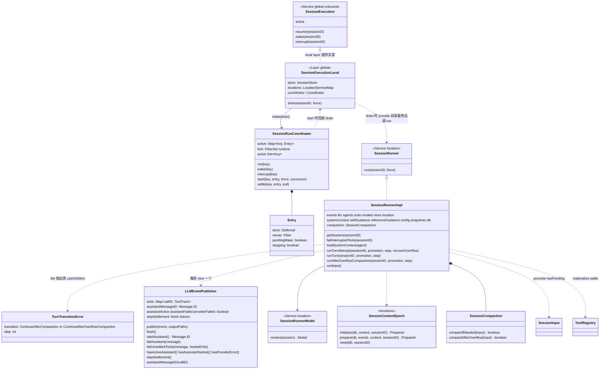
```mermaid
classDiagram
  class SessionExecutionLocal {
    <<Layer global>>
    store: SessionStore
    locations: LocationServiceMap
    coordinator: Coordinator
    drain(sessionID, force)
  }
  class SessionRunCoordinator {
    active: Map~Key, Entry~
    fork: FiberSet runtime
    run(key)
    wake(key)
    interrupt(key)
    active Set~Key~
    start(key, entry, force, successor)
    settle(key, entry, exit)
  }
  class SessionExecution {
    <<Service global unbound>>
    active
    resume(sessionID)
    wake(sessionID)
    interrupt(sessionID)
  }
  class Entry {
    done: Deferred
    owner: Fiber
    pendingWake: boolean
    stopping: boolean
  }
  class SessionRunner {
    <<Service location>>
    run(sessionID, force)
  }
  class SessionRunnerImpl {
    events llm agents tools models store location
    systemContext skillGuidance referenceGuidance config snapshots db
    compaction: SessionCompaction
    getSession(sessionID)
    failInterruptedTools(sessionID)
    loadSystemContext(agent)
    runTurnAttempt(sessionID, promotion, step, recoverOverflow)
    runTurn(sessionID, promotion, step)
    runAfterOverflowCompaction(sessionID, promotion, step)
    run(input)
  }
  class TurnTransitionError {
    transition: ContinueAfterCompaction or ContinueAfterOverflowCompaction
    step: int
  }
  class LLMEventPublisher {
    tools: Map~callID, ToolTrack~
    assistantMessageID: Message.ID
    assistantActive assistantFailed providerFailed: boolean
    stepSettlement: finish tokens
    publish(event, outputPaths)
    flush()
    startAssistant() Message.ID
    failAssistant(message)
    failUnsettledTools(message, hostedOnly)
    hasActiveAssistant() hasAssistantStarted() hasProviderError()
    stepSettlement()
    assistantMessageID(callID)
  }
  class SessionRunnerModel {
    <<Service location>>
    resolve(session) Model
  }
  class SessionContextEpoch {
    <<functions>>
    initialize(db, context, sessionID) Prepared
    prepare(db, events, context, sessionID) Prepared
    reset(db, sessionID)
  }
  class SessionCompaction {
    compactIfNeeded(input) boolean
    compactAfterOverflow(input) boolean
  }
  SessionExecution <|.. SessionExecutionLocal : local layer 提供实现
  SessionExecutionLocal --> SessionRunCoordinator : make(drain)
  SessionRunCoordinator *-- Entry
  SessionRunCoordinator ..> SessionExecutionLocal : start 时回调 drain
  SessionExecutionLocal ..> SessionRunner : drain 时 provide 目录服务后调 run
  SessionRunner <|.. SessionRunnerImpl
  SessionRunnerImpl ..> TurnTransitionError : die 抛出再 catchDefect
  SessionRunnerImpl ..> LLMEventPublisher : 每轮 new 一个
  SessionRunnerImpl --> SessionRunnerModel
  SessionRunnerImpl ..> SessionContextEpoch
  SessionRunnerImpl *-- SessionCompaction
  SessionRunnerImpl ..> SessionInput : promote hasPending
  SessionRunnerImpl ..> ToolRegistry : materialize settle
```

### 4.1 `SessionExecutionLocal`

`SessionExecutionLocal` 负责根据会话 id 找到会话所在目录的 runner。文件头注释：*"Current-process routing for implicit-local Locations. Future remote placement belongs here."*

它不是在收到 `wake` 时临时创建协调器。`SessionExecutionLocal` 的 layer 初始化时先取出全局的 `SessionStore` 和 `LocationServiceMap`，
然后立刻调用 `SessionRunCoordinator.make({ drain })` 创建一个进程内协调器。这里传入的 `drain(sessionID, force)` 是 local 定义的闭包：

1. 用 `SessionStore.get(sessionID)` 查出会话，拿到它的 `location`。
2. 用 `locations.get(session.location)` 取出该目录的 Effect layer。
3. 把这层目录服务 `provide` 给 `SessionRunner.Service.use(...)`，再调用 `runner.run({ sessionID, force })`。
4. 非中断错误先记日志，再原样返回给协调器处理。

`make()` 返回协调器后，local 用它组装出真正注册到 `SessionExecution.Service` token 下的对象：

```ts
SessionExecution.Service.of({
  active: coordinator.active,
  interrupt: coordinator.interrupt,
  resume: coordinator.run,
  wake: coordinator.wake,
})
```

所以运行时没有一层额外的 `SessionExecutionLocal.wake()` 转发：`SessionV2` 拿到的 `execution.wake` 本身就是这个协调器的 `wake` 函数。
反过来，协调器的 `start()` 最终执行的 `options.drain(key, force)`，就是创建协调器时由 local 传进去的那个闭包。
两者由此形成闭环：local 把并发调度交给 Coordinator，Coordinator 需要真正排空会话时再回调 local；local 再负责按 location 找到 `SessionRunner`。

### 4.2 `SessionRunCoordinator`

`SessionRunCoordinator` 给每个 key 一把锁：同一个 key 串行执行，不同 key 并发执行，运行期间收到的多次 wake 合并成一次后续运行。

字段：

| 字段 | 含义 |
|---|---|
| `active: Map<Key, Entry>` | 正在跑的 key。不在里面就是空闲 |
| `fork` | `FiberSet.makeRuntime`，用来起后台 fiber |
| `Entry.done` | 这次执行结束时完成的 Deferred，`run` 的调用者会 await 它，等执行结束 |
| `Entry.owner` | 跑 `drain` 的 fiber，`interrupt` 就是打断它 |
| `Entry.pendingWake` | 运行中又来了 wake，置真。结束后决定要不要起后继 |
| `Entry.stopping` | `interrupt` 置真。让 settle 时不起后继，让新的 `run` 等它死透再开始 |

主要方法：

| 方法 | 干什么 |
|---|---|
| `run(key)` | 有 entry：`stopping` 就等它 done 再递归 `run`；否则直接等 done（加入）。没 entry：新建，`start(key, entry, force = true)`，等 done |
| `wake(key)` | 有 entry：`pendingWake = true`，返回。没 entry：新建，`start(key, entry, force = false)` |
| `interrupt(key)` | `stopping = true`，`pendingWake = false`，`Fiber.interrupt(owner)` |
| `start(key, entry, force, successor)` | 起一个 fiber 跑 `drain(key, force)`，结束时调 `settle`。后继 fiber 先 `yieldNow` 让一下 |
| `settle(key, entry, exit)` | 成功且没在停且 `pendingWake` 为真：清标志，复用同一个 entry 再 `start` 一次（后继）。否则：有 `pendingWake` 就造新 entry 起后继，没有就从 `active` 删掉；最后完成 `done` |

两个入口的区别：`run` 传 `force = true`，runner 即使没有待办也会跑一轮；`wake` 传 `force = false`，没待办直接返回。
`specs/v2/session.md` 里的说明："`run` is an explicit resume … `wake` reports newly recorded durable inbox work."

### 4.3 `SessionRunner`

`SessionRunner` 从已经记录的历史出发，把待处理的输入跑完。接口只有一个方法 `run({ sessionID, force })`，不接收消息参数。

错误类型写在方法签名里（`index.ts`）：`RunError = LLMError | ModelError | MessageDecodeError | ContextSnapshotDecodeError | InitializationBlocked | ToolOutputStore.Error`。
少处理一种，编译就会报错。

字段（构造 layer 时取，`llm.ts`）：13 个服务加一个 `compaction` 对象。其中 `location` 是这个 runner 绑定的目录，后面用来检查会话是不是还在这个目录下。

主要方法：

| 方法 | 干什么 | 谁调它 |
|---|---|---|
| `run(input)` | 用双层循环把待处理输入跑完，详见 §10 | `SessionExecutionLocal.drain` |
| `runTurn(sessionID, promotion, step)` | 调 `runTurnAttempt` 并传入 `compaction.compactAfterOverflow` 作为溢出恢复函数；捕获 `TurnTransitionError`：压缩后重来一次 `runTurn`，溢出压缩后转 `runAfterOverflowCompaction` | `run` |
| `runAfterOverflowCompaction(...)` | 和 `runTurn` 一样但不传溢出恢复函数。再溢出就 die："Post-compaction provider attempt cannot recover another overflow" | `runTurn` |
| `runTurnAttempt(sessionID, promotion, step, recoverOverflow?)` | 跑完一轮对话的完整流程，详见 §8.2 | 上面两个 |
| `failInterruptedTools(sessionID)` | 遍历上下文里所有 assistant 的 tool 项，`pending` 或 `running` 的发 `Tool.Failed`，文案 "Tool execution interrupted" | `run` 开头 |
| `loadSystemContext(agent)` | 并发加载三个上下文源（注册表、技能引导、引用引导），`SystemContext.combine` | `runTurnAttempt` |
| `isUserDeclined(cause)` | 失败原因里有 `PermissionV2.DeclinedError` 或 `QuestionV2.RejectedError` 就算用户拒绝 | `runTurnAttempt` |

### 4.4 `TurnTransitionError`

名字叫 Error，实际是用来控制流程的信号。`runTurnAttempt` 嵌套很深（在 `Stream.runForEach` 的回调里），要让上层重新跑一轮，
最简单的办法是用 `Effect.die(new TurnTransitionError(...))` 直接抛到外层，上层 `catchDefect` 识别出来后重新开始。
两种转换：`ContinueAfterCompaction`（主动压缩完成）和 `ContinueAfterOverflowCompaction`（溢出后压缩完成），都带当前 `step`。

### 4.5 `createLLMEventPublisher`

`createLLMEventPublisher` 把 `llm.stream` 返回的 16 种 `LLMEvent` 转成会话事件，再 `events.publish`。每轮创建一个，只在这一轮内使用。
文件注释："Persist one provider turn without executing tools or starting a continuation turn."

字段：

| 字段 | 含义 |
|---|---|
| `tools: Map<callID, {assistantMessageID, name, inputEnded, called, settled, providerExecuted, providerMetadata}>` | 这一轮见过的每个工具调用的状态机 |
| `assistantMessageID` | 这一轮的 assistant 消息 id。第一个需要它的事件到来时才创建（`startAssistant`），创建时发 `Step.Started` |
| `assistantActive` / `assistantFailed` / `providerFailed` | 三个布尔。runner 收尾时靠它们决定发什么 |
| `stepSettlement` | `step-finish` 事件带来的 `finish` 原因和 token 用量 |
| `text` / `reasoning` / `toolInput` | 三个 `fragments` 累加器：`start(id)` 开一个桶，`append` 攒，`end` 把桶里的拼成完整字符串发 `*.Ended` 事件 |

主要方法：

| 方法 | 干什么 |
|---|---|
| `publish(event, outputPaths)` | 大 switch。`text-delta` 发 `Text.Delta`（不持久化）并攒桶；`text-end` 发 `Text.Ended`（持久化）。`tool-call`：桶没关先关，发 `Tool.Called`。`tool-result`：成功发 `Tool.Success`，错误发 `Tool.Failed`。`step-finish`：flush 全部桶，记 `stepSettlement`。`provider-error`：`providerFailed = true`，`failAssistant` |
| `flush()` | 把三个桶里没关的都关掉（发 Ended 事件）。runner 用 `Effect.ensuring` 保证流结束一定 flush（`llm.ts`） |
| `failAssistant(message)` | 发 `Step.Failed`。只发一次 |
| `failUnsettledTools(message, hostedOnly)` | 所有没 `settled` 的工具发 `Tool.Failed`。`hostedOnly` 为真只处理 provider 执行的 |
| `assistantMessageID(callID)` | 给 runner 查这个工具调用属于哪条 assistant |

一致性检查很严格：同一个 id 重复 start、name 变了、result 比 call 先到，都会 `Effect.die`。
也就是不假设 provider 返回的流式数据一定正确。

### 4.6 `SessionRunnerModel`

`SessionRunnerModel` 把会话的 `model: { providerID, id, variant }` 变成 llm 包的 `Model`（带路由、鉴权、限额）。

| 方法 | 干什么 |
|---|---|
| `resolve(session)` | 会话指定了模型就从目录里找；没指定用 `catalog.model.default()`；默认的不支持就找第一个支持的。找不到分别抛 `ModelUnavailableError` / `ModelNotSelectedError` |
| `fromCatalogModel(model, credential)` | 只支持三种 API：`@ai-sdk/openai`（走 Responses 协议）、`@ai-sdk/anthropic`、`@ai-sdk/openai-compatible`（必须有 url）。其他抛 `UnsupportedApiError` |
| `withVariant(model, variantID)` | 变体的 headers / body 用 immer 合并进模型 |
| `withDefaults(model, route)` | 把目录里的 `limit.context` / `limit.output` 塞进 route 的 `limits`，压缩判定读的就是这里 |

### 4.7 `SessionContextEpoch`

`SessionContextEpoch` 管理 `session_context_epoch` 表，详见 §13。

| 函数 | 干什么 |
|---|---|
| `initialize(db, context, sessionID)` | 表里没有就观察一遍上下文源、拍快照、插一行，返回 `{ baseline, baselineSeq }`；有就返回 undefined |
| `prepare(db, events, context, sessionID)` | 表里已有：比对。有新压缩就 `replace`（整个换新基线）；否则 `reconcile`，变了就发 `ContextUpdated` 事件，并在事件的 `commit` 钩子里 `advance` 快照 |
| `reset(db, sessionID)` | 删行。会话移动目录时用 |

### 4.8 `SessionCompaction`

`SessionCompaction` 负责判断要不要压缩、生成摘要、发压缩事件，详见 §11。`make({ events, llm, config })` 返回两个函数。

| 函数 / 常量 | 内容 |
|---|---|
| `DEFAULT_BUFFER = 20_000` | 上下文窗口要留的余量（token） |
| `DEFAULT_KEEP_TOKENS = 8_000` | 压缩后保留最近原文的 token 预算 |
| `TOOL_OUTPUT_MAX_CHARS = 2_000` | 序列化进摘要提示词时每个工具输出截到多长 |
| `SUMMARY_OUTPUT_TOKENS = 4_096` | 摘要请求的 `maxTokens` 上限 |
| `SUMMARY_TEMPLATE` | 摘要必须遵守的 Markdown 模板：Objective / Important Details / Work State(Completed, Active, Blocked) / Next Move / Relevant Files |
| `settings(config)` | 从配置文档里取 `compaction.auto` / `buffer` / `keep.tokens`，多份配置后者覆盖前者 |
| `select(entries, tokens)` | 把非 compaction 消息序列化成文本行，从尾往头攒到 `tokens` 预算为止，切成 `head`（要总结的）和 `recent`（保留原文的） |
| `buildPrompt({ previousSummary, context })` | 有旧摘要就带上 `<prior-summary>` 和合并规则 |
| `compactIfNeeded(input)` | `auto` 关了返回 false；估算 `system + messages + tools` 的 token，超过 `context - max(output, buffer)` 就调 `compactAfterOverflow` |
| `compactAfterOverflow(input)` | 主体逻辑。发 `Compaction.Started` → 用同一个模型发一次无工具请求→ 拼文本 → 发 `Compaction.Ended`。任何一步失败返回 false |

---

## 5. 工具与权限层

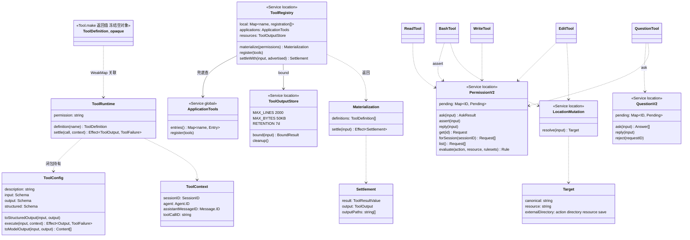
```mermaid
classDiagram
  class ToolDefinition_opaque {
    <<Tool.make 返回值 冻结空对象>>
  }
  class ToolRuntime {
    permission: string
    definition(name) ToolDefinition
    settle(call, context) Effect~ToolOutput, ToolFailure~
  }
  class ToolConfig {
    description: string
    input: Schema
    output: Schema
    structured: Schema
    toStructuredOutput(input, output)
    execute(input, context) Effect~Output, ToolFailure~
    toModelOutput(input, output) Content[]
  }
  class ToolContext {
    sessionID: SessionID
    agent: Agent.ID
    assistantMessageID: Message.ID
    toolCallID: string
  }
  class ToolRegistry {
    <<Service location>>
    local: Map~name, registration[]~
    applications: ApplicationTools
    resources: ToolOutputStore
    materialize(permissions) Materialization
    register(tools)
    settleWith(input, advertised) Settlement
  }
  class Materialization {
    definitions: ToolDefinition[]
    settle(input) Effect~Settlement~
  }
  class Settlement {
    result: ToolResultValue
    output: ToolOutput
    outputPaths: string[]
  }
  class ApplicationTools {
    <<Service global>>
    entries() Map~name, Entry~
    register(tools)
  }
  class ToolOutputStore {
    <<Service location>>
    MAX_LINES 2000
    MAX_BYTES 50KB
    RETENTION 7d
    bound(input) BoundResult
    cleanup()
  }
  class PermissionV2 {
    <<Service location>>
    pending: Map~ID, Pending~
    ask(input) AskResult
    assert(input)
    reply(input)
    get(id) Request
    forSession(sessionID) Request[]
    list() Request[]
    evaluate(action, resource, rulesets) Rule
  }
  class QuestionV2 {
    <<Service location>>
    pending: Map~ID, Pending~
    ask(input) Answer[]
    reply(input)
    reject(requestID)
  }
  class LocationMutation {
    <<Service location>>
    resolve(input) Target
  }
  class Target {
    canonical: string
    resource: string
    externalDirectory: action directory resource save
  }
  class BashTool
  class EditTool
  class ReadTool
  class WriteTool
  class QuestionTool
  ToolDefinition_opaque ..> ToolRuntime : WeakMap 关联
  ToolRuntime ..> ToolConfig : 闭包持有
  ToolRuntime ..> ToolContext
  ToolRegistry --> ApplicationTools : 兜底查
  ToolRegistry --> ToolOutputStore : bound
  ToolRegistry ..> Materialization : 返回
  Materialization ..> Settlement
  BashTool ..> PermissionV2 : assert
  BashTool ..> LocationMutation : resolve
  EditTool ..> PermissionV2
  EditTool ..> LocationMutation
  ReadTool ..> PermissionV2
  WriteTool ..> PermissionV2
  QuestionTool ..> QuestionV2 : ask
  QuestionTool ..> PermissionV2
  LocationMutation ..> Target
```

### 5.1 `Tool.make`

`Tool.make` 把描述、输入 Schema、输出 Schema 和执行函数包成一个不透明的工具值。
返回的是 `Object.freeze({})`，实际内容存在模块级的 `WeakMap` 里。
`tool/AGENTS.md` 里说明了这是有意这样设计的："A tool value is opaque: its codecs, executor, definition derivation, and catalog permission declaration are private runtime details."

`Runtime` 三个成员：

| 成员 | 干什么 |
|---|---|
| `definition(name)` | 按名字造 `ToolDefinition`，Schema → JSON Schema，缓存 |
| `settle(call, context)` | 执行链：解码 `call.input`（失败 → `ToolFailure: Invalid tool input`）→ `config.execute(input, context)` → 编码输出（失败 → `ToolFailure: invalid value for its output schema`）→ 有 `structured` 就再算一份结构化输出 → `toModelOutput` 生成给模型看的 content；没给就字符串输出直接当 text |
| `permission` | `Tool.withPermission(tool, "edit")` 可以把权限动作名改成别的。`edit` / `write` / `apply_patch` 三个都声明成 `edit`，这样一条禁止编辑的规则就能同时关掉三个工具 |

### 5.2 `ToolRegistry`

`ToolRegistry` 是目录级的注册表，把进程级的应用工具和目录级的本地工具合在一起，按权限过滤出这一轮能用的工具，并负责执行。

| 方法 | 干什么 | 谁调它 |
|---|---|---|
| `register(tools)` | 校验名字（`/^[A-Za-z][A-Za-z0-9_-]{0,63}$/`），按名字压栈。Scope 关闭时自动弹栈（`addFinalizer`），露出上一个 | 每个内置工具的 layer（`bash.ts`, `edit.ts` …） |
| `materialize(permissions)` | 应用工具打底，本地工具覆盖同名；再删掉 `whollyDisabled` 的（规则 `resource: "*"` 且 `effect: "deny"`）。返回 `{ definitions, settle }`，`settle` 闭包持有这一刻的注册表快照 | `runTurnAttempt`，每轮一次 |
| `settleWith(input, advertised)` | 找注册项（本地优先）；注册项的 `identity` 和 materialize 时的不一致 → "Stale tool call"；调 `Tool.settle`；`ToolFailure` 变成 `{ result: { type: "error" } }`；成功输出交给 `ToolOutputStore.bound` 截断 | `Materialization.settle` |

AGENTS.md 里对注册表有三条约定：不依赖 `PermissionV2`、不做执行授权（授权在每个工具自己的 `execute` 里）；
按定义过滤只决定工具在目录里是否可见，不代表允许执行；`settle` 是唯一执行工具、截断输出的地方。

### 5.3 `ToolOutputStore`

`ToolOutputStore` 在工具输出太长时把完整内容写到文件，只给模型头尾预览和文件路径。

`bound(input)`：把 content 里的 text 拼起来（没 content 就 JSON 化 `structured`）；
行数 ≤ 2000 且字节 ≤ 50KB 原样返回；否则写到 `<data>/tool-output/tool_<id>`，返回 `boundedPreview`（头 + "... output truncated; full content saved to … ..." + 尾）。
限额可以在配置的 `tool_output.max_lines / max_bytes` 改。`cleanup` 删 7 天前的文件，server 启动时挂了个 `cleanupNode`。

### 5.4 `PermissionV2`

`PermissionV2` 是工具副作用之前的一道门。它不负责执行工具，只回答三个结果：

```text
allow：直接继续执行
deny：直接阻止，不询问用户
ask：暂停当前工具，等用户选择 once / always / reject
```

权限实际在两个时机使用：

1. `ToolRegistry.materialize` 在把工具列表发给模型前，隐藏被规则完整禁用的工具。例如某个 action 对 `resource: "*"` 是 deny，模型就不会看到它。
2. 模型真的调用工具后，工具在产生副作用之前调用 `permission.assert(...)`，对这一次操作的具体目标再判断。第一步只是减少模型可见的工具，不代替这里的执行检查。

`Tool.withPermission(tool, "edit")` 只告诉注册表“这个工具按哪个 action 做可见性过滤”，不会自动执行授权；真正的 `assert` 仍由工具在正确的副作用边界前调用。

#### 一次权限请求里有什么

假设模型要运行 `git status`，工具会构造类似这样的请求：

```ts
yield* permission.assert({
  sessionID,
  agent,
  action: "bash",
  resources: ["git status"],
  save: ["git status"],
  source: { type: "tool", messageID, callID },
})
```

| 字段 | 白话含义 |
|---|---|
| `action` | 要做哪类操作。通常是工具名，也可以是 `edit`、`external_directory` 这类共用权限名 |
| `resources` | 这次实际要操作什么。它只是用于匹配规则的字符串；这里是命令，读写工具里通常是文件路径 |
| `save` | 用户选择 `always` 时要记住哪些字符串。它可以和 `resources` 不同，也可以不提供 |
| `sessionID` / `agent` | 用哪个会话和 agent 的规则来判断 |
| `source` | 是哪条 assistant 消息里的哪个 tool call 发起了请求，供客户端定位和显示 |

一条规则就是 `{ action, resource, effect }`。`action` 和 `resource` 都支持通配符；多条规则同时匹配时，排在最后的那条生效。
例如：

```ts
[
  { action: "*",    resource: "*",             effect: "allow" },
  { action: "read", resource: "*.env",         effect: "ask" },
  { action: "read", resource: "*.env.example", effect: "allow" },
]
```

这表示一般操作允许，读取 `.env` 要问用户，而读取 `.env.example` 仍然允许。完全没有规则匹配时，默认结果是 `ask`，不是自动允许。

#### `assert` 怎样暂停工具，再由 UI 唤醒

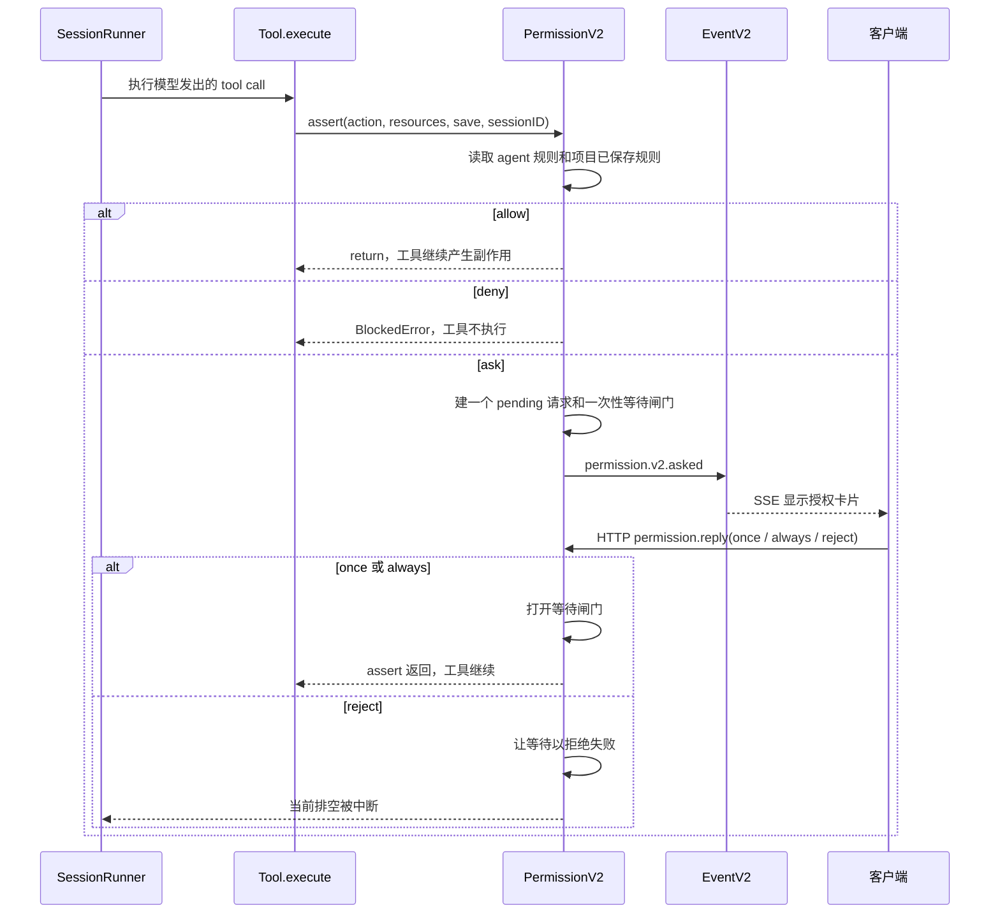
```mermaid
sequenceDiagram
  participant RN as SessionRunner
  participant TL as Tool.execute
  participant PM as PermissionV2
  participant EV as EventV2
  participant UI as 客户端

  RN->>TL: 执行模型发出的 tool call
  TL->>PM: assert(action, resources, save, sessionID)
  PM->>PM: 读取 agent 规则和项目已保存规则
  alt allow
    PM-->>TL: return，工具继续产生副作用
  else deny
    PM-->>TL: BlockedError，工具不执行
  else ask
    PM->>PM: 建一个 pending 请求和一次性等待闸门
    PM->>EV: permission.v2.asked
    EV-->>UI: SSE 显示授权卡片
    UI->>PM: HTTP permission.reply(once / always / reject)
    alt once 或 always
      PM->>PM: 打开等待闸门
      PM-->>TL: assert 返回，工具继续
    else reject
      PM->>PM: 让等待以拒绝失败
      PM-->>RN: 当前排空被中断
    end
  end
```

代码里的 `Deferred` 就是图中的“一次性等待闸门”：`assert` 在 `Deferred.await` 停住；`reply` 成功或失败这个 Deferred，原来那个工具 fiber 才继续或退出。
等待中的请求放在 `pending` Map，客户端也通过 `list` / `forSession` / `get` 读取它们。目录服务被释放时，所有还在等待的 Deferred 都会按拒绝处理，避免工具永远挂住。

三个回复的区别：

| 回复 | 后果 |
|---|---|
| `once` | 只打开当前请求的等待闸门，不写数据库；下次相同操作仍重新判断 |
| `always` | 请求带有 `save` 时，把其中的字符串作为 allow 规则写进当前 project 的 `PermissionSaved` 表，再放行当前请求；同会话里其他现在也能命中这些规则的 pending 请求会一起放行。没有 `save` 时只放行当前请求 |
| `reject` | 拒绝当前请求，并把同一会话里其他 pending 请求一起拒绝；没有反馈文案时，runner 把它识别成用户拒绝并停止本次排空 |

#### 规则最终怎样合并

判断顺序不是简单地把所有规则拼起来：

1. 根据 `sessionID` 找到会话，再确定当前 agent，取它配置的 permission rules；找不到 agent 时使用全 deny。
2. 先只看 agent 规则。如果这次任一 resource 被 agent 明确 deny，立即 deny。项目里记住的 `always` 不能覆盖 agent 的硬禁止。
3. 没有硬禁止，再把项目已保存的 allow 规则放到 agent 规则后面。因为后面的匹配规则优先，它可以把原来的 ask 变成 allow。
4. 一个请求可以有多个 resources：任一个 deny，整体 deny；否则任一个 ask，整体 ask；全部 allow 才整体 allow。

主要入口可以归纳成：

| 方法 | 谁使用 | 行为 |
|---|---|---|
| `assert(input)` | 工具执行代码 | 完成判断；allow 立即返回，deny 报错，ask 发事件并等待用户回复 |
| `ask(input)` | `session.permission.create` HTTP 接口 | 只判断并在需要时创建 pending，请求本身不等待；返回 `{ id, effect }` |
| `reply(input)` | 客户端的授权按钮 | 回复 pending 请求，让等待中的 `assert` 继续或失败 |
| `list()` / `forSession()` / `get()` | HTTP 接口和客户端同步 | 查询当前还在等待用户处理的请求 |

内置 build agent 的规则是 `*` allow 打底，但外部目录默认 ask，读取敏感环境文件也会 ask；`plan`、`explore` 等 agent 再追加更严格的规则。

### 5.5 `QuestionV2`

和 `PermissionV2` 结构一样：`pending` Map + Deferred。`ask` 发 `Asked` 事件后等答复；`reply` 返回答复；`reject` 以 `RejectedError` 失败。
`question` 工具（`tool/question.ts`）先 `permission.assert({ action: "question" })` 再 `question.ask`。

### 5.6 `LocationMutation.resolve`

`LocationMutation.resolve` 把工具传进来的路径解析成规范路径、权限资源名，以及是否属于外部目录。

规则：相对路径必须落在 Location 内（否则 `relative_escape`）；绝对路径落在 Location 内但 realpath 逃出去了是 `location_escape`；
绝对路径在 Location 外算外部路径，资源名用规范绝对路径，并附一个 `externalDirectory` 授权描述（action `external_directory`，resource `<目录>/*`）。
内部路径的资源名是相对路径。

---

## 6. 装配层

前面每个模块都有一个 `Service`、一个 `Layer`，有些模块还多导出了一个 `node`。这三个东西不是同一个层次：

| 东西 | 回答的问题 | 例子 |
|---|---|---|
| `Context.Service` | 业务代码要取哪一种服务？ | `yield* SessionExecution.Service` |
| Effect `Layer` | 这个服务实例怎样创建、依赖哪些服务、怎样随 Scope 释放？ | `Layer.effect(SessionExecution.Service, ...)` |
| `LayerNode` | 整个应用选用哪个 Layer 来满足依赖？这个实例属于全局还是某个目录？ | `SessionExecution.node → SessionExecutionLocal.node` |

所以装配层没有再实现一套 DI 容器。最后保存实例、查找服务、缓存资源和执行释放的仍然是 Effect；`LayerNode` 只是启动前存在的一张应用依赖图，
`compile` 最终把它翻译成普通的 Effect `Layer`。

### 6.1 为什么 Effect `Layer` 上面还要有 `LayerNode`

#### `Layer` 知道“缺什么”，但不知道“选哪个实现”

一个 Layer 的环境类型会记录它需要哪些服务。比如 `SessionV2` 的 Layer 需要 `Database`、`EventV2`、`SessionExecution` 等服务，
TypeScript 因而能检查这些服务最终有没有被提供。但这个类型只包含服务 token，不包含“具体用哪个提供者”：

```text
SessionV2.layer 需要 SessionExecution.Service
                         │
                         ├─ 可以由 SessionExecutionLocal.node 提供
                         ├─ 测试可以换成 noopLayer
                         └─ 将来可以换成远程执行实现
```

如果只使用原生 Layer，这个选择必须在入口处手写成一长串 `Layer.provide`。Effect 不会根据
“某个 Layer 需要 `SessionExecution.Service`”自动搜索项目里的 `SessionExecutionLocal.layer`，因为同一个 token 可以有多个合法实现，框架不能替应用做决定。

`LayerNode` 因此要求每个模块显式声明具体依赖节点：

```ts
const layer = Layer.effect(
  SessionExecution.Service,
  Effect.gen(function* () {
    const store = yield* SessionStore.Service
    const locations = yield* LocationServiceMap.Service
    // ...
  }),
)

export const node = makeGlobalNode({
  service: SessionExecution.Service,
  layer,
  deps: [SessionStore.node, LocationServiceMap.node],
})
```

这里有两份信息，看起来重复，作用却不同：

- `layer` 的环境类型说：“我需要 `SessionStore.Service` 和 `LocationServiceMap.Service` 这两个 token。”
- `deps` 说：“分别使用 `SessionStore.node` 和 `LocationServiceMap.node` 这两个具体提供者。”

`CheckDependencies` 会用前者检查后者有没有漏填，但不会自动推断提供者。

#### 真正促使它出现的是“全局一份、每个目录一份”

opencode 不是只启动一套固定服务。一个 server 可以同时服务多个目录，而不同服务要求不同的生命周期：

```text
进程全局，只创建一份
  Database#1
  EventV2#1
  ProjectV2#1
  SessionV2#1
  LocationServiceMap#1

LocationServiceMap 按 Location.Ref 创建并缓存
  /repo-a → Config#A、Policy#A、ToolRegistry#A、SessionRunner#A ...
  /repo-b → Config#B、Policy#B、ToolRegistry#B、SessionRunner#B ...
```

两个目录必须有各自的配置、权限、文件系统视图和 runner，但它们应该共用同一个数据库、事件服务和项目索引。
如果把全局 Layer 放进 `Layer.fresh` 的目录边界里，打开第二个目录就可能再创建一份数据库等全局资源；如果把目录 Layer 放在外面，两个目录又会错误地共享状态。

仓库在引入这套节点图之前，确实有一个集中式的 `location-layer.ts` 手工完成这些连接。它的结构大致是：

```ts
const base = Layer.mergeAll(location, Policy.locationLayer, Config.locationLayer, /* ... */)
  .pipe(Layer.provideMerge(location))

const resources = ToolOutputStore.layer.pipe(Layer.provide(base))
const tools = ToolRegistry.layer.pipe(
  Layer.provide(resources),
  Layer.provide(base),
)
const runner = SessionRunnerLLM.defaultLayer.pipe(
  Layer.provide(base),
  Layer.provide(tools),
  // ...
)
```

这种写法能运行，但依赖关系全挤在一个文件里：新增服务要回来修改总装配文件，同一个 `base` 要反复 provide，
也很难从类型上阻止全局服务依赖目录服务。`LayerNode` 把这些边分散回各自模块的 `node.deps`，再从根节点自动生成同样的 Effect Layer。

#### `global` / `location` 不是分类标签，而是生命周期约束

`app-node.ts` 声明了：

```ts
LayerNode.tags({
  location: ["global"],
  global: [],
})
```

含义是：

- location 节点可以依赖 location 或 global 节点；
- global 节点只能依赖 global，不能反过来依赖 location。

这个方向在 `makeGlobalNode` / `makeLocationNode` 的类型上检查。构造某个目录时，`hoist(..., global)` 再把整棵目录图中遇到的 global 节点摘出去：
目录部分进入 `Layer.fresh`，global 部分在外面 provide 进来。这样“共享哪部分、隔离哪部分”不是靠入口文件里的 provide 顺序碰巧实现，而是依赖图本身的属性。

#### `unbound` 表示“核心只声明端口，由宿主决定实现”

`SessionExecution.node`、`LocationServiceMap.node` 和 `Location.node` 都只有服务 token，没有实现 Layer。它们是 `unbound` 节点：

- core 可以声明自己需要执行器，却不绑定本地还是远程实现；
- server 把 `SessionExecution.node` 替换成 `SessionExecutionLocal.node`；
- 创建目录环境时，把 `Location.node` 替换成携带当前 `Location.Ref` 的 `Location.boundNode(ref)`；
- 测试可以把任意节点换成封闭的测试 Layer。

如果走到 `compile` 仍有未替换的 `unbound`，会直接抛 `Unbound layer node`，而不是等第一次请求时才发现缺服务。

#### 从节点图到 Effect Layer 的过程

`LayerNode.compile(root, replacements)` 做的事情可以按下面的顺序理解：

1. 从 root 只遍历实际可达的节点，未被使用的节点和 replacement 不会构造。
2. 按 service name 应用 replacement；替换节点自己的依赖也会继续参与整图替换。
3. 深度遍历时检测循环依赖，遇到未绑定节点就报错。
4. 对每个节点，先编译它的依赖，再生成 `implementation.pipe(Layer.provide(dependencies))`。
5. 同一个节点用缓存只编译一次；多个 root 最后通过 `Layer.provideMerge` 合成一个 Layer。

这里的“编译”只是在组装 Layer 值，没有创建业务服务。真正的实例仍然要等最终 Layer 被 provide 给 HTTP routes、Effect Scope 开始运行时才创建。

完整地看 server 这一条链就是：

```text
applicationServices（根节点组）
  → 替换 SessionExecution.node 为 SessionExecutionLocal.node
  → 发现依赖了未绑定的 LocationServiceMap.node
  → AppNodeBuilder 自动创建 buildLocationServiceMap(replacements)
  → compile 全局图，得到 serviceLayer
  → serviceLayer provide 给 HTTP routes

请求到来后：
SessionV2.prompt
  → 全局 SessionExecutionLocal
  → LocationServiceMap.get(session.location)
  → 获取或创建该目录自己的 location Layer
  → 该目录的 SessionRunner.run
```

下面再看这张图，里面各个函数的职责就容易对应了：

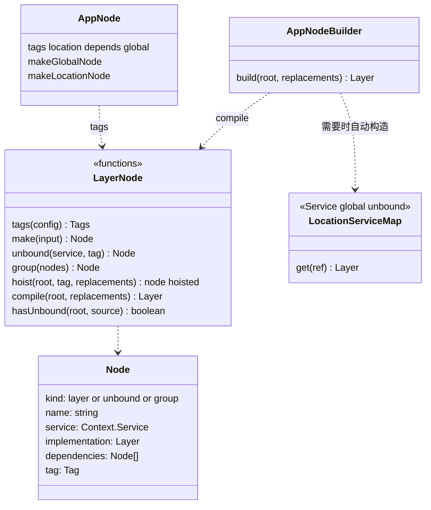
```mermaid
classDiagram
  class Node {
    kind: layer or unbound or group
    name: string
    service: Context.Service
    implementation: Layer
    dependencies: Node[]
    tag: Tag
  }
  class LayerNode {
    <<functions>>
    tags(config) Tags
    make(input) Node
    unbound(service, tag) Node
    group(nodes) Node
    hoist(root, tag, replacements) node hoisted
    compile(root, replacements) Layer
    hasUnbound(root, source) boolean
  }
  class AppNode {
    tags location depends global
    makeGlobalNode
    makeLocationNode
  }
  class AppNodeBuilder {
    build(root, replacements) Layer
  }
  class LocationServiceMap {
    <<Service global unbound>>
    get(ref) Layer
  }
  LayerNode ..> Node
  AppNode ..> LayerNode : tags
  AppNodeBuilder ..> LayerNode : compile
  AppNodeBuilder ..> LocationServiceMap : 需要时自动构造
```

| 函数 | 干什么 |
|---|---|
| `tags(config)` | 定义标签，以及哪些标签可以依赖哪些标签。`app-node.ts` 只有四行：`location: ["global"]`（目录级可以依赖进程级）、`global: []`（进程级谁都不能依赖）。类型层面检查（`CheckTags`），进程级服务依赖了目录级服务编译不过 |
| `make(input)` | 造一个 `kind: "layer"` 节点。`deps` 的类型检查 `CheckDependencies`：Layer 声明需要的服务必须都在 deps 里 |
| `unbound(service, tag)` | 占位节点。`SessionExecution.node`、`LocationServiceMap.node`、`Location.node` 都是。编译时没被替换就抛 "Unbound layer node" |
| `group(nodes)` | 一组节点当一个节点 |
| `hoist(root, tag, replacements)` | 遍历图，把标签等于 `tag` 的节点摘出来放到 `hoisted` 组里，原位置换成空组。`buildLocationServiceMap` 用它把目录服务图里的进程级依赖摘出去，让每个目录只构造目录级部分 |
| `compile(root, replacements)` | 后序遍历，每个节点 `implementation.pipe(Layer.provide(依赖们))`，最后 `provideMerge` 合并。带缓存，同一节点只编译一次 |

### 6.2 目录服务表

`locationServices` 是一个 36 个节点的 `group`：Location、Policy、Config、Agent、Command、Reference、Integration、Catalog、AISDK、Plugin、
PluginInternal、ProjectCopy、ProjectCopy.refreshNode、FileSystemSearch、FileSystem、Watcher、Pty、Skill、SystemContextRegistry、
SystemContextBuiltIns、LocationMutation、FileMutation、PermissionV2、ToolOutputStore、ToolRegistry、ToolRegistry.toolsNode、Image、
SkillGuidance、ReferenceGuidance、SessionTodo、QuestionV2、ReadToolFileSystem、BuiltInTools、SessionRunnerModel、Snapshot、SessionRunnerLLM。

`buildLocationServiceMap`：`LayerMap.make(ref => ...)`，按 `Location.Ref` 懒建。每次建：把 `Location.node` 替换成绑定了这个 ref 的节点 →
`hoist` 出进程级依赖 → `compile` 目录级部分并 `Layer.fresh`（不共享）→ `provide` 编译好的进程级部分。60 分钟没有使用会自动回收。

### 6.3 server 装配

`applicationServices` 是进程级组：Database、EventV2、httpClient、ToolOutputStore.cleanupNode、SessionV2、PermissionSaved、PtyTicket、Credential、PtyEnvironment、LocationServiceMap。

`makeRoutes`：`AppNodeBuilder.build(applicationServices, [[SessionExecution.node, SessionExecutionLocal.node]])`，
v2 的执行器就是在这一行接进来的。`AppNodeBuilder.build`（`app-node-builder.ts`）发现图里有未绑定的 `LocationServiceMap.node` 就自动用 `buildLocationServiceMap` 补上。

两个中间件决定请求在哪个目录下执行：`sessionLocationLayer`（`server/src/middleware/session-location.ts`）从路径里的 `sessionID` 查 `session` 表拿目录；
`locationLayer`（`server/src/location.ts`）从 query `location[directory]` 或 header `x-opencode-directory` 拿，默认 `process.cwd()`。

### 6.4 `EventV2`

`EventV2` 既是事件总线，也负责存储事件。

| 方法 | 干什么 |
|---|---|
| `publish(definition, data, options)` | 补 `id`（`evt_`）、`location`（从当前 Effect 环境里取 `Location.Service`，没有就不带），进 `publishEvent` |
| `publishEvent` | 定义带 `durable` 就先 `commitDurableEvent`，再 `notify`；不带直接 `notify` |
| `commitDurableEvent` | 一个 SQLite 事务（`behavior: "immediate"`）：读 `event_sequence` 拿 `latest` → `seq = latest + 1` → 检查 id 没重复 → 跑这个类型注册的全部投影函数→ 跑 `options.commit(seq)` 钩子→ upsert `event_sequence` → 插 `event`。事务外：叫醒这个聚合的 durable 订阅者 |
| `notify(event, isolate)` | 依次调 `listeners`（durable 事件时隔离异常）、按类型的 PubSub、全局 PubSub |
| `project(definition, projector)` | 注册投影函数。`SessionProjector` 的 layer 就是一串 `project` 调用 |
| `durable({ aggregateID, after })` | 返回一个流：先 `readAfter` 把库里 `seq > after` 的全读出来，再 `Stream.concat` 一个实时流，每次被唤醒就再读一次。叫醒信号是 `PubSub.sliding(1)`，连续提交合并 |
| `replay` / `replayAll` / `claim` / `remove` | 跨节点同步用的。序号不连续、owner 不匹配都会 die |

因为投影在事务里执行，事件写入和状态表更新要么都成功，要么都失败。`Prompted` 事件的投影（写 user 消息 + 标 promoted）也因此原子。

---

## 7. 启动装配

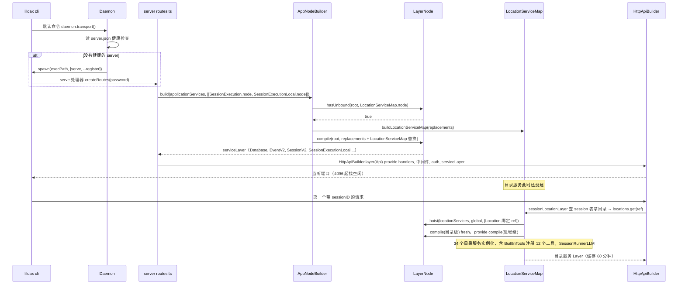
```mermaid
sequenceDiagram
  participant CLI as lildax cli
  participant D as Daemon
  participant S as server routes.ts
  participant B as AppNodeBuilder
  participant LN as LayerNode
  participant LM as LocationServiceMap
  participant HTTP as HttpApiBuilder

  CLI->>D: 默认命令 daemon.transport()
  D->>D: 读 server.json 健康检查
  alt 没有健康的 server
    D->>CLI: spawn(execPath, [serve, --register])
    CLI->>S: serve 处理器 createRoutes(password)
  end
  S->>B: build(applicationServices, [[SessionExecution.node, SessionExecutionLocal.node]])
  B->>LN: hasUnbound(root, LocationServiceMap.node)
  LN-->>B: true
  B->>LM: buildLocationServiceMap(replacements)
  B->>LN: compile(root, replacements + LocationServiceMap 替换)
  LN-->>S: serviceLayer（Database, EventV2, SessionV2, SessionExecutionLocal ...）
  S->>HTTP: HttpApiBuilder.layer(Api) provide handlers, 中间件, auth, serviceLayer
  HTTP-->>CLI: 监听端口（4096 起找空闲）
  Note over LM: 目录服务此时还没建
  CLI->>HTTP: 第一个带 sessionID 的请求
  HTTP->>LM: sessionLocationLayer 查 session 表拿目录 → locations.get(ref)
  LM->>LN: hoist(locationServices, global, [Location 绑定 ref])
  LM->>LN: compile(目录级) fresh，provide compile(进程级)
  Note over LM: 34 个目录服务实例化，含 BuiltInTools 注册 12 个工具，SessionRunnerLLM
  LM-->>HTTP: 目录服务 Layer（缓存 60 分钟）
```

| 步 | 代码 | 说明 |
|---|---|---|
| 1 | `cli/src/index.ts` | 命令表。默认命令 `default.ts`：取 daemon 传输参数，动态 import TUI 连上去 |
| 2 | `cli/src/services/daemon.ts` | 没有健康 server 时 `spawn` 自己跑 `serve --register` |
| 3 | `cli/src/commands/handlers/serve.ts` | `HttpRouter.serve(createRoutes(password))`，端口从 4096 往上试 |
| 4 | `server/src/routes.ts` | 装配。`SessionExecution` 未绑定节点在这里被换成本地实现 |
| 5 | `core/src/effect/app-node-builder.ts` | 自动补 `LocationServiceMap` |
| 6 | `core/src/location-services.ts` | 目录服务懒建 |
| 7 | `server/src/middleware/session-location.ts` | 每个会话请求进来先查目录再 provide |

进程启动时只有进程级服务；某个目录收到第一个请求时，才会创建这个目录的 34 个服务，包括工具注册和 runner。

---

## 8. prompt 执行流程

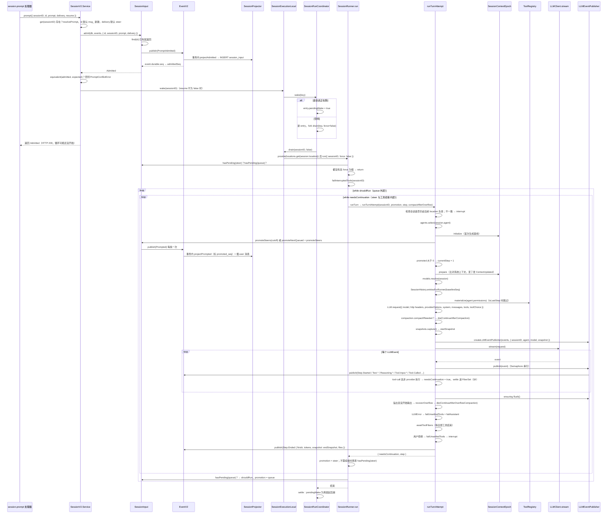
```mermaid
sequenceDiagram
  participant H as session.prompt 处理器
  participant SV as SessionV2.Service
  participant SI as SessionInput
  participant EV as EventV2
  participant PJ as SessionProjector
  participant EX as SessionExecutionLocal
  participant CO as SessionRunCoordinator
  participant RN as SessionRunner.run
  participant RT as runTurnAttempt
  participant CE as SessionContextEpoch
  participant TR as ToolRegistry
  participant LLM as LLMClient.stream
  participant PB as LLMEventPublisher

  H->>SV: prompt({ sessionID, id, prompt, delivery, resume })
  SV->>SV: get(sessionID) 存在？resolvePrompt，id 默认 msg_ 新建，delivery 默认 steer
  SV->>SI: admit(db, events, { id, sessionID, prompt, delivery })
  SI->>SI: find(id) 已有就返回
  SI->>EV: publish(PromptAdmitted)
  EV->>PJ: 事务内 projectAdmitted → INSERT session_input
  EV-->>SI: event.durable.seq → admittedSeq
  SI-->>SV: Admitted
  SV->>SV: equivalent(admitted, expected)？否则 PromptConflictError
  SV->>EX: wake(sessionID)（resume 不为 false 时）
  EX->>CO: wake(key)
  alt 该会话正在跑
    CO->>CO: entry.pendingWake = true
  else 空闲
    CO->>CO: 新 entry，fork drain(key, force=false)
  end
  SV-->>H: 返回 Admitted（HTTP 200，循环可能还没开始）
  CO->>EX: drain(sessionID, false)
  EX->>RN: provide(locations.get(session.location)) 后 run({ sessionID, force: false })
  RN->>SI: hasPending(steer)？hasPending(queue)？
  RN->>RN: 都没有且 force 为假 → return
  RN->>RN: failInterruptedTools(sessionID)
  loop while shouldRun（queue 外层）
    loop while needsContinuation（steer 与工具续接 内层）
      RN->>RT: runTurn → runTurnAttempt(sessionID, promotion, step, compactAfterOverflow)
      RT->>RT: 检查会话是否仍由当前 location 负责；不一致 → interrupt
      RT->>RT: agents.select(session.agent)
      RT->>CE: initialize（首次生成基线）
      RT->>SI: promoteSteers(cutoff) 或 promoteNextQueued + promoteSteers
      SI->>EV: publish(Prompted) 每条一次
      EV->>PJ: 事务内 projectPrompted（标 promoted_seq）+ 插 user 消息
      RT->>RT: promoted 大于 0 → currentStep = 1
      RT->>CE: prepare（比对系统上下文，变了发 ContextUpdated）
      RT->>RT: models.resolve(session)
      RT->>RT: SessionHistory.entriesForRunner(baselineSeq)
      RT->>TR: materialize(agent.permissions)（isLastStep 时跳过）
      RT->>RT: LLM.request({ model, http headers, providerOptions, system, messages, tools, toolChoice })
      RT->>RT: compaction.compactIfNeeded？→ die(ContinueAfterCompaction)
      RT->>RT: snapshots.capture() → startSnapshot
      RT->>PB: createLLMEventPublisher(events, { sessionID, agent, model, snapshot })
      RT->>LLM: stream(request)
      loop 每个 LLMEvent
        LLM-->>RT: event
        RT->>PB: publish(event)（Semaphore 串行）
        PB->>EV: publish(Step.Started / Text.* / Reasoning.* / Tool.Input.* / Tool.Called ...)
        RT->>RT: tool-call 且非 provider 执行 → needsContinuation = true，settle 进 FiberSet（§9）
      end
      RT->>PB: ensuring flush()
      RT->>RT: 溢出且没开始输出 → recoverOverflow → die(ContinueAfterOverflowCompaction)
      RT->>RT: LLMError → failUnsettledTools + failAssistant
      RT->>RT: awaitToolFibers（等全部工具结束）
      RT->>RT: 用户拒绝 → failUnsettledTools → interrupt
      RT->>EV: publish(Step.Ended { finish, tokens, snapshot: endSnapshot, files })
      RT-->>RN: { needsContinuation, step }
      RN->>RN: promotion = steer；不需续接时再查 hasPending(steer)
    end
    RN->>SI: hasPending(queue)？→ shouldRun，promotion = queue
  end
  RN-->>CO: 结束
  CO->>CO: settle：pendingWake 为真就起后继
```

### 8.1 `SessionV2.prompt`

| 步 | 做什么 |
|---|---|
| ① | `Effect.uninterruptible`：写库和叫醒不能被打断到一半 |
| ② | 会话不存在抛 `NotFoundError` |
| ③ | `resolvePrompt` 推附件 mime；`id` 默认新建；`delivery` 默认 `"steer"` |
| ④ | `SessionInput.admit`。`LifecycleConflict` 缺陷转成 `PromptConflictError` |
| ⑤ | 同一个 id 但内容或 delivery 不同，报冲突。客户端重发同一条不会产生两条记录 |
| ⑥ | `resume !== false` 才叫醒。`resume: false` 只入库不跑 |
| ⑦ | 返回 `Admitted`。此时循环可能还没开始。想等结果订阅 `session.events` |

### 8.2 `runTurnAttempt`

| 步 | 做什么 | 提前退出 |
|---|---|---|
| ① | 取出会话，检查 `session.location` 是否等于当前 runner 的 `location`。不相等说明这套 runner 不该再处理它，于是用 `Effect.interrupt` 结束本次执行 | interrupt |
| ② | `agents.select(session.agent)`：没指定就默认 `build`（`agent.ts`） | — |
| ③ | `SessionContextEpoch.initialize`：表里还没有基线就现在生成。上下文源不可用抛 `InitializationBlocked` | 错误 |
| ④ | 取出执行。`cutoff = latestSequence`；`steer` 轮只取 steer，`queue` 轮先取一条 queue 再取全部 steer。取出了任何输入就 `currentStep = 1` | — |
| ⑤ | 用 ③ 刚生成的基线，没有新基线就比对系统上下文有无变化 | — |
| ⑥ | 按会话配置解析出本轮要用的模型，失败就报错 | 模型错误 |
| ⑦ | 从库里读出带序号的历史消息，供拼请求和压缩用 | — |
| ⑧ | `isLastStep = agent.steps 有值 且 currentStep >= steps`。不是最后一步才 `materialize` 工具 | — |
| ⑨ | 按 §8.3 拼出本轮发给模型的请求 | — |
| ⑩ | 需要压缩就抛转换信号，跳出本轮去走压缩流程 | 转换 |
| ⑪ | 拍文件树快照；新建一个发布器；`withPublication` 是一个单许可信号量，保证事件按顺序发 | — |
| ⑫ | 消费流。每个事件：已有 provider 错误就丢弃；溢出错误且还没开始输出就记下来不发；否则 `publish`；`tool-call` 且不是 provider 执行的 → `needsContinuation = true`，起工具 fiber（§9）。`ensuring(flush)` | — |
| ⑬ | 用不可中断区包住收尾流程，具体判断见下表 | — |

收尾时按这个顺序判断：

| 步 | 条件 | 动作 |
|---|---|---|
| ① | 传了 `recoverOverflow`、还没开始输出、错误是溢出、压缩成功 | `die(continueAfterOverflowCompaction)` |
| ② | 有记下的溢出错误但没能恢复 | 现在把它 publish 出去（变成 `Step.Failed`） |
| ③ | 流以 `LLMError` 失败且发布器还没记 provider 错误 | `failUnsettledTools("Provider did not return a tool result", hostedOnly=true)` + `failAssistant(reason)` |
| ④ | 流被中断 | 清掉工具 fiber（不等它们） |
| ⑤ | — | `awaitToolFibers`：等全部工具 settle |
| ⑥ | 工具失败原因是用户拒绝 | 清 fiber，`failUnsettledTools("Tool execution interrupted")`，`Effect.interrupt` 结束整个排空 |
| ⑦ | 流或工具被中断 | `failUnsettledTools`，assistant 还活着就 `failAssistant("Provider turn interrupted")` |
| ⑧ | 工具以非中断原因失败 | `failUnsettledTools("Tool execution failed: …")` |
| ⑨ | 有 `stepSettlement` 且没 provider 错误 | 拍结束快照，算改动文件列表，发 `Step.Ended { finish, cost: 0, tokens, snapshot, files }` |
| ⑩ | 兜底 | 有 provider 错误再 fail 一次未 settle 的；流正常结束但 provider 执行的工具没给结果也 fail |
| ⑪ | 流失败 / 工具中断 | 把失败原因原样往上抛 |
| ⑫ | 正常 | 返回 `{ needsContinuation: 没 provider 错误 && needsContinuation, step }` |

### 8.3 请求体

| 字段 | 值 | 来源 |
|---|---|---|
| `model` | `models.resolve(session)` 的结果 | §4.6。变体的 headers/body 已合并 |
| `http.headers` | `x-session-affinity: <sessionID>`、`X-Session-Id: <sessionID>`、有父会话再加 `x-parent-session-id` | 写死 |
| `providerOptions.openai.promptCacheKey` | 会话 id 去掉 `ses_` 前缀（正则匹配 `ses_[0-9a-f]{64}` 时），否则原 id | 让 OpenAI 的 prompt cache 按会话命中 |
| `system` | `[agent.info.system, epoch.baseline]` 过滤空串，各成一个 `SystemPart` | agent 专属提示词在前，系统上下文基线在后。基线内容见 §13 |
| `messages` | `toLLMMessages(context, model)`，最后一步再追加一条 `Message.assistant(MAX_STEPS_PROMPT)` | 转换规则 §2.2；`MAX_STEPS_PROMPT` 在 `runner/max-steps.ts` |
| `tools` | `toolMaterialization.definitions`，最后一步是 `[]` | |
| `toolChoice` | 最后一步 `"none"`，否则 undefined | |
| `generation` | 不传。温度、maxTokens 全靠 route 默认 | — |

每轮会变的字段：`messages`（历史变长、steer 被取出执行）、`system`（压缩后基线被替换时）、`tools`（agent 权限变了或到最后一步）。
不变的字段：headers、cacheKey、`generation`。
v2 还没有的：v1 里的每次 prompt 覆盖系统文本、插件修改请求、结构化输出策略，在 v2 里都还是 `missing`（`specs/v2/session.md` 那张表）。

### 8.4 步数上限

到达 `steps` 上限时会同时做三件事：`tools: []`、`toolChoice: "none"`、消息末尾追加一条 assistant 消息（`max-steps.ts`）：
"CRITICAL - MAXIMUM STEPS REACHED … Tools are disabled until next user input. Respond with text only."
模型如果还是发了 tool-call，会直接 `failUnsettledTools("Tools are disabled after the maximum agent steps")`，不执行。
有新用户输入就 `currentStep = 1`，所以这个上限指的是每次用户输入之后最多跑 N 轮。

---

## 9. 工具调用

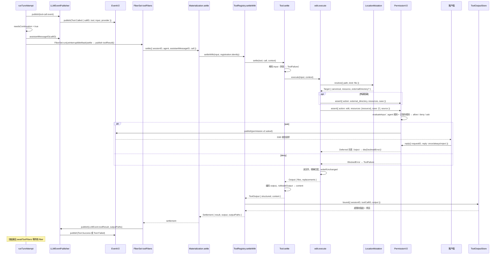
```mermaid
sequenceDiagram
  participant RT as runTurnAttempt
  participant PB as LLMEventPublisher
  participant EV as EventV2
  participant FS as FiberSet toolFibers
  participant MT as Materialization.settle
  participant TR as ToolRegistry.settleWith
  participant TL as Tool.settle
  participant EX as edit.execute
  participant LM as LocationMutation
  participant PM as PermissionV2
  participant UI as 客户端
  participant OS as ToolOutputStore

  RT->>PB: publish(tool-call event)
  PB->>EV: publish(Tool.Called { callID, tool, input, provider })
  RT->>RT: needsContinuation = true
  RT->>PB: assistantMessageID(callID)
  RT->>FS: FiberSet.run(uninterruptibleMask(settle → publish toolResult))
  FS->>MT: settle({ sessionID, agent, assistantMessageID, call })
  MT->>TR: settleWith(input, registration.identity)
  TR->>TL: settle(tool, call, context)
  TL->>TL: 解码 input（失败 → ToolFailure）
  TL->>EX: execute(input, context)
  EX->>LM: resolve({ path, kind: file })
  LM-->>EX: Target { canonical, resource, externalDirectory? }
  opt 外部目录
    EX->>PM: assert({ action: external_directory, resources, save })
  end
  EX->>PM: assert({ action: edit, resources: [resource], save: [*], source })
  PM->>PM: evaluateInput：agent 规则 + 已保存规则 → allow / deny / ask
  alt ask
    PM->>EV: publish(permission.v2.asked)
    EV-->>UI: SSE 收到请求
    UI->>PM: reply({ requestID, reply: once/always/reject })
    PM-->>EX: Deferred 兑现（reject → die(DeclinedError)）
  else deny
    PM-->>EX: BlockedError → ToolFailure
  end
  EX->>EX: 读文件、精确匹配、writeIfUnchanged
  EX-->>TL: Output { files, replacements }
  TL->>TL: 编码 output，toModelOutput → content
  TL-->>TR: ToolOutput { structured, content }
  TR->>OS: bound({ sessionID, toolCallID, output })
  OS-->>TR: 超限则落盘 + 预览
  TR-->>MT: Settlement { result, output, outputPaths }
  MT-->>FS: settlement
  FS->>PB: publish(LLMEvent.toolResult, outputPaths)
  PB->>EV: publish(Tool.Success 或 Tool.Failed)
  Note over RT: 流结束后 awaitToolFibers 等所有 fiber
```

### 9.1 执行规则

1. 先记录再执行（`llm.ts`）：`publish(event)` 发出 `Tool.Called` 并写库之后，才调 `settle`。进程在这之间挂掉，重启后 `failInterruptedTools` 能看到一个 `running` 的工具并标失败。
2. 执行过程不会停在中间状态：`uninterruptibleMask` 包住 settle，但 `restore` 让 settle 本身可中断；`publish(toolResult)` 在 mask 内。所以中断只会发生在工具还没跑完的时候，不会出现跑完了但结果没记下来的情况。
3. 并行执行，串行发布：每个 tool-call 立刻进 `FiberSet`，互不等待；但 `withPublication` 信号量让事件一条一条发。文档："Eager local-tool execution is intentionally unbounded in the current local slice."

### 9.2 工具结果回传

下一轮 `entriesForRunner` 读到这条 assistant 消息，`content` 里的 tool 项已经是 `completed`。`to-llm-message.ts` 把每个本地执行的 tool 项转成一条 `role: tool` 消息，
内容是 `ToolOutput.toResultValue({ structured, content })`。`outputPaths` 里的落盘路径已经写进 content 的预览文本里了。

### 9.3 工具无结果时的文案

| 文案 | 在哪发 | 什么情况 |
|---|---|---|
| `Tool execution interrupted` | `llm.ts` | 上次崩溃留下的；用户拒绝权限；流或工具被中断；provider 报错 |
| `Provider did not return a tool result` | | provider 执行的工具没给结果 |
| `Tools are disabled after the maximum agent steps` | | 最后一步模型还在调工具 |
| `Tool execution failed: …` | | 工具 fiber 以非中断原因失败（一般是 `ToolOutputStore.Error`） |
| `Stale tool call: …` / `Unknown tool: …` | `registry.ts` | 工具在 materialize 之后被替换或注销 |

---

## 10. 插话与排队

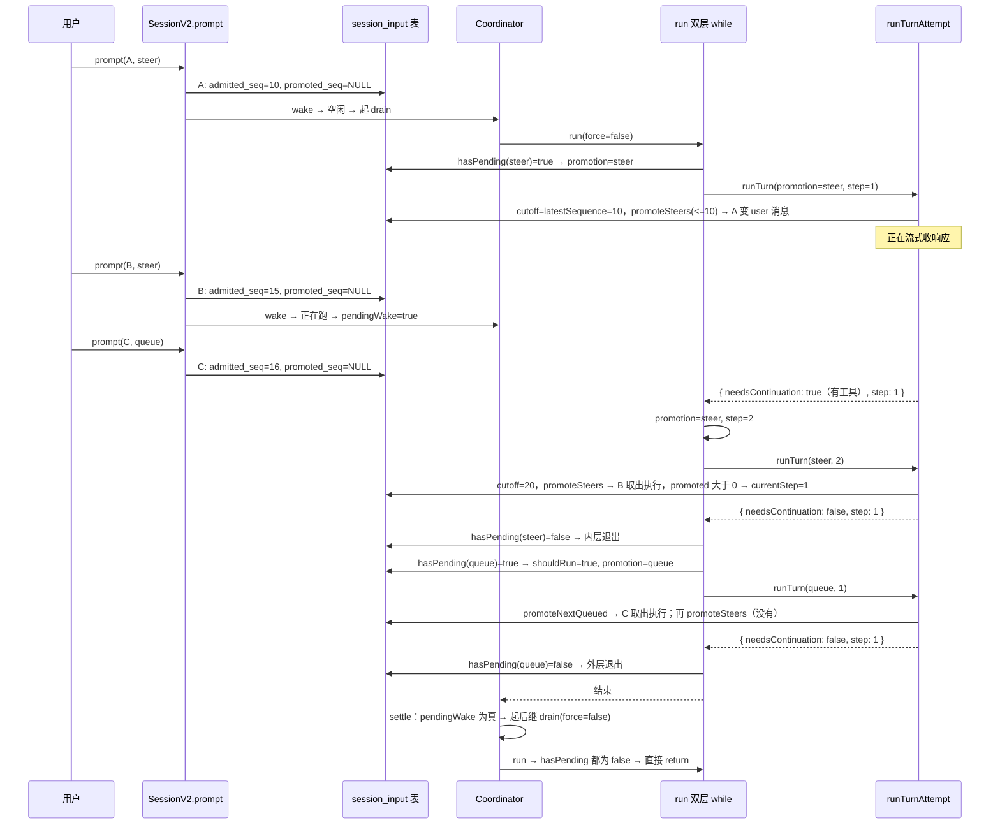
```mermaid
sequenceDiagram
  participant U as 用户
  participant SV as SessionV2.prompt
  participant DB as session_input 表
  participant CO as Coordinator
  participant RN as run 双层 while
  participant RT as runTurnAttempt

  U->>SV: prompt(A, steer)
  SV->>DB: A: admitted_seq=10, promoted_seq=NULL
  SV->>CO: wake → 空闲 → 起 drain
  CO->>RN: run(force=false)
  RN->>DB: hasPending(steer)=true → promotion=steer
  RN->>RT: runTurn(promotion=steer, step=1)
  RT->>DB: cutoff=latestSequence=10，promoteSteers(<=10) → A 变 user 消息
  Note over RT: 正在流式收响应
  U->>SV: prompt(B, steer)
  SV->>DB: B: admitted_seq=15, promoted_seq=NULL
  SV->>CO: wake → 正在跑 → pendingWake=true
  U->>SV: prompt(C, queue)
  SV->>DB: C: admitted_seq=16, promoted_seq=NULL
  RT-->>RN: { needsContinuation: true（有工具）, step: 1 }
  RN->>RN: promotion=steer, step=2
  RN->>RT: runTurn(steer, 2)
  RT->>DB: cutoff=20，promoteSteers → B 取出执行，promoted 大于 0 → currentStep=1
  RT-->>RN: { needsContinuation: false, step: 1 }
  RN->>DB: hasPending(steer)=false → 内层退出
  RN->>DB: hasPending(queue)=true → shouldRun=true, promotion=queue
  RN->>RT: runTurn(queue, 1)
  RT->>DB: promoteNextQueued → C 取出执行；再 promoteSteers（没有）
  RT-->>RN: { needsContinuation: false, step: 1 }
  RN->>DB: hasPending(queue)=false → 外层退出
  RN-->>CO: 结束
  CO->>CO: settle：pendingWake 为真 → 起后继 drain(force=false)
  CO->>RN: run → hasPending 都为 false → 直接 return
```

### 10.1 `run`

```ts
const hasSteer = yield* SessionInput.hasPending(db, sessionID, "steer")
const hasQueue = hasSteer ? false : yield* SessionInput.hasPending(db, sessionID, "queue")  // 有 steer 就不看 queue
if (!input.force && !hasSteer && !hasQueue) return                                // wake 来的且没活 → 走人
yield* failInterruptedTools(input.sessionID)                                      // §12.3
let promotion = hasSteer ? "steer" : hasQueue ? "queue" : undefined
let shouldRun = input.force || hasSteer || hasQueue
while (shouldRun) {                                                               // 外层：queue
  let needsContinuation = true
  let step = 1
  while (needsContinuation) {                                                     // 内层：工具续接 + steer
    const result = yield* runTurn(sessionID, promotion, step)
    needsContinuation = result.needsContinuation
    step = result.step + 1                                                        // 注意 result.step 可能被重置成 1
    promotion = "steer"                                                           // 第二轮起只取出执行 steer
    if (!needsContinuation) needsContinuation = yield* hasPending(db, sessionID, "steer")   // 没工具了？看看有没有插话
  }
  shouldRun = yield* hasPending(db, sessionID, "queue")                           // 内层退出 → 看 queue
  promotion = shouldRun ? "queue" : undefined
}
```

### 10.2 与 pi-mono 对照

| pi-mono `runLoop` | opencode `run` | 差别 |
|---|---|---|
| `while (true)` | `while (shouldRun)` | pi 靠内部 break；opencode 靠查库 |
| `while (hasMoreToolCalls \|\| pending.length)` | `while (needsContinuation)` | 同构 |
| `pendingMessages = config.getSteeringMessages()` | `hasPending(db, "steer")` + 下轮 `promoteSteers` | 内存回调 → SQL 查询 |
| `followUp = config.getFollowUpMessages()` | `hasPending(db, "queue")` + `promoteNextQueued` | 同上 |
| steer 队列 `one-at-a-time` 或 `all` | steer 全部取出执行（cutoff 之前的），queue 一次一条 | opencode 没有模式开关 |
| `prepareNextTurn` 在轮次开头 | 取出执行 → 比对系统上下文 → 读历史，都在 `runTurnAttempt` 开头 | 同一位置 |

两边的循环结构基本一致，区别在于数据来源：pi 读内存，opencode 查数据库。这样换来了崩溃恢复和多进程运行的可能，但每轮至少要多跑五次 SQL。

---

## 11. 压缩与溢出

opencode v2 目前没有 provider 重试。`LLMClient` 里没有 retry，runner 头注释 "Bound provider retries" 没勾，
`SessionEvent.Retried` 定义了但没人发。一次 `LLMError` 就是这轮失败：`Step.Failed` 落库，排空结束。
所以循环外面的处理只有压缩这一种。

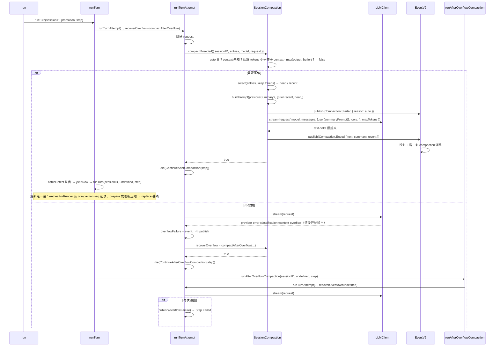
```mermaid
sequenceDiagram
  participant RN as run
  participant T as runTurn
  participant A as runTurnAttempt
  participant C as SessionCompaction
  participant LLM as LLMClient
  participant EV as EventV2
  participant R as runAfterOverflowCompaction

  RN->>T: runTurn(sessionID, promotion, step)
  T->>A: runTurnAttempt(..., recoverOverflow=compactAfterOverflow)
  A->>A: 拼好 request
  A->>C: compactIfNeeded({ sessionID, entries, model, request })
  C->>C: auto 关？context 未知？估算 tokens 小于等于 context - max(output, buffer)？→ false
  alt 需要压缩
    C->>C: select(entries, keep.tokens) → head / recent
    C->>C: buildPrompt(previousSummary?, [prior.recent, head])
    C->>EV: publish(Compaction.Started { reason: auto })
    C->>LLM: stream(request{ model, messages: [user(summaryPrompt)], tools: [], maxTokens })
    LLM-->>C: text-delta 攒起来
    C->>EV: publish(Compaction.Ended { text: summary, recent })
    EV->>EV: 投影：插一条 compaction 消息
    C-->>A: true
    A->>A: die(ContinueAfterCompaction(step))
    T->>T: catchDefect 认出 → yieldNow → runTurn(sessionID, undefined, step)
    Note over T: 重新走一遍：entriesForRunner 从 compaction.seq 起读，prepare 发现新压缩 → replace 基线
  else 不需要
    A->>LLM: stream(request)
    LLM-->>A: provider-error classification=context-overflow（还没开始输出）
    A->>A: overflowFailure = event，不 publish
    A->>C: recoverOverflow = compactAfterOverflow(...)
    C-->>A: true
    A->>A: die(ContinueAfterOverflowCompaction(step))
    T->>R: runAfterOverflowCompaction(sessionID, undefined, step)
    R->>A: runTurnAttempt(..., recoverOverflow=undefined)
    A->>LLM: stream(request)
    alt 再次溢出
      A->>A: publish(overflowFailure) → Step.Failed
    end
  end
```

### 11.1 压缩判定

```
estimate({ system, messages, tools }) > context - max(generation.maxTokens ?? limits.output, buffer)
```

`estimate` 是 `Token.estimate(JSON.stringify(...))`，粗估。`context` 来自 `model.route.defaults.limits.context`（目录里的 `limit.context`）。
`buffer` 默认 20000。`auto: false` 可以关掉。

### 11.2 压缩实现

1. `select`：非 compaction 消息序列化成行（user / assistant / tool call / tool result 截 2000 字 / system / synthetic / shell），从尾往头攒 8000 token 当 `recent`，其余是 `head`。
2. 有旧 `compaction` 消息就把它的 `recent` 拼在 `head` 前面，`summary` 当 `previousSummary`。这样摘要是滚动更新的。
3. 摘要提示词本身超过 `context - summaryOutput` 就放弃。
4. 用同一个模型发请求，`tools: []`，`maxTokens = min(output, 4096)`。注意用的是当前 agent，不是那个叫 `compaction` 的隐藏 agent（那是 v1 用的）。
5. 成功发 `Compaction.Ended`，投影插一条 `compaction` 消息，`seq` 是这条事件的序号。

### 11.3 压缩后的历史

`SessionHistory.messageRows`（`history.ts`）：有 compaction 时取 `seq >= compaction.seq`，所以历史变成 `[compaction 消息, 之后的所有消息]`。
`to-llm-message.ts` 把 compaction 消息渲染成一条 user 消息：`<conversation-checkpoint><summary>…</summary><recent-context>…</recent-context></conversation-checkpoint>`。
同时 `SessionContextEpoch.prepare`（`context-epoch.ts`）发现 `compaction.seq > baseline_seq`，走 `replace` 重新渲染一份完整基线，`baseline_seq` 设成 compaction 的 seq。
所以压缩后的第一轮请求里，系统提示词是重新生成的完整基线，历史只有一条 checkpoint 加上之后的消息。

### 11.4 溢出恢复

`runTurn` 传 `compactAfterOverflow` 进去；`runAfterOverflowCompaction` 不传。
第二次溢出时 `recoverOverflow` 是 undefined，溢出恢复的条件不成立，于是把溢出错误 publish 出去变成 `Step.Failed`。
如果溢出发生在已经开始输出之后（`hasAssistantStarted()` 为真），不恢复，直接当普通错误。文档："recovery never loops or replays partial side effects."

---

## 12. 持久化与恢复

### 12.1 事件写库

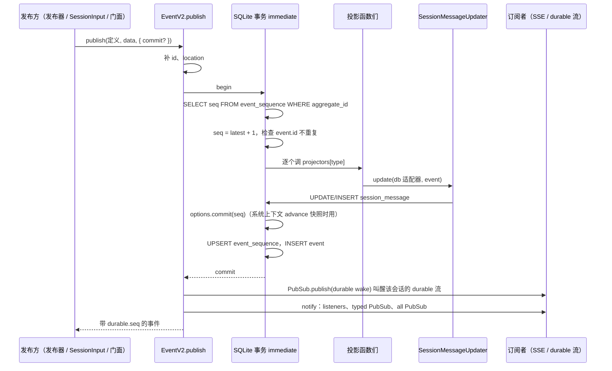
```mermaid
sequenceDiagram
  participant P as 发布方（发布器 / SessionInput / 门面）
  participant EV as EventV2.publish
  participant TX as SQLite 事务 immediate
  participant PJ as 投影函数们
  participant MU as SessionMessageUpdater
  participant SUB as 订阅者（SSE / durable 流）

  P->>EV: publish(定义, data, { commit? })
  EV->>EV: 补 id、location
  EV->>TX: begin
  TX->>TX: SELECT seq FROM event_sequence WHERE aggregate_id
  TX->>TX: seq = latest + 1，检查 event.id 不重复
  TX->>PJ: 逐个调 projectors[type]
  PJ->>MU: update(db 适配器, event)
  MU->>TX: UPDATE/INSERT session_message
  TX->>TX: options.commit(seq)（系统上下文 advance 快照时用）
  TX->>TX: UPSERT event_sequence，INSERT event
  TX-->>EV: commit
  EV->>SUB: PubSub.publish(durable wake) 叫醒该会话的 durable 流
  EV->>SUB: notify：listeners、typed PubSub、all PubSub
  EV-->>P: 带 durable.seq 的事件
```

`event` 表是数据的来源，`session_message` 相当于缓存。两者在同一个事务里写入，所以不会出现事件写进去了、消息却没更新的情况。
投影函数抛异常整个事务回滚，发布方拿到的是 defect。

### 12.2 客户端同步

`session.events` 处理器（`server/src/handlers/session.ts`）返回 `session.events({ sessionID, after })` 的 SSE。
底层 `EventV2.durable`（`event.ts`）：先一次性读 `seq > after` 的全部，再接一个流，每次被唤醒就再查一次。
叫醒信号是容量 1 的 sliding PubSub，连续多次提交合并成一次查询。只有持久化事件会走这条流；`Text.Delta` 这类要另外订阅 `EventV2.subscribe`。
文档："The first `sessions.events(...)` contract is durable-only during both replay and live tailing."

### 12.3 崩溃恢复

进程挂了，内存里什么都没了，库里有：`session_input`（哪些输入还没取出执行）、`session_message`（历史，包括 `running` 状态的工具）、`event`（全部事件）。
重启后：

1. 客户端调 `session.resume`（或再发一条 prompt）→ `coordinator.run`（force）或 `wake`。
2. `run` 开头 `failInterruptedTools`（`llm.ts`）：所有 `pending` / `running` 的工具项发 `Tool.Failed("Tool execution interrupted")`。
3. 正常进入循环，`hasPending` 看到没取出执行的输入就接着跑。

文档里写明了还没做的部分："Post-crash continuation recovery is intentionally deferred. A wake does not infer that ambiguous provider work is safe to retry after an input has already been promoted."
也就是说：输入已取出执行、请求已发出、进程挂了，重启后 `wake` 不会自动重发请求；要靠显式 `resume`。

### 12.4 中断

`session.interrupt` → `coordinator.interrupt`（`run-coordinator.ts`）→ `Fiber.interrupt(owner)`。
runner 的 `uninterruptibleMask` 保证中断只落在 `restore` 包住的地方：等 provider 流、等工具 fiber、等权限答复。
收尾（`llm.ts`）把没结果的工具标 `Tool execution interrupted`，assistant 标 `Provider turn interrupted`。
已入库的输入不会删除，下次 wake 时继续跑。

---

## 13. 系统上下文

系统提示词里除了 agent 自己的提示词，还会拼上环境信息、当前日期、`AGENTS.md`、技能清单这些内容，opencode 把它们统称为系统上下文。会话第一轮会把这些内容渲染成一份完整的基线文本；之后内容有变化时不改基线，而是追加一条 system 消息，只有压缩后才重新生成基线。这套机制在代码里叫 Context Epoch（`SessionContextEpoch`）。

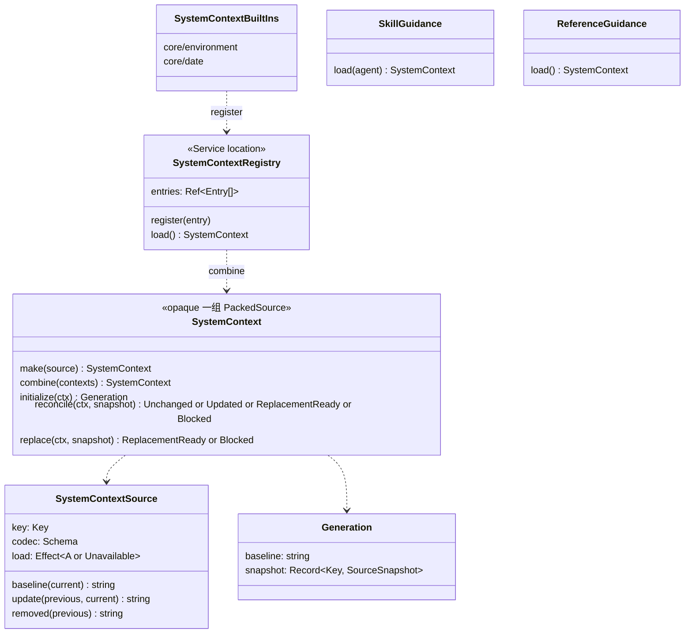
```mermaid
classDiagram
  class SystemContextSource {
    key: Key
    codec: Schema
    load: Effect~A or Unavailable~
    baseline(current) string
    update(previous, current) string
    removed(previous) string
  }
  class SystemContext {
    <<opaque 一组 PackedSource>>
    make(source) SystemContext
    combine(contexts) SystemContext
    initialize(ctx) Generation
    reconcile(ctx, snapshot) Unchanged or Updated or ReplacementReady or Blocked
    replace(ctx, snapshot) ReplacementReady or Blocked
  }
  class Generation {
    baseline: string
    snapshot: Record~Key, SourceSnapshot~
  }
  class SystemContextRegistry {
    <<Service location>>
    entries: Ref~Entry[]~
    register(entry)
    load() SystemContext
  }
  class SystemContextBuiltIns {
    core/environment
    core/date
  }
  class SkillGuidance {
    load(agent) SystemContext
  }
  class ReferenceGuidance {
    load() SystemContext
  }
  SystemContext ..> SystemContextSource
  SystemContext ..> Generation
  SystemContextRegistry ..> SystemContext : combine
  SystemContextBuiltIns ..> SystemContextRegistry : register
```

| 谁 | 文件 | 提供什么 |
|---|---|---|
| `SystemContextBuiltIns` | `core/src/system-context/builtins.ts` | 两个源：`core/environment`（`<env>` 块：工作目录、项目根、是否 git、平台）和 `core/date`（今天日期）。`baseline` 文案 "Here is some useful information about the environment you are running in:"，`update` 文案 "The environment you are running in is now:" |
| `InstructionContext` | `core/src/instruction-context.ts` | 全局和向上查找的 `AGENTS.md`（builtins 依赖它） |
| `SkillGuidance` | `core/src/skill/guidance.ts` | 当前 agent 有权限的技能清单，`<available_skills>` 块。按 agent 算，所以在 runner 里和注册表的源合并（`llm.ts`） |
| `ReferenceGuidance` | `core/src/reference/guidance.ts` | 引用引导 |

`runTurnAttempt` 每轮处理系统上下文的逻辑：

| 情况 | 代码 | 结果 |
|---|---|---|
| 会话第一轮 | `initialize`（`context-epoch.ts`） | 观察全部源，任一 `unavailable` 抛 `InitializationBlocked`（排空失败，输入留在库里可重试）。否则渲染 `baseline`，插表 |
| 后续轮，没新压缩 | `prepare` → `reconcile`（`system-context/index.ts`） | 逐源比对快照。没变 → 用旧基线。变了 → 拼 `update` 文案发 `ContextUpdated`（投影成 `system` 消息），并在同一事务 `advance` 快照。某个源不可用 → 保留旧值 |
| 后续轮，有新压缩 | `prepare` → `replace` | 重新渲染完整基线，`baseline_seq = compaction.seq`。有源不可用 → `ReplacementBlocked`，用旧基线 |

为什么不每轮重新生成系统提示词？因为 provider 的 prompt cache 是按前缀命中的。基线保持不变，变化的部分通过追加 system 消息来表达，缓存才能一直命中。
文档："A Context Epoch stores one immutable provider-cache baseline and a model-hidden structured snapshot."

---


## 14. 可以借鉴的设计与不足

### 可以借鉴的设计

| # | 做法 | 在哪 |
|---|---|---|
| 1 | `prompt` 只写库和唤醒执行器，立刻返回，执行器再从库里读取待处理的输入。崩溃恢复和远程执行都依赖这一点 | `session.ts` |
| 2 | 用 104 行实现按 key 串行的协调器：同 key 串行、不同 key 并发、合并多次 wake，interrupt 之后新的 run 会等旧的完全结束 | `run-coordinator.ts` |
| 3 | 事件和投影在同一个事务里写入，`event` 表是数据来源，状态表相当于缓存，两者始终一致 | `event.ts` |
| 4 | 入库和取出执行分成两步，一张 `session_input` 表加一列 `promoted_seq` 就实现了 steer/queue 两个队列，还能回放排队状态 | `input.ts`, `sql.ts` |
| 5 | 用 `cutoff` 保证只取出执行本轮开始前入库的 steer | `llm.ts` |
| 6 | 先记录再执行工具，重启后把没执行完的工具标为失败 | `llm.ts` |
| 7 | 用 defect 跳出深层嵌套来控制流程 | `llm.ts` |
| 8 | 溢出后只压缩重试一次，再次溢出就按普通失败处理 | `llm.ts` |
| 9 | 系统上下文：基线保持不变，变化通过追加 system 消息表达，保证 prompt cache 命中 | `context-epoch.ts`, `system-context/index.ts` |
| 10 | 滚动摘要：新摘要会合并旧摘要，并有明确的合并规则 | `compaction.ts` |
| 11 | 到达步数上限时用提示词让模型收尾，而不是直接停止 | `max-steps.ts`, `llm.ts` |
| 12 | 工具值不透明，运行时细节存在 `WeakMap` 里；编辑类工具共用 `edit` 权限动作 | `tool.ts` |
| 13 | 权限回复 `always` 会一并放行同一会话里其他等待中的请求，`reject` 会一并拒绝 | `permission.ts` |
| 14 | 工具输出超限时写到文件并返回路径，7 天后自动清理 | `tool-output-store.ts` |
| 15 | 模型切换后不回放 provider 私有元数据，避免签名校验失败 | `to-llm-message.ts` |
| 16 | 用四行分层规则加类型检查约束服务依赖 | `app-node.ts`, `layer-node.ts` |

### 不足

| # | 问题 | 影响 |
|---|---|---|
| 1 | 内存里没有变量记录当前执行到哪一步 | 调试时要查数据库，`session.active` 只能看出是否在运行 |
| 2 | 每轮至少五次 SQL（hasPending ×2、latestSequence、promote、entriesForRunner、epoch），事件写库每条一个事务 | 文档里提到 "Session-event publication remains serialized per provider turn" 是吞吐瓶颈 |
| 3 | 没有 provider 重试 | 网络稍有波动，这一轮就会失败。v1 有 `retry.ts`，v2 还没搬 |
| 4 | v2 未完工：`compact` / `wait` / `shell` / `skill` 门面返回 503；MCP / 插件工具、每 prompt 覆盖、@ 引用展开、标题生成都 `missing` | 老 CLI 还在跑 v1 |
| 5 | `edit` 没有模糊匹配 | 模型给的 old_string 差一个空格就会失败 |
| 6 | Effect 学习成本；`yield*`、`Layer`、`Deferred`、`FiberSet`、`uninterruptibleMask` 不熟悉的话很难读懂 | 上手慢 |
| 7 | `assert` 把用户拒绝转成 `die` | 工具作者容易漏掉，AGENTS.md 专门写了一段警告 |
| 8 | bash 没沙箱 | 文档原话 "Bash is not sandboxed" |
