## 1. 核心包与依赖

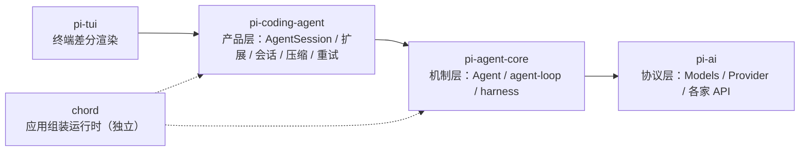

| 包（npm 名） | 目录 | 干什么 | 本篇重点 |
|---|---|---|---|
| `@earendil-works/pi-ai` | `packages/ai` | 统一 40 多家 provider 的流式调用、模型目录、鉴权 | §5 |
| `@earendil-works/pi-agent-core` | `packages/agent` | 主循环、事件、工具执行 | §3、§13 |
| `@earendil-works/pi-coding-agent` | `packages/coding-agent` | 交互式 CLI 产品：会话、扩展、压缩、重试、三种模式 | §4、§6–§12 |
|

`pi-ai`封装了对各个模型厂商的调用，`pi-agent-core`是Agent最核心的事件循环逻辑，是我们需要重点学习的部分，`pi-coding-agent`是基于core封装的完整产品。如果我们想要做自己的 Coding Agent，那么就可以使用 `pi-ai` 和 `pi-agent-core`。

---

## 2. 数据模型

这一节主要讲模块之间是如何传递数据的，从用户输入的表示，到agent运行时的参数，到工具调用，再到llm调用，最后落盘，整个链路中，数据类型如何定义。

### 2.1 消息定义：模型层message与产品层message

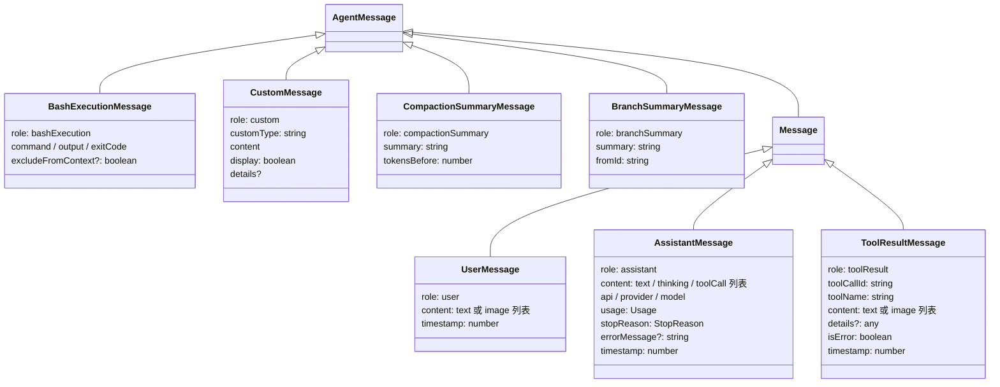

| 类型 | 谁产生它 | 发给模型前变成什么 |
|---|---|---|
| `UserMessage` | `AgentSession.prompt()` 把用户输入包成它 | 原样 |
| `AssistantMessage` | provider 的流函数边流边填 | 原样 |
| `ToolResultMessage` | `agent-loop.ts createToolResultMessage` | 原样 |
| `Message` = 上面三个的联合 | — | — |
| `BashExecutionMessage` | 用户在 TUI 里敲 `!ls` | 变成 `user` 消息；`!!` 前缀的直接丢掉 |
| `CustomMessage` | 扩展调 `pi.sendMessage()` | 变成 `user` 消息 |
| `BranchSummaryMessage` | 在会话树上跳分支时 | 变成 `user` 消息，前后包一段固定文案 |
| `CompactionSummaryMessage` | 压缩完成后 | 变成 `user` 消息，前后包一段固定文案 |
| `AgentMessage` = `Message` ∪ 四种自定义 | — | 靠 `convertToLlm` 转换 |

`Message`是模型接口需要的参数信息，而在产品层有一些动作操作也需要进入模型上下文，比如压缩后的总结，因此在基础`Message`上封装了一层，Agent层循环内部全程用 `AgentMessage[]`，只在真正发请求的时候才用 `convertToLlm` 转成 `Message[]`。

`AssistantMessage.stopReason` 的取值后面会反复用到：

| 值 | 含义 | 循环怎么处理 |
|---|---|---|
| `"stop"` | 正常说完 | 没有工具调用就结束这一轮 |
| `"toolUse"` | 要调工具 | 执行工具 |
| `"length"` | 输出被 token 上限截断 | 这一轮的工具调用全部不执行，直接返回错误（§8） |
| `"error"` | 出错 | 循环直接退出，产品层决定重不重试（§10） |
| `"aborted"` | 被用户中断 | 循环直接退出 |
| `"pending"` | 还在流 | 只在流的过程中出现 |
| `"deferred"` | 延迟响应（少数 provider） | 主线不管 |

### 2.2 模型、工具、上下文

这部分比较简单，基本就是对需要发给llm的参数，做了一下封装。

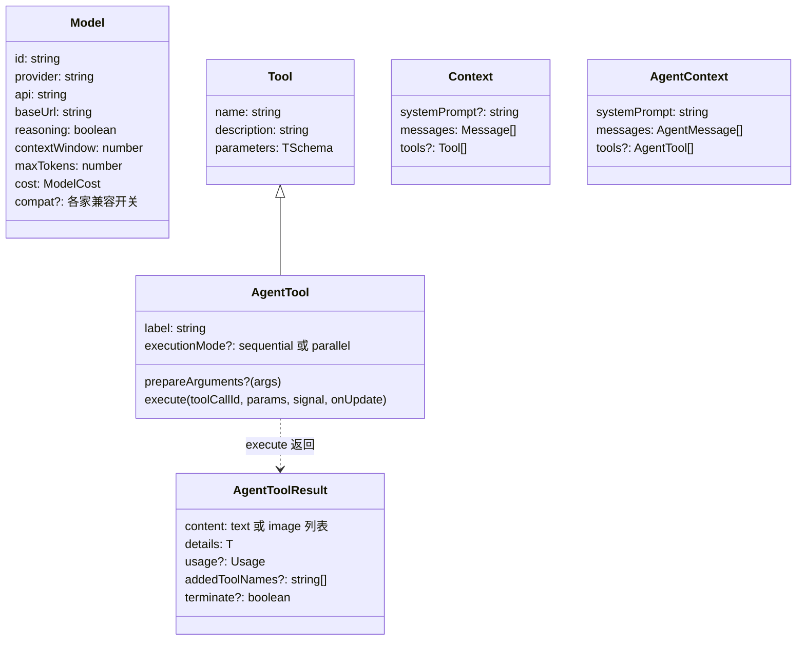

| 类型 | 说明 |
|---|---|
| `Model` | 一个模型的全部元数据。`contextWindow` 和 `maxTokens` 决定压缩时机和请求上限。`compat` 是每家 API 的兼容开关（比如 Anthropic 的 `forceAdaptiveThinking`）。 |
| `Tool` | 发给模型看的工具定义：名字、描述、参数 JSON Schema（TypeBox）。 |
| `AgentTool` | 在 `Tool` 上加了怎么执行：`execute` 方法、可选的参数整形 `prepareArguments`、是否允许并行。 |
| `AgentToolResult` | 工具执行返回值。`content` 给模型看，`details` 给 UI 看。`terminate` 是"这批工具跑完后停下"的提示。 |
| `Context` | 发给 provider 的上下文，消息是 `Message[]`。 |
| `AgentContext` | 循环用的上下文，消息是 `AgentMessage[]`，工具是 `AgentTool[]`。 |

### 2.3 两条事件流

Message是agent对接llm接口的中间层，Event则是对接上层应用的中间层，上层应用通过订阅event事件来获取所有信息。pi有两层事件，与Message类似，除了模型返回的消息，还有一些agent的执行状态比如start end等：

| 事件类型 | 谁发 | 谁收 | 内容 |
| --- | --- | --- | --- |
| `AssistantMessageEvent` | provider 的流函数 | `agent-loop.ts` 的 `for await` | `start` / `text_delta` / `thinking_delta` / `toolcall_start` / `toolcall_delta` / `toolcall_end` / `done` / `error`，每个都带一个 `partial`（当前累积到的整条消息） |
| `AgentEvent` | 循环的 `emit()` | `Agent.processEvents` → 所有订阅者 | `agent_start` / `turn_start` / `message_start` / `message_update` / `message_end` / `tool_execution_start` / `tool_execution_update` / `tool_execution_end` / `turn_end` / `agent_end` |

`message_update` 事件把上面那层的 `AssistantMessageEvent` 原样带上（字段名 `assistantMessageEvent`），所以 UI 能拿到最细粒度的增量。

产品层在 `AgentEvent` 上还有一批动作事件：`agent_settled` / `queue_update` / `compaction_start` / `compaction_end` / `auto_retry_start` / `auto_retry_end` / `entry_appended` / `bash_execution_update` 等，合起来叫 `AgentSessionEvent`。

### 2.4 SessionEntry

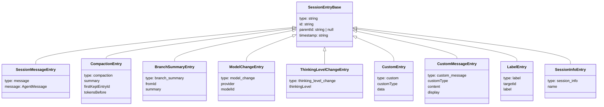

SessionEntry就是持久化存储时的格式，文件是一个JSONL，第一行是 `SessionHeader`（带 `id` / `cwd` / `parentSession`），后面每行一个entry。
每个entry都有 `id` 和 `parentId`，所以整个文件其实是一棵树，而不是按顺序排下来的一串记录，详见 §11。

---

## 3. 核心层：`pi-agent-core`

这一层主要看两个文件：`agent.ts`（有状态的壳）和 `agent-loop.ts`（无状态的循环）。

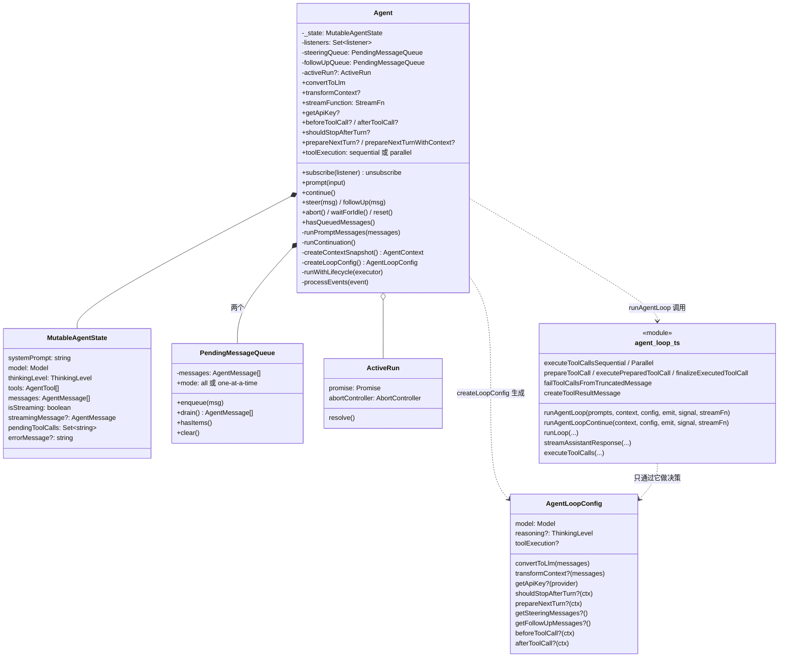

### 3.1 `Agent`

Agent持有当前对话状态，保存在_state，每轮agentloop把状态复制一份，把agentloop发出的事件转成状态更新并广播给订阅者。自己几乎没有任何业务逻辑，只保存了一些回调函数，所以他的agent设计是只保存状态+配置，其中配置包括各种回调。

Agent 里存了这些字段：

| 字段 | 含义 |
|---|---|
| `_state: MutableAgentState` | 系统提示词、当前模型、思考等级、工具列表、消息列表，以及运行时的流状态。 |
| `listeners` | 订阅者集合。`AgentSession` 是其中一个。 |
| `steeringQueue` / `followUpQueue` | 两个待投递队列，分别对应"插话"和"追加"。默认模式都是 `one-at-a-time`。 |
| `activeRun?: ActiveRun` | 当前是否正在运行 |
| `convertToLlm` / `transformContext` / `streamFunction` / `getApiKey` / `onPayload` / `onResponse` | 全是公开的可替换回调。产品层构造时传进来（§6）。 |
| `beforeToolCall` / `afterToolCall` / `shouldStopAfterTurn` / `prepareNextTurn` / `prepareNextTurnWithContext` | 也是公开回调。 |
| `sessionId` / `thinkingBudgets` / `transport` / `maxRetryDelayMs` / `toolExecution` | 透传给流函数的选项。`toolExecution` 默认 `"parallel"`。 |

主要方法：

| 方法 | 干什么 | 谁调它 |
|---|---|---|
| `subscribe(listener)` | 注册事件监听。监听器按注册顺序 `await`，`agent_end` 的监听器跑完运行才算结束。 | `AgentSession` 构造函数 |
| `prompt(input, images?)` | 发起新运行。已有运行在跑就抛错。先 `normalizePromptInput` 把字符串包成 `UserMessage`，再 `runPromptMessages`。 | `AgentSession._runAgentPrompt` |
| `continue()` | 不加新消息，从现有上下文继续。最后一条是 assistant 时：先看 steer 队列有没有东西，有就当作新 prompt 跑；再看 followUp 队列；都没有就抛错。最后一条是 user/toolResult 时走 `runContinuation`。 | `AgentSession._runAgentPrompt` 的重试/压缩后继续 |
| `steer(msg)` / `followUp(msg)` | 入队，不做别的。 | `AgentSession._queueSteer` / `_queueFollowUp` |
| `hasQueuedMessages()` | 两个队列任一非空。 | `AgentSession._handlePostAgentRun` |
| `abort()` | 触发 `activeRun.abortController.abort()`。 | `AgentSession.abort` |
| `waitForIdle()` | 等当前这次运行跑完再返回；没在运行就直接返回。 | `AgentSession.waitForIdle` |
| `reset()` | 清空消息、运行时状态、两个队列。运行中调用会抛错。 | 新会话 |
| `runPromptMessages(messages, options)` | 核心：`runWithLifecycle` 包住 `runAgentLoop(messages, createContextSnapshot(), createLoopConfig(options), processEvents, signal, streamFunction)`。 | `prompt` / `continue` |
| `createContextSnapshot()` | 返回 `{ systemPrompt, messages: slice(), tools: slice() }`。返回的是拷贝，循环改它不会影响 Agent 自己的状态。 | `runPromptMessages` |
| `createLoopConfig(options)` | 把 Agent 上所有回调和选项打包成一个 `AgentLoopConfig` 对象。`reasoning` 由 `thinkingLevel === "off" ? undefined : thinkingLevel` 算出。`getSteeringMessages` 就是 `steeringQueue.drain()`，`getFollowUpMessages` 就是 `followUpQueue.drain()`。 | `runPromptMessages` |
| `runWithLifecycle(executor)` | 建 `ActiveRun`，置 `isStreaming = true`，跑 executor；异常走 `handleRunFailure`（合成一条 `stopReason: "error"` 的 assistant 消息并补发四个事件）；`finally` 走 `finishRun`（清运行时状态，并通知所有在 `waitForIdle()` 上等着的调用方“跑完了”）。 | `runPromptMessages` / `runContinuation` |
| `processEvents(event)` | 先更新状态，再通知监听器：`message_start`/`message_update` 更新 `streamingMessage`；`message_end` 把消息 push 进 `_state.messages`；`tool_execution_start/end` 增删 `pendingToolCalls`；`turn_end` 记 `errorMessage`。然后按顺序 `await` 每个监听器。 | 循环的 `emit` |

循环拿到的 `context.messages` 是拷贝，循环往里 push 消息**不会**改 `_state.messages`。`_state.messages` 只在 `processEvents` 收到 `message_end` 时才更改。也就是说，Agent 的状态只靠事件来更新，和循环内部用的那个临时数组是两份数据。

### 3.2 `PendingMessageQueue`

| 方法 | 行为 |
|---|---|
| `enqueue(msg)` | push |
| `drain()` | `mode === "all"` 时全部取走；`"one-at-a-time"` 时只取第一条，剩下的留着 |
| `hasItems()` / `clear()` | 顾名思义 |


### 3.3 `AgentLoopConfig`

`agent-loop.ts` 里没有类，只有一组函数。循环不认识 `Agent`，也不关心是谁在调它：需要做决定的地方（取插话、下一轮前的准备、工具执行前后……）都去调 `AgentLoopConfig` 上的回调，状态变化则通过 `emit` 事件往外报。`Agent.createLoopConfig` 负责把回调打包传进来，但回调的实现大多来自产品层：有的是 `sdk.ts` 创建 `Agent` 时传入的，有的是 `AgentSession` 构造后直接赋值的。

| 回调 | 循环在哪一步调 | `AgentSession` 给它塞的是什么 |
|---|---|---|
| `getSteeringMessages()` | 循环开始前一次；每轮结束后一次；`prepareNextTurn` 之后若还没拿到则再补一次 | `steeringQueue.drain()` |
| `getFollowUpMessages()` | 内层循环退出后 | `followUpQueue.drain()` |
| `prepareNextTurn(ctx)` | 第二轮起，每轮开头 | 先压缩（如果快满了），再把最新的系统提示词、工具列表、模型、思考等级塞回去（§10.3） |
| `transformContext(messages)` | 发请求前 | `ExtensionRunner.emitContext`，让扩展改消息 |
| `convertToLlm(messages)` | 发请求前 | `messages.ts` 的转换，外面再包一层"屏蔽图片"的开关 |
| `getApiKey(provider)` | 发请求前 | `AgentSession` 没设；鉴权在更下面的 `ModelRuntime.streamSimple` 里做 |
| `beforeToolCall(ctx)` | 参数校验后、执行前 | `ExtensionRunner.emitToolCall`，扩展可以 `block` |
| `afterToolCall(ctx)` | 执行后、发事件前 | `ExtensionRunner.emitToolResult` + 图片规范化 |
| `shouldStopAfterTurn(ctx)` | 每轮 `turn_end` 之后 | `AgentSession` 没设（所以永远不提前停） |

### 3.4 `agent-loop.ts`

对外的入口函数：

| 函数 | 用途 |
|---|---|
| `agentLoop(prompts, context, config, signal, streamFn)` | 返回 `EventStream`，给想用 `for await` 消费事件的人 |
| `agentLoopContinue(context, config, signal, streamFn)` | 同上，但不加新消息。最后一条不能是 assistant |
| `runAgentLoop(prompts, context, config, emit, signal, streamFn)` | `await` 版本，`Agent` 用的就是它。把 prompts 拼进 context，发 `agent_start` / `turn_start` / 每条 prompt 的 `message_start`+`message_end`，然后 `runLoop` |
| `runAgentLoopContinue(...)` | `await` 版本的继续 |

真正的循环逻辑在 `runLoop` 里，§7 逐行讲；工具执行相关的函数放到 §8 讲。

---

## 4. 产品层：`pi-coding-agent`

产品层的核心是 `AgentSession`。它持有一个 `Agent`，再加上会话、设置、扩展、工具注册表、模型运行时。

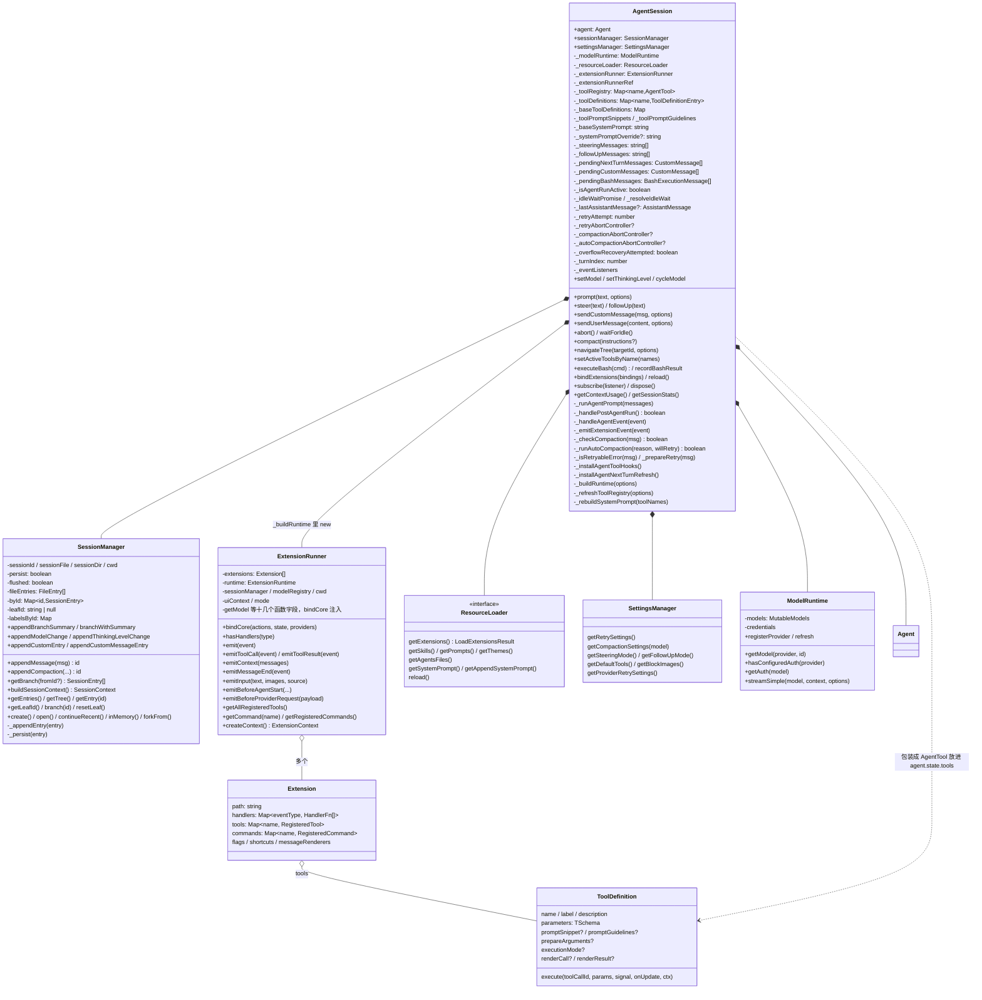

### 4.1 `AgentSession`

这里实现了agentloop之上的应用层，过滤输入、排队、持久化、通知扩展、自动压缩、自动重试、管理工具和系统提示词等。

`AgentSession` 的字段按用途分组如下：

| 分组 | 字段 | 含义 |
|---|---|---|
| 三个核心依赖 | `agent` / `sessionManager` / `settingsManager` | 构造时传入，`readonly` |
| 运行时依赖 | `_modelRuntime` / `_resourceLoader` / `_cwd` / `_scopedModels` | 模型鉴权、扩展和技能加载、工作目录、可循环切换的模型子集 |
| 扩展 | `_extensionRunner`/ `_extensionRunnerRef` / `_extensionUIContext` / `_extensionMode` / 若干 handler | `_extensionRunnerRef` 是一个 `{ current }` 对象，`Agent` 的 `streamFn` 闭包通过它拿到当前的 runner（reload 后 runner 会换） |
| 工具 | `_toolRegistry`（名字→`AgentTool`）/ `_toolDefinitions`（名字→定义+来源）/ `_baseToolDefinitions`（内置八个）/ `_toolPromptSnippets` / `_toolPromptGuidelines` / `_allowedToolNames` / `_excludedToolNames` | 注册表是"全部可用的"，`agent.state.tools` 是"当前激活的"（§6.4） |
| 系统提示词 | `_baseSystemPrompt` / `_systemPromptOverride` / `_baseSystemPromptOptions` | base由工具集和资源算出；override 是扩展在 `before_agent_start` 里临时改的，一次运行结束就清 |
| 排队 | `_steeringMessages: string[]` / `_followUpMessages: string[]` | 只存文本，用来在 UI 上显示排队的内容；实际的消息对象在 `Agent` 的两个队列里 |
| 延后投递 | `_pendingNextTurnMessages` / `_pendingCustomMessages` / `_pendingBashMessages` | 三种"现在不能插进去、等合适时机再插"的消息（§9.3） |
| 运行状态 | `_isAgentRunActive` / `_idleWaitPromise` / `_resolveIdleWait` / `_turnIndex` / `_lastAssistantMessage` | `isStreaming` 就是 `_isAgentRunActive`；`_lastAssistantMessage` 在 `message_end` 时记下，`_handlePostAgentRun` 用完清掉 |
| 重试 | `_retryAttempt` / `_retryAbortController` | 当前第几次重试 |
| 压缩 | `_compactionAbortController`（手动）/ `_autoCompactionAbortController`（自动）/ `_branchSummaryAbortController` / `_overflowRecoveryAttempted` | `isCompacting` 看这三个 controller 任一非空；`_overflowRecoveryAttempted` 保证溢出恢复只试一次 |
| bash | `_bashAbortControllers` | 用户 `!cmd` 的取消句柄 |

方法按流程分组（详细流程见 §6–§10）：

| 分组 | 方法 |
|---|---|
| 装配 | `constructor` / `_buildRuntime` / `_refreshToolRegistry` / `_bindExtensionCore` / `_installAgentToolHooks` / `_installAgentNextTurnRefresh` / `_rebuildSystemPrompt` / `setActiveToolsByName` / `bindExtensions` / `reload` |
| 输入 | `prompt` / `_runInputHandlers` / `_tryExecuteExtensionCommand` / `_expandSkillCommand` / `steer` / `followUp` / `_queueUserInput` / `_queueSteer` / `_queueFollowUp` / `sendCustomMessage` / `sendUserMessage` |
| 运行 | `_runAgentPrompt` / `_handlePostAgentRun` / `abort` / `waitForIdle` / `_emitAgentSettled` |
| 事件 | `_handleAgentEvent` / `_emitExtensionEvent` / `_emit` / `subscribe` / `dispose` |
| 重试 | `_isRetryableError` / `_prepareRetry` / `_willRetryAfterAgentEnd` / `abortRetry` |
| 压缩 | `_checkCompaction` / `_runAutoCompaction` / `compact` / `_compactBeforeNextAssistantResponse` / `getContextUsage` |
| 会话树 | `navigateTree` / `getSessionStats` / `exportToJsonl` |
| 模型 | `setModel` / `cycleModel` / `setThinkingLevel` / `cycleThinkingLevel` |
| bash | `executeBash` / `recordBashResult` / `abortBash` |

### 4.2 `SessionManager`

`SessionManager` 负责管理会话文件。内存里是一棵树（`byId` + `leafId`），磁盘上是 JSONL。每次写入都是追加一个entry，再把 `leafId` 指向它。

| 字段 | 含义 |
|---|---|
| `fileEntries: FileEntry[]` | 文件里所有行，包括头 |
| `byId: Map<string, SessionEntry>` | 按 id 索引 |
| `leafId: string \| null` | 当前叶子。`null` 表示"还没有条目"或"回到根之前" |
| `persist: boolean` / `flushed: boolean` | 是否落盘；是否已经把整个文件写出去过一次 |
| `labelsById` / `labelTimestampsById` | 条目标签（给树导航用） |

| 方法 | 干什么 |
|---|---|
| `appendMessage(message)` | 包成 `SessionMessageEntry`，`parentId = leafId`，`_appendEntry` |
| `appendCompaction(summary, firstKeptEntryId, tokensBefore, details, fromHook, usage)` | 追加一个 `compaction` 条目 |
| `branchWithSummary(branchFromId, summary, ...)` | 先把 `leafId` 挪到目标，再追加一个 `branch_summary` 条目记录"从哪来" |
| `branch(id)` / `resetLeaf()` | 只挪叶子，不写条目 |
| `getBranch(fromId?)` | 从叶子（或指定 id）沿 `parentId` 一路走到根，返回这条路径上的条目（顺序是根→叶） |
| `buildSessionContext()` | 调模块级函数 `buildSessionContext(entries, leafId, byId)`，得到 `{ messages, thinkingLevel, model }` |
| `_appendEntry(entry)` | push 进 `fileEntries`、写 `byId`、`leafId = entry.id`、`_persist` |
| `_persist(entry)` | 延迟写文件：在第一条 assistant 消息出现之前不写文件；第一条 assistant 出现时用 `"wx"`（不存在才创建）一次写出全部条目；之后每条追加。这样用户打开后什么都没问的会话，不会留下空文件 |
| `static create / open / continueRecent / inMemory / forkFrom` | 五种构造方式 |

上下文怎么从这棵树上算出来，靠的是文件里的三个模块级函数，§11 再讲。

### 4.3 `ExtensionRunner`

持有所有加载好的扩展，负责把事件分发给它们的处理函数，并给处理函数造一个 `ExtensionContext`。

| 字段 | 含义 |
|---|---|
| `extensions: Extension[]` | 每个 `Extension`（`types.ts`）里有 `handlers: Map<事件类型, 处理函数[]>`、`tools`、`commands`、`flags`、`shortcuts` |
| `runtime: ExtensionRuntime` | 加载期共享状态：flag 值、待注册的 provider、`assertActive` / `invalidate`（reload 后旧的 ctx 会失效） |
| `getModel` / `isIdleFn` / `abortFn` / `compactFn` / `getContextUsageFn` 等十几个函数字段 | 默认是空实现，`bindCore` 时由 `AgentSession` 注入真实现（`agent-session.ts`） |

分发方法都在 `runner.ts` 里。同一个事件可能有多个扩展在处理，这些方法的区别主要在于怎么合并多个处理函数的返回值：

| 方法 | 语义 |
|---|---|
| `emit(event)` | 逐个扩展、逐个处理函数 `await`。异常被吞掉并 `emitError`。只有 `session_before_*` 四种事件看返回值：谁返回 `cancel` 就立刻停 |
| `emitToolCall(event)` | 逐个调，谁先返回 `block` 就停，后面的不再调。异常不吞，直接抛（`agent-session.ts` 会把非 Error 包一层） |
| `emitToolResult(event)` | 逐个调，按字段（`content` / `details` / `isError` / `usage`）覆盖，后面的覆盖前面的 |
| `emitContext(messages)` | 先 `structuredClone`，然后链式传递：上一个处理函数返回的 `messages` 作为下一个的输入 |
| `emitMessageEnd(event)` | 允许扩展替换整条消息（要求 role 不变）；`AgentSession` 拿到替换后用 `_replaceMessageInPlace` 原地改对象，这样 agent 状态、后续事件、会话持久化三处看到的是同一个对象 |
| `emitBeforeProviderRequest(payload)` | 链式改请求体 |
| `emitBeforeProviderHeaders(headers)` | 处理函数直接改传进来的 headers，返回值被忽略 |
| `emitUserBash(event)` | 第一个有返回值的处理函数直接生效，用户的 `!cmd` 由它接管 |
| `emitInput(text, images, source, behavior)` | 返回 `handled`（扩展吃掉了）/ `transform`（改写）/ 什么都不返回（原样） |
| `emitBeforeAgentStart(...)` | 可以返回要注入的自定义消息列表和临时系统提示词 |
| `emitResourcesDiscover(...)` | 收集扩展补充的技能、提示词模板、主题路径 |

`hasHandlers(type)` 是所有 `emit*` 前的快速检查，没人订阅就不构造事件对象。

为什么要拆这么多方法，监听事件流、按类型分发一个入口不够吗？其实按类型分发的逻辑是有的，写在 `AgentSession._emitExtensionEvent` 里：它订阅 `Agent` 的事件流，把 `agent_start`、`turn_*`、`message_*`、`tool_execution_*` 按类型转给通用的 `emit`。这类事件只是通知，扩展只能看，不能改。

剩下的 `emit*` 单独拆出来，有两个原因。

一是这些事件大多不在事件流里。`tool_call` 发生在工具执行前，循环停在 `beforeToolCall` 里等结果；`context`、`before_provider_request` 发生在发请求前的回调里；`input`、`before_agent_start` 更是在循环启动之前。事件流是单向广播，发出去就结束了，没办法把“拦下这个工具”这样的结果带回去。

二是调用方要拿返回值做决定，而每种事件的合并规则都不一样（见上表）。如果都塞进一个 `emit`，里面就得按事件类型写一大串 switch；拆成独立的方法，返回类型也能写得更准确。

所以 runner 自己不监听任何东西，什么时候发、发哪种事件，都由调用方决定。各个方法的调用位置：

| 调用位置 | 调的方法 |
|---|---|
| `AgentSession._emitExtensionEvent`（事件流分发） | `emit`；`message_end` 走 `emitMessageEnd` |
| `AgentSession._installAgentToolHooks`（挂到 `beforeToolCall` / `afterToolCall`） | `emitToolCall` / `emitToolResult` |
| `sdk.ts` 里 `new Agent` 的 `transformContext` / `onPayload` / `onResponse` 回调 | `emitContext` / `emitBeforeProviderRequest` / `emit({ type: "after_provider_response" })` |
| `sdk.ts` 的 `transformHeaders` | `emitBeforeProviderHeaders` |
| `AgentSession.prompt()` 第③步、第⑩步（§7.1） | `emitInput` / `emitBeforeAgentStart` |
| `AgentSession` 加载资源时 | `emitResourcesDiscover` |
| `AgentSession` 的压缩、分支树、reload，`AgentSessionRuntime` 的切换会话、fork | `emit({ type: "session_before_*" })`，看 `cancel` |
| `InteractiveMode` / RPC 模式处理用户的 `!cmd` | `emitUserBash` |

#### 扩展侧

上面是 runner 这一侧：`emit*` 负责遍历、按事件合并返回值。扩展这一侧要做的事很简单，就是把处理函数登记到自己的 `handlers` 表里。runner 没有全局的事件注册表，事件分发就是去逐个查每个扩展的这张表。

一个扩展就是一个默认导出的函数，类型是 `ExtensionFactory = (pi: ExtensionAPI) => void | Promise<void>`（`extensions/types.ts`）。下面是示意：

```ts
import type { ExtensionAPI } from "@earendil-works/pi-coding-agent";

export default function (pi: ExtensionAPI) {
  pi.on("tool_call", async (event, ctx) => {
    if (event.toolName === "bash" && String(event.input.command).includes("rm -rf")) {
      return { block: true, reason: "危险命令" };        // 返回格式由事件决定，见上表
    }
  });

  pi.on("session_before_switch", async (event, ctx) => {
    if (ctx.hasUI && !(await ctx.ui.confirm("切换会话？", "当前会话有未保存的内容"))) {
      return { cancel: true };
    }
  });
}
```

仓库里的 `packages/coding-agent/examples/extensions/` 有近 80 个真实例子，`confirm-destructive.ts` 就是第二个处理函数的完整版。

`pi.on` 的实现只有四行（`extensions/loader.ts`）：

```ts
on(event: string, handler: HandlerFn): void {
  assertActive();
  const list = extension.handlers.get(event) ?? [];
  list.push(handler);
  extension.handlers.set(event, list);
}
```

类型层面，`ExtensionAPI.on` 按事件名写了 33 个重载（`types.ts`），所以事件名写对之后，`event` 的字段和处理函数该返回什么都有类型提示。同一个事件被多个处理函数订阅时，执行顺序是先按扩展的加载顺序，再按同一扩展内的注册顺序。

那为什么 runner 那边有十几个 `emit*`，扩展这边却只有一个 `on`，而不是 `onToolCall`、`onToolResult` 这样分开？因为登记、类型、合并这三件事是分开处理的：

| 事情 | 由谁负责 | 各事件之间有没有区别 |
|---|---|---|
| 登记"这个事件来了调我" | `pi.on`（上面四行） | 没有，都是往 `handlers` 表里 push |
| 处理函数收到什么、该返回什么 | 类型重载 | 有，编译期体现 |
| 多个返回值怎么合并、调用方拿去做什么 | runner 的 `emit*` | 有，运行时体现 |

```ts
on(event: "tool_call",      handler: ExtensionHandler<ToolCallEvent, ToolCallEventResult>): void;
on(event: "tool_result",    handler: ExtensionHandler<ToolResultEvent, ToolResultEventResult>): void;
on(event: "context",        handler: ExtensionHandler<ContextEvent, ContextEventResult>): void;
on(event: "message_update", handler: ExtensionHandler<MessageUpdateEvent>): void;   // 没有返回值
```

写 `pi.on("tool_call", (e) => ...)` 时，`e` 自动推断成 `ToolCallEvent`，编辑器提示可以返回 `{ block, reason }`；写 `message_update` 就没有返回值可填。效果和单独写一个 `onToolCall` 差不多。扩展作者也不需要知道合并规则，按类型提示返回就行，runner 会按这个事件的规则处理。DOM 的 `addEventListener`、Node 的 `EventEmitter.on` 也是这么设计的，好处是接口少，以后新增事件只要加一个重载和对应的 `emit*`，已有扩展的写法不用变。

##### 事件列表

扩展一共能订阅 38 种事件，按触发位置分类如下：

| 位置 | 事件 | 能改什么 |
| --- | --- | --- |
| 输入 | `input` | 吃掉或改写 |
| 运行前 | `before_agent_start` | 追加 custom 消息、临时系统提示词 |
| 请求前 | `context` → `before_provider_request` → `before_provider_headers` | 改消息列表 → 改请求体 JSON → 改请求头 |
| 响应后 | `after_provider_response` | 只读状态码和头 |
| 工具 | `tool_call`（可 block）→ `tool_execution_start/update/end` → `tool_result`（可改结果） | 权限、改结果 |
| 消息 | `message_start` / `message_update` / `message_end`（可替换消息） | — |
| 轮次 | `turn_start` / `turn_end` / `agent_start` / `agent_end` / `agent_settled` | `agent_end` 里 `sendMessage` 会触发 `_handlePostAgentRun` 的第三个分支 |
| 会话 | `session_start` / `session_before_compact`（可接管或取消）/ `session_compact` / `session_before_tree` / `session_tree` / `session_before_switch` / `session_before_fork` / `session_shutdown` | 压缩和树导航都能被扩展替换 |
| 模型 | `model_select` / `thinking_level_select` | — |
| 用户 bash | `user_bash` | 接管 `!cmd` |

##### 加载时序

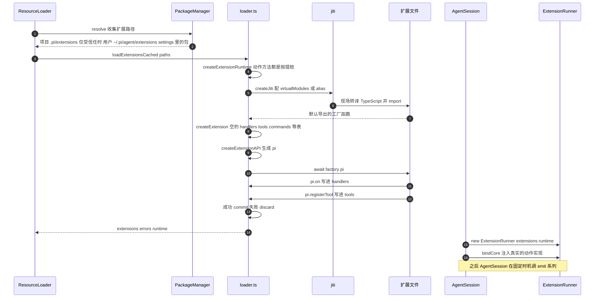

| 步骤 | 说明 |
| --- | --- |
| 收集路径 | 来源有三类：项目的 `.pi/extensions/`（只在项目被信任时才加载，`package-manager.ts`）、用户的 `~/.pi/agent/extensions/`、settings 里声明的包。命令行 `--extension` / `-e`（`cli/args.ts`）临时指定的路径，合并时排在最前并去重 |
| 目录里认哪些文件 | 只看一层：直接放的 `*.ts` / `*.js`；子目录里的 `index.ts` / `index.js`；子目录里 `package.json` 的 `pi.extensions` 字段声明的入口 |
| 加载模块 | 用 jiti 导入，取默认导出；不是函数就报“没有导出有效的工厂函数” |
| 建空壳 | `Extension` 对象里的 `handlers`、`tools`、`commands`、`flags`、`shortcuts`、渲染器表全是空的 |
| 调工厂 | `await factory(pi)`，成功 `commit()`，抛错 `discard()` 并把错误记进 `errors`，这个扩展不会进列表，其他扩展照常加载 |
| 建 runner | 拿 `extensions` 和共享的 `runtime` 构造 `ExtensionRunner`，随后 `_bindExtensionCore` 调 `runner.bindCore`（`runner.ts`）把真实现塞进去 |

##### jiti

jiti 是 Node 上的运行时模块加载器，能直接 `import` 一个 `.ts` 文件：加载时现场转译成 JavaScript 再执行，并且允许自定义模块解析。pi 在 `loadExtensionModule`（`loader.ts`）里创建 jiti，用它来做四件事：

1. 扩展不用构建。放一个 `.ts` 文件就生效，不需要 `tsc`，也不需要 `package.json`。
2. 把扩展里的 `import` 解析到宿主进程里的那一份模块。扩展目录通常没有 `node_modules`，原生 `import "@earendil-works/pi-coding-agent"` 找不到包。pi 按运行形态二选一：Bun 单文件二进制、Node SEA、自带 Node 的发行包没有磁盘上的包文件，用 `virtualModules`（`VIRTUAL_MODULES`）直接把宿主进程里已加载的模块对象交给扩展；普通 Node 构建版用 `alias`（`getAliases`）把包名映射到 pi 自己的 `dist` 文件。两种方式都能保证扩展和宿主用的是同一个模块实例，`instanceof`、TypeBox schema、全局注册表在两边一致。
3. 兼容老扩展。映射表同时收录新旧两个包名前缀 `@earendil-works/*` 和 `@mariozechner/*`，并把 `@earendil-works/pi-ai` 根入口指到 `compat` 入口，老扩展用旧的全局 API 也能跑。
4. 支持热重载。`moduleCache: false`，每次都重新读文件。pi 自己在外层按“工作目录 + 代次”缓存工厂函数（`useExtensionCacheCwd`），`/reload` 走到 `ResourceLoader.reload`（`core/resource-loader.ts`），调 `clearExtensionCache` 让代次加一，缓存作废，改过的扩展代码就能生效。

##### `pi` 的方法

`createExtensionAPI`（`loader.ts`）生成的 `pi` 对象里，方法按“写到哪”分成两类，区别在于加载期间能不能调用：

| 类别 | 方法 | 写到哪 | 加载期（工厂函数执行中）能否调用 |
|---|---|---|---|
| 注册方法 | `on`、`registerTool`、`registerCommand`、`registerShortcut`、`registerFlag`、`registerMessageRenderer`、`registerEntryRenderer`、`registerMarkdownTransformer` | 直接写进这个扩展自己的 `Extension` 对象 | 能，本来就该在这时调 |
| 延后生效的注册 | `registerProvider`、`unregisterProvider`、`registerFlag` 的默认值 | 加载期先排进待办队列，`commit()` 时才应用；`bindCore` 时模型注册表就绪后才真正注册 provider | 能，但效果推迟 |
| 动作方法 | `sendMessage`、`sendUserMessage`、`appendEntry`、`setSessionName`、`setLabel`、`getActiveTools`、`setActiveTools`、`getCommands`、`setModel`、`setThinkingLevel`、`exec` 等 | 委托给共享的 `runtime` | 不能。`createExtensionRuntime` 里它们是抛错桩，报 “Action methods cannot be called during extension loading”，`bindCore` 后才换成真实现 |
| 扩展间通信 | `events.emit(channel, data)`、`events.on(channel, handler)` | 共享的事件总线 | 能。加载失败时，加载期订阅的会被自动退订 |

加载过程用 `commit` / `discard` 做成了类似事务的效果（`loader.ts`）：工厂函数跑到一半抛错时，已排队的 flag 默认值和 provider 注册全部丢弃，事件总线订阅退订，这个 `pi` 被标记为失败，之后再调任何方法都会抛错。

##### `ctx`

每次 `emit*` 都会调 `createContext()`（`runner.ts`）新造一个 `ExtensionContext`，里面是 `ui`、`hasUI`、`cwd`、`sessionManager`、`modelRegistry`、`model`、`signal`、`isIdle()`、`abort()`、`compact()`、`getContextUsage()`、`getSystemPrompt()` 等。这些成员都是 getter 或闭包，调用时才去取值，所以 `bindCore` / `bindUI` 之后的变化能反映出来。里面没有能直接修改 `agent.state` 的方法，扩展要改状态只能调 `pi.setXxx()`。

`ctx` 的每个成员都会先 `assertActive()`。会话被替换（`newSession`、`fork`、`switchSession`）或 `reload` 之后，`runtime.invalidate()` 把旧的 `pi` 和 `ctx` 标记为过期，扩展如果把它们存下来以后再用，会收到一段明确的报错，告诉你改用新会话回调里传入的 `ctx`（`loader.ts` 中 `createExtensionRuntime` 里的 `invalidate`）。

##### 注意事项

1. 返回值的格式由事件决定，runner 按上面 `emit*` 那张表里的规则合并：`session_before_*` 返回 `{ cancel }`，`tool_call` 返回 `{ block }`，`context` 返回 `{ messages }`，`input` 返回 `{ action }`……返回格式不对，大多数事件不会报错，只是没有效果。
2. `tool_call` 的处理函数抛错，等于拦截这次工具调用。其他事件的异常会被捕获、上报，不影响后面的扩展；`emitToolCall` 不捕获，异常一路抛到 `agent.beforeToolCall`，这次工具调用被拦下。权限类扩展出错时因此不会误放行。
3. 高频事件的处理函数要尽量快。流式输出的每个分片都会触发一次 `message_update`，而 `AgentSession` 是先 `await` 扩展处理完、再通知 UI 等其他监听者（`core/agent-session.ts`）。订阅了它的扩展处理得慢，整个流式输出都会跟着卡。只有 `tool_call`、`tool_result` 等少数调用点会先查 `hasHandlers(type)` 跳过无人订阅的情况。

### 4.4 `ToolDefinition` 与 `AgentTool`

产品层定义工具用 `ToolDefinition`（`extensions/types.ts`），比 `AgentTool` 多了 `promptSnippet`（进系统提示词的一行简介）、`promptGuidelines`（进系统提示词的规则条目）、`renderCall` / `renderResult`（TUI 渲染），而且 `execute` 多一个参数 `ctx: ExtensionContext`。

进循环前要包两层：

| 包装 | 做什么 |
| --- | --- |
| `wrapToolDefinition(def, ctxFactory)` | 把 `ToolDefinition` 变成 `AgentTool`：`execute` 调用时补上 `ctxFactory()` 造的 `ExtensionContext` |
| `wrapRegisteredTool(tool, runner)` | 再包一层：执行前后各看一次 `runner.getActiveTools()`，如果执行过程中激活了新工具，就把新工具名塞进结果的 `addedToolNames` |

内置八个工具在 `tools/index.ts` 的 `ToolName`：`read` / `bash` / `powershell` / `edit` / `write` / `grep` / `find` / `ls`。默认激活四个：`read` / `bash` / `edit` / `write`（`sdk.ts`）。

---

## 5. 模型层：`pi-ai`

### 5.1 服务商与协议

pi-ai 把一次模型调用拆成两个互相独立的问题：

| 维度 | 字段 | 回答什么问题 | 取值例子 | 由谁实现 |
|---|---|---|---|---|
| 服务商 | `Model.provider`，对应 `Provider.id` | 请求发到哪、用什么凭证、有哪些模型、价格多少 | `anthropic`、`deepseek`、`moonshotai`、`openrouter`、`ollama`（用户自定义） | `providers/*.ts` 里每家一个 `createProvider(...)` 调用 |
| 协议 | `Model.api` | 请求体长什么样、流式响应怎么解析 | `openai-completions`、`openai-responses`、`anthropic-messages`、`google-generative-ai` 等 10 种（`ai/src/types.ts`） | `api/*.ts` 里每种协议一个模块，导出 `stream` 和 `streamSimple` |

每个 `Model` 上同时有这两个字段（`ai/src/types.ts`），用户可以自己加服务商，扩展也可以自己注册新协议。

为什么要这样拆？现在很多厂商提供的是 OpenAI 兼容接口或 Anthropic 兼容接口，协议一样，只是地址、鉴权、模型列表不同。如果按厂商来写，26 家 OpenAI 兼容厂商就得写 26 份差不多的请求代码；按协议来写，40 家内置服务商共用 10 份协议实现，每家厂商只剩一份配置。

各协议被多少家服务商使用（按 `providers/*.ts` 里各家传给 `createProvider` 的 `api` 统计）：

| 协议 | 实现文件 | 使用它的内置服务商 |
|---|---|---|
| `openai-completions` | `api/openai-completions.ts` | 26 家：deepseek、moonshotai、moonshotai-cn、zai、zai-coding-cn、groq、cerebras、together、fireworks、huggingface、nvidia、baseten、openrouter、cloudflare-workers-ai、cloudflare-ai-gateway、github-copilot、opencode、opencode-go、ant-ling、xiaomi 系列四家、qwen-token-plan 系列三家 |
| `anthropic-messages` | `api/anthropic-messages.ts` | 11 家：anthropic、kimi-coding、minimax、minimax-cn、openrouter、vercel-ai-gateway、fireworks、github-copilot、opencode、opencode-go、cloudflare-ai-gateway |
| `openai-responses` | `api/openai-responses.ts` | openai、xai、github-copilot、opencode、opencode-go、cloudflare-ai-gateway |
| `google-generative-ai` | `api/google-generative-ai.ts` | google、opencode |
| 其余六种 | `openai-codex-responses`、`azure-openai-responses`、`google-vertex`、`mistral-conversations`、`bedrock-converse-stream`、`pi-messages` | 各自只有一家 |

反过来，一家服务商也可以用多个协议。OpenRouter 对 Claude 模型走 `anthropic-messages`、其他模型走 `openai-completions`；opencode 一家就用了四种协议。这时 `createProvider` 的 `api` 参数传一个“协议名 → 实现”的映射，调用时按 `model.api` 挑（`providers/openrouter.ts`）：

```ts
export function openrouterProvider(): Provider<"anthropic-messages" | "openai-completions"> {
  return createProvider({
    id: "openrouter",
    baseUrl: "https://openrouter.ai/api/v1",
    auth: { apiKey: envApiKeyAuth("OpenRouter API key", ["OPENROUTER_API_KEY"]), oauth: … },
    models: Object.values(OPENROUTER_MODELS),
    api: {
      "anthropic-messages": anthropicMessagesApi(),
      "openai-completions": openAICompletionsApi(),
    },
  });
}
```

### 5.2 `compat`

很多厂商都说自己兼容 OpenAI 接口，但真接起来细节各不一样：DeepSeek 回放历史时要求 assistant 消息带上 `reasoning_content`；Moonshot 不认 `reasoning_effort`，也不认工具定义里的 `strict`；OpenRouter 的思考参数要写成 `reasoning: { effort }`。

pi-ai 并没有给每家单独写一套实现，大家共用 `openai-completions` 这一份代码，代码里需要区分厂商的地方去查一张开关表，这张表就是 `Model.compat`（`ai/src/types.ts`）。

不同协议的开关不一样，所以 `compat` 的类型跟着 `api` 走：`api` 是 `openai-completions` 时是 `OpenAICompletionsCompat`，是 `anthropic-messages` 时是 `AnthropicMessagesCompat`。把开关填到了错误的协议上，编译就会报错。

开关的值怎么来，看 `api/openai-completions.ts` 里的两个函数：

1. `detectCompat(model)` 先根据 `model.provider`，或者 `model.baseUrl` 里的域名，判断是哪家厂商，给一组默认值。因为也看域名，用户自己配一个叫 `my-ds` 的服务商，只要地址是 `deepseek.com`，拿到的也是 DeepSeek 的默认值。
2. `getCompat(model)` 再用模型上手写的 `model.compat` 一项项覆盖上去。

构造请求时先调一次 `getCompat(model)`，后面遇到厂商有差异的地方就查这个结果。`openai-completions` 下常见的几个开关：

| 开关 | 默认 | 哪些厂商不同 | 影响请求体的哪里 |
|---|---|---|---|
| `thinkingFormat` | `openai`：`reasoning_effort` | deepseek 用 `thinking: { type }`；zai 用 `thinking: { type }`；together 用 `reasoning: { enabled }`；openrouter 用 `reasoning: { effort }` | 思考强度参数的字段名和结构 |
| `requiresReasoningContentOnAssistantMessages` | false | deepseek 为 true | 回放历史时 assistant 消息补 `reasoning_content` |
| `maxTokensField` | `max_completion_tokens` | deepseek、moonshot、together、nvidia、zai 等用 `max_tokens` | 输出上限的字段名 |
| `supportsDeveloperRole` | 标准厂商为 true | 非标准厂商为 false；openrouter 也为 false，但它上面的 `anthropic/*`、`openai/*` 模型为 true | 系统提示词用 `developer` 还是 `system` 角色 |
| `supportsStore` | 标准厂商为 true | cerebras、xai、deepseek、moonshot 等为 false | 是否发 `store` 字段 |
| `supportsStrictMode` | true | moonshot、together、nvidia、cloudflare-ai-gateway 为 false | 工具定义里是否带 `strict` |
| `sendSessionAffinityHeaders` | false | openrouter 为 true | 是否发会话亲和头，让同一会话落到同一副本、提高缓存命中 |
| `cacheControlFormat` | 无 | openrouter 上的 `anthropic/*` 模型为 `anthropic` | 给系统提示词、最后一个工具、最后一条消息加 `cache_control` |

`anthropic-messages` 协议也是同样的做法（`api/anthropic-messages.ts`），开关有 `supportsEagerToolInputStreaming`（工具参数是否逐字流式返回）、`supportsLongCacheRetention`（是否支持 1 小时缓存）、`sendSessionAffinityHeaders`（Fireworks、OpenRouter 需要）。

那什么时候加开关、什么时候单独写一个协议？差异只是字段名不同、支不支持某个参数这种程度，就放进 `compat`，所以 DeepSeek、Moonshot 在 pi 里只是 `openai-completions` 加一组开关。像 `azure-openai-responses`、`openai-codex-responses` 这种，地址规则、鉴权方式或者请求结构差得比较多，才拆成独立的协议。

### 5.3 类图

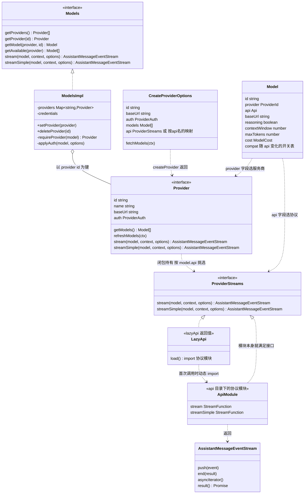

| 类型 | 说明 |
| --- | --- |
| `Model` | 纯数据。`provider` 决定 `Models` 把请求交给哪个 `Provider`；`api` 决定 `Provider` 用哪份协议实现；`compat` 决定协议实现内部走哪些分支 |
| `Models` 接口 | 对外门面。`coding-agent` 的 `ModelRuntime`（`model-runtime.ts`）实现了它，再套一层凭证管理 |
| `ModelsImpl` | 默认实现，内部一个 `provider id → Provider` 的 Map。`setProvider` 按 id 放入 |
| `Provider` 接口 | 一家服务商。它是接口而不是类，内置的都是 `createProvider` 拼出来的普通对象；`coding-agent` 的 `composeModelProvider` 也会拼一个 |
| `CreateProviderOptions` | `createProvider` 的入参。注意 `api` 字段的类型是“单个 `ProviderStreams`，或者 `{ 协议名: ProviderStreams }`” |
| `ProviderStreams` | 每个协议实现都要满足的结构：一个对象，带 `stream` 和 `streamSimple`，可选 `fetchDeferred` / `cancelDeferred`。每个 `api/*.ts` 模块的导出都满足它 |
| `lazyApi(load)` | 把“动态 import 一个协议模块”包装成 `ProviderStreams`。`providers/*.ts` 传给 `createProvider` 的都是它，比如 `anthropicMessagesApi()` 就是 `lazyApi(() => import("./anthropic-messages.ts"))`。所以启动时注册 40 家服务商并不会加载协议代码，要等第一次调用时才加载 |
| `lazyStream(model, setup)` | 先同步返回一个空的外层流，`setup()` 异步完成后把内层流的事件转发过去；`setup` 抛错就合成一条 `error` 事件。`StreamFn` 约定出错时不抛异常，而是把错误作为事件放进流里（见 `agent/src/types.ts` 的注释），靠的就是这一层 |
| `EventStream<T, R>` | 生产者 `push`，消费者 `for await`。内部两个 FIFO：一个存还没被消费的事件，一个存等着事件的消费者。`isComplete(event)` 为真时流结束，在等 `result()` 的一方拿到最终结果 |
| `AssistantMessageEventStream` | 特化：`done` 或 `error` 事件算完成，结果是那条 `AssistantMessage` |

### 5.4 `createProvider`

`createProvider` 返回一个满足 `Provider` 接口的普通对象，函数体里主要做了这几件事：

1. 合并模型列表：`getModels` 返回“静态列表 `input.models` + 最近一次 `fetchModels` 拉到的动态列表”，同 id 以动态的为准。
2. 判断 `api` 是单个实现还是映射：看 `input.api.stream` 是不是函数。是就记为 `single`，否则记为 `byApi`。`apiFor(model)` 返回 `single ?? byApi[model.api]`。
3. 生成 `stream` / `streamSimple`：两者都走 `dispatch`。`apiFor(model)` 找不到实现时，不抛异常，而是返回一条“`Provider xxx has no API implementation for "yyy"`”的错误流。
4. 按需加上可选方法：底层任意一份实现有 `fetchDeferred` / `cancelDeferred`，才给返回对象加上同名方法。

返回对象的字段：

| 字段 | 来源 |
|---|---|
| `id` / `name` / `baseUrl` / `headers` / `auth` | 原样取自入参，`name` 缺省用 `id` |
| `getModels` | 第 1 步的合并函数 |
| `refreshModels` | 入参有 `fetchModels` 才有：先恢复上次持久化的列表，允许联网时再拉新的，通过 `context.publish` 事务化地替换 |
| `filterModels` | 原样取自入参 |
| `stream` / `streamSimple` | 第 3 步的闭包，内部持有 `single` 或 `byApi` |

所以 `Provider` 自己并不处理协议，只是按 `model.api` 把调用转给对应的实现，协议相关的代码都在各个协议模块里。

### 5.5 调用流程

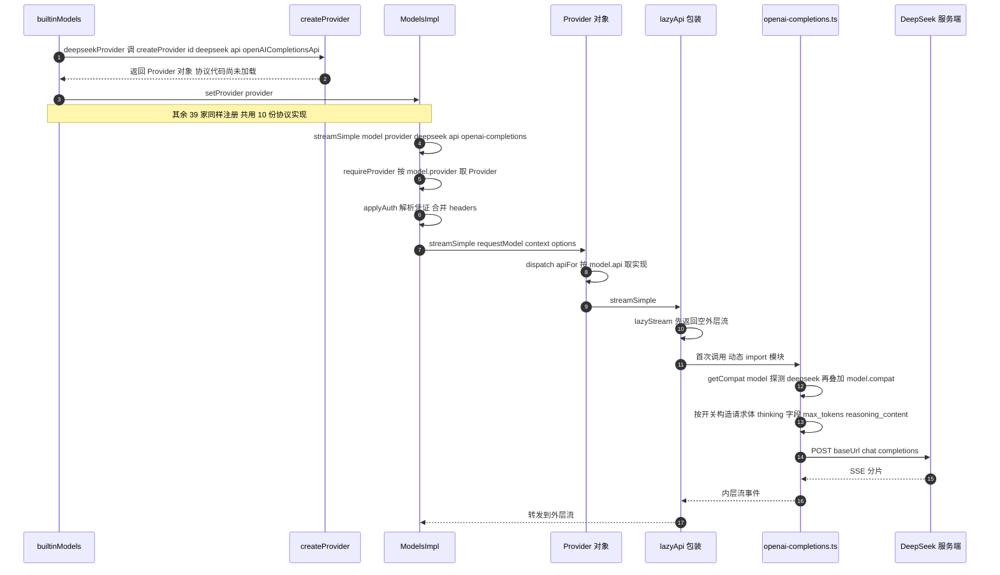

图里编号对应的步骤：

1–4. `builtinModels()`（`providers/all.ts`）对 `builtinProviders()` 返回的 40 个对象逐个 `setProvider`。每个对象都是 `createProvider` 拼的，协议实现都是 `lazyApi` 包装，此时一个协议模块都没加载。

5–7. `ModelsImpl.streamSimple`（`models.ts`）用 `lazyStream` 包住整个过程：`requireProvider` 用 `model.provider` 查 Map，`applyAuth` 解析凭证、合并 headers，有 `baseUrl` 覆盖就换掉模型的 `baseUrl`。

8–10. `Provider.streamSimple` 再按 `model.api` 选出对应协议的实现。

11–12. `lazyApi` 在首次调用时 `import()` 协议模块，之后走模块缓存。

13–14. 协议模块内部再根据 `compat` 处理各厂商的差异，这一步只是模块里的 if 判断，不再换对象。

### 5.6 自定义服务商

这样设计的好处是，想接本地的 Ollama、vLLM，或者新出的兼容厂商，只需要写配置，不用写代码。`coding-agent/docs/models.md` 的最小例子：

```json
{
  "providers": {
    "ollama": {
      "baseUrl": "http://localhost:11434/v1",
      "api": "openai-completions",
      "apiKey": "ollama",
      "compat": { "supportsDeveloperRole": false, "supportsReasoningEffort": false },
      "models": [{ "id": "gpt-oss:20b", "reasoning": true }]
    }
  }
}
```

`ollama` 是一个 pi-ai 不认识的服务商 id，但 `openai-completions` 是认识的协议。`coding-agent` 的 `composeModelProvider`（`core/provider-composer.ts`）为它拼一个 `Provider` 对象，调用时按三级顺序找实现：

1. 扩展注册了同名协议的 `streamSimple`，用扩展的；
2. 存在同 id 的内置服务商且它支持这个 `api`，用内置服务商的；
3. 否则从全局协议注册表按 `model.api` 取（`getApiProvider(model.api)`）。注册表在 `ai/src/compat.ts` 的 `BUILTIN_APIS` 里预置了全部 10 种协议。

`compat` 可以写在服务商层（对所有模型生效），也可以写在单个模型上覆盖。模型没写的字段，`findModelDefaults` 按“同 id 的已知模型 → 同协议的已知模型 → 任一 `openai-completions` 模型 → 第一个模型”的顺序找一个模型借默认值。

### 5.7 `anthropic-messages` 协议模块

`streamSimple` 把通用的 `SimpleStreamOptions`（`reasoning` 等级、`thinkingBudgets`）翻译成 Anthropic 特有的 `thinkingEnabled` / `thinkingBudgetTokens` / `effort`，再调 `stream`。`stream` 内部流程（其他协议大同小异）：

1. 造一条 `stopReason: "pending"` 的空 `AssistantMessage` 当累积器
2. `buildParams(model, context, isOAuth, options)`：把 `Context.messages` 转成 Anthropic 的消息格式，系统提示词放进 `params.system`，OAuth 令牌时强制在最前面加一句 "You are Claude Code..."
3. `options.onPayload?.(params, model)` 让上层（扩展）改请求体
4. `retryProviderRequest(() => client.beta.messages.create(params).asResponse())`：HTTP 层的重试，看 `x-should-retry` 头和 408/409/429/5xx（`utils/provider-retry.ts`）
5. `options.onResponse?.(status, headers)` 通知上层
6. `stream.push({ type: "start", partial })`，然后逐个 SSE 事件更新累积器并 `push` 对应的 `text_delta` / `toolcall_delta` 等
7. 最后 `push({ type: "done", message })` 或 `{ type: "error", error }`

第 2 步用的是 `model.baseUrl` 和 `model.compat`，没有写死 `api.anthropic.com`，所以 Anthropic 官方、Kimi Coding、MiniMax、Vercel AI Gateway 都能共用这一个模块。

---

## 6. 启动装配

`pi` 命令启动到 `AgentSession` 可用，经过这些步骤。后面各个回调具体指向谁，都是在这一步定下来的。

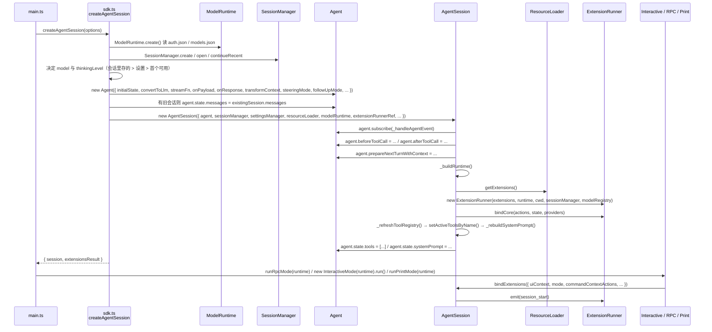

### 6.1 `createAgentSession`

| 步骤 | 决定了什么 |
|---|---|
| 决定模型 | 旧会话里记的模型优先（前提是那家 provider 还配了鉴权），否则 `findInitialModel` 按设置的默认 provider/model 找 |
| 决定思考等级 | 旧会话 > 每模型覆盖 > 全局默认 > `"medium"`，最后 `clampThinkingLevel` 夹到模型支持的范围 |
| 决定初始工具 | `options.tools`（白名单）> `settings.defaultTools` > `["read","bash","edit","write"]`，再减去 `excludeTools` |
| `new Agent(...)` | 见下表 |
| 恢复历史 | 有旧会话：`agent.state.messages = existingSession.messages`。没有：往会话里写 `model_change` 和 `thinking_level_change` 两条条目，以便下次恢复 |
| `new AgentSession(...)` | — |

`new Agent` 时传进去的每个回调（`sdk.ts`）：

| 参数 | 塞的是什么 | 为什么 |
|---|---|---|
| `initialState` | `{ systemPrompt: "", model, thinkingLevel, tools: [] }` | 系统提示词和工具由 `AgentSession` 稍后填 |
| `convertToLlm` | `messages.ts` 的转换，外面包一层：设置里 `blockImages` 打开时把所有图片换成文字 "Image reading is disabled." | 防御性：即使某个扩展往上下文塞了图片也发不出去 |
| `streamFn` | 闭包：读设置里的超时/重试参数，调 `modelRuntime.streamSimple(model, context, { ...options, timeoutMs, maxRetries, maxRetryDelayMs, transformHeaders })`。`transformHeaders` 先合并 provider 归属头，再让扩展改（`before_provider_headers`） | 每次请求都重新读设置，所以改设置立即生效 |
| `onPayload` | 若有扩展订阅 `before_provider_request`，让扩展改请求体 | 扩展可以改最终发出去的 JSON |
| `onResponse` | 若有扩展订阅 `after_provider_response`，把状态码和响应头发给扩展 | 给限流类扩展看头 |
| `transformContext` | `runner.emitContext(messages)` | 扩展可以在发请求前改消息 |
| `steeringMode` / `followUpMode` | 从设置读，默认都是 `"one-at-a-time"` | — |
| `sessionId` | `sessionManager.getSessionId()` | 透传给 provider 做缓存亲和 |

`extensionRunnerRef` 的作用：`streamFn` / `onPayload` / `onResponse` 三个闭包在 `new Agent` 时就固定了，但 `ExtensionRunner` 要到 `AgentSession._buildRuntime` 才创建，而且 `reload()` 会换新的。所以用一个 `{ current }` 对象包一层（`sdk.ts`），闭包每次调用时再去取最新的 runner。

### 6.2 `AgentSession` 构造函数

构造函数按顺序做了这几件事：

1. 存依赖
2. `agent.subscribe(this._handleAgentEvent)`：从此循环发的每个事件都先经过 `AgentSession`
3. `_installAgentToolHooks()`：给 `agent.beforeToolCall` 和 `agent.afterToolCall` 赋值（§8.2）
4. `_installAgentNextTurnRefresh()`：给 `agent.prepareNextTurnWithContext` 赋值（§10.3）
5. `_buildRuntime({ activeToolNames, includeAllExtensionTools: true })`

### 6.3 `_buildRuntime`

1. `createAllToolDefinitions(cwd, { read: { autoResizeImages }, bash: { commandPrefix, shellPath } })`（`tools/index.ts`）造八个内置 `ToolDefinition`，存进 `_baseToolDefinitions`
2. `resourceLoader.getExtensions()` 拿已加载的扩展
3. `new ExtensionRunner(...)`，写进 `_extensionRunnerRef.current`
4. `_bindExtensionCore(runner)`：把 `sendMessage` / `sendUserMessage` / `appendEntry` / `setActiveTools` / `setModel` / `compact` / `abort` 等二十来个动作绑进 runner，扩展调 `pi.xxx()` 时最终落到 `AgentSession` 的方法上
5. `_refreshToolRegistry({ activeToolNames, includeAllExtensionTools })`

### 6.4 `_refreshToolRegistry` 和 `setActiveToolsByName`

这两个方法决定模型能看到哪些工具：

1. 收集三种来源：`runner.getAllRegisteredTools()`（扩展注册的）、`_customTools`（SDK 调用方传的）、`_baseToolDefinitions`（内置）
2. 用 `_allowedToolNames` / `_excludedToolNames` 过滤
3. 全部包装成 `AgentTool`（§4.4），放进 `_toolRegistry`；同时从定义里抽出 `promptSnippet` 和 `promptGuidelines` 存进两个 Map
4. 算出"这次要激活哪些"：有白名单就激活白名单里全部；首次装配时激活全部扩展工具；reload 时只把新出现的工具加进激活列表
5. `setActiveToolsByName(names)`：从注册表挑出对象赋给 `agent.state.tools`，然后 `_rebuildSystemPrompt(validToolNames)` 重算系统提示词并赋给 `agent.state.systemPrompt`

`_rebuildSystemPrompt` 把激活工具的 snippet 和 guidelines、`resourceLoader` 给的自定义提示词/追加提示词/技能/AGENTS.md 内容，一起交给 `buildSystemPrompt`（`system-prompt.ts`）。所以激活的工具一变，系统提示词也会跟着重新生成。

---

## 7. prompt 执行流程

这张图是整个主流程，参与者从左到右依次是 UI 到网络请求。

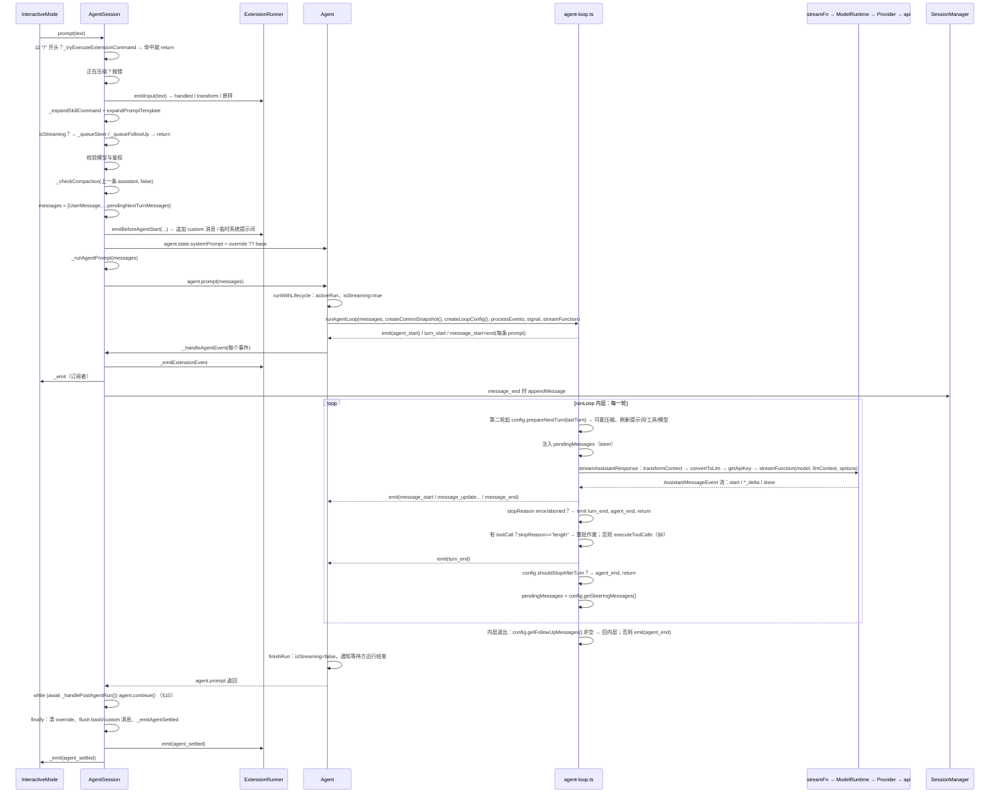

### 7.1 `AgentSession.prompt`

| 步 | 做什么 | 提前返回的条件 |
|---|---|---|
| ① | `text` 以 `/` 开头就试 `_tryExecuteExtensionCommand`。扩展命令即使在流式输出中也会立刻执行，它自己通过 `pi.sendMessage()` 管理和模型的交互 | 命中命令 |
| ② | `_compactionAbortController` 非空就抛错 | 抛错 |
| ③ | `_runInputHandlers`：让订阅了 `input` 的扩展先看一眼 | 扩展返回 `handled` |
| ④ | `/skill:name args` 展开成 `<skill>` 块；`/template args` 展开提示词模板 | — |
| ⑤ | `isStreaming` 为真：按 `options.streamingBehavior` 走 `_queueFollowUp` 或 `_queueSteer`。没给 behavior 就抛错 | 排队后返回 |
| ⑥ | 把上一轮攒下的 bash 消息和 custom 消息 flush 进状态（§9.3） | — |
| ⑦ | 没模型抛错；`modelRuntime.hasConfiguredAuth` 或 `checkAuth` 都不通过就抛错（OAuth 场景给不同文案） | 抛错 |
| ⑧ | `_checkCompaction(lastAssistant, skipAbortedCheck=false)`：上一次被用户中断的响应也可能已经溢出，这里补查一次 | — |
| ⑨ | 组 `messages`：一条 `UserMessage`（文本 + 图片），后面跟 `_pendingNextTurnMessages` 里攒的 custom 消息 | — |
| ⑩ | `emitBeforeAgentStart`：扩展可以再追加 custom 消息，可以给临时系统提示词。有临时的就 `_systemPromptOverride = 它` 并写进 `agent.state.systemPrompt`；没有就恢复 `_baseSystemPrompt` | — |
| ⑪ | `_runAgentPrompt(messages)` | — |

### 7.2 `_runAgentPrompt`

```ts
this._isAgentRunActive = true;
try {
  await this.agent.prompt(messages);
  while (await this._handlePostAgentRun()) {   // §10：重试 / 压缩 / 队列里还有东西
    await this.agent.continue();
  }
} finally {
  this._systemPromptOverride = undefined;      // 临时提示词只活一次运行
  this._flushPendingBashMessages();
  this._flushPendingCustomMessages();
  await this._emitAgentSettled();              // agent_settled 事件；在 waitForIdle 上等着的调用方此时返回
}
```

这里有两层循环：`agent.prompt()` 里面是 `runLoop` 的循环，外面还有一层 `while (_handlePostAgentRun())`，用来做重试、压缩这类产品层的处理。

### 7.3 `runLoop`

```ts
let currentContext = initialContext;            // 快照，循环内可以换（prepareNextTurn）
let config = initialConfig;                     // 同上，可以换模型/思考等级
let lastCompletedTurn;                          // 上一轮的结果，给 prepareNextTurn 用
let pendingMessages = await config.getSteeringMessages?.() || [];   // 开局先拉一次：用户可能在等待时已经打了字

while (true) {                                  // 外层：处理 followUp
  let hasMoreToolCalls = true;

  while (hasMoreToolCalls || pendingMessages.length > 0) {   // 内层：处理工具轮次和 steer
    if (lastCompletedTurn) {                    // 不是第一轮
      const next = await config.prepareNextTurn?.(lastCompletedTurn);
      if (next) { currentContext = next.context ?? currentContext; config = {...config, model, reasoning}; }
      if (pendingMessages.length === 0)         // 只有上一次没拉到才补拉
        pendingMessages = await config.getSteeringMessages?.() || [];
      await emit({ type: "turn_start" });
    }

    for (const m of pendingMessages) {          // 把 steer 注入上下文
      emit(message_start); emit(message_end); currentContext.messages.push(m); newMessages.push(m);
    }
    pendingMessages = [];

    const message = await streamAssistantResponse(currentContext, config, signal, emit, streamFunction);
    newMessages.push(message);

    if (message.stopReason === "error" || message.stopReason === "aborted") {
      emit(turn_end); emit(agent_end); return;  // 循环不重试，交给产品层
    }

    const toolCalls = message.content.filter(c => c.type === "toolCall");
    hasMoreToolCalls = false;
    if (toolCalls.length > 0) {
      const batch = message.stopReason === "length"
        ? await failToolCallsFromTruncatedMessage(toolCalls, emit)           // 整批作废
        : await executeToolCalls(currentContext, message, config, signal, emit);
      toolResults.push(...batch.messages);
      hasMoreToolCalls = !batch.terminate;
      for (const r of toolResults) { currentContext.messages.push(r); newMessages.push(r); }
    }

    await emit({ type: "turn_end", message, toolResults });
    lastCompletedTurn = { message, toolResults, context: currentContext, newMessages };

    if (await config.shouldStopAfterTurn?.(lastCompletedTurn)) { emit(agent_end); return; }

    pendingMessages = await config.getSteeringMessages?.() || [];
  }

  const followUps = await config.getFollowUpMessages?.() || [];
  if (followUps.length > 0) { pendingMessages = followUps; continue; }       // 回内层
  break;
}
await emit({ type: "agent_end", messages: newMessages });
```

内层循环在没有工具调用、也没有插话时退出；退出后外层再看有没有追加消息，有就继续跑。

为什么只在为空时才补拉？`prepareNextTurn` 可能很慢（比如在压缩），这期间用户说的话不应该被拖到再下一轮，所以要补拉一次；但如果上一次已经拉到了，`one-at-a-time` 模式下再拉就会在同一轮塞进两条，所以只在为空时补拉。

### 7.4 `streamAssistantResponse`

| 步 | 做什么 |
|---|---|
| ① | `transformContext`（扩展改 `AgentMessage[]`） |
| ② | `convertToLlm`（`AgentMessage[]` → `Message[]`） |
| ③ | 组 `llmContext = { systemPrompt: context.systemPrompt, messages: llmMessages, tools: context.tools }` |
| ④ | `getApiKey?.(provider) \|\| config.apiKey`：每次都重新取，为了会过期的 OAuth token |
| ⑤ | `streamFunction(config.model, llmContext, { ...config, apiKey, signal })`。注意 `config` 整个展开进去，所以 `reasoning` / `sessionId` / `transport` / `thinkingBudgets` / `onPayload` / `onResponse` / `maxRetryDelayMs` 都到了 provider |
| ⑥ | 消费流：`start` 事件时把 `partial` push 进 `context.messages`，之后每个增量事件用 `context.messages[last] = event.partial` 替换，并发 `message_update`；`done` / `error` 时用 `response.result()` 拿最终消息替换掉，发 `message_end` |

注意流一开始就 push 了 partial，所以用户中途按 Esc 时，`context.messages` 末尾是半条 assistant 消息。这条在 `agent_end` 之后由 `Agent.processEvents` 的 `message_end` 落进 `_state.messages`，`SessionManager` 也会存下来。

### 7.5 事件回到 UI

一个 `text_delta` 到达终端要经过：

1. provider 的 `stream.push({ type: "text_delta", partial })`（`anthropic-messages.ts`）
2. `agent-loop.ts` 收到，`emit({ type: "message_update", assistantMessageEvent, message: {...partial} })`
3. `Agent.processEvents`（`agent.ts`）：`_state.streamingMessage = message`，然后 `await listener(event, signal)`
4. `AgentSession._handleAgentEvent`：先 `_emitExtensionEvent`（转成扩展的 `message_update` 事件），再 `_emit(event)` 给订阅者
5. `InteractiveMode.handleEvent`（`interactive-mode.ts`）的 `case "message_update"` 更新组件并 `ui.requestRender()`
6. `TuiBase.requestRender`（`tui/src/tui.ts`）合并到下一帧（最小间隔 16ms），`TuiMainScreen.doRender`（`tui-main-screen.ts`）只重绘变化的行

这条路径上每一步都是 `await`，`processEvents` 会按顺序等每个监听器处理完，所以监听器慢了，整个流都会变慢。RPC 模式专门加了一个背压监听器（`rpc-mode.ts`）在 stdout 写不动时等待。

---

## 8. 工具调用

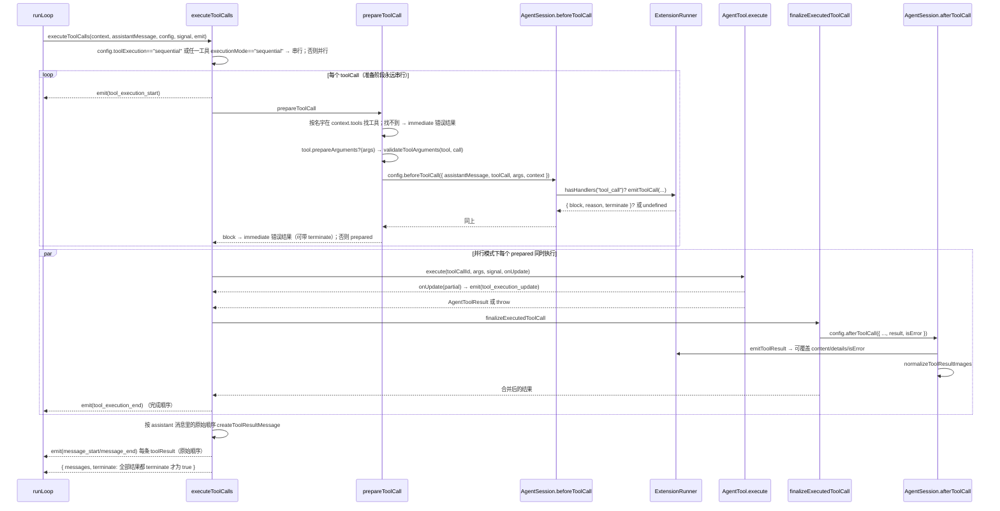

### 8.1 执行阶段

| 阶段 | 函数 | 输入 → 输出 |
|---|---|---|
| 准备 | `prepareToolCall` | `toolCall` → `{ kind: "prepared", tool, args }` 或 `{ kind: "immediate", result, isError }` |
| 执行 | `executePreparedToolCall` | `prepared` → `{ result, isError }`。`tool.execute` 抛错就包成错误结果。`onUpdate` 回调在 `execute` 返回后失效 |
| 收尾 | `finalizeExecutedToolCall` | 调 `afterToolCall`，逐字段合并覆盖，`afterToolCall` 自己抛错也变成错误结果 |

串行版三个阶段对每个调用依次做完再做下一个。并行版的准备阶段仍然是串行的（保证 `beforeToolCall` 的调用顺序确定），执行和收尾用 `Promise.all`。`tool_execution_end` 按完成顺序发，但 `toolResult` 消息按原始顺序发，保证上下文里的顺序和模型请求的顺序一致。

### 8.2 `beforeToolCall` 与 `afterToolCall`

`beforeToolCall`：没有扩展订阅 `tool_call` 就返回 `undefined`；有就 `emitToolCall`，扩展返回 `{ block: true, reason }` 即拒绝。pi 的权限控制只有这一个钩子，而且默认没有扩展订阅它。

`afterToolCall`：先让扩展改结果（`tool_result` 事件），然后 `normalizeToolResultImages` 按设置缩放图片。两者都没改就返回 `undefined`，循环保留原结果。

### 8.3 输出截断

`stopReason === "length"` 时不执行任何一个工具调用，每个都生成一条错误 `toolResult`，文案让模型重新发完整参数。源码注释里写了原因：流式返回的工具参数最后是靠一个容错的 JSON 解析器补全的，截断的消息里，工具调用可能解析成功、校验也通过，但参数其实不完整。自己写 agent 时要注意这一点。

### 8.4 `edit` 工具

```
execute(toolCallId, { path, edits }, signal, onUpdate, ctx)
  absolutePath = resolveToCwd(path, ctx.cwd || cwd)
  withFileMutationQueue(absolutePath, async () => {     // 同一文件的写串行化
    access → readFile → 去 BOM → 统一成 LF
    applyEditsToNormalizedContent(content, edits)      // 每个 oldText 必须唯一匹配
    还原换行 + BOM → writeFile
    return { content: [text "Successfully replaced N block(s)"], details: { diff, patch, firstChangedLine } }
  })
```

`withFileMutationQueue`（`tools/file-mutation-queue.ts`）：按真实路径（`realpath`）做 key，同一文件的操作排成一条 promise 链，不同文件互不等待。只要工具可以并行执行，就需要这样的机制，否则两个 `edit` 同时改一个文件会互相覆盖。

`bash`（`tools/bash.ts`）的执行体要点：输出走 `OutputAccumulator`，超过 2000 行或 50KB（`tools/truncate.ts`）就截断并把全文写到临时文件，结果里附 "Full output: 路径"；`onUpdate` 按 100ms 节流推增量。

---

## 9. 插话与排队

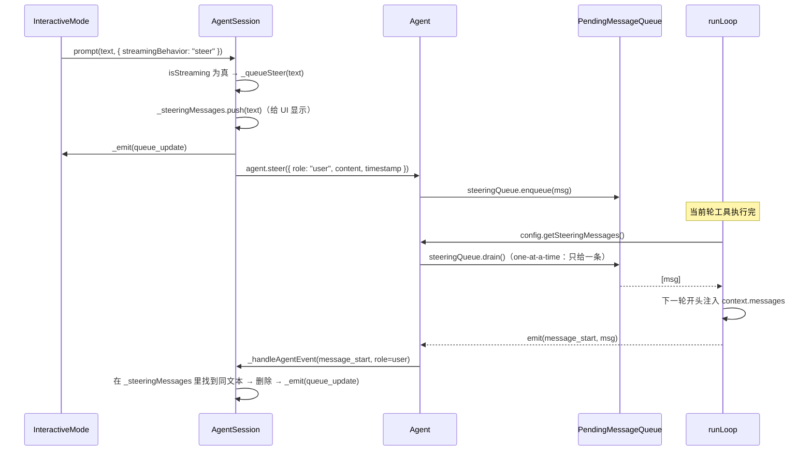

### 9.1 两个队列的区别

| | `steer` | `followUp` |
|---|---|---|
| 入口 | `AgentSession.steer` / `prompt(..., {streamingBehavior:"steer"})` | `AgentSession.followUp` / `prompt(..., {streamingBehavior:"followUp"})` |
| 循环在哪取 | 每轮结束后、开局、准备后补拉 | 内层循环退出后 |
| 语义 | "等等，改用另一个方案"，插进正在进行的任务 | "还有另一件事"，等手头的做完 |
| TUI 默认 | 正在流时直接回车就是 steer（`interactive-mode.ts`） | 需要专门的快捷键 |

### 9.2 `one-at-a-time` 模式

`PendingMessageQueue.drain()` 在 `one-at-a-time` 模式下只返回第一条。所以用户连打三句插话，会分三轮投进去，每轮模型只看到一句。`"all"` 模式一次全投。设置项 `steeringMode` / `followUpMode`（`settings-manager.ts` 的 `getSteeringMode`），RPC 命令 `set_steering_mode` 可改。

### 9.3 待发送消息

| 字段 | 谁往里放 | 什么时候 flush | 为什么不能立刻插 |
|---|---|---|---|
| `_pendingCustomMessages` | `sendCustomMessage` 在流式中且 `triggerTurn: false` | `turn_end` 时和运行结束时 | 立刻插会落在 assistant 的 toolCall 和 toolResult 之间，严格校验顺序的 provider 会拒绝 |
| `_pendingBashMessages` | `recordBashResult` 在流式中 | 运行结束时（`_runAgentPrompt` 的 finally） | 同上 |
| `_pendingNextTurnMessages` | `sendCustomMessage` 带 `deliverAs: "nextTurn"` | 下一次 `prompt()` 组消息时 | 语义就是"和用户下一句一起发" |

`sendCustomMessage` 的完整分支：`nextTurn` → 攒着；流式中且要触发 → `agent.steer` 或 `agent.followUp`；不流式且要触发 → 直接 `_runAgentPrompt`；流式中不触发 → 攒到 turn_end；不流式不触发 → 立刻追加进状态和会话。

---

## 10. 重试与压缩

`agent.prompt()` 返回后，`_handlePostAgentRun` 决定要不要 `agent.continue()`：

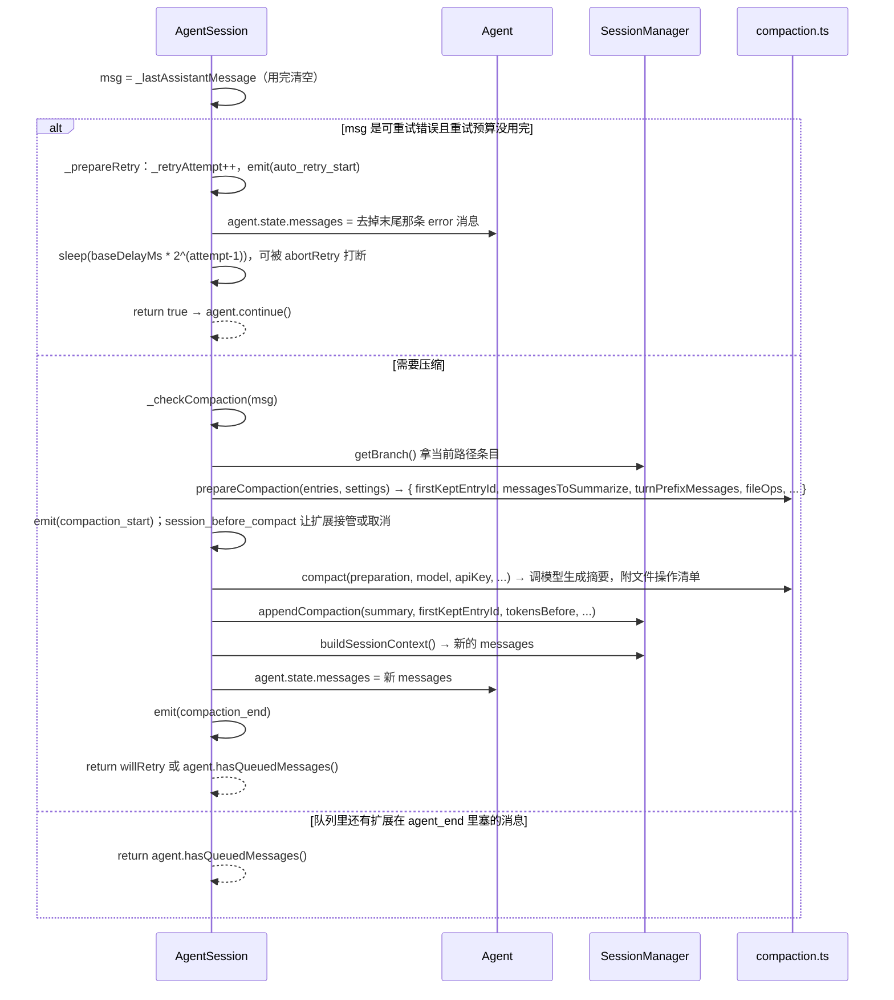

### 10.1 重试

| 判定 | 规则 |
| --- | --- |
| 是不是溢出 | 三种：错误文案匹配溢出模式；`stop` 但 `input + cacheRead > contextWindow`（静默溢出）；`length` 且 `output === 0` 且输入占满 99%（服务端截断输入）。溢出归压缩管，不重试 |
| 可不可以重试 | `stopReason === "error"` 且文案先排除"配额/账单"类（`NON_RETRYABLE_PROVIDER_LIMIT_ERROR_PATTERN`），再匹配"过载/限流/5xx/网络/超时/流提前结束"这一大串正则 |
| 延迟 | `baseDelayMs * 2^(attempt-1)`，上限 `maxAgentDelayMs`（默认 60 秒）。设置默认 `maxRetries: 3`，`baseDelayMs: 2000`（`settings-manager.ts`） |

`_prepareRetry` 做的事：计数、发 `auto_retry_start`、把末尾那条出错的 assistant 消息从 `agent.state.messages` 删掉（会话文件里保留）、可中断地睡眠、返回 `true`。然后 `agent.continue()` 看到最后一条是 user 或 toolResult，走 `runContinuation`。

重试计数在下一条成功的 assistant `message_end` 时归零。

注意这里有两层重试。这里说的是 agent 层的重试，会重新发整个请求；`ai` 包里还有 provider 层的重试（`provider-retry.ts`），在 HTTP 层根据状态码和 `x-should-retry` 头重试，次数由 `maxRetries` 选项控制。前者处理流中断、模型返回错误这类情况，后者处理连接层面的失败。

### 10.2 压缩判定

| 情况 | 条件 | 动作 |
|---|---|---|
| 排除 | 设置没开；被用户中断（`aborted`）且 `skipAbortedCheck`；这条 assistant 比最近一次压缩还早 | 不压 |
| 情况 1：溢出，响应没完成 | `isContextOverflow` 或 `isRecoverableLength`（`length` 且输出小于期望上限），`stopReason !== "stop"` | 删掉末尾那条 assistant，`_runAutoCompaction("overflow", willRetry=true)`，压完 `continue`。只试一次（`_overflowRecoveryAttempted`） |
| 情况 2：溢出，响应完成了 | 同上但 `stopReason === "stop"` | `_runAutoCompaction("overflow", false)`，不重试（`continue` 不能从完成的 assistant 继续） |
| 情况 3：阈值 | `contextTokens > contextWindow - reserveTokens`（`shouldCompact`，`compaction.ts`；默认 `reserveTokens: 16384`） | `_runAutoCompaction("threshold", false)` |

`contextTokens` 怎么算：优先用这条 assistant 的 `usage`（`totalTokens` 或四项相加）；如果是错误消息或 usage 全零，用 `estimateContextTokens(messages)`（`compaction.ts`）：找最后一条有效 usage 的 assistant，它的 usage 加上它之后所有消息的字符估算。

### 10.3 每轮开头的压缩

除了运行结束后检查，每轮开头也会检查一次：`_compactBeforeNextAssistantResponse` 估算当前上下文，超过阈值就 `_runAutoCompaction("threshold", false)`，然后返回新的 `context`。同一个回调还把 `systemPrompt` / `tools` / `model` / `thinkingLevel` 从 `agent.state` 刷新到下一轮的 config 里。所以运行中途换了模型或者激活了新工具，会从下一轮开始生效。

### 10.4 压缩实现

| 函数 | 做什么 |
|---|---|
| `prepareCompaction(pathEntries, settings)` | 找上一次压缩的位置当边界；`findCutPoint` 从最新往回累加估算 token，累到 `keepRecentTokens`（默认 20000）就切。切点可以是 user 或 assistant 消息，不会是 toolResult。切在一轮中间时 `isSplitTurn = true`，那一轮的前半段单独摘要。同时用 `extractFileOpsFromMessage`（`utils.ts`）从 assistant 的 toolCall 参数里抽出 read/write/edit 的路径 |
| `compact(preparation, model, apiKey, ...)` | `generateSummaryWithUsage`：把要压的消息 `convertToLlm` 后 `serializeConversation` 成文本，包进 `<conversation>` 标签，有上次摘要就再包一个 `<previous-summary>`，加上 `SUMMARIZATION_PROMPT` 或 `UPDATE_SUMMARIZATION_PROMPT` 发给模型。`maxTokens = min(0.8 * reserveTokens, model.maxTokens)`。摘要末尾追加 `formatFileOperations(readFiles, modifiedFiles)` |
| 结果 | `{ summary, firstKeptEntryId, tokensBefore, usage, details: { readFiles, modifiedFiles } }` |

摘要末尾附上文件清单这个做法很实用，压缩之后模型最容易忘掉的就是自己改过哪些文件。

---

## 11. 会话树

前面说过会话文件是一棵树。`session-manager.ts` 里的三个模块级函数负责从树和当前叶子出发，算出要发给模型的消息列表：

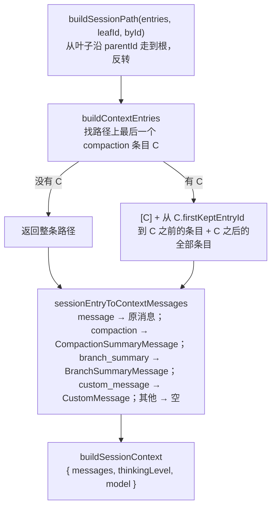

`getSessionContextSettings` 沿路径扫 `thinking_level_change` / `model_change` 条目和 assistant 消息，得到这条分支当前用的模型和思考等级。

分支是这样产生的：`navigateTree(targetId)`（`agent-session.ts`）把叶子挪到任意历史条目上；如果 `summarize`，先用 `collectEntriesForBranchSummary` 收集从旧叶子到公共祖先之间的条目，让模型摘要，再 `branchWithSummary` 写一个 `branch_summary` 条目。之后新消息就接在目标条目下面，形成分支。

延迟写文件的逻辑见 §4.2 的 `_persist`。

---

## 12. 三种运行模式

`main.ts` 按 `appMode` 分发。三种模式都拿同一个 `AgentSessionRuntime`（`agent-session-runtime.ts`，它包着 `AgentSession` 并负责 `newSession` / `fork` / `switchSession` 时换一个新的）。

| 模式 | 入口 | 怎么进 | 怎么出 |
|---|---|---|---|
| 交互式 TUI | `InteractiveMode`（`interactive-mode.ts`，6620 行） | 编辑器回车 → `session.prompt(text)`；正在流就 `prompt(text, {streamingBehavior:"steer"})`；`!cmd` 走 `handleBashCommand`；正在压缩就攒进本地队列 | `session.subscribe(handleEvent)`，`handleEvent` 的 `switch` 对 25 种事件各更新对应组件，然后 `ui.requestRender()` |
| RPC | `runRpcMode`（`rpc/rpc-mode.ts`） | stdin 一行一个 JSON 命令，`handleCommand` 的 `switch` 有 33 个 `case`：`prompt` / `steer` / `follow_up` / `abort` / `set_model` / `compact` / `bash` / `fork` / `get_tree` …，几乎一一对应 `AgentSession` 的公开方法 | `session.subscribe(e => output(toJsonEvent(e)))`，每个事件一行 NDJSON。`toJsonEvent`（`modes/json-event.ts`）把 `message_update` 里的 `partial` 整条消息去掉只留增量，省带宽 |
| print / json | `runPrintMode`（`modes/print-mode.ts`） | 命令行参数里的消息依次 `prompt` | `json` 模式同 RPC 的输出；`print` 模式只打最后一条 assistant 文本 |

`InteractiveMode` 和 `pi-tui` 的关系：`InteractiveMode` 持有一个 `TUI`（`tui/src/tui.ts` 接口），往里 `addChild` 各种 `Component`（只有 `render(width): string[]` 和可选的 `handleInput`）。`TuiBase.requestRender` 把多次请求合并成一帧，`TuiMainScreen.doRender`（`tui-main-screen.ts`）和上一帧逐行比较，只重写变化的行区间。

---

## 13. harness 层

`packages/agent/src/harness/` 有 2.3 万行，比主循环大一个数量级。目前主产品（`AgentSession`）没有用它，只有 `coding-agent/src/experimental/session-worker.ts` 通过 `AgentHarness.create(...)` 用它。所以第一次读可以跳过。它要解决的问题是：主循环的状态全在内存的局部变量里，进程一退出就没了；harness 会把运行到哪一步也持久化下来。

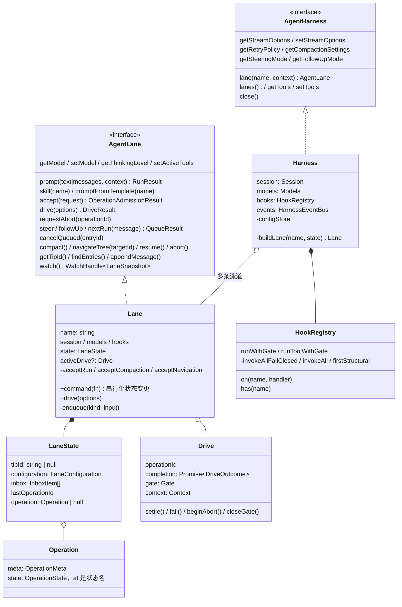

| 概念 | 位置 | 和主循环的对应 |
| --- | --- | --- |
| `Harness`（`runtime/harness.ts`） | 宿主，管多条 lane 和全局配置 | 相当于 `AgentSession` 的一部分 |
| `Lane`（`runtime/lane.ts`） | 一条独立的 agent 线：自己的历史（`tipId`）、自己的收件箱（`inbox`）、自己的当前操作。所有状态变更都通过 `command()` 串行化并写进 `Session` | 相当于一个 `Agent` + 它的两个队列，但状态持久化 |
| `Operation`（`session/types.ts`） | 一次运行/压缩/导航。`state.at` 是状态机的当前位置：`starting` → `checkpoint` → `assistant.ready` → `assistant.effect_pending` → `tools` → …→ `summary.*` / `navigation.ready_to_commit` | 主循环用局部变量 `hasMoreToolCalls` / `lastCompletedTurn` 隐式表示 |
| `Drive`（`runtime/types.ts`） | 进程内的一次“驱动”：`driveOperation`（`runtime/drive.ts`）是一个 `for(;;)`，按 `state.at` 分发到 `drive/` 目录下的十二个文件之一（`generation.ts` 发请求、`tools.ts` 跑工具、`structural.ts` 压缩/导航……），每步返回 `continue` / `waiting` / `settled` | 相当于 `runLoop`，但每一步的结果先落盘再前进，进程重启后从 `state.at` 恢复 |
| `inbox` 三种排队（`lane.ts enqueue`） | `steer` / `followUp` / `nextRun`。`selectAcceptedInbox` 按 `steeringMode` / `followUpMode` 决定取几条，没选中的留在 inbox 里 | 主循环的两个 `PendingMessageQueue`，多了 `nextRun`（永远合格，不受模式限制） |
| `HookRegistry`（`hooks.ts`） | 12 个具名 hook（`agent-harness.ts HookMap`）：`before_run` / `before_drive` / `transform_context` / `before_request` / `before_payload` / `after_response` / `before_tool` / `after_tool` / `before_compaction` / `before_navigation` / `before_run_end`。三种合成语义写在方法名里：`invokeAllFailClosed`（全跑，有异常就拒绝）、`runToolWithGate`（先过准入门）、`firstStructural`（取第一个有结论的） | 主循环的 `AgentLoopConfig` 匿名回调 |

对比来看，主循环用的是匿名回调加内存状态，harness 换成了具名 hook 加持久化的状态机。

---

## 14. 可以借鉴的设计与不足

### 可以借鉴的设计

| # | 做法 | 在哪 |
|---|---|---|
| 1 | 循环本身不做决定，需要决定的地方都交给回调。想改行为只需要改回调，不用动循环代码 | `AgentLoopConfig`，`agent/src/types.ts` |
| 2 | 重试和压缩放在循环外面，由 `AgentSession` 处理，`agent-loop.ts` 的 803 行里没有重试逻辑 | `agent-session.ts` |
| 3 | 输出被截断时，这一批工具调用全部不执行 | `agent-loop.ts` |
| 4 | 内部用 `AgentMessage`，可以随意扩展类型，发请求前才转成 `Message` | `messages.ts`，`agent-loop.ts` |
| 5 | 循环拿到的是上下文的拷贝，Agent 的状态只通过事件更新 | `agent.ts` |
| 6 | `prepareNextTurn` 放在每轮开头，之后如果还没拿到插话就再补拉一次 | `agent-loop.ts` |
| 7 | 并行执行工具时，准备阶段仍然串行，结果消息按原始顺序返回 | `agent-loop.ts` |
| 8 | 同一个文件的写操作排队串行执行 | `tools/file-mutation-queue.ts` |
| 9 | 压缩摘要末尾附上读写过的文件清单 | `compaction/utils.ts` |
| 10 | 没有 assistant 回复之前不创建会话文件 | `session-manager.ts` |
| 11 | 会话存成树，压缩和分支都是树上的条目，上下文每次从树上重新计算 | `session-manager.ts` |
| 12 | 扩展替换消息时直接修改原对象，状态、事件、持久化三处用的是同一个对象 | `agent-session.ts` |
| 13 | 流函数出错不抛异常，而是把错误作为事件放进流里，由 `lazyStream` 保证 | `ai/src/api/lazy.ts` |
| 14 | 用 `{ current }` 对象包一层，解决闭包创建时依赖还没准备好的问题 | `sdk.ts` |

### 不足

| # | 问题 | 影响 |
|---|---|---|
| 1 | 没有 OS 级沙箱，权限只有 `beforeToolCall` 一个钩子且默认没人订阅 | 需要隔离只能自己套容器 |
| 2 | 循环状态全在内存 | 进程死了运行就没了；harness 层在解决，但主线还没切过去 |
| 3 | 事件监听器全部 `await` 串行 | 一个慢监听器拖慢整个流；RPC 模式要专门加背压 |
| 4 | `AgentSession` 3552 行，`interactive-mode.ts` 6620 行 | 产品层没有再分层，什么都往 `AgentSession` 里放 |
| 5 | 排队队列的 UI 显示靠文本匹配（`_handleAgentEvent` 用 `indexOf(messageText)` 找）| 两条相同文本的插话会错删 |
| 6 | 重试判定靠正则匹配错误文案 | 新 provider 的新文案要手动加进 `RETRYABLE_PROVIDER_ERROR_PATTERN` |
